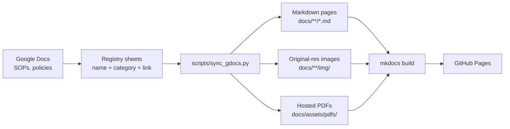

# NanoDocs

Documentation site for the ASRC Nanofabrication Facility, built with
[MkDocs Material](https://squidfunk.github.io/mkdocs-material/) and served on
GitHub Pages at <https://asrc-nanofab.github.io/nanodocs>.

## How the system works

The **source of truth is Google Docs**. Staff write and maintain every SOP,
hood document, and policy as a normal Google Doc. This repo never holds the
canonical content — it holds a synced, web-friendly rendering of it.



### The registry sheets

Three Google Sheets act as the registry of what gets published. Each row is a
document: its name, (for tools) a category, and a link to the Google Doc.

| Sheet | Section | Name column |
| --- | --- | --- |
| Tool SOPs | `docs/tool_sops/<category>/` | `Tool Name` |
| Chemical docs | `docs/chemicals/<hood>/` | `Document Name` |
| Policies | `docs/policy/` | `Document Name` |

Rows without a doc link are skipped, so tools can be listed in the sheet
before their SOP exists.

### The sync script

`scripts/sync_gdocs.py` downloads each registered doc in three formats and
assembles a site page:

- **Markdown** (`export?format=md`) — the page body. Google's export is faithful
  but includes things a website shouldn't show, so the script strips:
    - the **letterhead logo** at the top of each doc (the site has its own branding)
    - the **doc's title heading** (the page supplies its own H1, kept in sync
      with the site navigation)
    - the **inline table of contents** — including entries with unresolved
      `#heading=` anchors — because MkDocs Material generates a live TOC from
      the headings themselves
    - **empty heading lines** (leftover Heading styling on blank lines in the doc)
    - Google's *"AI-generated content may be incorrect"* image alt-text boilerplate
- **DOCX** (`export?format=docx`) — used only to recover **original-resolution
  images**. The Markdown export downscales images to ~640 px; the script matches
  each one against the docx originals (aspect ratio + pixel comparison) and swaps
  in the original when it's confidently the same picture and meaningfully larger.
  Cropped or unmatched images safely keep the Markdown version. Upgraded images
  keep the author's in-doc display size via a `width` attribute (so a QR code
  displayed small in the doc stays small on the page, but is high-res when zoomed).
- **PDF** (`export?format=pdf`) — refreshed into `docs/assets/pdfs/` so the site
  can offer an in-browser PDF view and a direct download.

Every generated page gets three buttons:

- **Open the Google Doc** — the doc's read-only `/preview` viewer
- **View PDF** — the hosted PDF, opened in the browser's native viewer
  (same tab, so the back button returns to the page)
- **Download PDF** — the same file with a download attribute

Everything is public "anyone with the link can view", so the sync needs
**no credentials**.

Run it with:

```bash
uv run python scripts/sync_gdocs.py tools chem policy   # everything
uv run python scripts/sync_gdocs.py tools --category Deposition
uv run python scripts/sync_gdocs.py policy --only "Safety Manual"
```

### What is generated vs. hand-written

Generated (never hand-edit — fix the Google Doc or the script, then re-sync):

- Any page starting with `<!-- AUTO-GENERATED by scripts/sync_gdocs.py ... -->`
- `docs/**/img/` (extracted images, content-hash filenames)
- `docs/assets/pdfs/` (hosted PDFs)

Hand-written: section index pages, `docs/faq/`, `docs/signup/`, and the
`.nav.yml` navigation files.

## Writing docs that convert cleanly

Google's Markdown export is faithful, with two authoring rules to know:

1. **Images must be "In line with text."** Images set to "Wrap text" or
   "Break text" are silently dropped by the export and will not appear on the
   site (the sync prints a warning when it detects an orphaned figure caption).
   Click the image → choose the leftmost "In line" layout option.
2. **Don't indent headings inside lists.** The sync compensates for this
   (dedenting them so they don't render as literal text), but keeping headings
   at the left margin gives the cleanest results.

Tables, bold/italics, footnotes, numbered procedures, and inline images all
convert well. The doc's own table of contents and letterhead are stripped
automatically, so authors can keep using them in the doc.

## Adding or updating a document

**Update an existing doc:** edit the Google Doc, then re-run the sync. Nothing
else to do.

**Add a new document:**

1. Create the Google Doc and set sharing to "anyone with the link can view".
2. Add a row to the appropriate registry sheet with the name and the doc's
   `export?format=pdf` link.
3. Mapping to a page file:
   - **Tools**: the filename is the slugified tool name (e.g. "AJA Sputter" →
     `aja_sputter.md`). If that doesn't match the file you want, add an entry to
     `TOOL_PAGE_OVERRIDES` in the script.
   - **Chem / policy**: add the document name → page path to `CHEM_PAGE_MAP` /
     `POLICY_PAGE_MAP` in the script.
4. Add the page to the section's `.nav.yml` so it appears in the navigation.
5. Run the sync and check the page locally.

## Local development

```bash
uv sync                      # install dependencies
uv run mkdocs serve          # http://127.0.0.1:8000/nanodocs/
uv run mkdocs build --strict # must pass before deploying
```

Linting: `uv run ruff check .` and `uv run ruff format .`

## Deploying

```bash
./deploy.sh   # mkdocs gh-deploy to GitHub Pages
```

Deploys are manual for now. Automating the sync + deploy on a schedule
(GitHub Actions) is planned — see `plans/`.

## Repo layout

| Path | Purpose |
| --- | --- |
| `docs/` | Site content (generated pages + hand-written indexes) |
| `scripts/sync_gdocs.py` | The Google Docs → site sync (see above) |
| `scripts/download_*_pdfs.py` | **Legacy** — superseded by `sync_gdocs.py`; slated for removal |
| `docs/assets/pdfjs/` | **Legacy** — in-page PDF viewer from the iframe era; no longer used by any page, kept for the time being |
| `mkdocs.yml` | Site configuration (Material theme, awesome-nav) |
| `overrides/` | Theme customizations |
| `plans/` | Dated work plans with phased steps and review gates |
| `AGENTS.md` | Operational guide for coding agents (invariants, commands, quirks) |
| `.cursor/rules/`, `.cursor/commands/` | AI agent guardrails and workflows |
