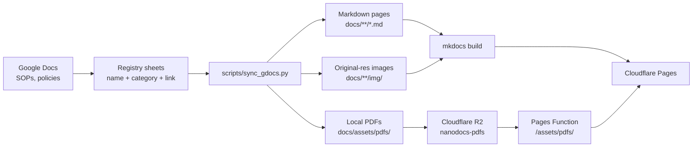

# NanoDocs

Documentation site for the ASRC Nanofabrication Facility, built with
[MkDocs Material](https://squidfunk.github.io/mkdocs-material/) and served on
Cloudflare Pages at <https://nanodocs.pages.dev>.

## How the system works

The **source of truth is Google Docs**. Staff write and maintain every SOP,
hood document, and policy as a normal Google Doc. This repo never holds the
canonical content — it holds a synced, web-friendly rendering of it.



Cloudflare Pages will not host a single file over **25 MiB** (PECVD's PDF
is ~32 MB). The markdown and images stay in the Pages upload. Hosted PDFs
live in the private R2 bucket `nanodocs-pdfs`. A Pages Function at
`functions/assets/pdfs/[[path]].js` answers `/assets/pdfs/…` from that
bucket, so the View/Download buttons keep the same relative links.

Locally, `mkdocs serve` still reads `docs/assets/pdfs/` from disk. The
Function only runs on Cloudflare. The Pages build copies those PDFs into
`site/` (MkDocs does not know about R2) and then **deletes**
`site/assets/pdfs` before upload so Pages never sees the large files.

### The registry sheets

Three Google Sheets act as the registry of what gets published. Each row is a
document: its name, (for tools) a category, and a link to the Google Doc.

| Sheet | Section | Name column |
| --- | --- | --- |
| Tool SOPs | `docs/tool_sops/<category>/` | `Tool Name` |
| Chemical docs | `docs/chemicals/<hood>/` | `Document Name` |
| Policies | `docs/policy/` | `Document Name` |

Rows without a doc link are skipped, so tools can be listed in the sheet
before their SOP exists.

### The sync script

`scripts/sync_gdocs.py` downloads each registered doc in three formats and
assembles a site page:

- **Markdown** (`export?format=md`) — the page body. Google's export is faithful
  but includes things a website shouldn't show, so the script strips:
    - the **letterhead logo** at the top of each doc (the site has its own branding)
    - the **doc's title heading** (the page supplies its own H1, kept in sync
      with the site navigation)
    - the **inline table of contents** — including entries with unresolved
      `#heading=` anchors — because MkDocs Material generates a live TOC from
      the headings themselves
    - **empty heading lines** (leftover Heading styling on blank lines in the doc)
    - Google's *"AI-generated content may be incorrect"* image alt-text boilerplate
    - **page-boundary scaffold** in docs converted from paginated PDFs:
      "Page N of M" lines are always dropped, and lines that recur next to
      several of those markers (repeated logos, revision lines, running
      titles) are recognized as page headers/footers and dropped too —
      content adjacent to a single page break is never touched
- **DOCX** (`export?format=docx`) — used only to recover **original-resolution
  images**. The Markdown export downscales images to ~640 px; the script matches
  each one against the docx originals by **pixel content** (deliberately not by
  aspect ratio — authors resize images non-proportionally in docs) and swaps in
  the original when it's confidently the same picture and meaningfully larger.
  The letterhead logo is excluded from matching so it can never displace a
  look-alike screenshot. Cropped or unmatched images safely keep the Markdown
  version. Upgraded images sized **550 px or wider** in the doc render at full
  page width; smaller ones keep the author's in-doc display size via a `width`
  attribute (so a QR code displayed small in the doc stays small on the page,
  but is high-res when zoomed).
- **PDF** (`export?format=pdf`) — written to `docs/assets/pdfs/` for local
  preview. Production serves the same keys from R2 (see [Deploying](#deploying)).

Every generated page gets three buttons:

- **Open the Google Doc** — the doc's read-only `/preview` viewer
- **View PDF** — the hosted PDF, opened in the browser's native viewer
  (same tab, so the back button returns to the page)
- **Download PDF** — the same file with a download attribute

Everything is public "anyone with the link can view", so the sync needs
**no credentials**.

The sync only writes files whose content actually changed — pages, images
(content-hash named), and PDFs are all change-guarded — so re-running it is
a safe no-op and exits with an error only when nothing matched the filters.

Run it with:

```bash
uv run python scripts/sync_gdocs.py tools chem policy   # everything
uv run python scripts/sync_gdocs.py tools --category Deposition
uv run python scripts/sync_gdocs.py policy --only "Safety Manual"
uv run python scripts/sync_gdocs.py tools --only AFM --watch   # re-sync every 20s
```

With `--watch [SECONDS]`, the sync re-runs until Ctrl+C, printing one
timestamped status line per cycle. Pair it with `uv run mkdocs serve` for a
live side-by-side workflow: edit the Google Doc in one browser pane and the
converted local page refreshes in the other within a cycle.

### What is generated vs. hand-written

Generated (never hand-edit — fix the Google Doc or the script, then re-sync):

- Any page starting with `<!-- AUTO-GENERATED by scripts/sync_gdocs.py ... -->`
- `docs/**/img/` (extracted images, content-hash filenames)
- `docs/assets/pdfs/` (hosted PDFs)

Hand-written: section index pages, `docs/faq/`, `docs/signup/`, and the
`.nav.yml` navigation files.

## Writing docs that convert cleanly

Google's Markdown export is faithful, with two authoring rules to know:

1. **Images must be "In line with text."** Images set to "Wrap text" or
   "Break text" are silently dropped by the export and will not appear on the
   site (the sync prints a warning when it detects an orphaned figure caption).
   Click the image → choose the leftmost "In line" layout option.
2. **Don't indent headings inside lists.** The sync compensates for this
   (dedenting them so they don't render as literal text), but keeping headings
   at the left margin gives the cleanest results.

Tables, bold/italics, footnotes, numbered procedures, and inline images all
convert well. The doc's own table of contents and letterhead are stripped
automatically, so authors can keep using them in the doc. Docs that were
converted from old PDFs are handled too: their baked-in per-page headers and
footers ("Page N of M", repeated logos and running titles) are stripped by
the sync, though cleaning them out of the doc itself is still nicer for
anyone reading the Google Doc directly.

## Adding or updating a document

**Update an existing doc:** edit the Google Doc, then re-run the sync. Nothing
else to do.

**Add a new document:**

1. Create the Google Doc and set sharing to "anyone with the link can view".
2. Add a row to the appropriate registry sheet with the name and the doc's
   `export?format=pdf` link.
3. Mapping to a page file:
   - **Tools**: the filename is the slugified tool name (e.g. "AJA Sputter" →
     `aja_sputter.md`). If that doesn't match the file you want, add an entry to
     `TOOL_PAGE_OVERRIDES` in the script.
   - **Chem / policy**: add the document name → page path to `CHEM_PAGE_MAP` /
     `POLICY_PAGE_MAP` in the script.
4. Add the page to the section's `.nav.yml` so it appears in the navigation.
5. Run the sync and check the page locally.
6. Upload the new PDF to R2 (same key as the local path under
   `docs/assets/pdfs/`) so View PDF works on the live site. See
   [Deploying](#deploying).

## Local development

```bash
uv sync                      # install dependencies
uv run mkdocs serve          # http://127.0.0.1:8000/
uv run mkdocs build --strict # must pass before deploying
```

Linting: `uv run ruff check .` and `uv run ruff format .`

## Deploying

**Live site:** <https://nanodocs.pages.dev> (Cloudflare Pages project
`nanodocs`, production branch `main`). A push to `main` is the deploy. Do
**not** run `./deploy.sh` — that is the old GitHub Pages path
(`mkdocs gh-deploy`) and would republish `github.io/nanodocs`.

Cloudflare already runs `pip install .` from `pyproject.toml`. The Pages
**build command** must strip PDFs after MkDocs so the 25 MiB limit is not
hit:

```bash
mkdocs build --strict && rm -rf site/assets/pdfs
```

Output directory: `site`. `wrangler.jsonc` binds the R2 bucket as `PDFS`
(same name as the dashboard binding). The Function reads `context.env.PDFS`.

### After a Google Doc / PDF changes

1. Sync as usual (`uv run python scripts/sync_gdocs.py …`). That refreshes
   the local file under `docs/assets/pdfs/{tools,chem,policy}/`.
2. Upload **that file** to the real bucket (`--remote` is required;
   without it Wrangler writes a local emulator under `.wrangler/`):

   ```bash
   npx wrangler r2 object put nanodocs-pdfs/tools/PECVD_SOP.pdf \
     --file=docs/assets/pdfs/tools/PECVD_SOP.pdf \
     --content-type=application/pdf \
     --remote
   ```

   Keys match the folders: `tools/…`, `chem/…`, `policy/…`.
3. Push to `main` if the markdown page also changed. A PDF-only change
   needs the R2 upload; Pages does not need a rebuild for the file bytes.

The bucket stays **private**. The site reaches it through the Pages
binding, not a public URL or API key in the repo.

GitHub Pages for this repo is **unpublished**. Leave it that way.

## Repo layout

| Path | Purpose |
| --- | --- |
| `docs/` | Site content (generated pages + hand-written indexes) |
| `docs/assets/pdfs/` | Local PDF copies (sync output; also uploaded to R2) |
| `functions/assets/pdfs/` | Pages Function: `/assets/pdfs/…` → R2 |
| `wrangler.jsonc` | Pages project name, `site/` output, `PDFS` → `nanodocs-pdfs` |
| `scripts/sync_gdocs.py` | The Google Docs → site sync (see above) |
| `scripts/download_*_pdfs.py` | **Legacy** — superseded by `sync_gdocs.py`; slated for removal |
| `docs/assets/pdfjs/` | **Legacy** — in-page PDF viewer from the iframe era; no longer used by any page, kept for the time being |
| `docs/robots.txt` | Allows crawlers; points at `/sitemap.xml` |
| `docs/google*.html` | Google Search Console verification file (do not delete) |
| `mkdocs.yml` | Site configuration (Material theme, awesome-nav); `site_url` is `https://nanodocs.pages.dev` |
| `overrides/` | Theme customizations |
| `plans/` | Dated work plans with phased steps and review gates |
| `AGENTS.md` | Operational guide for coding agents (invariants, commands, quirks) |
| `.cursor/rules/`, `.cursor/commands/` | AI agent guardrails and workflows |
