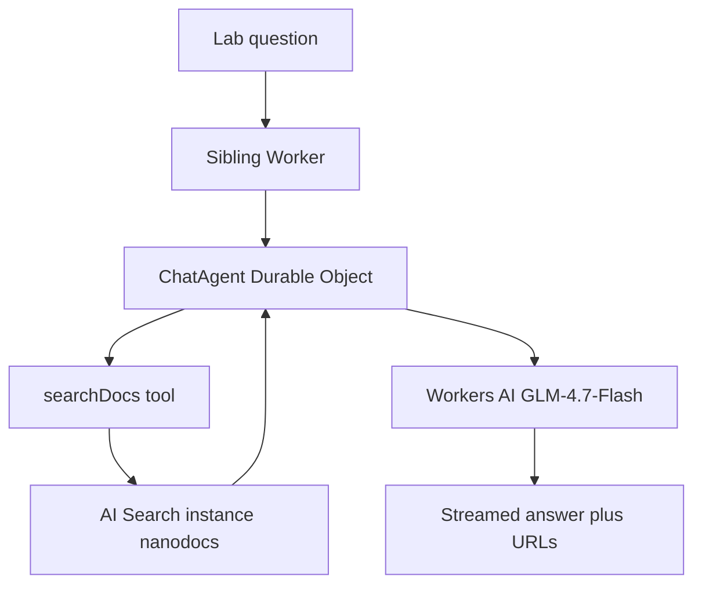

# Wiring a chat agent into your documentation

The site search box finds pages. A **docs chat** answers a lab question from
the whole published corpus — tool SOPs, chemicals, policies — and cites the
page it used. This is how NanoDocs wired that up on Cloudflare, and where
the usual “drop an SDK into my docs repo” picture is slightly wrong.

The chat window is **not on the public site yet**. The brain already exists:
a local playground Worker in this repo (`agent/`). The steps below are what
we actually ran.

## Three products, not one plugin

It is tempting to think “install the Agents SDK into the documentation
site.” That is the wrong seam.

This site is a **Cloudflare Pages** project (Zensical → `site/` → Pages).
Pages can bind to a Durable Object that already lives on a Worker. It
**cannot define or deploy** the Agent class itself. So the chat brain is a
**sibling Worker**, in the same git repo, with its own `wrangler.jsonc`.
The docs site stays Pages. The widget (when we add it) will talk to the
Worker over the network.

Three Cloudflare products, one job each:

| Piece | Product | Job |
| --- | --- | --- |
| Index | **AI Search** | Crawl the live site, chunk it, hybrid search (vector + keyword). |
| Conversation | **Agents SDK** (`AIChatAgent` on a Durable Object) | Hold the thread, call tools, stream the reply. |
| Writer | **Workers AI** | The model that reads retrieved chunks and writes the answer. |

AI Search is **not** installed as an npm package. You create an instance in
the dashboard (or API). The Worker only **binds** to it by name. Workers AI
is the same idea: a binding named `AI`, not an API key in the repo.

We also do **not** use AI Search’s one-shot `aiSearch()` (“search and write
an answer in one call”). The Agent calls `search()` as a tool named
`searchDocs`, then the chat model writes. That way the Agent owns
multi-turn chat, citations, and “I don’t know.”



## 1. Stand up AI Search

This is dashboard work. Nothing in git until the Worker binds to the
instance name.

1. In the Cloudflare dashboard: **AI → AI Search → Create**.
2. Name the instance. Ours is `nanodocs` (namespace `default`).
3. Data source: **Website**, URL `https://nanodocs.pages.dev`.
4. Parse type: **sitemap** (we already had a working
   `/sitemap.xml` — 51 URLs). Prefer sitemap over “discover the whole
   internet of links.”
5. Render: **static HTML**, not a headless browser. These pages are
   server-rendered.
6. Retrieval: **hybrid** on (vector + keyword), fusion **RRF**.
7. Chunking: we started at 512 tokens / 10% overlap, then moved to
   **768 / 10%** so a procedure (strike plasma, ramp, deposit) more often
   lives in one piece.
8. Leave **Public URL** / Chat Bubble **off**. The Agent is the chat UI;
   we do not want a second, unauthenticated Cloudflare widget on the site.
9. Wait for the first job. **Jobs** on the instance is the progress view
   (status, logs, duration). Overview totals: indexed pages, vectors,
   errors.

### Index the article, not the menu

A docs theme puts the same left nav on every page. If you crawl raw HTML,
search “learns” that menu thousands of times. Generic questions then rank
**index pages and chrome** over the SOP.

AI Search’s default strip of `<nav>` / `<script>` does not catch Material’s
sidebar (`div`s, not `<nav>`). Fix: a **content selector** on the instance:

| Path | Selector |
| --- | --- |
| `**` | `article.md-content__inner` |

That is the middle of every NanoDocs page. Saving selectors (or chunk size)
starts a new crawl. Watch **Jobs**; a few URLs may sit on **Outdated** with
`workers ai out of capacity` — that is GPU shortage during embedding, not a
bad page. Retry those rows.

Confirm in Playground **Search** (not Chat) that a query like *sputtering
deposition* returns SOP body, not `<!doctype html>` and Skip to content.

Do **not** turn on AI Gateway cache or rate limits on the gateway in front
of this crawl. Cache can poison embeddings; limits can stall the job.

## 2. Put the Agent in the repo — as a Worker, not in Pages

The Agents SDK lives in **`agent/`**, next to the docs app, not inside
`functions/` or Zensical.

We started from Cloudflare’s template (git no, deploy no):

```bash
npx create-cloudflare@latest --template cloudflare/agents-starter
```

That gives you `AIChatAgent`, a React playground, Vite, and a Durable
Object with SQLite. We renamed the UI to NanoDocs, stripped weather /
timezone / MCP toys, and taught the Agent one tool: `searchDocs`.

Useful packages (the template already pulled them):

- `agents` — routing (`routeAgentRequest`) and the DO runtime
- `@cloudflare/ai-chat` — `AIChatAgent`, message persistence, streaming
- `ai` — `streamText`, `tool`, `stopWhen`
- `workers-ai-provider` — the Workers AI chat model
- `zod` — tool argument schema

Local run is **from `agent/`**:

```bash
cd agent
npm run dev
```

That is `http://localhost:5173/`. Bindings with `"remote": true` talk to
real Workers AI and the real `nanodocs` search instance. You do not need
to deploy the Worker to try a question.

**Do not** run bare `npx wrangler` from the repo root. This repo also has
the Pages `wrangler.jsonc` (the PDF bucket). Wrangler walks upward and will
type-generate the wrong `Env`. Inside `agent/`, use `npm run types` or
`./node_modules/.bin/wrangler`.

Cloudflare Pages still cannot host this DO. When the site widget lands, it
will be extra JS on the docs site that opens a WebSocket to this Worker —
same-origin `/agents/...` would require migrating the whole site onto one
Worker, which we are not doing for v1.

## 3. Connect them in Wrangler

The glue is **`agent/wrangler.jsonc`**, not `mkdocs.yml`. Three bindings
matter:

```jsonc
{
  "name": "nanodocs-agent",
  "main": "src/server.ts",
  "compatibility_date": "2026-07-28",
  "compatibility_flags": ["nodejs_compat"],
  "ai": {
    "binding": "AI",
    "remote": true
  },
  "ai_search": [
    {
      "binding": "DOCS_SEARCH",
      "instance_name": "nanodocs",
      "remote": true
    }
  ],
  "durable_objects": {
    "bindings": [
      { "class_name": "ChatAgent", "name": "ChatAgent" }
    ]
  },
  "migrations": [
    { "tag": "v1", "new_sqlite_classes": ["ChatAgent"] }
  ]
}
```

What that means in the Worker:

- `this.env.AI` — Workers AI. We use `@cf/zai-org/glm-4.7-flash`.
- `this.env.DOCS_SEARCH.search(...)` — the named AI Search instance.
  (The old `env.AI.autorag()` path is gone.)
- `ChatAgent` — one Durable Object instance per conversation id (a session,
  not a page URL, so navigating the docs does not start a new brain).

`remote: true` is required for local `npm run dev`: AI Search and the model
do not run inside Miniflare.

Pin `compatibility_date` to what **local workerd** actually supports. A
date of “today” can crash the playground even when the dashboard is happy.

Regenerate types after binding changes: `npm run types` in `agent/`.

The Agent’s `fetch` is just:

```ts
return (
  (await routeAgentRequest(request, env, { cors: true })) ||
  new Response("Not found", { status: 404 })
);
```

Everything under `/agents/...` is the Agent. The Vite app is static assets
in front.

On each user message the Agent:

1. Calls `searchDocs` (at most twice; four model steps including thinking).
2. Sends the user’s question to AI Search `search()`, not `aiSearch()`.
3. Drops leftover full-page HTML chunks (doctype / Skip to content) if any
   survived the crawl.
4. Asks GLM to answer **only from those chunks** and cite URLs.

## What a good index still cannot fix

Search retrieves **pages as published**. If a Google Doc copy-pastes the
wrong SOP title (our Gold Sputter Coater still says “AJA Orion 8”), the
index will mix those tools until the **doc** is fixed and the next crawl
runs. Do not hand-edit the generated Markdown; the next sync overwrites it.

Index freshness is on AI Search’s schedule (hours, not minutes). Force Sync
from the dashboard when you change selectors or chunking.

## Where this is going

- **Now:** the site-wide chat window (vanilla JS, not React) talking to
  this Worker, built and verified locally. Instant navigation does not
  tear down the conversation, and citation cards come from `searchDocs`
  tool output rather than the model's prose. The user-facing story is
  [How the Docs Chat Works](how_chat_works.md).
- **Next:** deploy the Worker and point the widget at the production
  host.
- **Not this:** NanoKnow, accounts, or moving the whole site off Pages.

The published SOPs stay Google Docs. The Agent only **reads** what the
crawl can see.