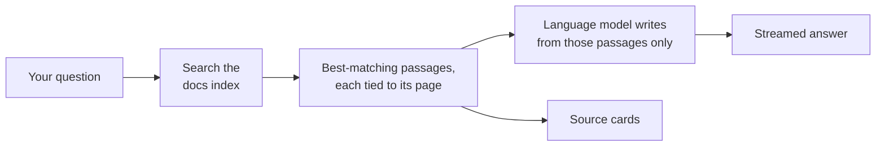
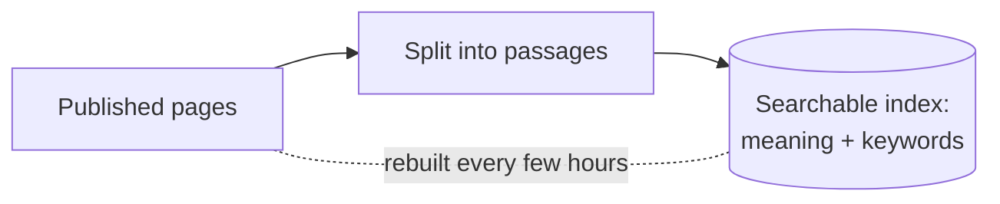

# How the Docs Chat Works

There is a chat button in the corner of every NanoDocs page. Ask it a lab
question — *"What PPE do I need for HF etching?"* — and it answers in plain
language and lists the pages it drew from. This page explains what happens
between pressing Enter and seeing that answer, and why the assistant behaves
the way it does.

The short version: **the assistant doesn't "know" anything about the lab.**
Every answer is assembled fresh from the same published SOPs, chemical
procedures, and policies you can read yourself. The technique is called
**retrieval-augmented generation** — RAG for short: first *retrieve* the
relevant passages, then *generate* an answer from them, and only from them.

## What you see

1. You type a question and press Enter.
2. *"Searching the docs…"* appears for a moment.
3. The answer streams in, a few words at a time.
4. **Source cards** appear under the finished answer — links to the actual
   NanoDocs pages the material came from.

You can ask follow-ups (*"which gloves, specifically?"*) — the assistant
keeps the thread of the conversation, so it knows "gloves" means the HF
gloves you were just discussing. The conversation follows you around the
site as you navigate and survives a page refresh; it ends when you close
the browser tab.

## What happens when you ask

### Step 1 — Retrieval

The whole published site is indexed ahead of time. Every page is split
into passages a few paragraphs long, and each passage is stored two ways:

- by **meaning**, so a question about "eye protection" finds a passage
  that says "face shield" even though the words don't match, and
- by **exact keywords**, so tool names, chemical formulas, and model
  numbers match precisely.

When you ask, both searches run at once and their results are merged.
The best-scoring passages — typically a handful — come back with the
address of the page each one lives on.

### Step 2 — Generation

The retrieved passages, your question, and the conversation so far are
handed to a language model with strict instructions: **answer only from
these passages, name the page for each claim, and say "I don't know" if
the passages don't cover it.** The model's job is to read and summarize —
not to remember, and not to improvise. If your first phrasing retrieves
nothing useful, it may rewrite the query and search once more before
answering.

### Where the source cards come from

The cards under an answer are **not the model's citations** — they are
the actual pages the search step returned. That distinction matters:
language models can be persuasive even when they're wrong, but a source
card always points at a real page that really matched your question. If
an answer seems off, the fastest check is to open the card and read the
original.

## Why retrieval, not just a chatbot?

| A plain chatbot | This assistant |
| --- | --- |
| Answers from whatever it absorbed in training — which may be outdated, generic, or about some other lab's tools | Answers from the current published NanoDocs pages |
| Can invent plausible-sounding procedures | Instructed to stay inside retrieved passages and admit when it doesn't know |
| No way to check its work | Every answer links the pages it used |

## What it can't do

- **It lags edits by a few hours.** The index is rebuilt on a schedule,
  so a doc updated this morning may not be reflected until later today.
- **It only sees published pages.** If it isn't on this site, the
  assistant can't retrieve it.
- **It can still misread.** Retrieval finds the right material far more
  often than not, but the summary step can garble a detail. Verify
  against the SOP before acting on anything safety-critical.
- **It is not training.** Reading an answer — or the SOP itself — does
  not qualify anyone to run a tool. Tool authorization still works the
  way [the policies](../policy/index.md) say it does.

For the technically curious, the service wiring behind this page —
which products host the index, the conversation, and the model — is
described in [Wiring a chat agent into your documentation](chat_agent.md).
