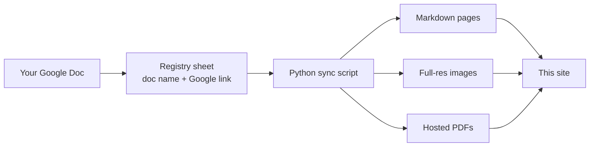

# How This Site Is Built

Curious what happens between your Google Doc and the page on this site? Here
is the whole pipeline.

## The pipeline

1. **You write in Google Docs.** The doc is the single source of truth — the
   site never holds content of its own.
2. **A registry sheet lists what's published.** Each row is one document: its
   name, category, and a link to the doc. If it's not in the sheet, it's not
   on the site.
3. **A sync script converts each doc.** It downloads the doc straight from
   Google in three formats:
    - **Markdown** becomes the web page you're reading. The script strips
      things that don't belong on a website — the letterhead, the doc's title
      line, and the doc's table of contents (the site generates its own live
      one from your headings).
    - **DOCX** is used only to recover your images at **full resolution**,
      since Google's web conversion shrinks them.
    - **PDF** is stored on the site so every page offers "View PDF" and
      "Download PDF" buttons alongside a link to the original doc.
4. **The site is rebuilt and published.** Every page ends up searchable,
   readable on phones, and always in step with the docs.

## What this means for you

- **Edit the doc, never the site.** Site files are overwritten on every sync.
- **Publishing is automatic.** The sync extracts the page, images, and PDF
  from your doc — nothing else to do on your end.
- **Readers can always reach the original**: every page links to a read-only
  preview of your Google Doc.

## What this means for your readers

- **Readable anywhere.** Pages adapt to any screen — a phone at the tool, a
  desktop in the office — far more comfortably than a PDF.
- **Searchable.** Every page is indexed, so one search box covers all SOPs
  and policies.
- **Always current, still printable.** Pages stay in step with the source
  docs, and a PDF copy is one click away when paper is better.
