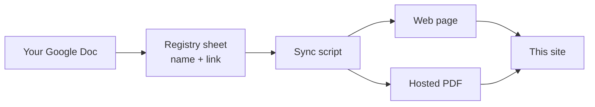

# How This Site Is Built

Curious what happens between your Google Doc and the page on this site? Here
is the whole pipeline — it also explains *why* the
[authoring rules](index.md#the-two-rules-that-matter) exist.

## The pipeline

1. **You write in Google Docs.** The doc is the single source of truth — the
   site never holds content of its own.
2. **A registry sheet lists what's published.** Each row is one document: its
   name, category, and a link to the doc. If it's not in the sheet, it's not
   on the site.
3. **A sync script converts each doc.** It downloads the doc straight from
   Google in three formats:
    - **Markdown** becomes the web page you're reading. The script strips
      things that don't belong on a website — the letterhead, the doc's title
      line, and the doc's table of contents (the site generates its own live
      one from your headings).
    - **DOCX** is used only to recover your images at **full resolution**,
      since Google's web conversion shrinks them.
    - **PDF** is stored on the site so every page offers "View PDF" and
      "Download PDF" buttons alongside a link to the original doc.
4. **The site is rebuilt and published.** Every page ends up searchable,
   readable on phones, and always in step with the docs.

## Why the authoring rules exist

- **"In line with text" images** — Google's conversion simply doesn't include
  wrapped or floating images, so the script can't recover them. Inline images
  come through perfectly, at full resolution.
- **Real heading styles** — the site builds each page's table of contents and
  search index from your headings. Bold "fake headings" don't register as
  headings after conversion, so those sections vanish from the TOC.

The script also smooths over conversion quirks so you don't have to think
about them: heading levels are normalized (sections styled Heading 1 are
shifted down so the page title stays the only top-level heading and the TOC
works), headings indented inside lists are un-indented, and stray artifacts —
empty headings, orphaned heading anchors, "Page N of M" scaffolding from
PDF-converted docs — are stripped.

## What this means for you

- **Edit the doc, never the site.** Site files are overwritten on every sync.
- **Your doc stays yours.** Keep the letterhead and table of contents for
  print use — the site removes them automatically.
- **Readers can always reach the original**: every page links to a read-only
  preview of your Google Doc.
