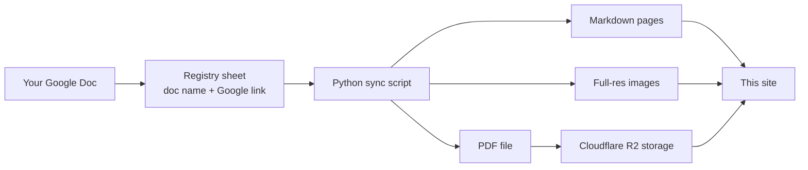

# How This Site Is Built

Curious what happens between your Google Doc and the page on this site? Here
is the whole pipeline.

## The pipeline

1. **You write in Google Docs.** The doc is the single source of truth — the
   site never holds content of its own.
2. **A registry sheet lists what's published.** Each row is one document: its
   name, category, and a link to the doc. If it's not in the sheet, it's not
   on the site.
3. **A sync script converts each doc.** It downloads the doc straight from
   Google in three formats:
    - **Markdown** becomes the web page you're reading. The script strips
      things that don't belong on a website — the letterhead, the doc's title
      line, and the doc's table of contents (the site generates its own live
      one from your headings).
    - **DOCX** is used only to recover your images at **full resolution**,
      since Google's web conversion shrinks them.
    - **PDF** is saved so every page can offer "View PDF" and "Download
      PDF" next to a link to the original doc.
4. **The site is rebuilt and published** to
   [nanodocs.pages.dev](https://nanodocs.pages.dev) (Cloudflare Pages).
   Every page ends up searchable, readable on phones, and in step with
   the docs.

### Where the PDFs live

The pages and images are hosted on Cloudflare Pages. The PDFs are not:
Cloudflare will not accept a single file larger than 25 MB, and some tool
SOPs exceed that. So the PDFs are stored in a Cloudflare **R2** bucket
(`nanodocs-pdfs`) and the site fetches them when you click View or
Download. The buttons still look like ordinary links on this site; a small
Pages Function maps `/assets/pdfs/…` to the matching file in the bucket.

On a laptop, the sync still writes the PDF next to the pages so local
preview works without the cloud. After a doc's PDF changes, that file also
has to be uploaded to R2 or the live View PDF button stays on the old
copy. Details and commands are in the repo [README](https://github.com/asrc-nanofab/nanodocs#deploying).

## What this means for you

- **Edit the doc, never the site.** Site files are overwritten on every sync.
- **You only edit the doc.** The sync extracts the page, images, and PDF.
  Getting a new PDF onto the live site is a short upload step for whoever
  runs the repo (see the README), not something authors do in Google Docs.
- **Readers can always reach the original**: every page links to a read-only
  preview of your Google Doc.

## What this means for your readers

- **Readable anywhere.** Pages adapt to any screen — a phone at the tool, a
  desktop in the office — far more comfortably than a PDF.
- **Searchable.** Every page is indexed, so one search box covers all SOPs
  and policies.
- **Always current, still printable.** Pages stay in step with the source
  docs, and a PDF copy is one click away when paper is better.

## A chat that reads the published site

There is also a **docs chat** in the works: not the search box, but an
assistant that retrieves from the whole live corpus and cites the page.
It is a sibling Cloudflare Worker plus an AI Search index of this site —
not a plugin dropped into the Google Doc pipeline. How that is wired, and
why Pages cannot host the Agent itself, is in
[Wiring a chat agent into your documentation](chat_agent.md).
