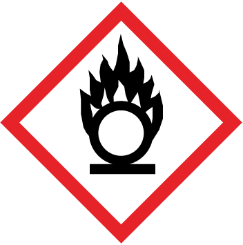
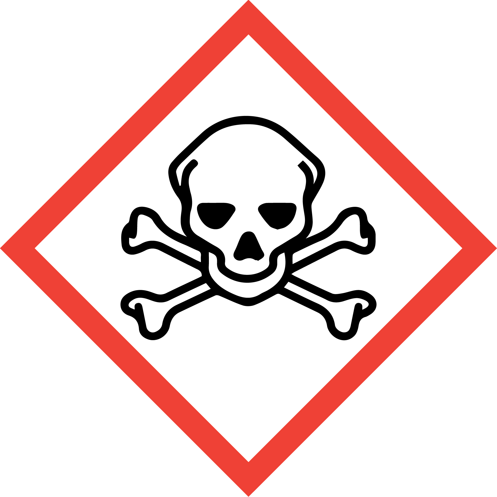
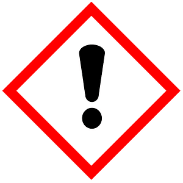

<!-- AUTO-GENERATED by scripts/sync_gdocs.py from the Google Doc below. Edit the Google Doc, not this file. -->

# Caustics and Metal Etch Hood

[:material-file-document-outline: Open the Google Doc](https://docs.google.com/document/d/1_9u5YudriyjGAOOsm-8EVmkD0bD6SvVQZb4RuNEvKrg/preview){ .md-button }
[:material-file-pdf-box: View PDF](../../assets/pdfs/chem/Caustics_Metal_Etch_Hood.pdf){ .md-button }
[:material-download: Download PDF](../../assets/pdfs/chem/Caustics_Metal_Etch_Hood.pdf){ .md-button download="Caustics_Metal_Etch_Hood.pdf" }

---

# Caustics/Metal Etch Hood

## Standard Operating Procedure

# Section 1: Process Description {#section-1:-process-description}

## Hood Description {#hood-description}

The Caustics/Metal Etch Hood is an Air Control polypropylene fume hood designed for corrosive chemical work. Located in the deposition bay of the cleanroom, this hood is designated for multiple chemistries, such as select acids, caustics and oxidizers. The acids allowed to be used in this hood include nitric acid, hydrochloric acid and phosphoric acid. No sulfuric acid or hydrofluoric acid should ever be used in this hood as there is no waste disposal available for them in the hood. The caustics allowed in this hood include ammonium hydroxide, potassium hydroxide and tetramethylammonium hydroxide. The oxidizers allowed in this hood include hydrogen peroxide and iodine/potassium iodide. No solvents should be used in this hood as they will react violently if mixed with acids.

DI water and dry nitrogen guns are available in the hood for rinsing and blowing dry samples and glassware. A rack of glassware designated for use in the caustic and metal etch hood only is located on the left side of the hood, though users may also bring their own glassware to be used in the hood if so desired. All acid should be disposed of in waste containers located at the back of the hood. Caustics can be disposed of in the carboy drain located at the back of the hood.

## TMAH Description and Precautions {#tmah-description-and-precautions}

Tetramethylammonium hydroxide (TMAH) is a caustic chemical available in solutions of varying concentrations, such as \<3% in some developer solutions or in higher concentrations of 10-25%. TMAH is a strong base in higher concentrations, so while the developer solutions with \<3% TMAH are allowed in the Litho Development Hood in Lithography without the full acid PPE, higher concentrations are only allowed in the Caustics/Metal Etch Hood and must be only be handled while wearing full PPE.

TMAH is extremely corrosive to skin, eyes, and mucous membranes, and it is also a contact poison, meaning it has toxic and potentially deadly effects if it comes in contact with skin. Skin contact allows the tetramethylammonium ion to enter the bloodstream causing systemic neurotoxicity, which can lead to respiratory failure. Though higher concentrations present the greatest risks, even lower concentrations of \<3% can cause severe burns and life-threatening symptoms depending on the duration and area of exposure if it gets on the skin, so even lower concentrations should be handled with caution and any skin that comes in contact with the solution should be flushed with water immediately.

# Section 2: Safety Protocols {#section-2:-safety-protocols}

## Chemical Hazards {#chemical-hazards}

### Acids {#acids}

| Hazardous Chemical | Hazard Sign | Hazard Statements |
| ----- | ----- | ----- |
| Nitric acid | { width="95" }{ width="96" }{ width="96" } | May intensify fire; oxidizer May be corrosive to metals Causes severe skin burns and eye damage Toxic if inhaled Corrosive to the respiratory tract |
| Hydrochloric acid | { width="96" }{ width="95" } | May be corrosive to metals Causes severe skin burns and eye damage May cause respiratory irritation Corrosive to the respiratory tract |
| Phosphoric acid | { width="96" }{ width="95" } | May be corrosive to metals Harmful if swallowed Causes severe skin burns and eye damage |
| Citric acid | { width="95" } | Causes serious eye irritation May cause respiratory irritation |
| Transene Chromium Etchant 1020 \[contains: nitric acid; ceric ammonium nitrate\] | { width="96" }{ width="95" }{ width="96" } | May be corrosive to metals Harmful if swallowed, in contact with skin or inhaled Causes severe skin burns and eye damage Causes serious eye damage May causes damage to organs (lungs, eyes, mucous membranes) through prolonged or repeated exposure |
| Transene Aluminum Etchant Type A \[contains: nitric acid; phosphoric acid; acetic acid\] | { width="96" }{ width="95" }{ width="96" }{ width="96" } | May be corrosive to metals Harmful if swallowed or in contact with skin Toxic if mist is inhaled Causes severe skin burns and eye damage May causes damage to organs (lungs, eyes, mucous membranes) through prolonged or repeated exposure |
| Transene Aluminum Etchant Type D \[contains: sodium-m-nitrobenzene sulfonate; phosphoric acid; acetic acid\] | { width="96" }{ width="95" }{ width="96" }{ width="96" } | May be corrosive to metals Harmful if swallowed or in contact with skin Toxic if mist is inhaled Causes severe skin burns and eye damage May causes damage to organs (lungs, eyes, mucous membranes) through prolonged or repeated exposure |
| Transene Nickel Etchant TFB \[contains: nitric acid; potassium perfluoroalkyl sulfonate (surfactant)\] | { width="96" }{ width="96" }{ width="96" } | May be corrosive to metals Toxic if swallowed Fatal if inhaled Causes severe skin burns and eye damage Causes serious eye damage Causes damage to organs (lungs, eyes, mucous membranes) through prolonged or repeated exposure |
| Transene Titanium Etchant TFTN \[contains: hydrochloric acid\] | { width="96" }{ width="96" } | May be corrosive to metals Fatal if swallowed Toxic if inhaled Causes severe skin burns and eye damage Causes serious eye damage |
| Transene Transetch N \[contains: phosphoric acid\] | { width="96" }{ width="95" }{ width="96" }{ width="96" } | May be corrosive to metals Harmful if swallowed or in contact with skin Toxic if mist is inhaled Causes severe skin burns and serious eye damage Causes damage to organs (lungs, eyes, mucous membranes) through prolonged or repeated exposure  |
| Transene Copper Etchant CE-100 & ITO Etchant TE-100 \[contains: ferric chloride; hydrochloric acid\] | { width="96" }{ width="95" }{ width="96" } | May be corrosive to metals Harmful if swallowed Harmful if inhaled Causes severe skin burns and eye damage Causes serious eye damage Causes damage to organs (liver) through prolonged or repeated exposure |

### Caustics {#caustics}

| Hazardous Chemical | Hazard Sign | Hazard Statements |
| ----- | ----- | ----- |
| Tetramethylammonium hydroxide | { width="96" }{ width="96" }{ width="96" }{ width="96" } | Fatal if swallowed or in contact with skin Causes severe skin burns and eye damage Causes damage to organs (central nervous system) Causes damage to organs (liver, thymus) through prolonged or repeated exposure in contact with skin Toxic to aquatic life with long lasting effects |
| Ammonium hydroxide | { width="96" }{ width="95" }{ width="96" } | Causes severe skin burns and eye damage Harmful if swallowed May cause respiratory irritation Toxic to aquatic life with long lasting effects  |
| Potassium hydroxide | { width="96" }{ width="95" } | May be corrosive to metals Harmful if swallowed Causes severe skin burns and eye damage May cause respiratory irritation Harmful to aquatic life |
| Sodium hydroxide | { width="96" }{ width="95" } | May be corrosive to metals Causes severe skin burns and eye damage May cause respiratory irritation Harmful to aquatic life |

### Oxidizers {#oxidizers}

| Hazardous Chemical | Hazard Sign | Hazard Statements |
| ----- | ----- | ----- |
| Hydrogen peroxide | { width="95" }{ width="95" }{ width="96" }{ width="96" } | May intensify fire; oxidizer Harmful if swallowed or inhaled Causes severe skin burns and eye damage Toxic to aquatic life  Harmful to aquatic life with long lasting effects |
| Transene Gold Etchant Type TFA & Silver Etchant TFS \[contains: iodine; potassium iodide | { width="95" }{ width="96" } | Harmful if swallowed Causes mild skin irritation Causes eye irritation Harmful to aquatic life May causes damage to endocrine or gastrointestinal system through prolonged or repeated exposure |
| Transene Copper Etchant APS-100 \[contains: ammonium peroxydisulfate\] | { width="95" }{ width="95" } | May intensify fire; oxidizer Harmful if swallowed, in contact with skin or inhaled Causes skin irritation and serious eye irritation |

## Physical Hazards {#physical-hazards}

| Hazard | Hazard Sign | Hazard Statements |
| ----- | :---: | ----- |
| Pressurized gas | { width="101" } | Nitrogen guns in the hood are pressurized |
| Hot Plate | { width="100" } | Can cause severe thermal burns |

## Routes of Exposure {#routes-of-exposure}

There is a risk of skin or eye exposure when handling chemicals that can be mitigated by wearing proper PPE.

There is an inhalation risk when using chemicals, which must only be opened and handled under a fume hood to reduce or eliminate exposure.  Check the photohelic exhaust monitor located at the top left corner of the fume hood to ensure that the exhaust is active and at an adequate level before doing any chemical work in the hood.

There is a risk of launching objects by spraying them with the nitrogen guns in the hood that can be mitigated by always aiming the nitrogen gun into the hood and away from people.

There is a risk of splattering chemicals by spraying them with the nitrogen guns in the hood that can be mitigated by always aiming the nitrogen gun into the hood and away from people and never directly spraying chemicals with the nitrogen guns.

There is a risk of severe skin burns if a hotplate is touched, which can be prevented by using tweezers when handling samples on the hotplate and never touching it directly with hands or other body parts.  When heating chemicals in glassware on a hotplate, do not remove from the hotplate until the hotplate has been turned off and the chemicals have returned to room temperature.

## Personal Protective Equipment Requirements {#personal-protective-equipment-requirements}

Trionic (tripolymer of nitrile, neoprene and rubber) gloves must be worn over the regular nitrile cleanroom gloves required throughout the cleanroom.

Vinyl apron that covers the entire torso and arms must be worn over the cleanroom suit required throughout the cleanroom.  The apron must be securely tied at the back of the neck and around the waste so that it does not hang loosely on the body.  The sleeves of the apron must be tucked into the trionic gloves at the forearm such that there is no space between the coverage of the apron and the coverage of the gloves.

Full faceshield must be worn over the cleanroom hood required throughout the cleanroom and any facemask or safety glasses worn by the user.  The faceshield must not be raised while handling chemicals and should never be touched with soiled gloves.

Safety glasses should be worn under the faceshield.

# Section 3: Chemical Containment {#section-3:-chemical-containment}

## Chemical Storage {#chemical-storage}

* Nitric acid and metal etch solutions containing nitric acid are stored in the Nitric Acid Cabinet, the small white plastic cabinet located on top of the Acids Cabinet.

* All acids not containing nitric acid are stored in the Acids Cabinet, the large blue cabinet located just outside of the EBL rooms.

* Gold etchant and hydrogen peroxide are stored in the Oxidizers Cabinet, the small yellow cabinet located just outside of the EBL rooms.

* All caustics are stored in the Caustic Cabinet, the long, short blue cabinet located on top of the Solvents Cabinet across from the entrance to the lithography bay.

## Chemical Transport {#chemical-transport}

Secondary containment is always required when moving acids, caustics and oxidizers between storage cabinets and hoods.  White plastic transport pails can be found on top of the Acids Cabinet next to the Nitric Acid Cabinet and next to the Oxidizers Cabinet.

Users must wear the trionic gloves whenever you’re handling bottles of acids, caustics and oxidizers due to the risk of contamination on the outside surface of bottles from chemical drips down the side of the bottle.

## Chemical Waste Disposal {#chemical-waste-disposal}

* Acid waste, excluding the Transene Chromium Etchant, must be disposed of in the acid waste container in the back of the hood.

* Chromium Etchant must be disposed of in the separate chromium etchant waste bottle in the back of the hood. Chemical components of the chromium etchant react with the other etchants to create solids if mixed with the other acid waste, so it is best to keep them separate.

* Gold etchant waste must be disposed of in the gold etch waste container in the back of the hood. This gold etchant contains iodine-based chemistry and is not an acid solution. If using an acid based chemistry for etching gold, such as aqua regia, the waste would go into the acid waste container.

* Caustic waste must be disposed of in the caustics carboy drain in the back of the hood.

## Solid Waste Disposal {#solid-waste-disposal}

* Dispose of wipes soiled with chemicals in a red hazardous waste bin.

* Dispose of personal protective equipment that is damaged or cannot be decontaminated in a red hazardous waste bin.

* Dispose of used or failed substrates in a sharps waste container.

* Dispose of broken chemical glassware in a sharps waste container.

# Section 4: Chemical Use Protocols {#section-4:-chemical-use-protocols}

## Preparation {#preparation}

1. Read through the SOP for the specific chemical process you’re performing.  For the Caustics/Metal Etch Hood, there are SOPs for the different chemistries used in the hood.  From these you can determine the chemicals and glassware you’ll be using. The chemical SOP will also include important procedures for spill cleanup and first aid for chemical exposures that must be reviewed before using the chemicals.

2. Check whether any users have either of the 2 slots for the “Caustics and Metal Etch Hood” in Badger enabled. If so, confirm that they’re actually still using the hood. Users should have the hood enabled as long as they have chemicals in the hood. If both slots are enabled, you cannot use the hood until 1 of them opens.

3. Enable one of the “Caustics and Metal Etch Hood” user slots in Badger.

4. Check the state of the hood:

   1. If another user has chemistry in the hood, coordinate with that user so your work in the hood does not overlap. While two users can have chemistry in the hood at the same time, only one user can be working at the hood at any time.

   2. Check the photohelic exhaust monitor located at the top left corner of the fume hood to ensure that the exhaust is active and at an adequate level.

   3. Check that there are waste containers at the back of the hood for the chemicals you’ll be using and that there is enough room in the containers for your chemical waste. If using caustics, check that status of the caustics carboy in the hood controls.

   4. Confirm that the hood is in a clean and safe state. If another user’s chemistry is in the hood, it should be on the hot plate or to the side of the hood and unattended chemicals must be covered.

5. Collect the necessary beakers, graduated cylinders or other containers for your process from the glassware rack and place them on wipes inside the hood. There are separate drawers for “Acid Supplies” and “Caustic Supplies”.

6. Place your samples and any other supplies on wipes inside the hood.

7. Check the status of the PPE you’ll be wearing:

   1. Check the trionic gloves you’ll be using for holes by twisting it off at the cuff to enclose air inside and squeeze it to confirm that balloons.

   2. Check the vinyl apron you’ll be wearing for tears and holes, especially on the sleeves. Confirm that the ties are intact at the neck and waist.

   3. Check the faceshield you’ll be using to confirm that it is intact and that the visor is clean and clear. Make sure it is adjustable and set it up to fit comfortably and securely on your head.

   4. Check your safety glasses to confirm that they are clean and clear.

8. Put on the trionic gloves. Best practice is to avoid touching the outside of the gloves as you’ll be putting them on and taking them off after handling chemicals. Turn the duff inside out so you can grip it from the inside with the opposite hand to put it on. As you put the other glove on, only touch the outside of the glove with your gloved hand.

9. Collect the necessary chemicals from the chemical cabinets, placing them in the white transport pails found by the acids and oxidizers cabinets to carry them from the cabinets to the hood. Be cautious when handling the bottles of chemicals. You’re required to use secondary containment whenever moving them between hood and cabinet. You must wear the trionic gloves whenever you’re handling bottles of acids, caustics and oxidizers.

10. Remove the trionic gloves, essentially reversing the procedure used to put them on. You may place them in the hood with the cuffs overhanging the edge outside the hood.

11. Don the full PPE:

    1. Put on the apron first. Secure it around your neck with the ties. It is often easier to tie the neck ties prior to donning it and then lift over your head to put it on. Be careful when putting your arms into the sleeves as the vinyl material can sometimes tear easily. Fasten the apron around your waist by wrapping the ties around your waste and tying them in the front rather than the back. Once you have the apron on, double check for tears and holes, especially on the sleeves.

    2. Put on your safety glasses if you are not already wearing them.

    3. Put on the faceshield. Adjust it to ensure that it fits securely on your head and does not shift. The faceshield needs to be down over your face before you move on to the next step of putting on the trionic gloves.

    4. Put on the trionic gloves. Again, best practice is to avoid touching the outside of the gloves as you’ll be putting them on and taking them off after handling chemicals. Turn the duff inside out so you can grip it from the inside with the opposite hand to put it on. As you put the other glove on, only touch the outside of the glove with your gloved hand.

12. Once you have the full PPE on, you should only work in the immediate area of the hood. Do not touch anything outside of the hood while you’re wearing the PPE. If you need to use something outside of the hood, you need to remove the PPE first.  
    Do not touch the faceshield while you’re wearing the trionic gloves. If you need to adjust the faceshield or your safety glasses, you need to remove the trionic gloves first.

## Acid or Caustic Use Procedures {#acid-or-caustic-use-procedures}

Procedures for the different chemical processes, including post-process cleanup of glassware, spill cleanup and accident protocols, are detailed in the SOPs for those processes. This hood has a greater variety of chemicals and processes compared to the other hoods, so be sure to use the correct procedure and supplies.

Note that as covered in those SOPs that if you are leaving chemicals unattended, they should be covered with watch glasses and should have a label with them. You’ll need to remove all of the PPE in order to do anything outside of the hood. Make sure to follow the guidelines for removing PPE laid out in the next section and then the guidelines for donning PPE laid out in the previous section.

## Cleanup {#cleanup}

1. Place your samples and all of your supplies that you’ll be removing from the hood to the side of the hood on a clean wipe.

2. Check the chemical bottles for drips down the side from pouring. Decontaminate the bottles with a damp wipe and then dry with another wipe.

3. Place the bottles of chemicals back into the white transport pails and place them on the floor next to the hood.

4. Wipe up any splashes or drops of fluid in the hood with wipes.

5. Remove all soiled wipes from the hood and dispose of them in the proper trash bin.

6. Rinse off the trionic gloves with DI water and then dry them with wipes.

7. Inspect all of the PPE to ensure it did not come into contact with chemicals.  Decontaminate the PPE with DI water and dry with wipes if you find any chemicals on the PPE.

8. Remove the PPE:

   1. Remove the trionic gloves, essentially reversing the procedure used to put them on. You may place them in the hood with the cuffs overhanging the edge outside the hood.

   2. Remove the faceshield and hang it on the hook on the wall. Do not place the faceshield in the hood.

   3. If you remove your safety glasses, do not put them in the hood.

   4. Untie the apron and then carefully take it off. Hang it up immediately on the hook on the wall.

9. Don the trionic gloves.

10. Take the chemicals back to the chemical cabinets in the secondary containment and store them in the cabinets.  Store the chemical transport pails by the acids and oxidizers cabinets.

11. Rinse off the trionic gloves with DI water and then dry them with wipes.

12. Remove the trionic gloves and store them.

13. Clean off the chemical label with IPA and store it.

14. Remove samples and supplies from the hood.

15. Confirm that you cleaned up after yourself and that nothing has been left behind, including used wipes.  

16. Disable the “Caustics and Metal Etch Hood” user slot in Badger.

# Section 5: Accident Procedure

### **Contact**

- Skin: Remove contaminated clothing, wash skin with soap and water. **If there is any irritation, get immediate medical attention.**   
- Eye: Immediately flush with water for at least 15 minutes while lifting upper and lower eyelids occasionally. **Get immediate medical attention.**  
- Ingestion: Do not induce vomiting. **Get immediate medical attention.**  
- Inhalation: Remove to fresh air. Resuscitate if necessary. Take care not to inhale any fumes released from the victim’s lungs. **Get immediate medical attention.**

### **Spills**

#### **Small Spill Within the Hood**

If a small spill occurs and is fully contained within the hood:

* Wipe up the spill using appropriate wipes and dispose of them in the designated waste container.  
* If wipes are insufficient, use the absorbent pads stored in the bottom right corner of the hood.  
* If you are unsure how to clean up the material or feel uncomfortable doing so, **notify staff immediately**.

#### **Medium or Large Spill Within the Hood \- Always staff**

If the spill requires neutralization or use of an absorbent pillow from the spill kit:

* **Notify staff immediately.**  
* If the spill occurs **after hours**, contact cleanroom staff and post a message on Slack to alert other users **not to use the hood** until it has been properly cleaned and cleared by staff.

#### **Any Spill Outside the Hood**

If a spill occurs outside the hood:

1. **Notify cleanroom staff immediately.**  
2. **Evacuate the immediate area** (typically the entire bay containing the hood).  
3. If the spill occurs **after hours**, contact cleanroom staff and post a message on Slack to alert others. The cleanroom will remain closed until staff can safely manage the spill.

