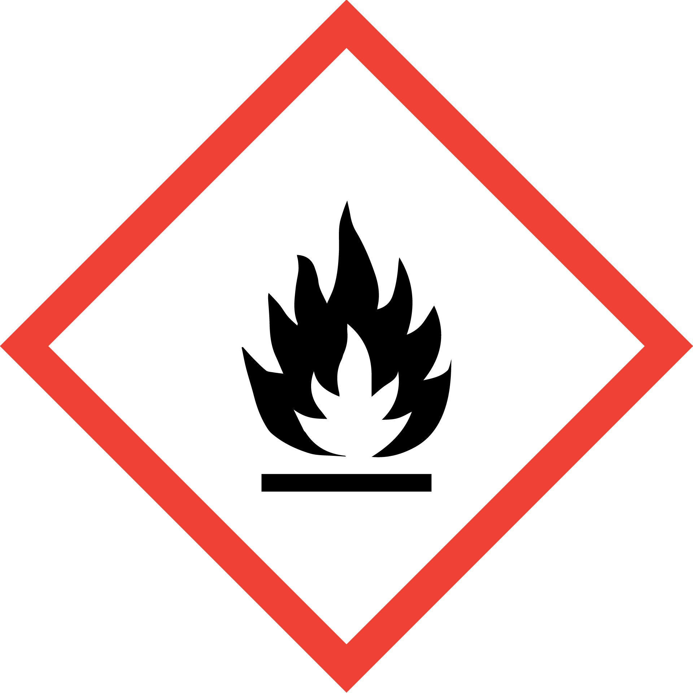
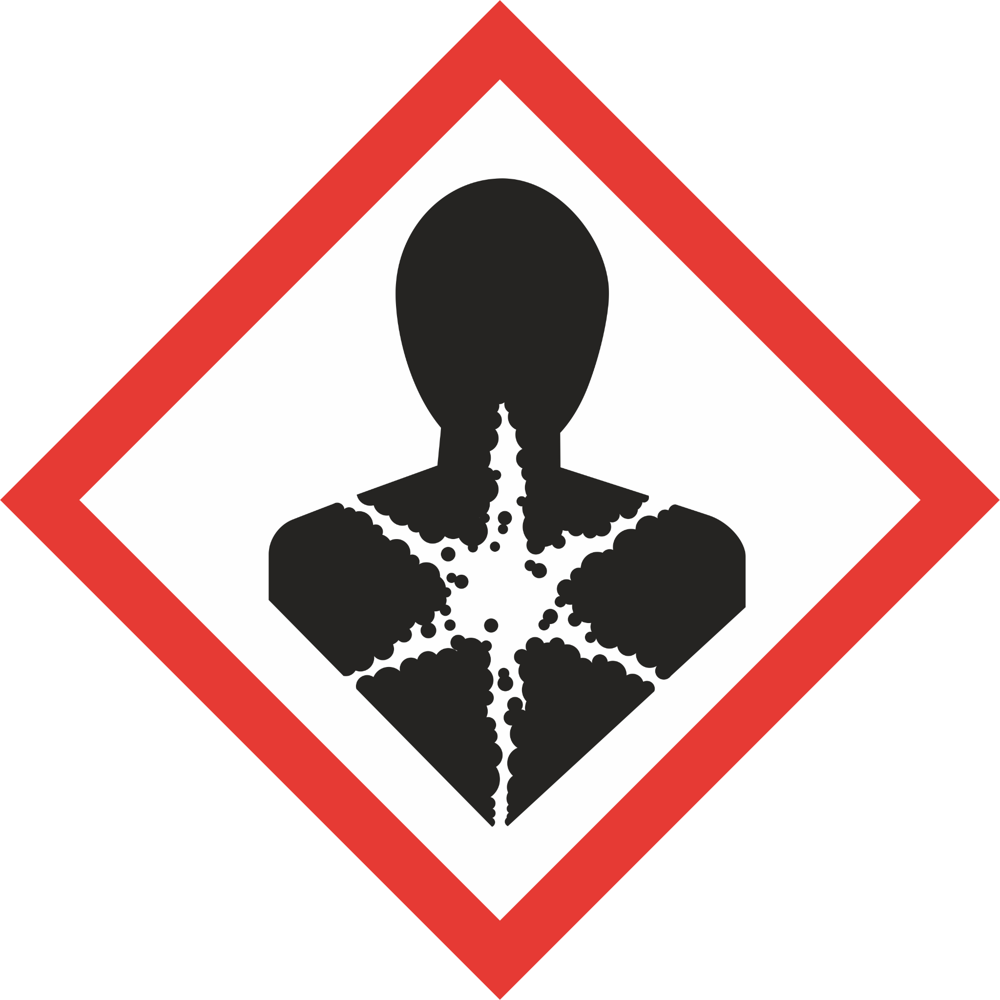
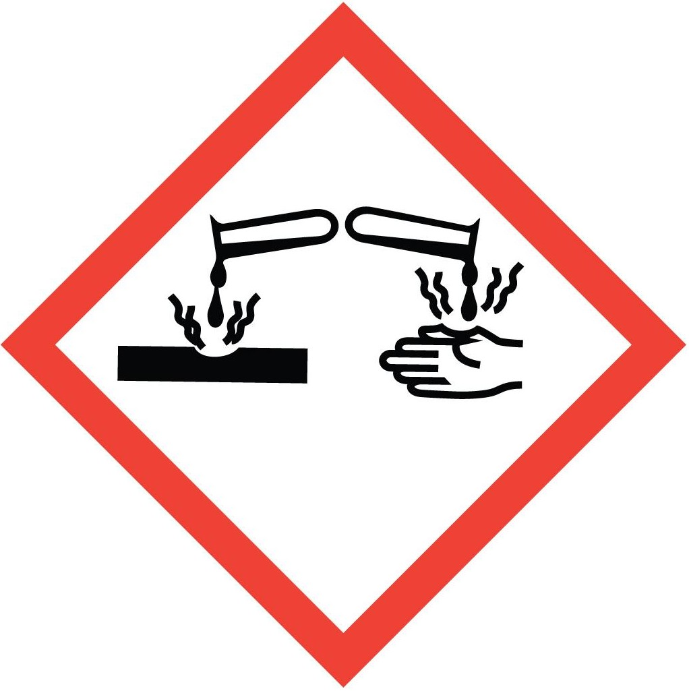

<!-- AUTO-GENERATED by scripts/sync_gdocs.py from the Google Doc below. Edit the Google Doc, not this file. -->

# Litho-Development Hood

[:material-file-document-outline: Google Doc](https://docs.google.com/document/d/15K8HiRoBqTl6__K5GMHitdGn7ybAD6Iga3Qf07gFwt4/preview){ .md-button }
[:material-file-pdf-box: View PDF](../../assets/pdfs/chem/Litho-Development_Hood.pdf){ .md-button }
[:material-download: Download](../../assets/pdfs/chem/Litho-Development_Hood.pdf){ .md-button download="Litho-Development_Hood.pdf" }

---

## Litho-Development Hood

### Standard Operating Procedure

## Section 1: Process Description

The Litho-Development Hood is an Air Control stainless steel fume hood designed for non-corrosive chemical work. Located in the lithography bay of the cleanroom, this hood is designated for solvents and developers with low concentrations of caustics (3% or less) and is to be used for preparing substrates and other samples for lithography and performing post-exposure development of photo- and EBL-resists. There is one sonicator tank built into the hood that can be used to assist with cleaning or development.

DI water guns and a DI water faucet over the sink is available for rinsing samples and glassware. Dry nitrogen guns are available in the hood for blowing dry samples and glassware.  Squeeze bottles of isopropanol, acetone and methanol are also available in the hood to be used for rinsing samples. A rack of glassware designated for use in the litho-development hood only is located next to the hood, though users may also bring their own glassware to be used in the hood if so desired. The glassware is also labelled for use with specific types of chemicals only, such as solvents, caustics or water. There are two stainless steel carboys located in the hood for disposal of most solvents used in the hood, though there are several developers used in the hood that must be disposed of into separate waste containers.

### TMAH Description and Precautions

Tetramethylammonium hydroxide (TMAH) is a caustic chemical available in solutions of varying concentrations, such as \<3% in some developer solutions or in higher concentrations of 10-25%. TMAH is a strong base in higher concentrations, so while the developer solutions with \<3% TMAH are allowed in the Litho Development Hood in Lithography without the full acid PPE, higher concentrations are only allowed in the Caustics/Metal Etch Hood and must be only be handled while wearing full PPE.

TMAH is extremely corrosive to skin, eyes, and mucous membranes, and it is also a contact poison, meaning it has toxic and potentially deadly effects if it comes in contact with skin. Skin contact allows the tetramethylammonium ion to enter the bloodstream causing systemic neurotoxicity, which can lead to respiratory failure. Though higher concentrations present the greatest risks, even lower concentrations of \<3% can cause severe burns and life-threatening symptoms depending on the duration and area of exposure if it gets on the skin, so even lower concentrations should be handled with caution and any skin that comes in contact with the solution should be flushed with water immediately.

## Section 2: Safety Protocols

### Potential Hazards

| Hazardous Chemical | Hazard Sign | Hazard Statements |
| ----- | ----- | ----- |
| Isopropanol \[Isopropyl alcohol; 2-propanol\] | { width="96" }{ width="95" }{ width="96" } | Highly flammable liquid and vapor Causes serious eye irritation May cause respiratory irritation May cause drowsiness or dizziness May cause damage to organs through prolonged or repeated exposure  |
| Acetone \[2-propanone; Dimethyl ketone\] | { width="96" }{ width="95" }{ width="96" } | Highly flammable liquid and vapor Causes serious eye irritation May cause drowsiness or dizziness May cause damage to organs through prolonged or repeated exposure Repeated exposure may cause skin dryness or cracking |
| Methanol \[Methyl alcohol\] | { width="96" }{ width="96" }{ width="96" } | Highly flammable liquid and vapor Causes damage to organs (eyes/central nervous system) Toxic if swallowed, in contact with skin or if inhaled |
| Ethanol \[Ethyl alcohol\] | { width="96" }{ width="95" } | Highly flammable liquid and vapor Causes serious eye irritation |
| SU-8 Developer \[PGMEA; Propylene glycol methyl ether acetate; 1-methoxy-2-propanol acetate\] | { width="96" }{ width="95" }{ width="96" } | Flammable liquid and vapor May cause drowsiness or dizziness May damage fertility or the unborn child |
| Methyl isobutyl ketone \[MIBK; 4-methyl-2-pentanone\] | { width="96" }{ width="95" }{ width="96" } | Highly flammable liquid and vapor Causes serious eye irritation Harmful if inhaled May cause drowsiness or dizziness Suspected of causing cancer |
| Amyl acetate \[Pentyl acetate\] | { width="96" }{ width="95" } | Flammable liquid and vapor Causes serious eye irritation May cause respiratory irritation |
| o-Xylene \[ortho-xylene; 1,2-dimethylbenzene\] | { width="96" }{ width="96" }{ width="95" } | Flammable liquid and vapor Harmful if inhaled May be fatal if swallowed and enters airways Harmful in contact with skin Causes skin irritation Causes serious eye irritation May cause respiratory irritation Suspected of causing cancer May cause damage to organs (central nervous system, liver, kidneys) through prolonged or repeated exposure |
| Anisole | { width="96" }{ width="95" } | Flammable liquid and vapor May cause drowsiness or dizziness Harmful to aquatic life |
| Surpass 3000 | { width="95" } | May causes skin irritation May cause respiratory irritation |
| Cyclopentanone | { width="96" }{ width="95" } | Flammable liquid and vapor Causes skin irritation Causes serious eye irritation |
| Chlorobenzene | { width="96" }{ width="95" }{ width="96" } | Flammable liquid and vapor May causes skin irritation Harmful if swallowed Toxic to aquatic life with long lasting effects |
| Toluene \[Toluol\] | { width="96" }{ width="96" }{ width="95" } | Highly flammable liquid and vapor May be fatal if swallowed and enters airways Causes skin irritation Causes serious eye irritation May cause drowsiness or dizziness Suspected of damaging fertility or the unborn child May cause damage to organs (central nervous system) through prolonged or repeated exposure |
| Chlorotrimethylsilane | { width="96" }{ width="96" }{ width="96" } | Highly flammable liquid and vapor May be toxic if swallowed or if inhaled Harmful in contact with skin Causes severe skin burns and eye damage |
| AZ 300 MIF Developer \[contains: tetramethylammonium hydroxide (\<3%)\] | { width="96" }{ width="95" } | May be corrosive to metals Harmful if swallowed Causes skin irritation Causes serious eye irritation |
| AZ 726 MIF Developer \[contains: tetramethylammonium hydroxide (\<3%)\] | { width="96" }{ width="95" } | May be corrosive to metals Harmful if swallowed Causes skin irritation Causes serious eye irritation |
| MF-24A Developer \[contains: tetramethylammonium hydroxide (\<3%)\] | { width="96" }{ width="95" } | May be corrosive to metals Harmful if swallowed Causes skin irritation Causes serious eye irritation |
| AZ 400K 4:1 Developer \[contains: potassium borates (\<15%)\] | { width="96" }{ width="96" } | May be corrosive to metals Causes mild skin irritation Causes eye irritation May damage fertility or the unborn child |
|  |  |  |

### Physical Hazards

| Hazard | Hazard Sign | Hazard Statements |
| ----- | :---: | ----- |
| Pressurized gas (for the hood spinners only) | { width="101" } | Nitrogen guns in the hood are pressurized |

### Routes of Exposure

There is a risk of skin or eye exposure when handling chemicals that can be mitigated by wearing proper PPE.

There is an inhalation risk when using chemicals, which must only be opened and handled under a fume hood to reduce or eliminate exposure. Check the photohelic exhaust monitor located at the top left corner of the fume hood to ensure that the exhaust is active and at an adequate level before doing any chemical work in the hood.

There is a risk of launching objects by spraying them with the nitrogen guns in the hood that can be mitigated by always aiming the nitrogen gun into the hood and away from people.

There is a risk of splattering chemicals by spraying them with the nitrogen guns in the hood that can be mitigated by always aiming the nitrogen gun into the hood and away from people and never directly spraying chemicals with the nitrogen guns.

### Personal Protective Equipment Requirements

Users must be wearing the nitrile cleanroom gloves required throughout the cleanroom at all times.  It is also recommended that users wear a second pair of gloves over the first pair.  Chemicals may splash onto gloves, which could lead to contaminating other equipment in the cleanroom if gloves are not changed after using chemicals.  Wearing a second pair of gloves makes it easier to remove, dispose of and replace soiled gloves.

Safety glasses are required when using the litho-development hood.

### Chemical Storage

* Caustic-based developers, those with low concentrations of tetramethylammonium hydroxide or potassium borates are stored in the Caustic Developers Cabinet, the small blue caustics cabinet located under the shelf to the right of the litho-development hood.

* Solvent-based developers are mostly stored in the Litho Flammables Cabinet, the medium yellow cabinet located under the table further to the right of the hood, past the door to the bay. Some EBL development solutions that need to be kept cold are stored in the Resists Refrigerator located across from the Litho Flammables Cabinet.

* Regular solvents, such as IPA and acetone, are stored in the Solvents Cabinet, the large yellow cabinet located just outside of the lithography bay.

### Waste Disposal

#### Solvents (excluding SU-8 Developer/PGMEA)

There are two chemical waste slots in the back of the solvents/lift-off hood that drain to stainless steel carboys under the hood.  All regular solvents, such as isopropanol, acetone, methanol, ethanol, and toluene, should go into the carboys.  Solvents used for development of EBL resists, such as MIBK, xylene, and amyl acetate, along with solvents used to dilute or mix  resists, such as anisole and cyclopentanone, can also go into the carboys.  Any of these solvents can go into either of the two carboys in spite of the labeling above them.

#### SU-8 Developer/PGMEA

One exception for solvent disposal in the carboys is SU-8 developer (PGMEA or 1-methoxy-2-propanol acetate), which should not be poured into the carboys, but instead should be disposed of into a waste bottle in the waste cabinet.

#### Caustic-based Photo Developers

Caustic based developers that contain TMAH, potassium borate or NaOH, such as AZ 300 MIF, AZ 726 MIF, AZ 400K, must be disposed of in a waste bottle and stored in the chemical waste cabinet in the lithography bay.  The waste bottle must be labelled with the full names of the chemical contents, meaning no abbreviations or trade names are to be used on the label.  Generally, there should already be a waste bottle set up in the waste cabinet for halogenated solvents.

#### Soiled Wipes and Gloves

Dispose of gloves and wipes soiled with chemicals in a red hazardous waste bin.

#### Sharps

Dispose of any used pipettes or swabs in the sharps waste container.

Dispose of used or failed substrates in a sharps waste container.

Dispose of broken chemical glassware in a sharps waste container.

## Section 3: Chemical Process

### Preparation

1. Read through the datasheet of the resist that you will be developing.  The duration of development is critical, so you need to know this before you begin the actual chemical work.

2. Check whether any users have any of the 3 slots for the “Litho-Development Hood” in Badger enabled. If so, confirm that they’re actually still using the hood. Users should have the hood enabled as long as they have chemicals in the hood. If all slots are enabled, you cannot use the hood until 1 of them opens.

3. Enable one of the “Litho-Development Hood” user slots in Badger.

4. Check the state of the hood:

    1. If other users have chemistry in the hood, coordinate with them so your work in the hood does not overlap too much with theirs. While three users can have chemistry in the hood at the same time, only two users can be working at the hood at any time and they cannot use the sink at the same time.

    2. Check the photohelic exhaust monitor located at the top left corner of the fume hood to ensure that the exhaust is active and at an adequate level.

    3. Check the status of the carboys in the hood controls if you will be disposing of solvents that go into the carboys.

    4. Confirm that the hood is in a clean and safe state. If other users’ chemistry is in the hood, it should be to the side of the hood and unattended chemicals must be covered.

### Litho-Development

1. Get two glass beakers that will fit your samples for processing from the “Development Hood Supplies” glassware rack on the shelf to the right of the hood – one should be labeled “Water Only” and the other should be labeled either “Solvents Only” or “Caustics Only” depending on the type of developer you are using.  
2. Rinse both beakers with DI water prior to beginning the process.  
3. Blow the beaker labeled developer semi-dry with the N2 gun and place it on a cleanroom wipe in the hood.  
4. Stand the beaker labeled “Water Only” to be used for rinsing the sample on a cleanroom wipe in the hood and fill it with DI water so that the water level will cover the entire substrate.  
5. Retrieve the required developer from its cabinet. Caustic-based developers are located in the small blue caustics cabinet located under the shelf to the right of the hood. Solvent-based developers are located in the litho flammables cabinet under the table further to the right of the hood, past the door to the bay.  
6. Carefully pour enough developer into the beaker labeled for developer so that your sample will be completely submerged in developer.  
7. Place your sample into the developer using tweezers and begin agitating the solution.  
8. Allow your samples to sit in the developer for the duration of time required to develop your features. If you are leaving your chemistry unattended for this time, make sure there is a label with your name, the date and chemical contents next to it, and leave the Badger slot for the hood enabled while your chemicals remain in the hood.

### DI Water Rinse

1. When the development is complete, remove your sample from the developer with tweezers. *It is often best to use a small trickle of DI water from one of the DI water guns to break the surface tension of the chemical solution as you remove your sample so don’t coat your sample with contaminants as you take it out. Only use a small trickle as you do not want to add too much water and you don’t want to splash it outside of the beaker.*  
2. Transfer the sample carefully to the DI water rinse beaker.  
3. Let the sample soak in DI water for 1 minute.  
4. Remove the sample from the rinse beaker with the tweezers. *It is often best to use a small trickle of DI water from one of the DI water guns to break the surface tension of the chemical solution as you remove your sample so don’t coat your sample with contaminants as you take it out.*  
5. Rinse the sample with DI water in the hood sink, holding it in the water stream for approximately 10 seconds or more.

### Sample Dry

1. After the water rinse is finished, blow the sample dry with the N2 gun. Be careful to use a full blast of nitrogen as it is easy to blow your sample out of the tweezers if it is too strong.

### Cleanup

1. Retrieve a waste bottle labelled for the chemical components of your developer solution from the chemical waste cabinet and bring it to the hood. Do not open the waste bottle outside of the hood.  
2. Carefully pour the developer waste into the waste bottle designated for the chemical components using the small plastic funnel found on the shelf next to the hood.  
3. Rinse the beaker with DI water multiple times (typically 3 times or more) in the sink and then blow it as dry as possible with the N2 gun.  **DO NOT pour rinse water in the waste bottle.**  
4. Dump the DI rinse beakers into the sink in the hood.  **DO NOT pour rinse water in the waste bottle or carboys.**  
5. Rinse the beaker with DI water multiple times (typically 3 times or more) in the sink and then blow it as dry as possible with the N2 gun.  
6. Return all glassware to a drawer in the litho-development glassware rack.

## Section 4: Accident Procedure

### **Chemical Exposure**

- Skin: Remove contaminated clothing, wash skin with soap and water. **If there is any irritation, get immediate medical attention.**   
- Eye: Immediately flush with water for at least 15 minutes while lifting upper and lower eyelids occasionally. **Get immediate medical attention.**  
- Ingestion: Do not induce vomiting. **Get immediate medical attention.**  
- Inhalation: Remove to fresh air. Resuscitate if necessary. Take care not to inhale any fumes released from the victim’s lungs. **Get immediate medical attention.**

### **Spills**

##### **Small Spill Within the Hood**

If a small spill occurs and is fully contained within the hood:

* Wipe up the spill using appropriate wipes and dispose of them in the designated waste container.  
* If wipes are insufficient, use the absorbent pads stored in the bottom right corner of the hood.  
* If you are unsure how to clean up the material or feel uncomfortable doing so, **notify staff immediately**.

##### **Medium or Large Spill Within the Hood \- Always staff**

If the spill requires use of an absorbent pillow from the spill kit:

* **Notify staff immediately.**  
* If the spill occurs **after hours**, contact cleanroom staff and post a message on Slack to alert other users **not to use the hood** until it has been properly cleaned and cleared by staff.

##### **Any Spill Outside the Hood**

If a spill occurs outside the hood:

1. **Notify cleanroom staff immediately.**  
2. **Evacuate the immediate area** (typically the entire bay containing the hood).  
3. If the spill occurs **after hours**, contact cleanroom staff and post a message on Slack to alert others. The cleanroom will remain closed until staff can safely manage the spill.

## Versioning and Updates

4/7/26- Updated with TMAH Hazard Section

