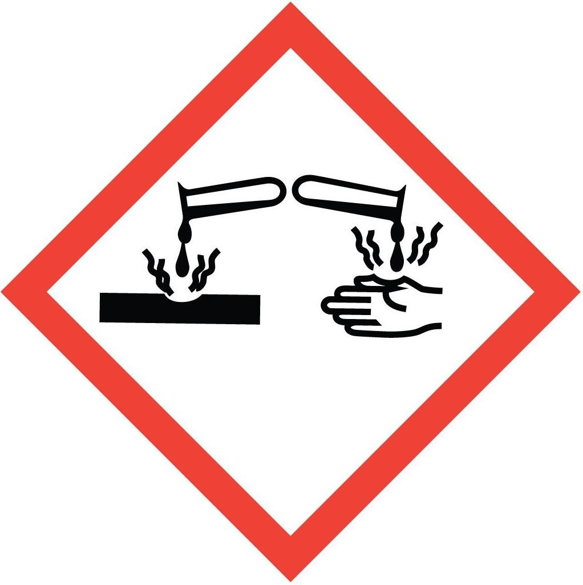
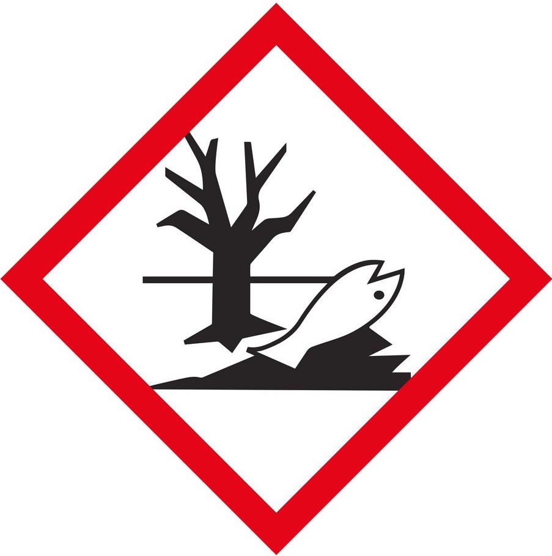
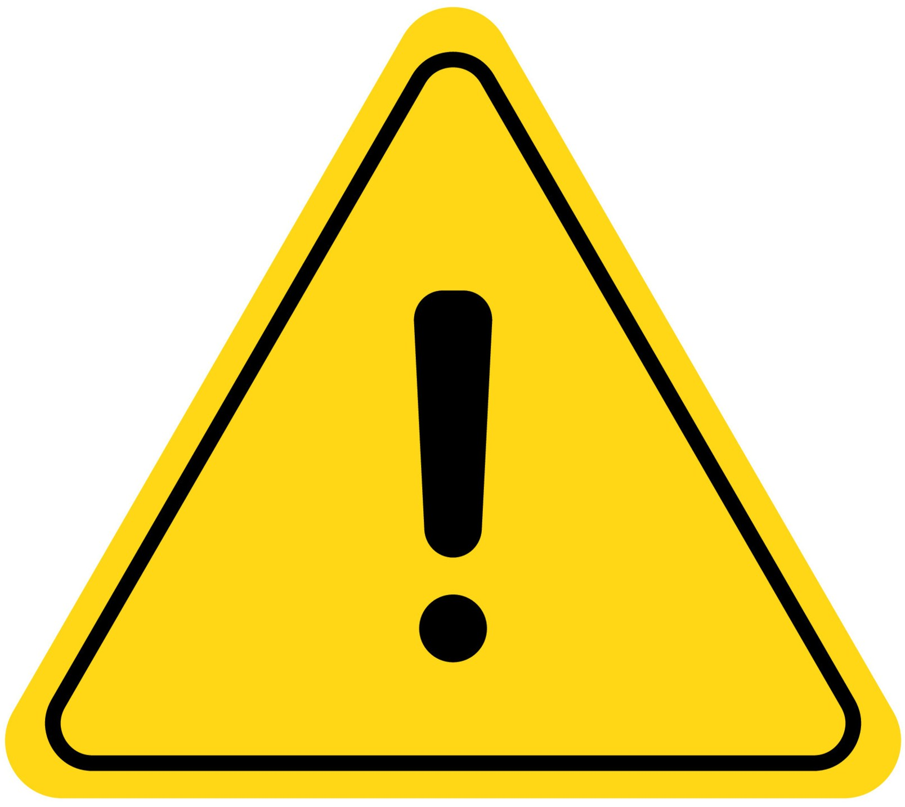

<!-- AUTO-GENERATED by scripts/sync_gdocs.py from the Google Doc below. Edit the Google Doc, not this file. -->

# RCA Clean Hood

[:material-file-document-outline: Google Doc](https://docs.google.com/document/d/1Qtl2bvsitV9snJGXmonvmC6lgJgq6zfIud20R6E94i0/preview){ .md-button }
[:material-file-pdf-box: View PDF](../../assets/pdfs/chem/RCA_Hood.pdf){ .md-button }
[:material-download: Download](../../assets/pdfs/chem/RCA_Hood.pdf){ .md-button download="RCA_Hood.pdf" }

---

## RCA Hood

### Standard Operating Procedure

## Section 1: Process Description {#section-1:-process-description}

### Hood Description {#hood-description}

The RCA Hood is an Air Control polypropylene fume hood designed for corrosive chemical work. Located in the etch bay of the cleanroom, this hood is designated for the all acid and caustic chemistries used for RCA cleans. The specific chemistries used are RCA1, a solution of hydrochloric acid and hydrogen peroxide in DI water, RCA2, a solution of ammonium hydroxide and hydrogen peroxide in DI water, and an HF dip, a HF diluted in DI water. Sulfuric acid is never to be used in this hood as there is no waste disposal available for it in the hood. No solvents should be used in this hood as they will react violently if mixed with acids.

DI water and dry nitrogen guns are available in the hood for rinsing and blowing dry samples and glassware. A rack of glassware designated for use in the RCA hood only is located on the left side of the hood past the spin rinse dryer and vapor HF system, though users may also bring their own glassware to be used in the hood if so desired. All acid should be disposed of in waste containers located at the back of the hood. Hydrofluoric acid must be disposed of in a separate waste container. Caustics can be disposed of in the carboy drain located at the back of the hood.

### RCA Description {#rca-description}

The RCA clean is a standardized process for cleaning silicon wafers for high temperature processing, such as oxidation or LPCVD. Typically, there are 3 steps, though the second step is optional. The first step consisting of a diluted solution of ammonium hydroxide and hydrogen peroxide removes particles and organic contaminants. The second step, which is optional, consisting of a diluted solution of aqueous hydrofluoric acid removes the thin oxide that naturally forms on silicon wafers. The third step consisting of a diluted solution of hydrochloric acid and hydrogen peroxide removes ionic contamination. Each step must be performed with high-purity chemicals and clean glassware and containers to ensure cleanliness. Rinsing and drying must be performed properly in order to avoid recontaminating the wafer surfaces.

### HF Description and Precautions {#hf-description-and-precautions}

Some extra precautions should be taken if using hydrofluoric acid. Hydrofluoric acid is an acid used for wet etching of oxides and some metals. Since hydrofluoric acid etches glass, it should never be used in glass containers. Hydrofluoric acid is an especially dangerous acid since it is a powerful contact poison. It will not  immediately burn when it comes in contact with skin, but instead will permeate the skin and begin leaching calcium from the body damaging bones and other organs long before signs of burning begin to appear on the skin. Any delay in treating exposure to hydrofluoric acid will often lead to fatal consequences for anyone exposed to it. Due to these characteristics of hydrofluoric acid, extra care should be taken when handling it.

## Section 2: Safety Protocols {#section-2:-safety-protocols}

### Chemical Hazards {#chemical-hazards}

| Hazardous Chemical | Hazard Sign | Hazard Statements |
| ----- | ----- | ----- |
| Ammonium hydroxide | { width="96" }{ width="95" }{ width="96" } | Causes severe skin burns and eye damage Harmful if swallowed May cause respiratory irritation Toxic to aquatic life with long lasting effects  |
| Hydrochloric acid | { width="96" }{ width="95" } | May be corrosive to metals Causes severe skin burns and eye damage May cause respiratory irritation Corrosive to the respiratory tract |
| Hydrogen peroxide | { width="95" }{ width="95" }{ width="96" }{ width="96" } | May intensify fire; oxidizer Harmful if swallowed or inhaled Causes severe skin burns and eye damage Toxic to aquatic life  Harmful to aquatic life with long lasting effects |
| Hydrofluoric acid | { width="96" }{ width="96" } | May be corrosive to metals Causes severe skin burns and eye damage May cause respiratory irritation Fatal if swallowed, in contact with skin or if inhaled Corrosive to the respiratory tract |

### Physical Hazards {#physical-hazards}

| Hazard | Hazard Sign | Hazard Statements |
| ----- | :---: | ----- |
| Pressurized gas | { width="101" } | Nitrogen guns in the hood are pressurized |
| Hot Plate | { width="100" } | Can cause severe thermal burns |

### Routes of Exposure {#routes-of-exposure}

There is a risk of skin or eye exposure when handling chemicals that can be mitigated by wearing proper PPE.

There is an inhalation risk when using chemicals, which must only be opened and handled under a fume hood to reduce or eliminate exposure. Check the photohelic exhaust monitor located at the top left corner of the fume hood to ensure that the exhaust is active and at an adequate level before doing any chemical work in the hood.

There is a risk of launching objects by spraying them with the nitrogen guns in the hood that can be mitigated by always aiming the nitrogen gun into the hood and away from people.

There is a risk of splattering chemicals by spraying them with the nitrogen guns in the hood that can be mitigated by always aiming the nitrogen gun into the hood and away from people and never directly spraying chemicals with the nitrogen guns.

There is a risk of severe skin burns if a hotplate is touched, which can be prevented by using tweezers when handling samples on the hotplate and never touching it directly with hands or other body parts. When heating chemicals in glassware on a hotplate, do not remove from the hotplate until the hotplate has been turned off and the chemicals have returned to room temperature.

### Personal Protective Equipment Requirements {#personal-protective-equipment-requirements}

Trionic (tripolymer of nitrile, neoprene and rubber) gloves must be worn over the regular nitrile cleanroom gloves required throughout the cleanroom.

Vinyl apron that covers the entire torso and arms must be worn over the cleanroom suit required throughout the cleanroom. The apron must be securely tied at the back of the neck and around the waste so that it does not hang loosely on the body. The sleeves of the apron must be tucked into the trionic gloves at the forearm such that there is no space between the coverage of the apron and the coverage of the gloves.

Full faceshield must be worn over the cleanroom hood required throughout the cleanroom and any facemask or safety glasses worn by the user. The faceshield must not be raised while handling chemicals and should never be touched with soiled gloves.

Safety glasses should be worn under the faceshield.

## Section 3: Chemical Containment {#section-3:-chemical-containment}

### Chemical Storage {#chemical-storage}

* Hydrochloric acid is stored in the Acids Cabinet, the large blue cabinet located just outside of the EBL rooms.  
    
* Ammonium hydroxide is stored in the Caustics Cabinet, the long, short blue cabinet located on top of the Solvents Cabinet across from the entrance to the lithography bay.

* Hydrogen peroxide is stored in the Oxidizers Cabinet, the small yellow cabinet located just outside of the EBL rooms.

* Hydrofluoric acid is stored in the HF Cabinet, the small white plastic cabinet located next to the Piranha/HF Hood.

### Chemical Transport {#chemical-transport}

Secondary containment is always required when moving acids, caustics and oxidizers between storage cabinets and hoods. White plastic transport pails can be found on top of the Acids Cabinet next to the Nitric Acid Cabinet and next to the Oxidizers Cabinet.

Users must wear the trionic gloves whenever you’re handling bottles of acids, caustics and oxidizers due to the risk of contamination on the outside surface of bottles from chemical drips down the side of the bottle.

### Chemical Waste Disposal {#chemical-waste-disposal}

* RCA1 waste must be disposed of in the acid waste container in the back of the hood. The cap on the acid waste bottle should never be fastened. RCA1 waste will continue to react long after you’re finished with it and will build pressure in a sealed container creating an explosion risk. If you notice the acid waste container is closed and bulging, inform staff immediately and stay away from the hood until it is dealt with.

* RCA2 waste must be disposed of in the caustics carboy drain in the back of the hood.

* HF waste must be disposed of in the HF waste container in the back of the hood. Any chemical solution containing even minimal amounts of hydrofluoric acid is considered HF waste and must be disposed of in the HF waste container.

### Solid Waste Disposal {#solid-waste-disposal}

* Dispose of wipes soiled with chemicals in a red hazardous waste bin.

* Dispose of personal protective equipment that is damaged or cannot be decontaminated in a red hazardous waste bin.

* Dispose of used or failed substrates in a sharps waste container.

* Dispose of broken chemical glassware in a sharps waste container.

## Section 4: Chemical Use Protocols {#section-4:-chemical-use-protocols}

### Preparation {#preparation}

1. Read through the SOP for RCA clean. From this you can determine the chemicals and glassware you’ll be using. The RCA clean SOP will also include important procedures for spill cleanup and first aid for chemical exposures that must be reviewed before using the chemicals.

2. Check whether anyone has the “RCA Hood” enabled in Badger. If so, confirm that they’re actually still using the hood. Users should have the hood enabled as long as they have chemicals in the hood. Only 1 user can use the RCA hood at a time. If someone else is using it, you’ll need to wait for them to finish before you can use it.

3. Enable the “RCA Hood” user slots in Badger.

4. Check the state of the hood:

   1. Check the photohelic exhaust monitor located at the top left corner of the fume hood to ensure that the exhaust is active and at an adequate level.

   2. Check that there are waste containers at the back of the hood for the chemicals you’ll be using and that there is enough room in the containers for your chemical waste.

   3. Confirm that the hood is in a clean and safe state.

5. Collect the necessary beakers, graduated cylinders or other containers for your process from the glassware rack and place them on wipes inside the hood.

6. Place your samples and any other supplies on wipes inside the hood.

7. Check the status of the PPE you’ll be wearing:

   1. Check the trionic gloves you’ll be using for holes by twisting it off at the cuff to enclose air inside and squeeze it to confirm that balloons.

   2. Check the vinyl apron you’ll be wearing for tears and holes, especially on the sleeves. Confirm that the ties are intact at the neck and waist.

   3. Check the faceshield you’ll be using to confirm that it is intact and that the visor is clean and clear. Make sure it is adjustable and set it up to fit comfortably and securely on your head.

   4. Check your safety glasses to confirm that they are clean and clear.

8. Put on the trionic gloves. Best practice is to avoid touching the outside of the gloves as you’ll be putting them on and taking them off after handling chemicals. Turn the duff inside out so you can grip it from the inside with the opposite hand to put it on. As you put the other glove on, only touch the outside of the glove with your gloved hand.

9. Collect the necessary chemicals from the chemical cabinets, placing them in the white transport pails found by the acids and oxidizers cabinets to carry them from the cabinets to the hood. Be cautious when handling the bottles of chemicals. You’re required to use secondary containment whenever moving them between hood and cabinet. You must wear the trionic gloves whenever you’re handling bottles of acids, caustics and oxidizers.

10. Remove the trionic gloves, essentially reversing the procedure used to put them on. You may place them in the hood with the cuffs overhanging the edge outside the hood.

11. Don the full PPE:

    1. Put on the apron first. Secure it around your neck with the ties. It is often easier to tie the neck ties prior to donning it and then lift over your head to put it on. Be careful when putting your arms into the sleeves as the vinyl material can sometimes tear easily. Fasten the apron around your waist by wrapping the ties around your waste and tying them in the front rather than the back. Once you have the apron on, double check for tears and holes, especially on the sleeves.

    2. Put on your safety glasses if you are not already wearing them.

    3. Put on the faceshield. Adjust it to ensure that it fits securely on your head and does not shift. The faceshield needs to be down over your face before you move on to the next step of putting on the trionic gloves.

    4. Put on the trionic gloves. Again, best practice is to avoid touching the outside of the gloves as you’ll be putting them on and taking them off after handling chemicals. Turn the duff inside out so you can grip it from the inside with the opposite hand to put it on. As you put the other glove on, only touch the outside of the glove with your gloved hand.

12. Once you have the full PPE on, you should only work in the immediate area of the hood. Do not touch anything outside of the hood while you’re wearing the PPE. If you need to use something outside of the hood, you need to remove the PPE first.  
    Do not touch the faceshield while you’re wearing the trionic gloves. If you need to adjust the faceshield or your safety glasses, you need to remove the trionic gloves first.

### RCA Clean Procedures {#rca-clean-procedures}

The procedure for the RCA clean, including post-process cleanup of glassware, spill cleanup and accident protocols, are detailed in the separate SOP for it.

Note that as covered in that SOP that if you are leaving chemicals unattended, they should be covered with watch glasses or plastic lids and should have a label with them. You’ll need to remove all of the PPE in order to do anything outside of the hood. Make sure to follow the guidelines for removing PPE laid out in the next section and then the guidelines for donning PPE laid out in the previous section.

### Cleanup {#cleanup}

1. Place your samples and all of your supplies that you’ll be removing from the hood to the side of the hood on a clean wipe.

2. Check the chemical bottles for drips down the side from pouring. Decontaminate the bottles with a damp wipe and then dry with another wipe.

3. Place the bottles of chemicals back into the white transport pails and place them on the floor next to the hood.

4. Wipe up any splashes or drops of fluid in the hood with wipes.

5. Remove all soiled wipes from the hood and dispose of them in the proper trash bin.

6. Rinse off the trionic gloves with DI water and then dry them with wipes.

7. Inspect all of the PPE to ensure it did not come into contact with chemicals.  Decontaminate the PPE with DI water and dry with wipes if you find any chemicals on the PPE.

8. Remove the PPE:

   1. Remove the trionic gloves, essentially reversing the procedure used to put them on. You may place them in the hood with the cuffs overhanging the edge outside the hood.

   2. Remove the faceshield and hang it on the hook on the wall. Do not place the faceshield in the hood.

   3. If you remove your safety glasses, do not put them in the hood.

   4. Untie the apron and then carefully take it off. Hang it up immediately on the hook on the wall.

9. Don the trionic gloves.

10. Take the chemicals back to the chemical cabinets in the secondary containment and store them in the cabinets.  Store the chemical transport pails by the acids and oxidizers cabinets.

11. Rinse off the trionic gloves with DI water and then dry them with wipes.

12. Remove the trionic gloves and store them.

13. Clean off the chemical label with IPA and store it.

14. Remove samples and supplies from the hood.

15. Confirm that you cleaned up after yourself and that nothing has been left behind, including used wipes.  

16. Disable the “RCA Hood” in Badger.

## Section 5: Accident Procedure

#### **Hydrofluoric Acid Contact**

**In the event of an HF exposure your chemical buddy must call Public Safety (212-650-7777), and notify them of the nature of the emergency. When the ambulance arrives, the chemical safety buddy must explain to the emergency personnel the nature of the exposure, give them the MSDS, and request that the victim be transported to Columbia Presbyterian Medical Center, which is equipped to handle HF burns. Note: The ambulance driver may not always comply with this request, in which case the proper emergency room should be left to the discretion of the driver.**

#### **Skin Exposure**

1. Move the victim immediately under an emergency shower or other water source and flush the affected area with large amounts of cool running water for at least 5 minutes. Clothing, shoes and jewelry should be removed while the water is flowing onto the victim. Goggles should be removed last while the victim is facing the water flow. Colleagues must be EXTREMELY CAREFUL not to become contaminated while assisting the victim. Trionic gloves must be worn.  
2. While the victim is being rinsed with water, call Public Safety (212-650-7777) and inform the emergency dispatcher of the HF exposure and request emergency transport. Ensure emergency responders and treating physicians are aware of the nature of the chemical exposure. Not all hospitals are equipped to deal with HF exposure, so emergency responders need to know to take the victim to the right hospital. Provide a copy of the MSDS to emergency responders.  
3. After the affected area is flushed with copious amounts of water for at least five minutes, apply 2.5% calcium gluconate gel to the area of exposure. Massage gel into affected areas. If calcium gluconate gel is unavailable, flush skin surfaces with water for at least 15 minutes. In order to prevent cross contamination, the victim should self-apply the calcium gluconate gel. If the victim is unable to self-apply, anyone present can apply the gel after first putting on trionic gloves. Do not use regular nitrile gloves because they are not thick enough to provide an effective barrier against HF. Note the time when the calcium gluconate gel was first applied to the contaminated skin and provide this information to the emergency responders. Re-apply gel every 15 minutes until the victim arrives at the hospital and is treated by doctors.  
4. After the emergency responders arrive they will call the Emergency Room doctor for instructions and may administer the calcium carbonate tablets (antacid tablets) in the HF First Aid Kit.

#### **Eye Exposure**

> > > 1. Immediately flush eyes for at least 5 minutes with copious cool flowing water. Call Public Safety (212-650-7777), inform the emergency dispatcher of the exposure and request emergency transport. The victim should then be transported to a medical facility. MEDICAL PERSONNEL may irrigate the victim’s eyes with a sterile 1% calcium gluconate solution.  
> > > 2. Ensure emergency responders and treating physicians are aware of the nature of the chemical exposure. Provide a copy of the MSDS to emergency responders.

#### **Inhalation**

1. *If a large volume of hydrofluoric acid gas is inhaled.* Immediately remove the victim to fresh air. Call Public Safety (212-650-7777) and inform the emergency dispatcher of the exposure and request emergency transport.  
2. Ensure emergency responders and treating physicians are aware of the nature of the chemical exposure. Provide a copy of the MSDS to emergency responders.  
3. Inhalation of hydrofluoric acid fumes may cause swelling in the respiratory tract up to 24 hours after exposure. Persons who have inhaled hydrofluoric acid vapors may need prophylactic oxygen treatment and must be seen by a physician as soon as possible.  
- 

#### **Hydrochloric Acid, Ammonium Hydroxide and Hydrogen Peroxide Contact**

- Skin: Remove contaminated clothing, rinse affected area with water for 10 minutes. **If there is a visible burn, get immediate medical attention.**  
- Eye: Immediately flush with water for at least 20 minutes while lifting upper and lower eyelids occasionally. **Get immediate medical attention.**  
- Ingestion: Do not induce vomiting. **Get immediate medical attention.**  
- Inhalation: Remove to fresh air. Resuscitate if necessary. Take care not to inhale any fumes released from the victim’s lungs. **Get immediate medical attention.**

#### **Spills**

##### **Small Spill Within the Hood**

If a small spill occurs and is fully contained within the hood:

* Wipe up the spill using appropriate wipes and dispose of them in the designated waste container.  
* If wipes are insufficient, use the absorbent pads stored in the bottom right corner of the hood.  
* If you are unsure how to clean up the material or feel uncomfortable doing so, **notify staff immediately**.

##### **Medium or Large Spill Within the Hood \- Always staff**

If the spill requires neutralization or use of an absorbent pillow from the spill kit:

* **Notify staff immediately.**  
* If the spill occurs **after hours**, contact cleanroom staff and post a message on Slack to alert other users **not to use the hood** until it has been properly cleaned and cleared by staff.

##### **Any Spill Outside the Hood**

If a spill occurs outside the hood:

1. **Notify cleanroom staff immediately.**  
2. **Evacuate the immediate area** (typically the entire bay containing the hood).  
3. If the spill occurs **after hours**, contact cleanroom staff and post a message on Slack to alert others. The cleanroom will remain closed until staff can safely manage the spill.

