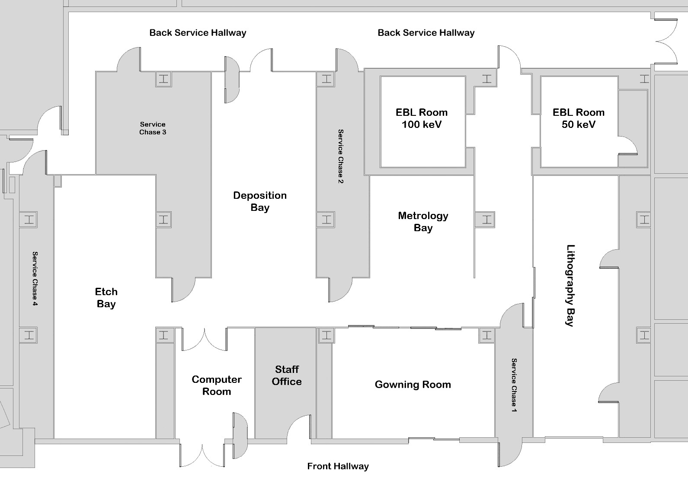
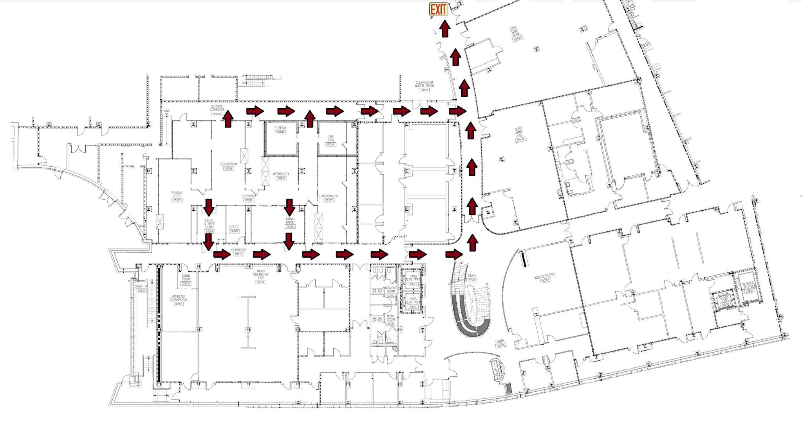
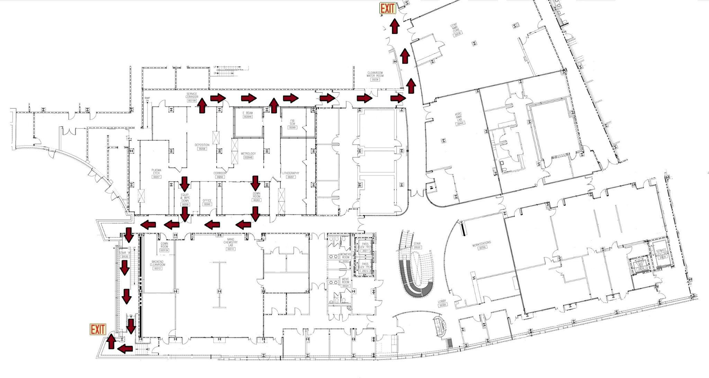
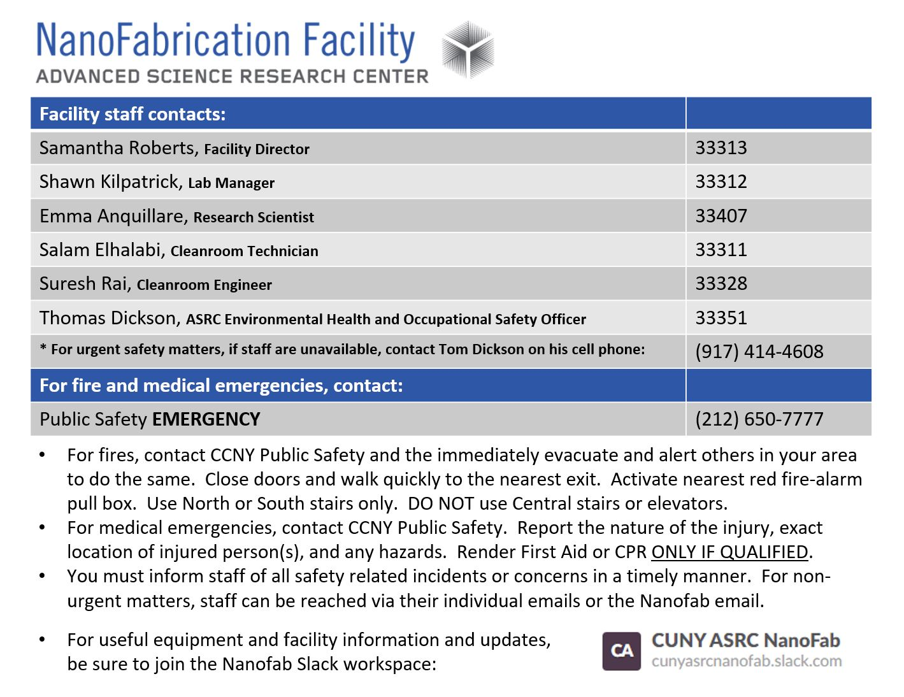
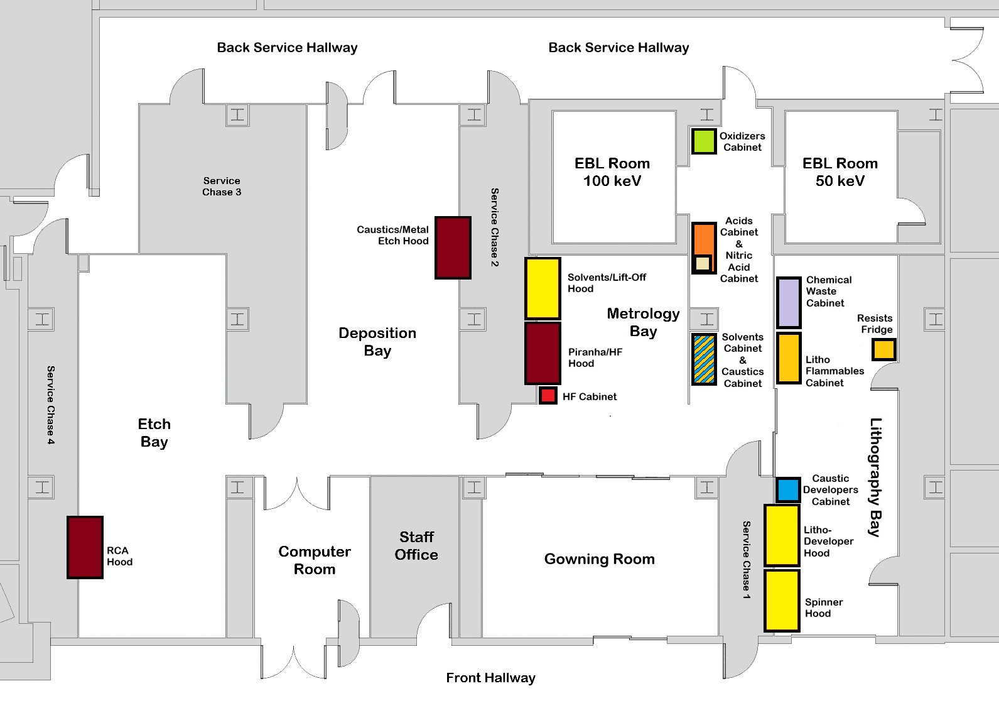
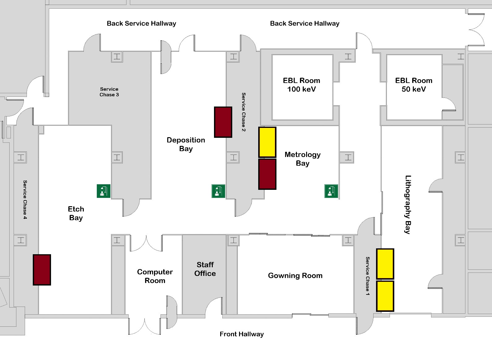

<!-- AUTO-GENERATED by scripts/sync_gdocs.py from the Google Doc below. Edit the Google Doc, not this file. -->

# ASRC Nanofab Facility -- Safety Manual

[:material-file-document-outline: Open the Google Doc](https://docs.google.com/document/d/187RZSPDB9wpZXlKId2_d5mGpKgp5suuu95ipNXFHyPw/preview){ .md-button }
[:material-file-pdf-box: View PDF](../assets/pdfs/policy/Safety_Manual.pdf){ .md-button }
[:material-download: Download PDF](../assets/pdfs/policy/Safety_Manual.pdf){ .md-button download="Safety_Manual.pdf" }

---

**Lab Manual: Safety**

# **Section 1: Cleanroom Basic Layout** {#section-1:-cleanroom-basic-layout}

{ width="615" }

# **Section 2: Emergency Exits** 

{ width="624" }

{ width="624" }

**Cleanroom Egress**

**Building Egress from the Cleanroom**

**Evacuation Procedure**

* Secure your process.

* Do not de-gown, keep your gown on.

* As you proceed to an exit door, ask other lab members to follow.

* Exit the building through the nearest exits.

* The assembly area for the NanoFab is across St. Nicholas Terrace on the park side of the street.

* Remain available to pass on details you have about events that lead to an evacuation.

# **Section 3: Facility Staff and Emergency Contacts** {#section-3:-facility-staff-and-emergency-contacts}

## **Facility Staff Contacts** {#facility-staff-contacts}

* Samantha Roberts, Facility Director  
  * Office phone: (212) 413-3313  
    \* dial 33313 when dialing from an internal phone within the ASRC  
  * Email: sroberts@gc.cuny.edu  
* Shawn Kilpatrick, Lab Manager  
  * Office phone: (212) 413-3312  
    \* dial 33312 when dialing from an internal phone within the ASRC  
  * Email: skilpatrick@gc.cuny.edu  
* Salam Elhalabi, Cleanroom Technician  
  * Office phone: (212) 413-3311  
    \* dial 33311 when dialing from an internal phone within the ASRC  
  * Email: selhalabi@gc.cuny.edu  
* Suresh Rai, Cleanroom Engineer  
  * Office phone: (212) 413-3328  
    \* dial 33328 when dialing from an internal phone within the ASRC  
  * Email: srai@gc.cuny.edu  
* Emma Anquillare, Research Scientist  
  * Office phone: (212) 413-3407  
    \* dial 33407 when dialing from an internal phone within the ASRC  
  * Email: [eanquillare@gc.cuny.edu](mailto:eanquillare@gc.cuny.edu)

## **ASRC Safety Contacts** {#asrc-safety-contacts}

* Thomas Dickson, Environmental Health and Safety Officer  
  * Office phone: (212) 413-3351  
    \* dial 33351 when dialing from an internal phone within the ASRC  
  * Email: tdickson@gc.cuny.edu  
* Elliot Quinteros  
  * Office phone:  
    \* dial 33313 when dialing from an internal phone within the ASRC  
  * Email: equinteros@gc.cuny.edu

## **ASRC Emergency Contacts** {#asrc-emergency-contacts}

* Public Safety Emergency: dial (212) 650-7777

In the case of a fire emergency, activate the nearest red fore-alarm pull box and then immediately evacuate while alerting others in the area to the same.  DO NOT use the central staircase or elevators.  Contact the CCNY Public Safety Emergency number once out of immediate danger.

In the case of a medical emergency, contact the CCNY Public Safety Emergency number and report the nature of the medical emergency, the exact location of the injured person(s), and any hazards.

## **Phone Locations in the Cleanroom** {#phone-locations-in-the-cleanroom}

A staff contact list is posted next to all telephones in the cleanroom.

{ width="364" }

{ width="624" }

# **Section 4: Alarm Systems** {#section-4:-alarm-systems}

## **Fire Alarm:**  {#fire-alarm:}

### **Alarm Light and Horn** {#alarm-light-and-horn}

There are red fire alarms with a strobe light and speaker mounted on walls throughout the cleanroom. In the case of a fire, the strobe light will blink and an audible alarm will sound.

The speaker may also be used by CCNY Fire Safety to deliver more information, so be aware and listen for any important information if you hear a voice come onto the speaker. They will first identify themselves and then deliver any important information. If the fire alarm is a false alarm due to testing or other activity in the building, Fire Safety will say so over the speaker, and you will not need to evacuate the building.

### **Fire Drills** {#fire-drills}

Fire drills are preplanned events, so staff will send messages and warnings ahead of time. Everyone is required to evacuate the building during fire drills. It is important to plan certain cleanroom processes that require constant presence in the cleanroom so that they do not coincide with fire drills.

### **Pull Stations** {#pull-stations}

There are pull stations to set off the fire alarm mounted on walls throughout the cleanroom. These are only to be activated in case of a fire in the cleanroom.

## **Toxic Gas Monitoring System (TGMS) Alarm:** {#toxic-gas-monitoring-system-(tgms)-alarm:}

Alarm Lights and Horn:

There are TGMS alarms with a stack of 3 lights and a horn mounted 

* Blue Alarm (Danger Level): Exit the cleanroom and building.

  * Orange Alarm (Warning Level): Exit the cleanroom.

  * Green Light: Normal/safe conditions.

  **Emergency Gas Off (EGO):** if a gas leak is detected, press the EGO button

  **Fire Alarm:** in the event of a fire, pull the fire alarm

Emergency Gas Off (EGO) and Fire Alarm is located in the gowning room next to the Material Safety Data Sheets.

## **Facility Equipment Alarms** {#facility-equipment-alarms}

**Equipment EMO Buttons**

* Only push in the event of life threatening emergencies such as visible flames or electrocution.

* A process malfunction is NOT an emergency.

* Pressing the button will damage the instrument.

# **Section 5: Emergency Response** {#section-5:-emergency-response}

## **Fire** {#fire}

In the event of a fire:

* DO NOT attempt to extinguish the fire unless you have prior training on the use of fire extinguishers.  
* Activate the nearest red fore-alarm pull box to   
* Immediately evacuate the lab.  In the process of evacuating, notify others in the cleanroom that the alarm is real and that they need to evacuate the lab immediately.  
* Immediately evacuate the building.  Use the closest fire exit for the building.  DO NOT use the central staircase or the elevator.  
* Contact CCNY Public Safety to inform them of any important information about the source of the fire and any other hazards.  
* Notify cleanroom staff to inform them of all information about the fire.

## **Medical Emergency (Not Caused by Chemical Exposure)** {#medical-emergency-(not-caused-by-chemical-exposure)}

In the event of a medical emergency (non-chemical related):

* Immediately call CCNY Public Safety (91 (212) 650-7777), tell them the nature of the emergency and your location.  
* If the injured person is able to make it to the entrance of the cleanroom, assist them in moving there.  Otherwise, wait for the public safety officer to arrive and then bring theto the injured person in the cleanroom.  
* DO NOT render first aid or CPR unless you are certified to do so. 

## **Medical Emergency Due to Chemical Exposure** {#medical-emergency-due-to-chemical-exposure}

In the event of a medical emergency due a chemical exposure:

* Immediately call CCNY Public Safety (91 (212) 650-7777), tell them the nature of the emergency, your location and all hazards associated with the chemical.  
* Follow the protocols given in the SOP for the specific chemical exposure.

## **Flooding or Utility Problem** {#flooding-or-utility-problem}

In the event of flooding or a utility problem:

Immediately contact facility staff.

* Shutdown water supply if you can identify the source.  DO NOT attempt to do anything if the flooding is near high voltage power supplies.  Immediately get away from anything hazardous.

# **Section 6: Right to Know and Safety Data Sheets** {#section-6:-right-to-know-and-safety-data-sheets}

## **Right to Know** {#right-to-know}

You have a right to know about the hazards you are exposed to in the workplace. The law requires that your employer make you aware of the hazards and provide you with the information you need to work safely. Under the federal Occupational Safety and Health Administration, Hazard Communication Standard, your employer must develop a comprehensive program to inform you of hazards you may encounter in the workplace and also provide you with training in the use and handling of products containing hazardous chemicals. Additionally, public sector workplaces in New York State must meet the requirements of the NYS Right-To-Know law.

The ASRC Nanofabrication Facility administration and staff is obligated to provide all users of the facility with information about all possible hazards you may encounter while working in the cleanroom. This information is conveyed through different avenues, including in-person orientation and training and written documentation such as the lab manuals and standard operating procedures. No user will be granted access to the cleanroom until they have read the lab manuals, completed the ASRC lab safety training, and attended the cleanroom orientation. No user will be granted access to equipment and hoods in the cleanroom until they have read the necessary SOPs and received the training and qualification for individual tools and hoods.

Safety information for all chemicals stored in the cleanroom is also provided through signage and SDSs for individual chemicals. Pay close attention to sections of chemical SOPs and the chemical content lists posted on all chemical cabinets that will identify the specific hazards. These are especially important for users with underlying health conditions that can be exacerbated by exposure to certain chemicals. No one is required to report health conditions before using the facility, but if you have any questions or there is anything you need to know more about, staff will provide any information you need. An important example pertains to anyone who is pregnant or trying to become pregnant while working in the cleanroom. There are multiple solvents, several specifically used for photolithography processes, that may potentially harm fertility or an unborn child, so knowing which chemicals have this hazard and the best methods for mitigating this hazard will be important to know.

## **Safety Data Sheets** {#safety-data-sheets}

Abbreviated as SDS, and previously known as Material Safety Data Sheets or MSDS.  A Safety Data Sheet is a document required by the Occupational Safety and Health Administration (OSHA) to provide chemical safety and hazard information for end users.  Anyone who might handle, work with or be exposed to a hazardous material must have access to the SDS.

Current regulations require an SDS to contain 16 sections: (1) Identification of the substance/mixture and details of the supplier; (2) Hazard identification; (3) Composition/information on the ingredients; (4) First aid measures; (5) Firefighting measures; (6) Accidental release measures; (7) Handling and storage; (8) Exposure controls/personal protection; (9) Physical and chemical properties; (10) Stability and reactivity; (11) Toxicological information; (12) Ecological information; (13) Disposal considerations; (14) Transport information; (15) Regulatory information; (16) Other information.

Before working with any chemical in the cleanroom, you must thoroughly review the SDS for important handling and safety information.

Copies of the SDS’s for all chemicals can be found in:

* Printed copies stored in the SDS binder mounted on the wall at the entrance of the gowning room.  
* Digital copies stored in the MSDS folder in the shared NanoFab01 drive accessible within the ASRC network.  
* Digital copies available as downloadable PDFs from the NanoFab website: https://asrc.gc.cuny.edu/facilities/nanofabrication/policies-procedures-resources/chemicals/

# **Section 7: Chemical Safety** {#section-7:-chemical-safety}

## **Chemical Hood Access and Use** {#chemical-hood-access-and-use}

Chemicals can only ever be opened and used within their designated fume hoods. There are 6 fume hoods in the cleanroom: the photoresist spinner hood, the litho-developer hood, the solvents/lift-off hood, the piranha/HF hood, the caustics/metal etch hood, and the RCA hood. Each hood is designated for specific chemicals and processes.

The spinner hood, developer hood and solvents/lift-off hood are all stainless steel hoods intended for solvents and very dilute (\<3%) caustic solutions. Access to the solvents/lift-off hood and the litho-developer hood will be granted after orientation, while the spinner hood requires the spinner training before access will be granted.

* Solvents/Lift-Off Hood:  
  * Designated for solvents use only, though halogenated solvents may also be used in this hood with the permission of staff.  
  * To be used for cleaning samples with solvents and for lift-off of patterned depositions.  
* Litho-Developer Hood:  
  * Designated for solvents and diluted caustic developers, such as those containing \<3% concentrations of TMAH or potassium borates.  
  * To be used for cleaning samples with solvents and for developing patterned photo and EBL resists.

The piranha/HF hood, caustics/metal etch hood and the RCA hood are all polypropylene plastic hoods intended for corrosive chemicals, including all acids and concentrated caustics. Access to these hoods will only be granted after taking the chemical hood training. These hoods are the highest risk hoods and should never be used without proper PPE.

* Piranha/HF Hood:  
  * Designated for piranha chemistry or other sulfuric acid mixtures and hydrofluoric acid.  
  * To be used for piranha cleans and etching with HF or HF mixtures.  
* Caustics/Metal Etch Hood:  
  * Designated for all caustics, all acids except sulfuric acid and hydrofluoric acid, and the iodine based gold etchant.  
  * To be used for acid and nitric acid etches, gold etches, and caustic processes, including the development of patterned HSQ using concentrated TMAH.  
* RCA Hood:  
  * Designated for RCA chemistries, including ammonium hydroxide (RCA 1), hydrochloric acid (RCA 2\) and hydrofluoric acid (HF dip).  
  * To be for the RCA cleaning process to prepare samples for oxide growths in the furnace.

**{ width="624" }**

## **Chemical Storage** {#chemical-storage}

The ASRC Nanofabrication Facility provides most standard chemicals, including solvents, acids, caustics, oxidizers, and photo and EBL resists. Anything not supplied by the facility can only be brought into and stored in the cleanroom with the explicit permission of facility staff. All chemicals must be stored in appropriate chemical cabinets.

There are 10 chemical cabinets in the cleanroom:

* Solvents Cabinet: stores most standard solvents, especially those used for cleaning and lift-off, including IPA, acetone and NMP (Remover PG).  
* Litho Flammables: stores solvents and other flammables, especially those used in lithography processes, including some resists and developers.  
* Resists Fridge: stores most resists in the cleanroom, especially anything that benefits from cooler storage temperatures.  
* Caustic Developers Cabinet: stores only diluted caustic solutions, especially photodevelopers with \<3% TMAH or potassium borates.  
* Caustics Cabinet: stores all concentrated caustic chemicals, including ammonium hydroxide and TMAH.  
* Acids Cabinet: stores most acids excluding anything containing nitric acid or hydrofluoric acid, including sulfuric acid and hydrochloric acid.  
* Nitric Acid Cabinet: stores nitric acid and metal etch solutions containing nitric acid, including chrome and aluminum etchants.  
* Oxidizers Cabinet: stores all non-acid oxidizers, including hydrogen peroxide and the iodine-based gold etchant.  
* HF Cabinet: stores hydrofluoric acid and any solutions containing hydrofluoric acid.  
* Chemical Waste Cabinet: stores waste bottles of specific chemicals, including photodeveloper and SU-8 developer.

Each cabinet has a label with all of the chemicals stored in the cabinet and basic hazards associated with each chemical. The contents list will also distinguish chemicals supplied by the facility and those belonging to specific groups or users.

## **User Chemicals** {#user-chemicals}

Users must get staff approval before bringing their own chemicals into the cleanroom. To get approval, users must first supply required information about the chemical and its use through the New Material Request Form and send staff a copy of the Safety Datasheet (SDS) for the chemical.

Once approval is granted, the user must coordinate bringing the chemical to the cleanroom.

Fill out the [New Materials Request Form](https://asrc.formstack.com/forms/material_request_form) to request approval.

## **Chemical Handling** {#chemical-handling}

Chemicals should never be opened or used outside of a chemical fume hood or without wearing the required person protective equipment (PPE). Always check the exhaust of any hood you’re using before you use it to be sure that there is sufficient exhaust. Never use a hood if the exhaust monitor reads below 0.1 inches of water. The hood will alarm and cut off any electronics in the hood if the exhaust is too low. Wait until the exhaust has returned to its normal level before resetting the alarmed hood and using it. Also be mindful of the exhaust level if it is unstable as it may dip below 0.1 inches of water unexpectedly.

* When dispensing chemicals, use a chemical label to label the following:

  * Chemical Name (no formulas)

  * Your Name

  * Date and Time

* Assume any liquid is potentially dangerous.

  * Contact staff to dispose of unidentified chemicals.

* Only use tanks and glassware as they are designated.

* When using hot plates, only heat Pyrex beakers and constantly monitor the temperature.

* Keep gloves dry and clean.

  * Double glove or put on new gloves when needed.

* Uncap only one bottle at a time and pour slowly.

* Do not pour chemicals back into storage bottle.

* Replace chemical bottle cap securely and chemical free.

* When mixing chemicals:

  * Pour acids into water (exception being Piranha)

  * Do not mix acids and solvents

  * Do not mix halogenated solvents with non-halogenated solvents

  * Label all mixtures

**Chemical Handling – PPE**

* Personal protective equipment (PPE) is required when working with acids.

  * Chemically resistant gloves, face shield and apron.

  * Safety glasses must be worn under the face shield at all times.

  * Make a cuff in the gauntlet gloves.

* PPE is located next to the acid benches.

* Never wear PPE outside of the wet bench area.

* Inspect PPE before and after use.

  * Check for holes, stains and other indicators of contamination.

* PPE is chemical resistant – not chemical proof.

**Chemical Handling – Cleaning Up**

* Dispose of chemicals in designated carboys or chemical waste bottles.

* Rinse glassware/plasticware 3x with DI water and blow dry with nitrogen gun to dry.

  * Glassware/plasticware is no to be left in the hood to dry.

* Return glassware/plasticware storage racks/storage bins and clean up work area.

* If a chemical bottle is empty, triple rinse with DI water, cross out the chemical name and label bottle as “Rinsed 3x”.

* Please review our [Glassware Policy](https://asrc.gc.cuny.edu/nanofab/member-resources/chemicals/) on our website for full glassware policy details.

* All solid waste that has come in contact with photoresist and chemicals must be discarded in either the red sharps or hazardous waste bins.

* Dispose needles, pipettes, razor blades, wafers and other sharp objects in red “sharps” bins.

* Non-contaminated wipes are **NOT** to be disposed of in the hazardous waste bins.

**Showers and Eye Wash Stations**

{ width="624" }

**Hoods and Carboys**

* Pour waste into appropriate carboy.

* Chutes are labeled directly above.

## **Chemical Spills** {#chemical-spills}

### **Level 1: Small Spill Within the Hood** {#level-1:-small-spill-within-the-hood}

A small spill that occurs and is fully contained within the hood. These spills are generally safe for users to clean up without the assistance of staff, though they may ask for staff assistance if they are not comfortable with it.

In the case of such a spill, users are to do the following:

* Wipe up the spill using appropriate wipes and dispose of them in the designated waste container.  
* If wipes are insufficient, use the absorbent pads stored in the bottom right corner of the hood.  
* If you are unsure how to clean up the material or feel uncomfortable doing so, **notify staff immediately**.

### **Level 2: Medium or Large Spill Within the Hood** {#level-2:-medium-or-large-spill-within-the-hood}

A spill that occurs within a hood but is large enough to require neutralization (if an acid or caustic) or use of an absorbent pillow from the spill kit.

In the case of such a spill, users are to do the following:

* **Notify staff immediately.**  
* If the spill occurs **after hours**, contact cleanroom staff and post a message on Slack to alert other users **not to use the hood** until it has been properly cleaned and cleared by staff.

### **Level 3: Any Non-Waste Spill Directly Outside the Hood** {#level-3:-any-non-waste-spill-directly-outside-the-hood}

A spill that occurs outside of a hood with chemicals in-use with a hood process by a user.

In the case of such a spill, users are to do the following:

* **Notify cleanroom staff immediately.**  
* **Evacuate the immediate area** (typically the entire bay containing the hood).  
* If the spill occurs **after hours**, contact cleanroom staff and post a message on Slack to alert others. The cleanroom will remain closed until staff can safely manage the spill.

### **Level 4: Any Chemical Waste Spill by a User** {#level-4:-any-chemical-waste-spill-by-a-user}

A spill that occurs outside of a hood by a user handling or transporting a chemical waste bottle between the waste cabinet and a hood.

In the case of such a spill, users are to do the following:

* **Notify cleanroom staff immediately.**  
* **Evacuate the immediate area** (typically the entire bay containing the hood).  
* If the spill occurs **after hours**, contact cleanroom staff and post a message on Slack to alert others. The cleanroom will remain closed until staff can safely manage the spill.

**Emergency: Chemical Exposure (not HF)**

* Have someone call Public Safety (91 (212) 650-7777) and notify staff.

  * The person calling Public Safety should find the MSDS for the chemical and have it ready for them when they arrive; needs to stay with the exposed person.

* Remove the affected clothing.

* Rinse the exposed areas with water for 15 minutes using a safety shower or eye wash.

* Notify staff after exposure using the posted Emergency Contact Information.

* In an emergency, the deck hoses are usually your closest source of water. 

**Emergency: Eye Exposure**

* Lab members should assist a colleague in the event of an eye exposure.

* Flush eyes for at least 15 minutes – NOT LESS.

  * Use an eye wash station.

  * Sinks have DI guns that can be used followed by an eye wash.

* Contact staff for assistance or call Public Safety (91 (212) 650-7777).

* Follow up eye exposures with a visit to a medical professional.

**Emergency: HF Burns**

* HF acts as an anesthetic, you may not feel the burn until damage is already done.

* Have someone call Public Safety (91 (212) 650-7777) and notify staff.

  * The person calling Public Safety should find the MSDS for the chemical and have it ready for them when they arrive; needs to stay with the exposed person.

  * MSDS is located in the gowning room.

  * Bring calcium gluconate gel to the ambulance and continue to apply.

* Remove affected clothing, flush with cold water for 5 minutes.

* Massage calcium gluconate ointment from First Aid Safety Stations onto exposed area.

* Notify cleanroom staff after exposure, using the posted Emergency Contact Information.

**Emergency: TMAH Exposure**

* TMAH is used in photoresist developer @ \~3%.

* It is hazardous by ingestion, inhalation, skin exposure and eye contact.

* Exposure to concentrations \>15% may cause respiratory or heart failure – a ganglion inhibitor.

* If exposed:

  * Flush exposed area with water for 15 minutes.

  * Notify cleanroom staff after exposure, using posted Emergency Contact Information.

* If medical assistance is needed, have someone call Public Safety (91 (212) 650-7777).

  * The person calling Public Safety should find the MSDS for the chemical and have it ready for them when they arrive; needs to stay with the exposed person.

**Emergency: General**

* If you see someone who is in distress, you are automatically their safety buddy.

* Call Public Safety (91 (212) 650-7777).

* Be sure you are wearing proper protective equipment before helping the victim.

* Take MSDS to the Emergency Room.

**First Aid for Other Incidents**

**Chemical Inhalation**

* Check area for safety.

  * Close open containers.

  * Move victim to safety.

  * Call Public Safety (91 (212) 650-7777).

  * Resuscitate with rescue breathing if necessary and qualified.

**Chemical Ingestions**

* Call Public Safety (91 (212) 650-7777) and notify staff.

  * Immediately go to ER.

**First Aid for Minor Incidents**

**Thermal Burn**

* Immerse burned area in cold water.

  * Cover with sterile dressing.

  * Call Public Safety (91 (212) 650-7777) if severe.

**Bleeding**

* Place clean pad and pressure on the wound.

  * If excessive, get medical attention.

**Clothing Fire**

* Stop, drop & roll or douse victim with safety shower.

  * Call Public Safety (91 (212) 650-7777).

