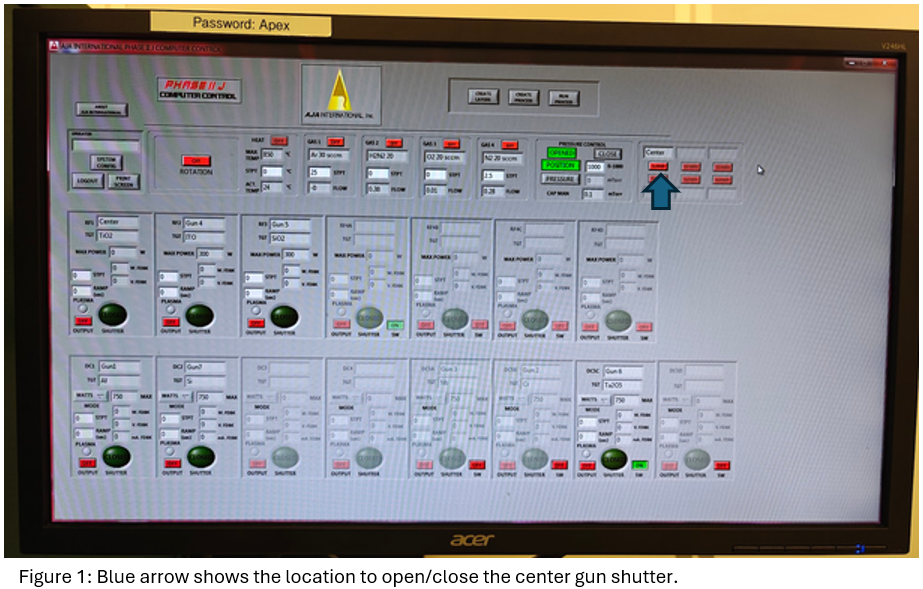

<!-- AUTO-GENERATED by scripts/sync_gdocs.py from the Google Doc below. Edit the Google Doc, not this file. -->

# AJA Sputter Deposition

[:material-file-document-outline: Google Doc](https://docs.google.com/document/d/1ZxRo_R4RzLxKZ7h_I2hFphAH187e9qq2U4bBf5n4lOg/preview){ .md-button }
[:material-file-pdf-box: View PDF](../../assets/pdfs/tools/AJA_Sputter_SOP.pdf){ .md-button }
[:material-download: Download](../../assets/pdfs/tools/AJA_Sputter_SOP.pdf){ .md-button download="AJA_Sputter_SOP.pdf" }

---

## Safety Information and Overview

| Advanced Science Research Center | Graduate Center CUNY |
| :---- | :---- |
| Date | 8/26/2026 |
| SOP Title | Manual Operation of the AJA Orion 8 Sputter Tool |
| Principal Investigator | Samantha Roberts |
| Department | NanoFabrication Facility |
| Room and Building | ASRC G.263 |
| Primary Phone Number | 2124133399 |

### **Section 1 – Process or Experiment Description**

This SOP is only for the general use of depositing thin films. Only approved users are allowed to use the equipment, after passing a qualification with the tool manager. Any maintenance will be done by trained staff members. Some maintenance creates additional hazards which will be described in the Instrument Manual.

\*Note: Any sample preparation is to be done by the user, and this document does not cover any information related to sample preparation. Any materials listed outside of the approved list, must be discussed with the tool manager.  NO high vapor pressure materials

### **Section 2 – Hazardous Substances**

**Substance Name:** Chromium

**Common Name:** Chrome

**Abbreviation:** Cr

**Substance Name:** Silver

**Abbreviation:** Ag

### **Section 3 – Potential Hazards**

| Hazard | Hazard Sign | Hazard Description |
| :---- | ----- | :---- |
| Thermal  | { width="88" } | Sample(s) and sample plate can get hot to touch |
| Chrome | { width="98" }{ width="74" } | Exposure to particulate or vapor form may present significant health hazards and is toxic to aquatic organisms.  Under the high temperatures involved in e-beam evaporation, **metallic Cr can oxidize** into Cr(VI), especially in the presence of residual oxygen. This is highly toxic to aquatic organisms and is a known human carcinogen. |
| Silver | { width="99" }{ width="77" } | Silver is toxic to aquatic life in nanoparticulate or ionic forms. **low acute toxicity**, but chronic exposure (especially to nanoparticles or silver dust) may lead to: **Argyria**: A bluish-gray discoloration of the skin.
 **Respiratory irritation** from dust or vapor in poorly ventilated areas. |

### **Section 4 – Routes of Exposure**

Thermal hazard is present if using the sputter’s sample heater for a long period of time, which can heat up the plate and the sample(s). 

### **Section 5 – Personal Protective Equipment**

All personnel are instructed to use pliers to handle the sample plate, if it has not cooled down to sufficient temperature; and to work with tweezers to remove the sample(s) from the hot plate too.

### **Section 6 – Waste Disposal**

Kapton or copper tape that has silver and/or chrome on the top layer, must be disposed into the container found on the workbench. Staff will transport the container for waste disposal when the container is full. 

| Hazardous compound, element, or chemical name | State (L,G,S) | Hazardous | Non-hazardous | Which hazards? | How is waste managed? |
| ----- | ----- | ----- | ----- | :---- | ----- |
| Silver | S | x |  | Solid waste is toxic to environment, aquatic, and human health | Must be collected and disposed of as Hazardous waste  |
| Chrome | S | x |  |  Solid waste is toxic to environment, aquatic, and human health | Must be collected and disposed of as Hazardous waste  |

## **Tool Operation**

1\. Verify the material you want to sputter is in the tool and locate its position on the Phase II control screen. (ie: Gun number)   
2\. If the gun you want is grayed out but you can still see the info on the screen (this may   
happen with Guns 3, 5 and 6), click to toggle the lower right button called "SW" to "On".  
3\. **If you want to use the center gun, contact staff first to set up the power supply to it. By default, it is not connected to anything.**   
4\. Load substrate into tool (see those instructions)   
5\. If you want to heat your sample, you must turn ON the substrate rotation first, in order to access the heater panel section. You can set the desired temperature (in celsius) and press the ON button to start heating it up. \[You can turn on the heater at any point.\]

#### **Strike Plasma** 

6\. On the Phase II control screen do the following: 

1. Set the Argon setpoint to 30sccm and turn Gas 1 "On"  
2. Click the pressure button and set it to 30m Torr for the initial Strike. Wait for pressure to reach this set value.  
3. Go to the Gun that you are using and set the STPT to 20 Watts.  
    1. If using the center gun, staff will notify you which power supply to use. Whichever RF/DC power supply it’s connected to, use that corresponding gun.  
4. Set the ramp time to 5 seconds   
5. Turn "on" the output button   
6. Watch to see that the plasma ignites. You will see several things if it does:   
    1. You will be able to see a purple glow from around the lid if it is on   
    2. You will see a current (in mA) lower right of the gun screen   
    3. The "Plasma" button in the gun panel will change from gray to purple 

#### **Ramp Up** 

7\. Now that the plasma is ignited, decrease the pressure value to 3 mTorr for deposition. Verify that the plasma is still ignited after the pressure decrease.

8\. Set the ramp time first:

1. For a target that is on a DC power supply: set the ramp time to be 1W/sec. \[ie: if you want your final deposition power to be 150W, set the ramp to 150.\]   
2. If the target is on a RF power supply: set the ramp time to be 2W/sec. \[ie: if you want your final deposition power to be 40W, set the ramp to 80.\]  
3. If using the center gun, staff will notify you which power supply to use. Whichever RF/DC power supply it’s connected to, use that corresponding gun.

9\. Set the STPT power to the final deposition power. 

10\. Click enter on the keyboard and wait until the power reaches its final value 

11\. Verify the WFDBK field also has this same power value. Verify that the plasma is still ignited.

#### **Deposition** 

12\. Now adjust the knob for substrate rotation for 30 or 50 RPM 

13\. Turn on Phase II Substrate rotation. 

14\. Verify the substrate is turning by watching the arm the substrate is attached to. 

15\. Now set a timer and open the shutter.

1. To open the center target shutter, go to the top left corner. There is a section with one of the boxes labeled “Center”. Underneath it, click that button to open the shutter. Refer to figure 1 below.

16\. Deposit for the length of time that you want. (20 minutes for Al at 150W for \>100 nm) 

17\. Close the shutter when time is completed.   

#### **Ramp Down** 

18\. Turn off substrate rotation 

19\. Set the ramp value appropriately based on the DC/RF supply it’s using (refer to ramp up section \- step 7). This step is important so as not to crack the target by cooling too quickly. 

20\. Set the STPT to 0

21\. Hit "Enter" on the keyboard to start the ramp down.   
22\. When the power is at 0, (the purple turn the "output" button to "Off"   
23\. Click "Opened" on the pressure controller to open the pump valve all the way. 

24\. Turn off the Argon \- ie: Gas 1 

25\. Unload your sample following the appropriate protocol. 

#### **Target Cleaning**

Should be performed whenever doing reactive sputtering (after deposition).   
26\. With the shutter closed, set the material to standard strike conditions.  
27\. Set a timer for 10mins.  
28\. When complete, ramp down, and set the tool back to idle state. (No gas flowing, heater is off, shutter(s) closed, rotation off, pressure control section has a green “Opened” button). 

## **Common Errors and Troubleshooting\-** 

1. Plasma not striking  
    * Check both viewports. Sometimes the placement of the target can be seen better through one than the other.  
    * Try again with the same parameters. Sometimes it may take 1-3 tries to see the plasma ignite.  
    * Increase the ramp time  
    * Open the shutter for a few seconds. This is the last case resort, since your sample will be exposed immediately to the material when the plasma ignites.   
2. There’s no evidence of deposition on your sample.  
    * Did you verify there was plasma after striking? After decreasing the pressure? After ramping up? During deposition?  
    * Contact Staff  
3. Plasma dies out randomly  
    * Usually occurs with RF sputtering. Check the corresponding RF power supply to look at the load and tune values. If it is at the extreme ends (0 & 100\) or close to it, contact staff.

## ---

Prepared by: SPR  
Date:  August 26, 2026  
Reviewed/Revised:   
Salam Garraway  
   

