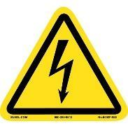
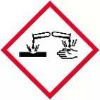
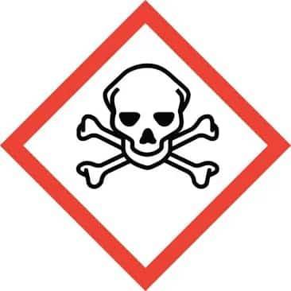
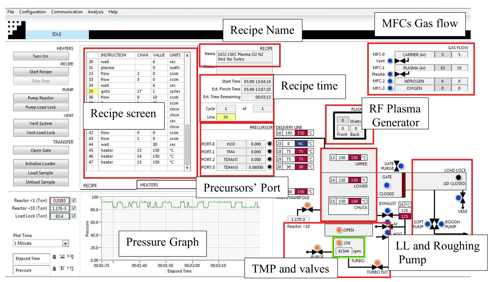
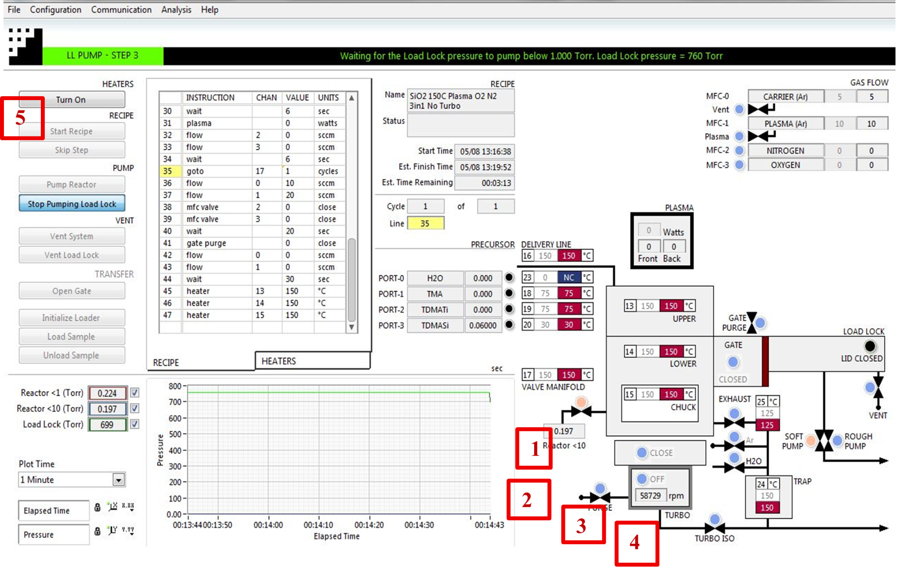
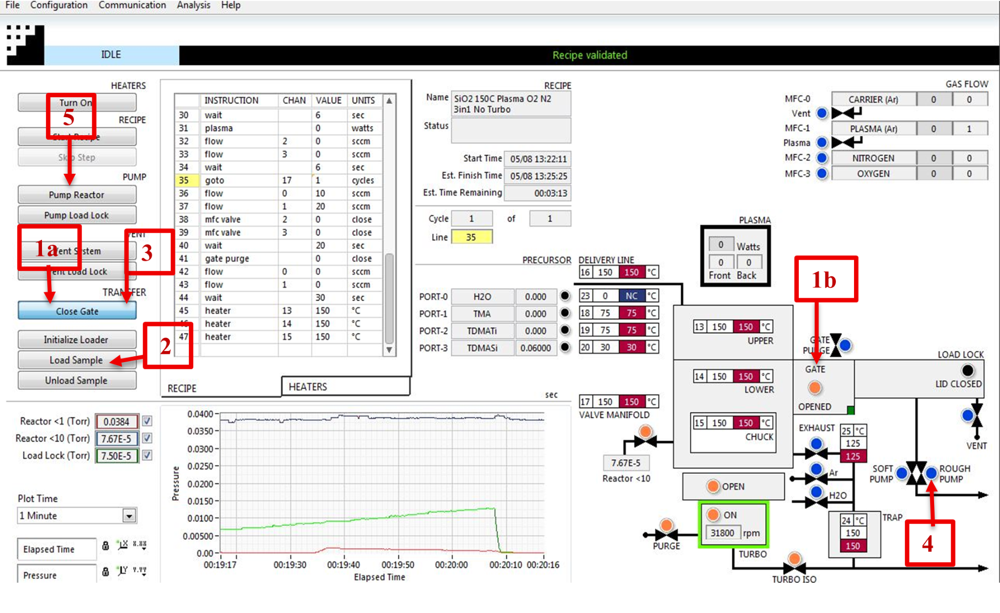
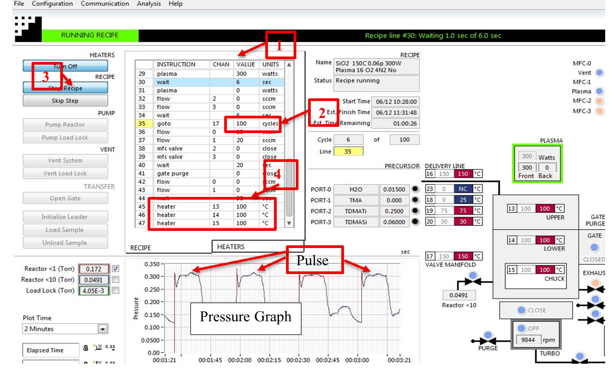
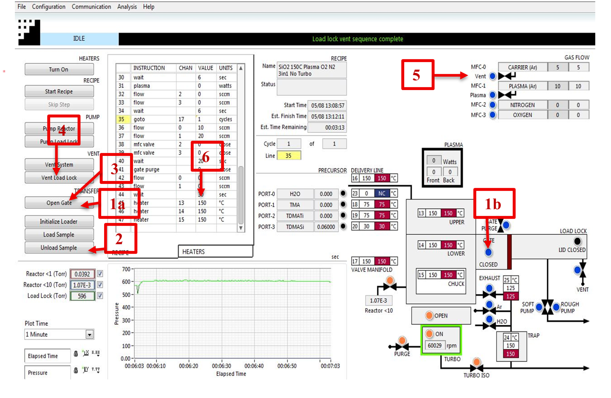
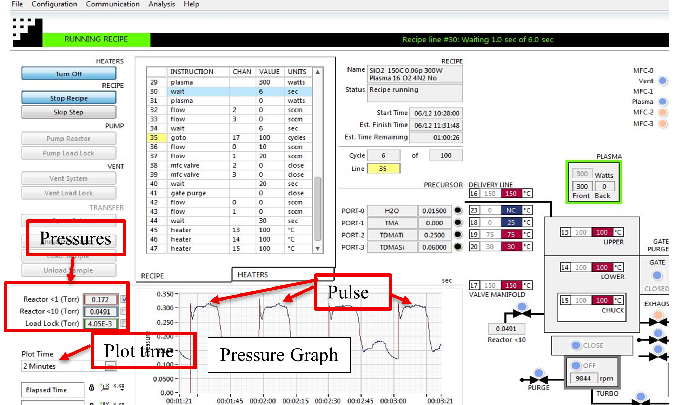
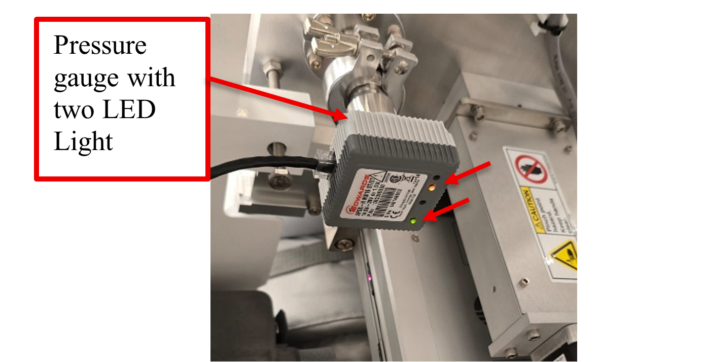

<!-- AUTO-GENERATED by scripts/sync_gdocs.py from the Google Doc below. Edit the Google Doc, not this file. -->

# Atomic Layer Deposition (ALD)

[:material-file-document-outline: Google Doc](https://docs.google.com/document/d/13ZXev9NXbltwLdRk76AbLV_IsnMcdnw-pK4Ytmj8YJc/preview){ .md-button }
[:material-file-pdf-box: View PDF](../../assets/pdfs/tools/ALD_SOP.pdf){ .md-button }
[:material-download: Download](../../assets/pdfs/tools/ALD_SOP.pdf){ .md-button download="ALD_SOP.pdf" }

---

## **Ultratech Fiji G2 ALD**

### **Facility and Contact Information**

| Nanofabrication Facility | ASRC, RFCUNY |
| :---- | :---- |
| SOP Title | Plasma Enhanced Chemical Vapor Deposition |
| Director | Samantha Roberts, PhD |
| Manager | Shawn Kilpatrick |
| Room & Building |  G263, Nanofab, ASRC |

### **Section: 1 Hardware Description and Principle of Operation**

#### **Principle of ALD**

Atomic Layer deposition (ALD) is a vapor-phase thin film deposition technique that allows growth of films, atomic layer by layer. The typical ALD reaction is illustrated via the formation of aluminum oxide from trimethylaluminum or TMA, Al(CH3)3, and water. The precursor reacts with hydroxyl groups on the surface of the substrate, liberating methane. The reaction is self-limiting as the precursor does not react with adsorbed aluminum species. Unreacted precursor and the methane (CH4) liberated from the reaction are removed by simple evacuation of the sample chamber or by flowing inert gas over the surface. Water reacts with the methyl groups on the deposited aluminum atoms forming both Al-O-Al bridges, as well as new hydroxyl groups. The formation of hydroxyl groups readies the surface for the acceptance of the next layer of aluminum atoms. Methane is liberated as a by-product. The unreacted byproducts are then pumped out of the chamber. Finally, the process begins again with the introduction of precursor A followed by B. Atomic layers are built up one after the other and shown in Figure 1\.

The ALD system consists of a heated reaction chamber, to which the reaction precursors are plumbed using fast ALD valves. As shown in figure 2 below. The system accommodates two growth modes: thermal and plasma. In the thermal growth mode, water is used as a source of oxygen, as described above. In the plasma mode, an RF generator positioned at the top of the Chamber is used to dissociate oxygen (or nitrogen) gas and supply radicals for the formation of the dielectric film.

Typically, two types of ALD deposition tools that are available i.e. Thermal ALD and Plasma Enhanced ALD.

##### **Thermal ALD**

Thermal ALD operates through sequential, self-limiting chemical reactions between precursor gases and co-reactant (e.g. H2O, O3, NH3) by thermal or heat energy. 

**Advantages**

* Very good conformality on high aspect ratio features  
* Suitable for sensitive substrates (e.g. Polymers, low-k dielectrics).  
* Simple hardware  
* Lower contamination risk  
  

**Disadvantages**

* Requires higher substrate temperature (typically above 150o C)  
* May not work well with less thermally reactive precursors. (limited to materials/reactants)  
* Lower growth rate than PE-ALD

##### **Plasma Enhanced ALD (PE-ALD)**

Plasma Enhanced or Plasma assisted ALD is another technique that deposits a thin film of choice materials with the introduction of plasma source. Plasma discharge helps to activate precursor molecules and enhance surface reactions, that increases growth rate and improves film properties. It uses Plasma (e.g. O2, N2, NH3, Ar) to generate reactive radicals and ions.

**Advantages**

* Low temperatures deposition (as low as 50-100o C).  
* Denser, purer and more stoichiometric films.  
* Higher growth per cycle (GPC) due to plasma enhanced surface reactions.

**Disadvantages:**

* Complex hardware (RF/microwave plasma source and matching network).  
* Due to ion bombardment sensitive substrate may damage.  
* Not suitable for deep trench or high aspect ratio deposition.

**Material Requirements**

The ALD growth process involves the use of volatile chemical reactants. Therefore, the materials on which ALD growth takes place should be inert. Typically, silicon, glass, or metal substrates are ideal. Many ALD precursors are known to react with organic materials, such as photo or electron beam resists. Furthermore, most ALD processes are calibrated in the 100 – 300 C temperature range. The sample should be able to withstand that heat for a prolonged period. Please consult staff (and literature) prior to growing on uncommon substrates.

### **Section 2- Potential Hazards of Precursors**

| Hazard | Hazard Sign | Hazard Description |
| :---- | :---- | :---- |
| Electric Shock | { width="80" } | RF generator works with high voltage supply. |
| Thermal  | { width="88" } | Sample(s) and sample holder can get hot to touch, even LL get heated up with the chamber’s high temperature. |
| TDMHf | **{ width="61" }**{ width="62" }{ width="66" }{ width="63" } | Vapor may form explosive mixing with air. It can cause burn to skin, eyes and respiratory tract and is toxic.  . |
| TDMA | **{ width="61" }**{ width="66" } | Pyrophoric, may ignite in the moist air can form flammable and may cause skin and eye burns |
| TDMSi | **{ width="61" }**{ width="63" }{ width="62" } | Can form flammable vapors Release corrosive gases Can cause coughing, dizziness and respiratory distress. |
| TDMTi | **{ width="61" }**{ width="62" }{ width="63" } | Highly reactive in air. Skin and eye damage, respiratory irritation. |

### **Section 3- Routes of Exposure**

There are three major routes of exposure to hazardous gases in ALD Tools and mostly from Lock lock land from wafers or chips.

The load lock is the space that allows wafer/chips transfer into and out of the vacuum system without venting the main process chamber. It is an interface zone between atmospheric pressure and vacuum.

While transferring wafer from the loadlock, residual gases may escape, and Wafer surfaces or substrate hold/puck may be contaminated by adsorbing or condensing chemicals that could be hazardous to the users. 

| Sl. No. | Route | Description | Risks |
| :---- | :---- | :---- | :---- |
| 1 | { width="97" } Inhalation | Breathing toxic or reactive gas vapor/fumes | Headaches, dizziness, respiratory irritation, disorientation. |
| 2 | { width="101" }Skin Contact | Direct contact with leaked or condensed gas | Irritation, chemical burns or delayed skin reactions. |
| 3 | { width="100" }Eye Contact | Irritation from gas fumes or splashes | Eye irritation, burn |

### **Section 4 \- Personal Protective Equipment**

**Personal Protective Equipment**: Clean room gown, nitrile gloves, Mask, Goggles (optional) 

**Equipment for the tool**: Chips/Substrate, conditioning/cleaning substrate/wafer and appropriate tweezers 

### **Section 5- Standard Operating Procedure**

**Estimated Time**: Typical processes go from 1 hour for 100 cycles to several hours as many hundreds of cycles. The Screen will display with process time when a recipe is loaded.

Loading and unloading samples into the Fiji system can initially appear tricky if you are not familiar with all the hardware and all of its functions. The instructions for Loading, Run Recipe and Unloading the samples are described below.

Figure 3 shows the software screen that you should encounter when coming to the tool. Note that both the load lock and process chamber are under vacuum, the Argon flow rate for MFC-0 is set to 5 sccm, the Argon flow rate for MFC 1 is set to 10 sccm, and heaters 13, 14, 15 are set to 100oC. 

Figure 3 General Information of FIJI software screen

#### **Load Sample**

To load the sample please follow the following steps (also see Figure 4 for a graphical reference):

Verify that both the load lock and the reactor are under vacuum.

1. Vent the load lock, it will take approximately 2 mins.

2. Open the lid of the load lock chamber 

    Place the sample/wafer/chip onto the sample holder/puck carefully. When loading the sample, make sure that there is no gap between the fork/prongs that hold the sample holder and the loader arm. See **Figure 4** for the correct position of the sample holder and the lifting fork.

   

   

   

   

   

   

   

   

 

	3\.  Turn off the Argon flow by setting the values of the MFC-0 and the MFC-1 			controllers to zero.

	4\. Isolate the reactor chamber by: **(follow figure 5\)**

1. Closing a radio button (OPEN/CLOSE) to make it BLUE from ORANGE **\[step 1\]**

    2. Turn off the turbo purge **\[step 2\]**

    3. Turn off the Turbo (ON/OFF) **\[step 3\]**

    4. Close the turbo isolation valve **\[step 4\]**

    5. Now press the **Pump Load Lock** button. **\[step 5\]**

   

Once the load lock has been pumped, it is ready to transfer the sample into the Reactor chamber. 

Figure 5 Isolating reactor chamber and Pumping LL

  **Transfer sample**

1. Open the gate valve by clicking either the **Open Gate** tap or **BLUE** button (Blue color means Closed and Orange means Open) **\[step 1a or 1b\]**. **(Figure 6\)**

   

2. Load the sample by pressing **Load Sample**. **\[step 2\]**

   

    CAUTION: do not press **Unload Sample**, as that will damage the transfer arm.

   

3. Once the sample is successfully loaded, \[you need to wait for the Load arm to fully retract back to its home position.\] Close the gate valve, by pressing the **Close Gate** button **\[step 3\].** It is the same button just used to open the gate valve.

    Now you need to Pump down the reactor chamber

4. Press the Rough Pump button which will turn blue to orange, **\[step 4\]** 

5. Now hit Pump Reactor tap **\[step 5\]** to evacuate the chamber. When “Pumping sequence complete” showed up in the menu bar you can then load and run the recipe.

   

  
Figure 6, Loading and pumping reactor sequences

#### **Run Recipe**

You are now ready to run a recipe. 

1. Right clicking anywhere in the CURRENT RECIPE window (see **figure 7**), **\[step 1\]**

2. Click **Load Recipe** option, now a choose USER RECIPE or PROCESS folder to load the desired recipe.

3. Now, the recipe will appear on the screen, you can modify or change parameters like, **plasma power**, reactor temperature **(HEATER** 13,14 and 15), the **number of cycles** to grow the atomic layer as you desire. Usually, you only change the **number of cycles \[step 2\].** Then press the **Start Recipe \[step 3\]** the tap on the left side of the screen to run the recipe.

4. After completion of the recipe message appeared as RECIPE STOPPED.

5. Now you can unload the sample

NOTE: At the end of your recipe make sure to set the temperature of heaters 13, 14, and 15 back to 100 C **\[step 4\]**. This will allow the tool to cool down for the next user.

  
Figure 7 Loading recipe and modifying parameters

#### **Unload Sample**

When unloading the sample, you must follow the above steps in reverse order. In that case, you should follow **figure 8\.**

1. Open the gate valve **\[step 1a or 1b\]** either pressing the tap or radio button (it must be orange color when open and a green dot will appear).

2. Click unload sample **\[step 2\]**. **Be sure to click unload tap**

3. Wait for the sample to unload completely.

4. Once the sample unloads, close the gate valve \[same tap or radio button to open the gate (blue color)\] **\[step 3\]**.

5. Then vent the load lock **\[step 4\]** and remove your sample. 

    CAUTION: the sample holder will be hot. Be careful not to burn yourself.

   

    

   

Figure 8, Unloading sample

6. Once the sample is unloaded, follow the steps in the **“loading sample”** section in order to pump the load lock first, and then pump the main chamber.

7. Prior to leaving the tool you MUST verify that:

    1. The load lock is under vacuum.

    2. The process chamber is under vacuum, that is, the turbo isolation valve is open, the turbo purge is on, the turbo is on, and the turbo isolation valve is open.

    3. MFC-0 is set to 5 sccm. and MFC-1 is set to 10 sccm**. \[step 5\]**

    4. Heaters 13, 14, and 15 are set to 100 C. **\[step 6\]**

   

   

   

### **Section 6- Safety and Emergency**

**Emergency Stop**

*Critical*

- If the tool is smoking or a gas leak has occurred, press the EMO button if possible and leave the cleanroom.

*Non-Critical*

- Press **Skip Step** until you reach the end of the process.

**Allowed Activities**

- Load and unload samples.

- Run standard recipes.

- Modify recipes, after discussing the changes with the clean room staff.

**Disallowed Activities**

- Changing any software/hardware configuration of the tool.

- Change the ALD precursors.

**When to call staff?**

* If either the main chamber or the load lock is not pumping down as expected.  
* If the substrate holder /puck stucked inside the chamber or in between the load lock and the chamber.  
* If the pressure graph during your recipe does not look like the graph in Figure 6\.  
* If the sample holder falls off the loading arm (or the loading fork) when you are either loading or unloading the sample.

 **What to watch out for during the operation**

Figure 9 shows a typical pressure graph for a Plasma-Enhanced ALD process. If the pressure graph during your process does not look like this or you cannot see any pulse peaks, then something is wrong. All the precursor pulses should look identical, areas under those curves should be the same. You can change the “plot time” option in the ALD software to monitor the long-term progress.

  
Figure 9 Pressure graph and Pulse peaks

#### **Common Troubleshooting Tips**

* If the heaters are off, or if there are communication issues between the software and the hardware, restart the Fiji software.  
* Pressure gauge issues.   
    * Sometimes load lock pressure gauge and chamber low-pressure gauges will malfunction, when you notice the pressures are not reading correctly unplug the ethernet cable from the gauge for 10 seconds and again re-plug it, now orange and green LEDs will lite up **(Figure 10).**

    

    Figure 10 Pressure under the LL and Main Reactor chamber

*Report Problem*

* Pumping issues.  
* Loading issues.

*Shutdown*

* The tool doesn’t pump down to vacuum.

#### **Revision History:**

1. Revision 1.0 \-January 2018 – MB created the original document  
2. Revision 2.0 – June 2025 \- Rai Suresh  
3. Revision 2.01– September 2026 \- Rai Suresh  

