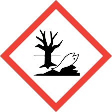
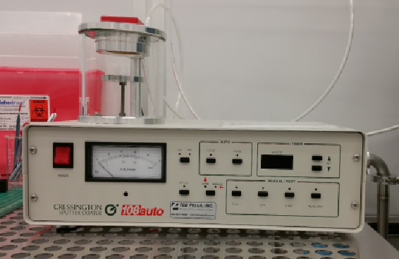

<!-- AUTO-GENERATED by scripts/sync_gdocs.py from the Google Doc below. Edit the Google Doc, not this file. -->

# Gold Sputter Coater

[:material-file-document-outline: Open the Google Doc](https://docs.google.com/document/d/1CEDzZpsaCl18r2u3Z_2YnZJjB6EAYobtiUnn9lpl9LY/preview){ .md-button }
[:material-file-pdf-box: View PDF](../../assets/pdfs/tools/Gold_Sputter_SOP.pdf){ .md-button }
[:material-download: Download PDF](../../assets/pdfs/tools/Gold_Sputter_SOP.pdf){ .md-button download="Gold_Sputter_SOP.pdf" }

---

# Safety Information and Overview {#safety-information-and-overview}

| Advanced Science Research Center | Graduate Center CUNY |
| :---- | :---- |
| Date | 5/30/2025 |
| SOP Title | Manual Operation of the AJA Orion 8 Sputter Tool |
| Principal Investigator | Samantha Roberts |
| Department | NanoFabrication Facility |
| Room and Building | ASRC G.263 |

## **Section 1 – Process or Experiment Description** {#section-1-–-process-or-experiment-description}

This SOP is only for the general use of depositing thin films. Only approved users are allowed to use the equipment, after training with the tool manager. Any maintenance will be done by trained staff members. Some maintenance creates additional hazards which will be described in the Instrument Manual.

\*Note: Any sample preparation is to be done by the user, and this document does not cover any information related to sample preparation. Any materials listed outside of the approved list, must be discussed with the tool manager.  

## **Section 2 – Hazardous Substances** {#section-2-–-hazardous-substances}

**Substance Name:** Gold

**Abbreviation:** Cr

## **Section 3 – Potential Hazards** {#section-3-–-potential-hazards}

| Hazard | Hazard Sign | Hazard Description |
| :---- | :---- | :---- |
| Gold | { width="99" }{ width="77" } | Gold is toxic to aquatic life in nanoparticulate form. **Inhalation risk** from dust or nanoparticles in poorly ventilated areas. |

## **Section 4 – Routes of Exposure** {#section-4-–-routes-of-exposure}

Inhalation hazard is present during handling or cleaning the chamber walls in a poorly ventilated area. The hazard is also present if the chamber did not have sufficient time to vent to atmospheric pressure.

## **Section 5 – Personal Protective Equipment** {#section-5-–-personal-protective-equipment}

All personnel are instructed to clean the chamber in the designated fume hood with goggles, and dispose of the dirty wipes in the chemical waste bin. 

## **Section 6 – Waste Disposal** {#section-6-–-waste-disposal}

| Hazardous compound, element, or chemical name | State (L,G,S) | Hazardous | Non-hazardous | Which hazards? | How is waste managed? |
| ----- | ----- | ----- | ----- | :---- | ----- |
| Gold | S | x |  | Solid waste is toxic to environment and human health | Must be collected and disposed of as Hazardous waste  |

# **Tool operation** {#tool-operation}

**Hardware Description and Principle of Operation** 

***Cressington 108 Auto Sputter Coater*** 

Non-conducting samples placed in an electron microscope will build up charge on the surface,  thereby diminishing image quality. One way to reduce the effects of surface charging is to coat  the sample with a conductive material to give the electrons used to image the sample a path to  ground. Sputter coating with Au or Au:Pd is one method to achieve this. Sputter coating uses  ionized argon to vaporize gold atoms from a target and deposit them in a thin layer onto a sample. 

Material Requirements 

Equipment: substrate and tweezers 

Personal Protective Equipment: nitrile gloves

**Procedure** 

Estimated Time: \~20 minutes 

*Load Sample* 

1\. Open the valve to the Argon vent line.  

2\. Once the chamber has vented, close the Argon  

valve. Note: As long as the tool is off, the internal  

vent valve is open, so the tool will continuously flow  

Argon if the external valve is left open. 

3\. Open the chamber lid and remove the glass jar of  

the sputter chamber, placing it on a wipe. Be  

careful not to break or chip the glass, especially  

along the rims where it must form a seal. Do not place it on a hard or rough surface. 4\. Place your sample on the sample holder.  

5\. Replace the glass jar over the sample and close the chamber lid.  

6\. Turn on the power to the system.  

7\. The pump will turn on and begin pumping the chamber. Check the seals to make sure  there are no leaks and the chamber is pumping normally. 

*Edit Recipe* 

1\. Determine the current and time of the  

sputtering you will need in order to get the  

thickness of gold you require. Use the graph  

of sputtering rates for different current  

settings.  

2\. Hold down **SET mA** to display the set  

current in the timer display. Use the up and  

down arrows next to the display to change  

the setting.  

3\. Hold down **PAUSE/TEST** and use the up or  

down arrows next to the timer display to set  

the time. 

*Run Recipe* 

1\. Once the chamber is pumped down to around 0.01 mbar, flush the chamber with argon 2- 3 times. Press **FLUSH** once to turn on the flow of Argon in the chamber and then press it  again to turn it off. Allow the chamber to pump back down to around 0.01 mbar between  flushes. 

2\. Turn on the flow of Argon to be ionized during the sputtering by turning on **LEAK**. Allow  the chamber pressure to stabilize at 0.08 mbar. 

3\. Press **START** to begin the sputtering. A purplish glow from ionized Argon should be visible  around the gold sputtering target in the lid of the chamber while the timer counts down  from the set time.  

4\. Once the sputtering has ended, turn off **LEAK**.  

5\. Flush the chamber once more.  

6\. Turn off the power to the system. 

*Unload Sample* 

1\. Open the valve to the Argon vent line.  

2\. Once the chamber is finished venting, close the valve to the Argon vent line.  3\. Open the chamber lid and remove the glass jar of the sputter chamber, placing it on a  wipe. Be careful not to break or chip the glass, especially along the rims where it forms a  seal. Do not place it on a hard or rough surface.  

4\. Remove your sample.  

5\. Wipe the inside of the glass jar and the sample holder with IPA to remove the gold that  has been deposited. Replace the glass jar over the sample holder and close the chamber  lid.  

6\. Turn on the tool for a minute to pump the chamber and leave it at vacuum. 

**Emergency Stop** 

\- If the tool begins to malfunction, turn off the power. Be sure the argon valve is turned off  also. 

**Allowed Activities** 

\- Users can set the power and time as necessary, but they should not deposit more than  20nm of gold without staff permission. 

**Disallowed Activities** 

\- Users are not allowed to deposit more than 20nm of gold without staff permission.

# **Common Errors and Troubleshooting\-**  {#common-errors-and-troubleshooting-}

**What to watch out for during operation** 

\- Check for plasma by looking for plasma glow discharge underneath the top of the  chamber. 

\- Make sure to turn off the valve for the venting argon when finished with the tool. 

**Common Troubleshooting Tips** 

\- If chamber is not pumping down, carefully shift the glass jar from side to side to catch a  seal with the top and bottom of the chamber. 

**When to call staff?** 

\- If the plasma will not ignite. 

\- The tool will not power on, though first check to be sure it is enabled. 

---

Prepared by: Salam Elhalabi  
Date:  May 30, 2025  
Reviewed/Revised:   
Salam Elhalabi  

