<!-- AUTO-GENERATED by scripts/sync_gdocs.py from the Google Doc below. Edit the Google Doc, not this file. -->

# AJA Metal Evaporator

[:material-file-document-outline: Google Doc](https://docs.google.com/document/d/1UN-jwGXj1MgKG_DcL0Pjg06Q0h_o_oWUWd3saSPNCxk/preview){ .md-button }
[:material-file-pdf-box: View PDF](../../assets/pdfs/tools/Metal_Evap_SOP.pdf){ .md-button }
[:material-download: Download](../../assets/pdfs/tools/Metal_Evap_SOP.pdf){ .md-button download="Metal_Evap_SOP.pdf" }

---

## Safety Information and Overview

| Advanced Science Research Center | Graduate Center CUNY |
| :---- | :---- |
| Date | 8/26/2026 |
| SOP Title | AJA E-Beam Metal Evaporator SOP |
| Principal Investigator | Samantha Roberts |
| Department | NanoFabrication Facility |
| Room and Building | ASRC G.263 |

### **Section 1 – Process or Experiment Description**

This SOP is only for the general use of depositing thin films. Only approved users are allowed to use the equipment, after passing a qualification with the tool manager. Any maintenance will be done by trained staff members. Some maintenance creates additional hazards which will be described in the Instrument Manual.

\*Note: Any sample preparation is to be done by the user, and this document does not cover any information related to sample preparation. Any materials listed outside of the approved list, must be discussed with the tool manager.  NO high vapor pressure materials

### **Section 2 – Hazardous Substances**

**Substance Name:** Chromium

**Common Name:** Chrome

**Abbreviation:** Cr

**Substance Name:** Silver

**Abbreviation:** Ag

### **Section 3 – Potential Hazards**

| Hazard | Hazard Sign | Hazard Description |
| :---- | ----- | :---- |
| Bright e-beam |  | Serious eye damage may occur if viewed directly at e-beam during use |
| Electric Shock | { width="80" } | Tool operates in extremely high voltages (3-10kV). |
| Thermal  | { width="88" } | Sample(s) and sample plate can get hot to touch |
| Chrome | { width="98" }{ width="74" } | Exposure to particulate or vapor form may present significant health hazards and is toxic to aquatic organisms.  Under the high temperatures involved in e-beam evaporation, **metallic Cr can oxidize** into Cr(VI), especially in the presence of residual oxygen. This is highly toxic to aquatic organisms and is a known human carcinogen. |
| Silver | { width="99" }{ width="77" } | Silver is toxic to aquatic life in nanoparticulate or ionic forms. **low acute toxicity**, but chronic exposure (especially to nanoparticles or silver dust) may lead to: **Argyria**: A bluish-gray discoloration of the skin.
 **Respiratory irritation** from dust or vapor in poorly ventilated areas. |

### **Section 4 – Routes of Exposure**

Eye damage can occur if looking through the viewport window with the shutter open, and not wearing the appropriate protective eyewear. 

Electric shock can occur when working with the high voltage feedthroughs or in the back of the electronics rack, without properly grounding the work area beforehand.

Thermal hazard is present if using the e-beam evaporator for a long period of time, which can heat up the plate and the sample(s).

### **Section 5 – Personal Protective Equipment**

All personnel must wear the welding goggles whenever looking directly at the bright e-beam.

All trained staff must use the grounding rod to touch the working areas, before attempting any maintenance.

### **Section 6 – Waste Disposal**

Kapton or copper tape that has silver and/or chrome on the top layer, must be disposed into the container found on the workbench. Staff will transport the container for waste disposal when the container is full. 

| Hazardous compound, element, or chemical name | State (L,G,S) | Hazardous | Non-hazardous | Which hazards? | How is waste managed? |
| ----- | ----- | ----- | ----- | :---- | ----- |
| Silver | S | x |  | Solid waste is toxic to environment, aquatic, and human health | Must be collected and disposed of as Hazardous waste  |
| Chrome | S | x |  |  Solid waste is toxic to environment and human health | Must be collected and disposed of as Hazardous waste  |

## **Tool Operation**

### Deposition Procedure

### 1\. **Precheck**

1. Check load lock pressure (\< 1E-5)  
2. Check chamber pressure (\~ E-8)  
3. Check temp of cryo pumps   
    1. Top/Left cryo (10-11K)  
    2.  Bottom/Right cryo (12-13K)  
4. Check if other users are on the sputter tool (coordinate load lock usage)  
5. Check that the material you need is in the tool  
6. **CONFIRM THAT BOTH GATE VALVES ARE CLOSED**

### 2\. **Loading Sample and Rack into the Loadlock**

1. Verify BOTH gate valves are closed  
2. Vent load lock to atmospheric pressure (\~750 Torr)  
3. Lift the load lock lid completely   
4. Remove rack from the loadlock and load sample on the sample plate  
    1. The sample plate can be inserted on either the 2nd or 3rd level  
5. Insert the rack back into the loadlock and pump loadlock to **BELOW** 3E-5 Torr

### 3\. **Loading Sample into the Main Chamber**

1. Verify the receiving substrate holder (the angle bracket) is in the correct load position (height and rotation)  
    1. Do not go below the bottom sharpie line   
    2. Verify the vertical sharpie line (green line) orients with either the screw groove or red line for correct orientation  
    3. See figures 1+4 in appendix for reference  
2. Open viewport shutters  
3. Open gate valve when it is **below** 3E-5 Torr  
4. Move the load arm to the loadlock.  
    1. First go to the gate valve marking   
    2. Make sure to slowly move towards the loadlock  
    3. The paddle should be below the sample plate  
    4. See figure 2 in appendix for reference  
5. Pick up the sample plate   
    1. The sample plate should sit in the middle step of the paddle  
    2. Recall that there is limited clearance between the rack spaces  
    3. See figure 2 in appendix for reference  
6. Retract load arm to the substrate holder position inside main chamber   
    1. The sharpie line closest to the home position of the load arm  
7. Close gate valve  
    1. The chamber pressure will suffer (you will see a spike in chamber pressure) whenever you open the gate valve. This is normal.  
8. Use the joystick to lift the sample plate off the loadarm.   
    1. The sample plate must sit on the lowest step of the angle brackets  
    2. You **can adjust the loadarm as needed** to achieve the above  
    3. See figure 3 in appendix for reference  
9. Raise substrate holder (with sample plate) to deposition height  
    1. Deposition height is 90mm from the top   
    2. See figure 4 in appendix for reference  
10. Return load arm to home position  
    1. As long as you are **on or above the top sharpie line**, the loadarm can be moved back to the home position safely  
11. Shut the viewport shutters

### 4\. **Preparing for Film Deposition** 

1. Turn on HV on the Genius monitor (should say 9.45kV)  
2. Verify the Genius monitor is in “Automatic Operation”  
3. Go to the Process Screen  
    1. Select the material desired to deposit  
    2. Must select it **twice** to actually select that choice  
    3. See figure 5+6 in appendix for reference  
4. Press “Edit” on the layer screen  
    1. **You should only see 1 layer** \- which is the same as the material selected  
5. In the “Process Menu: Edit …: Edit Layer 1.1” screen, you must edit/verify the following:  
    1. Enter a film thickness greater than what you need to deposit  
    2. Verify that the Start Mode is in “Auto” mode  
    3. Sensor 1 must be “On”  
    4. See figure 7 in appendix for reference   
6. Go back to the main menu and go to the Film menu  
    1. Select the material desired to deposit  
7.  In that material film menu screen, verify the following 2 items  
    1. The pocket number on the screen matches the crucible turret position in reality  
    2. The material name matches to what you will be evaporating   
8. On the main menu, verify you are operating in “Man/Auto” (as opposed to Auto/Man)  
    1. A white box appears around the “Power” level column when you are in manual mode  
9. Press the green “Start Button/ Start Layer”   
    1. The EBSH will go from Black to green  
    2. **Wait until the crucible turret arrives to your desired material**  
    3. **On the top left of the main screen, it will say “Verify Crystal” for a very brief moment.**   
    4. It should read “Deposit”, before you start ramping up.

### 5\. **Film Deposition**

#### *Ramping up to Threshold* 					

1. Ramp up by increasing the power knob slowly and waiting between movements    
    1. Ramping up is:  
        1. **No more than 3% at a time**   
    2. For every movement done, **you must wait anywhere between 30 sec. \- 1 min. Before moving the power knob again.**  
2. When you start to get a rate on the monitor (ideally \~0.01Å/s), note the power in the log binder  
    1. If it fluctuates to 0 or to negative numbers, that is not a real rate. It’s just noise.  
3. Check chamber pressure and cryo temperatures periodically  
4. Verify the location of the E-beam in the crucible through the viewport window  
    1. If it is too close to the crucible wall or if it is on the crucible, notify staff member to move the beam for you  
5. Close the viewport window 

#### *After Threshold \- Ramping up to Soaking* 

6. Increase the power slowly until you are midway of the desired deposition rate   
    1. You could try moving 1% first and observe how the rate rises.   
        1. If the rate moves up slowly or within acceptable bounds (≤ 0.1Å/s), you can increase the power jump slightly.  
        2. If you see the rate rise more than 0.1Å/s, then move the power back to the last number you were on. Wait at least 1 minute for the rate to stabilize. Then, try moving again at a slower pace and observe how the rate behaves  
7. When you are halfway of the desired rate, soak for a couple of minutes for uniformity  
    1. **Soak for at least 3 minutes**  
8. Check chamber pressure and cryo temperatures periodically

#### *After Soaking \- Ramping up to Desired Rate* 

9. At this point, it shouldn’t take large power jumps to reach your desired rate.  
    1. Should be increasing the power approximately the same pace  
10. Check chamber pressure and cryo temperatures periodically

#### *Deposition*  

11. When you reached your desired rate, open the substrate shutter to expose your sample  
    1. Click on the “S\_SH” button  
12. Press the “ZERO” button to zero the starting thickness  
13. Wait until you reached your desired thickness  
    1. You may not leave the cleanroom unless there is an emergency   
    2. You are allowed to work in other areas of the cleanroom, **as long as you periodically check on the chamber pressure, cryo temperatures, the rate, and thickness deposited.**  
14. When you have deposited the film thickness you need, press the “S-SH” button, to shut the shutter.  
15. Slowly ramp down the power until it reaches zero  
    1.  Should be about the same pace as when you ramped it up \- after soaking   
16. Hit the “Stop/Stop Layer” button  
17. Click “Next Menu”  
18. Hit the “Reset” button  
19. Record the crystal monitor life at the end of each layer.   
    1. Look for the “**Sensor Life**” button  
        1. You may have to press “**Next Menu**” to see this option  
        2. Record the value found in the “**Life Percentage**”, under first column “**Sensor 1**”

---

\*\* If depositing another layer(s) of different material repeat steps 4 and 5 \*\*  
( 4.Preparing for Film Deposition, and 5\. Film Deposition)  
---

 

### 6\. **Unloading the Sample** 

1. Turn off the HV on the Genius controller.   
2. Insert the load arm into the main chamber to receive the sample plate  
3. Lower your sample plate onto the load arm  
    1. Make sure the sample plate sits on the middle step feature of the loadarm paddle  
4. Lower the substrate holder (angle bracket) to the bottom sharpie line   
5. Check that the rack is in the position you need it and that there is no one using the loadlock  
6. Verify the pressure in the loadlock is \< 3E-5  
7. Open the gate valve  
8. Transfer your sample to the rack in the loadlock  
    1. When the paddle is in the loadlock, the level/ledge that the sample plate was sitting on the rack originally, should be below the paddle  
9. After transferring the sample plate to the rack, retract the arm to its home position  
10. Shut the gate valve  
11. Vent the load lock and remove your sample.

### 7\. **Before You Go…** 

12. When you leave the tool, verify the following:  
    1. The HV is off on the Genius Controller  
    2. The gate valves are shut (both on the loadlock)  
    3. The load lock is evacuated and pumped down.  
        1. You don’t need to stay until the loadlock is fully pumped down to vacuum, **but until you see that the pressure numbers are dropping**    
13. Enter your deposition info into the log book  
14. Enter all films and thicknesses in Badger and disable the tool 

---

## Ion Milling Procedure 

### **Setup and Loading**

1. Remove all of the other sample plates from the rack  
    1. Place them on a wipe  
2. Mount your sample in the middle of the plate  
    1. **Only 1 sample at a time**  
3. Place the plate back on the rack, on the middle level. Make sure that the plate is centered.  
    1. All other plates remain on the wipe  
4. Pump down loadlock and transfer sample plate as you would for deposition  
5. Load the sample plate to the milling height of 110mm from the top  
    1. Right above the top sharpie line

### **Working**

1. Open the gate valve to the loadlock, and **keep it open**.  
2. Turn off the ion gauge, by pressing the **SENSOR ON/OFF** button  
    1. Shown in figure 8  
        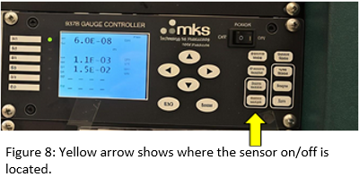  
3. Shut off the top cryo pump.  
    1. Touch **Cr\_I** to make it go from **ON** to **OFF**  
    2. Shown in figure 9  
        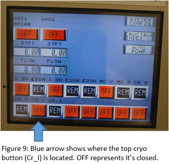  
4. Turn on the Argon gas and start the flow at 5 sccm  
    1. On the touch screen, touch the gas box to edit the value  
    2. See figure 10  
        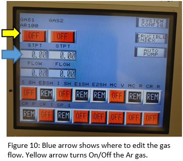  
5. Establish the chamber pressure to be about **5E-4 Torr** by cranking the lever on the bottom cryo  
    1. Use the loadlock gauge to verify the pressure  
    2. See figure 11 for the location of the bottom cryo lever.  
        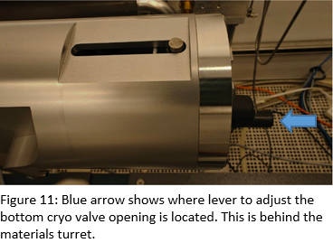  
6. Setup your ion milling settings  
    1. Use the chart on the tool to help you with this  
        1. If you need to adjust a parameter, press the button that is next to it, and then turn the knob  
7. Open the ion shutter by touching **I\_SH t**o make it go from **OFF** to **ON**  
8. Keep the sample shutter close  
9. Press **DISCHARGE ENABLE**  
    1. Wait about 30 sec \-1 minute for the panel to stabilize  
    2. See figure 12  
10. Press **BEAM ENABLE**  
    1. Wait about 30 sec \-1 minute for the panel to stabilize  
    2. See figure 12  
    3. The chamber will be very bright, please make sure to use welding goggles if you are going to look inside.  
        1. The filament for ion milling will glow and refer to figure 13 for what it should look like

        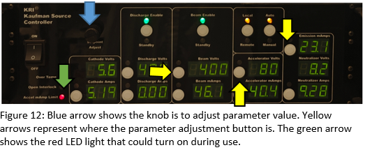

        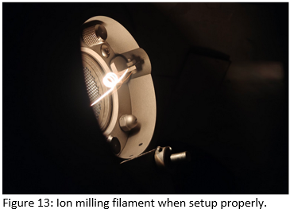

11. Turn on rotation of the sample plate.  
    1. Flip the switch to **LOCAL** mode  
    2. Turn the RPM knob all the way to 100  
        1. You should hear a click at the beginning   
        2. A green LED should be turned ON  
    3. Adjust the RPM knob to desired rotation speed  
    4. See figure 14 as an example for in-use  
        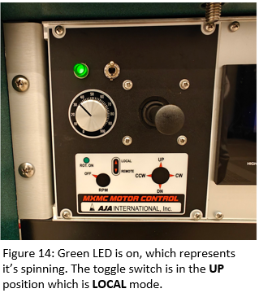  
12. At this point, you are ready to mill. Open the substrate shutter and start a timer  
    1. The substrate shutter is **S\_SH**  
    2. You may see a red light appear for **Accel mAmp Limit** on the panel, this is ok.  
        1. See figure 12  
    3. **Make sure the viewing shutter is closed\!**

### **Turning Off and Unloading**

1. To turn off, first press **BEAM ENABLE**  
    1. Wait about 30 sec \-1 minute for the panel to stabilize  
2. Press **DISCHARGE ENABLE**  
    1. Wait about30 sec \-1 minute for the panel to stabilize  
3. Close the ion shutter, but turning off **I\_SH**  
4. Turn off the Argon gas, by pressing **OFF**  
    1. Wait until it reads 0 sccm  
5. Stop the rotation by turning the RPM knob to 0  
    1. Should hear a loud click sound when the knob is successfully at 0  
6. Set the sample plate holder (angle brackets) back into the original position. The green sharpie line should be lined up to the black sharpie line/screw groove  
    1. Refer to figure 1 in the appendix  
    2. Flip the switch next to the RPM knob to **REMOTE** mode after alignment  
7. You may need to raise the sample plate a little bit before moving the loadarm into the unloading position. Otherwise, unload the sample plate as normal.  
    1. Loadarm should be at the chamber sharpie line for removing the sample plate from the angle bracket.  
    2. **Make sure the sample plate is not rotating before attempting to place it on the loadarm**  
8. **Make sure the loadlock gate valve is closed before venting the loadlock to remove your sample\!**

### **Before You Go…**

1. Turn the ion gauge back on by pressing the **SENSOR ON/OFF** button  
2. Open the top cryo pump by pressing the **Cr\_I**   
    1. You may hear a hiss and pop sounds, this is normal.  
    2. See figure 13 for what the touch screen and the ion gauge panels should look like for idle state  
        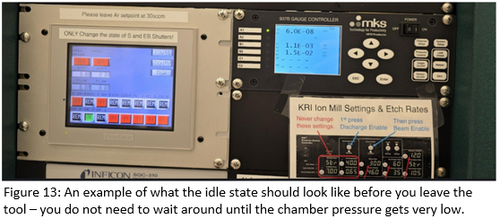  
3. Open up completely the bottom cryo pump  
    1. Manually crank the level to **OPEN** position  
4. **Make sure the gate valve is closed before venting the loadlock to remove your sample**  
     
     
     
     
   

## **Appendix**

#### *Loading Sample into the Main Chamber*

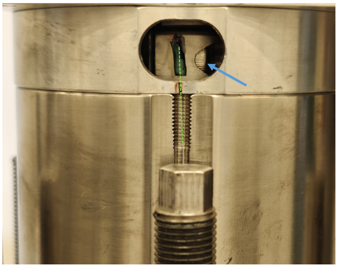{ width="407" }  
*Figure 1*  
The green dashed line shows that the green sharpie mark is aligned with the screw groove or red sharpie mark (whichever is easiest). *Note: the green sharpie mark will only appear if you can see the screw notched on the side, represented by the blue arrow.*  
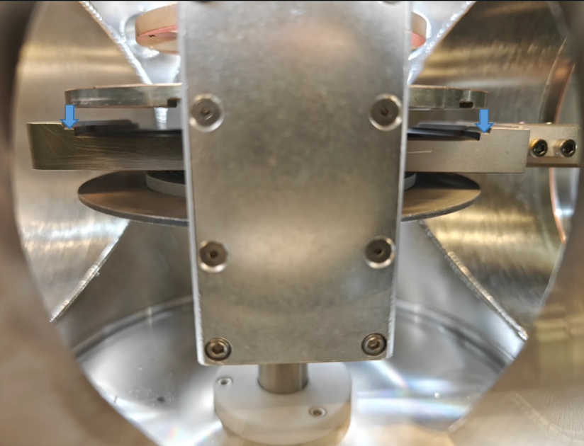{ width="406" }  
*Figure 2*  
This point of view of looking through the loadlock viewport window. The loadarm paddle is directly below the sample plate. **The goal is to place the sample plate onto the middle step feature on the loadarm, represented by the blue arrows.** 

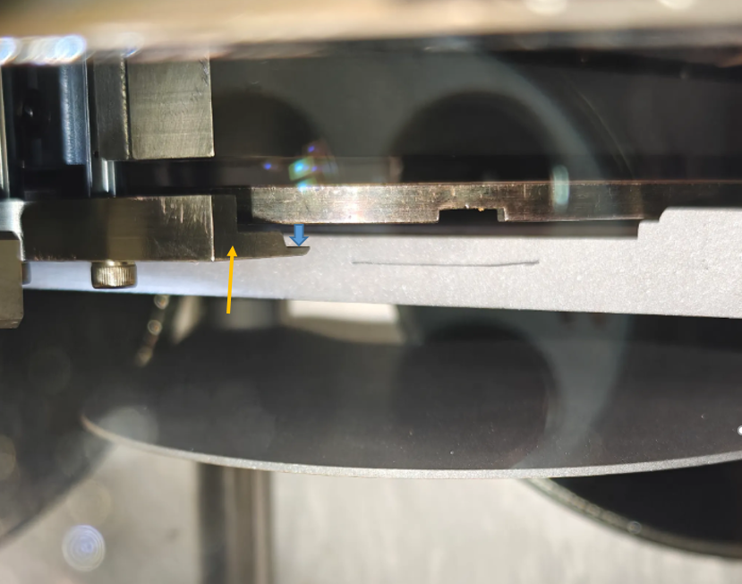{ width="421" }  
*Figure 3*  
This point of view is looking into the main chamber from the viewport window. The yellow arrow points to the angle bracket. **The blue arrow shows where the sample plate should be placed onto the angle bracket.**  
  
*Figure 4*  
The **bottom** sharpie denotes where the angle brackets should be placed to start the loading process. This is also where you leave the angle bracket when you want to transfer the sample plate back into the loadlock. The **top** sharpie mark is the minimum safe clearance to move the loadarm back to its home position safely. The blue dashed line shows where the angle bracket is at the 90mm mark, the deposition height. *Note: We align the angle bracket to the placemarkers by using the bottom edge of the brass rod.*

#### *Preparing for Film Deposition*

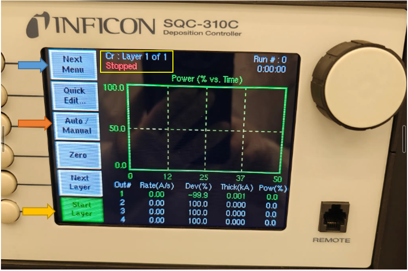{ width="412" }  
*Figure 5*  
This is the main screen on the Inficon. On the top, in the yellow box, displays the current material recipe loaded, and the state of the process. Next to the blue arrow, is the “next menu” button, that cycles indefinitely through all of the options. Next to the orange arrow, is the “Auto/Manual” button, that you must confirm/adjust to read “Manual/Auto” for using the tool in manual mode. Next to the yellow arrow, is the “Start Layer” button, that you press **once** to start ramping up your deposition process. 

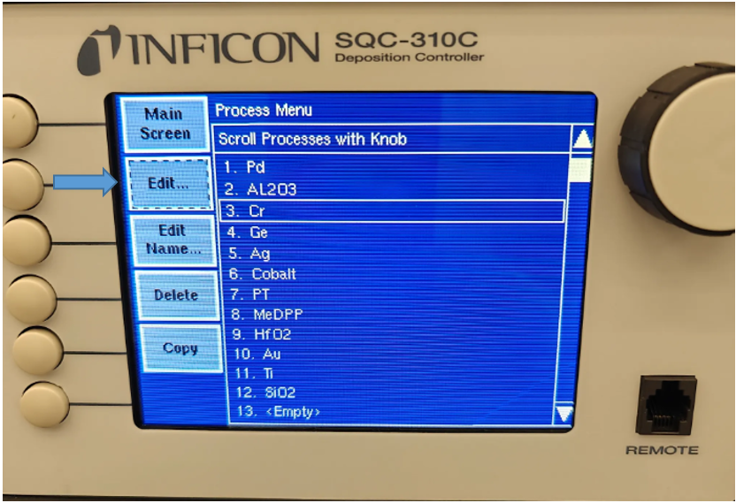{ width="428" }  
*Figure 6*  
After you press the “Process Menu” button, it takes to this screen to select a material. Choose the material you will be depositioning, and **in order to make the selection (or move on to the next screen), you must press it twice.**

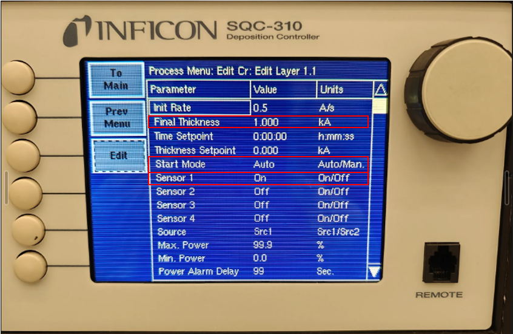{ width="500" }  
*Figure 7*  
When you are on this screen, you are editing the material’s recipe/process. The only parameter to edit here is the “Final Thickness”, which you **must set to a number higher than what you want on your sample**. The other 2 parameters: **“Start Mode” and “Sensor 1” must match this photo.** 

## **Common Errors and Troubleshooting** 

---

Prepared by: Salam Elhalabi  
Date: August 26, 2026  
Reviewed/Revised:   
Salam Garraway

