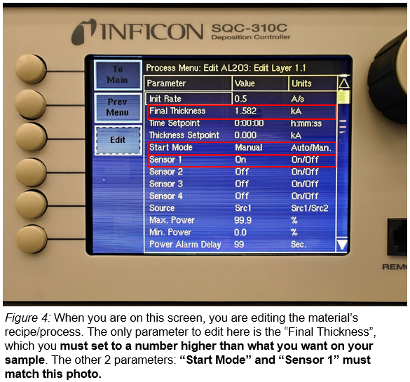
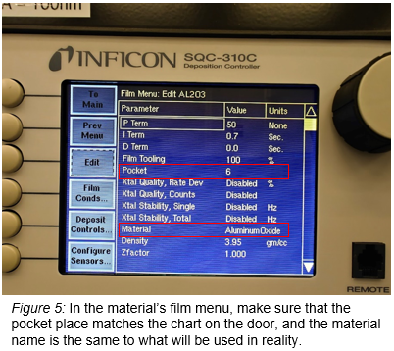

<!-- AUTO-GENERATED by scripts/sync_gdocs.py from the Google Doc below. Edit the Google Doc, not this file. -->

# AJA Organic Evaporator

[:material-file-document-outline: Open the Google Doc](https://docs.google.com/document/d/1_GuCjeccX-jVpvjYN3VdQHAqRQzjFMkkwiHjFlsDaZI/preview){ .md-button }
[:material-file-pdf-box: View PDF](../../assets/pdfs/tools/Organic_Evap_SOP.pdf){ .md-button }
[:material-download: Download PDF](../../assets/pdfs/tools/Organic_Evap_SOP.pdf){ .md-button download="Organic_Evap_SOP.pdf" }

---

# Safety Information and Overview {#safety-information-and-overview}

| Advanced Science Research Center | Graduate Center CUNY |
| :---- | :---- |
| Date | 3/11/2026 |
| SOP Title | AJA E-Beam Organic/Oxide Evaporator SOP |
| Principal Investigator | Samantha Roberts |
| Department | NanoFabrication Facility |
| Room and Building | ASRC G.263 |

## **Section 1 – Process or Experiment Description** {#section-1-–-process-or-experiment-description}

This SOP is only for the general use of depositing thin films. Only approved users are allowed to use the equipment, after passing a qualification with the tool manager. Any maintenance will be done by trained staff members. Some maintenance creates additional hazards which will be described in the Instrument Manual.

\*Note: Any sample preparation is to be done by the user, and this document does not cover any information related to sample preparation. Any materials listed outside of the approved list, must be discussed with the tool manager.  NO high vapor pressure materials

## **Section 2 – Hazardous Substances** {#section-2-–-hazardous-substances}

**Substance Name:** Chromium

**Common Name:** Chrome

**Abbreviation:** Cr

**Substance Name:** Silver

**Abbreviation:** Ag

## **Section 3 – Potential Hazards** {#section-3-–-potential-hazards}

| Hazard | Hazard Sign | Hazard Description |
| :---- | ----- | :---- |
| Bright e-beam | { width="83" } | Serious eye damage may occur if viewed directly at e-beam during use |
| Electric Shock | { width="80" } | Tool operates in extremely high voltages (3-10kV). |
| Thermal  | { width="88" } | Sample(s) and sample plate can get hot to touch |
| Chrome | { width="98" }{ width="74" } | Exposure to particulate or vapor form may present significant health hazards and is toxic to aquatic organisms.  Under the high temperatures involved in e-beam evaporation, **metallic Cr can oxidize** into Cr(VI), especially in the presence of residual oxygen. This is highly toxic to aquatic organisms and is a known human carcinogen. |
| Silver | { width="99" }{ width="77" } | Silver is toxic to aquatic life in nanoparticulate or ionic forms. **low acute toxicity**, but chronic exposure (especially to nanoparticles or silver dust) may lead to: **Argyria**: A bluish-gray discoloration of the skin.
 **Respiratory irritation** from dust or vapor in poorly ventilated areas. |

**Section 4 – Routes of Exposure**

Eye damage can occur if looking through the viewport window with the shutter open, and not wearing the appropriate protective eyewear. 

Electric shock can occur when working with the high voltage feedthroughs or in the back of the electronics rack, without properly grounding the work area beforehand.

Thermal hazard is present if using the e-beam evaporator for a long period of time, which can heat up the plate and the sample(s).

**Section 5 – Personal Protective Equipment**

All personnel must wear the welding goggles whenever looking directly at the bright e-beam.

All trained staff must use the grounding rod to touch the working areas, before attempting any maintenance.

**Section 6 – Waste Disposal**

Kapton or copper tape that has silver and/or chrome on the top layer, must be disposed into the container found on the workbench. Staff will transport the container for waste disposal when the container is full. 

| Hazardous compound, element, or chemical name | State (L,G,S) | Hazardous | Non-hazardous | Which hazards? | How is waste managed? |
| ----- | ----- | ----- | ----- | :---- | ----- |
| Silver | S | x |  | Solid waste is toxic to environment, aquatic, and human health | Must be collected and disposed of as Hazardous waste  |
| Chrome | S | x |  |  Solid waste is toxic to environment, aquatic, and human health | Must be collected and disposed of as Hazardous waste  |

# **Tool operation** {#tool-operation}

## **1\. Precheck list** {#1.-precheck-list}

1. Check main chamber pressure (should be \<1E-7, or E-8 Torr range)  
2. Check load lock pressure (should be in E-5 or E-6 Torr range)  
3. Check the cryo temp is between 10-12K  
4. Check the material you need is in the tool  
5. **CONFIRM THAT THE GATE VALVE IS CLOSED**

## **2\. Loading the Sample in Loadlock** {#2.-loading-the-sample-in-loadlock}

1. Verify the gate valve is closed  
2. Turn off pump to vent the loadlock  
3. Remove sample holder and replace lid  
4. Load sample onto substrate holder  
   * Make sure one arm of the propeller is pointing towards the main chamber		OR  
   * Use one of the lines coming out of the middle of the propeller, to align to the **NOTCH** on the **LEFT** side of the loadarm  
   * See figure 1 for reference

## **3\. Loading the Sample into Chamber**

1. Open the upper viewport shutter to visualize loading  
2. Raise propeller to **top** sharpie line for load arm clearance to transfer the sample plate  
   * Sharpie line that is around 67 (see figure 2\)  
3. Spin propeller collet to line up with the **green** circle (see figure 3\)  
4. Open gate valve when pressure is less than 3E-5 Torr  
5. Rotate knob by loadlock to move the load arm all the way into the chamber  
   * It’s a small knob that is to the right of the loadlock  
   * Rotate knob until can’t move anymore  
6. Lower propeller onto substrate holder.    
   * Continue moving it down to bend the load arm only slightly  
   * Propeller should insert into substrate holder relief and be flush  
   * Should be aligned to the **green** sharpie line around 85 (see figure 2\)  
     1. **Do not go below the green sharpie line**  
7. Rotate propeller **clockwise** to lock it to the substrate holder  
8. Raise sample holder to top sharpie line  
   * Sharpie line that is around 67  
9. Move loadarm back to resting position using the knob  
10. Close the gate valve  
11. Close the upper viewport shutter

## **4\. Preparing the Gun** {#4.-preparing-the-gun}

1. Turn on the Genius remote  
   * Make certain it is in manual mode   
   * Should say 9.45kV  
2. Open **E-beam Shutter**  
3. Turn on the camera switch (Under laptop)  
   * Can adjust the viewing angle of the camera by moving the shutter in front of the camera  
   * Can adjust the contrast of the image by moving the 2 pins next to the camera  
   * You should see the e-beam assembly glowing  
   * Should position the view to be able to see the assembly on top and “darkness” underneath  
     1. You could open and close the “e-beam shutter” to see if positioned correctly 

## **5\. Selecting a Material and Recipe** {#5.-selecting-a-material-and-recipe}

1. Select the material by crucible number from the **E-BEAM POCKET** drop-down menu  
   1. The crucible positions are shown on the chart attached to the chamber door  
2. Click **E-beam index start** to give the command for the turret to move into that position  
3. When movement is complete a popup window will appear with the message **“E-beam move complete”**   
   1. Click **OK** to acknowledge the window   
4. On the Inficon screen select **“Process Menu”**   
5. Select the material desired to deposit  
   1. Must select it **twice** to actually select that choice  
6. Press **“Edit”** on the layer screen  
   1. **You should only see 1 layer** \- which is the same as the material selected  
7. In the **“Process Menu: Edit …: Edit Layer 1.1”** screen, you must edit/verify the following:  
   1. Enter a film thickness **greater** than what you need to deposit  
   2. Verify that the Start Mode is in “Manual” mode  
   3. Sensor 1 must be “On”  
   4. See figure 4 for reference { width="398" }  
8. Go back to the main menu and go to the **Film menu**  
9. Select the material desired to deposit  
10.  In that material film menu screen, verify the following 2 items  
    1. The **pocket number** on the screen matches the crucible turret position in reality  
    2. The line that reads “**material”** matches to what you will be evaporating   
       1. This would be found towards the bottom of the screen  
       2. Do not look at the top of the screen to verify this information  
       3. See figure 5 for reference  
11. On the main menu, verify you are operating in “Man/Auto” (as opposed to Auto/Man)  
    1. You may have to click on **“Next Menu”** to see this option  
    2. A white box appears around the **“Power”** level column when you are in manual mode  
12. Press the green box that reads **“Start Button/ Start Layer”**  
    1. It should read **“Manual Start Layer”**, before you start ramping up. 

## **6\. Film Deposition** {#6.-film-deposition}

### *Ramping up to Threshold* 					

1. Ramp up by increasing the power knob slowly and waiting between movements    
   1. Ramping up is:  
      1. **No more than 3% at a time**   
   2. For every movement done, **you must wait anywhere between 30 sec. \- 1 min. Before moving the power knob again.**  
2. When you start to get a rate on the monitor (ideally \~0.01Å/s), note the power in the log binder  
   1. If it fluctuates to 0 or to negative numbers, that is not a real rate. It’s just noise.  
3. Check chamber pressure and cryo temperatures periodically  
4. Verify the location of the E-beam in the crucible through the viewport window  
   1. If it is too close to the crucible wall or if it is on the crucible, notify staff member to move the beam for you  
5. Close the viewport window 

### *After Threshold \- Ramping up to Soaking* 

6. Increase the power slowly until you are midway of the desired deposition rate   
   1. You could try moving 1% first and observe how the rate rises.   
      1. If the rate moves up slowly or within acceptable bounds (≤ 0.1Å/s), you can increase the power jump slightly.  
      2. If you see the rate rise more than 0.1Å/s, then move the power back to the last number you were on. Wait at least 1 minute for the rate to stabilize. Then, try moving again at a slower pace and observe how the rate behaves  
7. When you are halfway of the desired rate, soak for a couple of minutes for uniformity  
   1. **Soak for at least 3 minutes**  
8. Check chamber pressure and cryo temperatures periodically

### *After Soaking \- Ramping up to Desired Rate* 

9. At this point, it shouldn’t take large power jumps to reach your desired rate.  
   1. Should be increasing the power approximately the same pace  
10. Check chamber pressure and cryo temperatures periodically

### *Deposition*  

11. When you reached your desired rate, open the substrate shutter to expose your sample  
    1. Click on the **“SUB SHUTTER”** button  
12. Press the “ZERO” button to zero the starting thickness  
13. Wait until you reached your desired thickness  
    1. You may not leave the cleanroom unless there is an emergency   
    2. You are allowed to work in other areas of the cleanroom, **as long as you periodically check on the chamber pressure, cryo temperatures, the rate, and thickness deposited.**  
14. When you have deposited the film thickness you need, press the “S-SH” button, to shut the shutter.  
15. Slowly ramp down the power until it reaches zero  
    1.  Should be about the same pace as when you ramped it up \- after soaking   
16. Hit the “Stop/Stop Layer” button  
17. Click “Next Menu”  
18. Hit the “Reset” button

---

\*\* If depositing another layer(s) of different material repeat steps 4 and 5 \*\*  
( 4.Preparing for Film Deposition, and 5\. Film Deposition)  
---

## **7\. Turn Off the Gun** {#7.-turn-off-the-gun}

1. Turn **off** the HV on Genius Monitor  
2. **Close** the E-beam shutter

## **8\. Unload Sample** {#8.-unload-sample}

19. Verify load lock is \< 3E-5 Torr   
20. Open the gate valve  
21. Move load arm all the way into the main chamber   
22. Lower sample holder onto the load arm  
23. Turn propeller **counter-clockwise** to release sample holder  
24. Raise propeller to clear the sample holder   
    1. Align to the **top sharpie line**  
25. Rotate load arm handle to bring the sample holder back into the loadlock  
26. Close the gate valve  
27. Vent the loadlock to retrieve sample  
28. Return the sample holder to the loadlock and replace lid  
29. **Always leave the loadlock under vacuum before you log off the tool**  
30. **Make sure to record the deposition information in the log book, if you didn’t do it earlier.**

# **Common Errors and Troubleshooting** {#common-errors-and-troubleshooting}

---

Prepared by: Salam Elhalabi  
Date: March 11, 2026  
Reviewed/Revised:   
Salam Elhalabi

