<!-- AUTO-GENERATED by scripts/sync_gdocs.py from the Google Doc below. Edit the Google Doc, not this file. -->

# Oxford PECVD

[:material-file-document-outline: Google Doc](https://docs.google.com/document/d/1q-4YgUklqppoQipswF7NygH4oarlqO2lo9nTGDubHhk/preview){ .md-button }
[:material-file-pdf-box: View PDF](../../assets/pdfs/tools/PECVD_SOP.pdf){ .md-button }
[:material-download: Download](../../assets/pdfs/tools/PECVD_SOP.pdf){ .md-button download="PECVD_SOP.pdf" }

---

**Standard Operating Procedure: PECVD**

## **PLASMA ENHANCED CHEMICAL VAPOR DEPOSITION** {#plasma-enhanced-chemical-vapor-deposition}

### **Facility and Contact Information** {#facility-and-contact-information}

| Nanofabrication Facility | ASRC, RFCUNY |
| :---- | :---- |
| **SOP Title** | **Plasma Enhanced Chemical Vapor Deposition** |
| **Director** | **Samantha Roberts, PhD** |
| **Manager** | **Shawn Kilpatrick** |
| **Room & Building** |  **G263, Nanofab, ASRC** |

### **Section 1- Process and Experiment Description** {#section-1--process-and-experiment-description}

**Oxford PlasmaPro System 100 PECVD**

The Oxford Plasma Enhanced Chemical Vapor Deposition (PECVD) is a sophisticated high quality film deposition tool, which utilizes various process gases for deposition of silicon dioxide, silicon carbide silicon nitride, amorphous silicon, silicon carbide and other films for wide applications.

Hardware Description

1. Vacuum Chamber

   Vacuum chamber is a high purity stainless steel or aluminum alloy enclosed space to maintain a very clean and controlled deposition environment. In this tool, there are two separate vacuum chambers. To create vacuumed space inside the chambers, high-capacity pumps (dry and turbomolecular pumps) are used 

* Main Process chamber, where deposition occurs

* Load lock chamber where the wafers or substrates are loaded and unloaded.

2. Electrode and Plasma generation system

   To create plasma, parallel plate configuration is used. Top plate/Electrode serves as a showerhead which distributes process gases uniformly across the wafer. The bottom electrode/plate serves the substrate holder and is grounded to generate RF-powered plasma. Distance between two electrodes is adjusted to optimize the process parameters. RF power supply is typically 13.56 MHz to generate plasma with active precursor gases. For better control of ion bombardment and film properties (film stress, deposition density, refractive index) dual frequency setup of low and high RF frequencies is provided. Matching network of impedance is adjusted to a correct position to deliver maximum power to the plasma for uniform films deposition.

3. Substrate Holder

   It can hold substrates up to 8 inches in diameter. The temperature control system is included to maintain substrate temperature generally ranges from 100oC to 400o

#### **Principle of Operation:** {#principle-of-operation:}

The PECVD process has three main operation steps

1. Conditioning

   2. Deposition and 

   3. Cleaning

##### **Conditioning:** {#conditioning:}

It is the process of preparing and stabilizing the chamber and its components before actual film deposition starts. This step helps to remove any contaminants or any residues from previous processes. Conditioning or seasoning involves a pre-deposition of approximately 200 nm of material deposition on the chamber area to ensure a clean atmosphere for the new deposition process using the recommended carrier wafer.

Conditioning also heats the chamber to the desired temperature, adjusts chamber pressure to the required level and ensures consistent gas flow into the chamber.

##### **Deposition:** {#deposition:}

It is the main process of the PECVD where the desired thickness of materials is deposited onto the surface of the wafer or substrate to form a thin film layer/s in a precisely controlled environment. In a confined space of vacuum, high voltage RF power is applied to generate plasma between two parallel configurations of electrodes with the introduction of process gas/es.  During the operation, some gases flow and components are interlocked for safety purposes. 

##### **Cleaning:** {#cleaning:}

The cleaning process after deposition is crucial for maintaining the PECVD system’s performance and high-quality film deposition in the next subsequent processes. 

After the deposition process, the chamber walls and components often contain residual films and toxic gases. Plasma cleaning is commonly used to remove these residues. Generally, fluorine-based gas is introduced into the chamber to generate plasma, and it etches out thin layers of material that are deposited on the chamber’s inside walls and stage. After plasma cleaning multiple cycles of pumping and purging of N2 gas are done to flush out any remaining contaminants.

### ---

### **Section 2 \- Personal Protective Equipment & Responsibilities** {#section-2---personal-protective-equipment-&-responsibilities}

**Personal Protective Equipment**: 

Clean room gown, nitrile gloves, Mask, Goggles (optional) 

**Equipment for the tool**: 

Chips/Substrate, conditioning/cleaning substrate/wafer and appropriate tweezers. 

**User Responsibilities**

* Follow proper gowning procedures (Top to bottom and vice-versa)  
* Carefully read SOP.  
* Always follow safety protocols.  
* Look for the color of the hazard light signal and sound of alarm.  
* Always do Conditioning and Cleaning before and after running the recipe.  
* (must follow three main operation steps).  
* Know what your process parameters, materials and limitations are.  
* Always be alert and aware of any unusual tool behavior or smells; warn fellow users and inform staff immediately.  
* Always keep clean working space before and after use

**Do / Can**

* Walk as slow as possible, brisk walks or running might contaminate sensitive substrates in the Cleanroom.  
* Before using the tool, enable the badger account.  
* Disable badger after completion of CLEANING RECIPE.  
* Use your own substrate, carrier wafer or ASRC while conditioning and cleaning, (Condition and carrier wafers are as shown in Image 1.)  
* Use only Sapphire wafer for cleaning recipes, users can use their own wafer or use ASRC’s wafer.   
* Always check the matching position of RF capacitors (430) before beginning the cleaning recipe.  
* In a request, staff can create private accounts for users. They can develop their own recipes or just modify them.  
* Can do some other experiment side by side or walk around inside the Clean Room.  
*   
    
* Refer to the gas SDS sheets and safety summary in the binder near the exit of the Cleanroom Gowning area.  
* Be aware of hazardous flammable, oxidizing, corrosive and acute toxicity of gases that are used in the Process parameters.  
* Placing the wafer on the load arm of the load lock, always align the flat edge of the wafer between the two set screws as shown in Image 2 below. The load arm can accommodate wafer size up to 8 inches. But in general, use only small cut pieces of chip, 2-, 3- or 4-inches wafer size.

       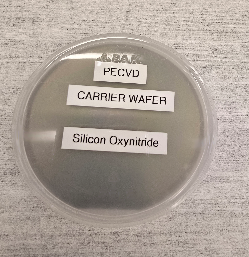{ width="109" }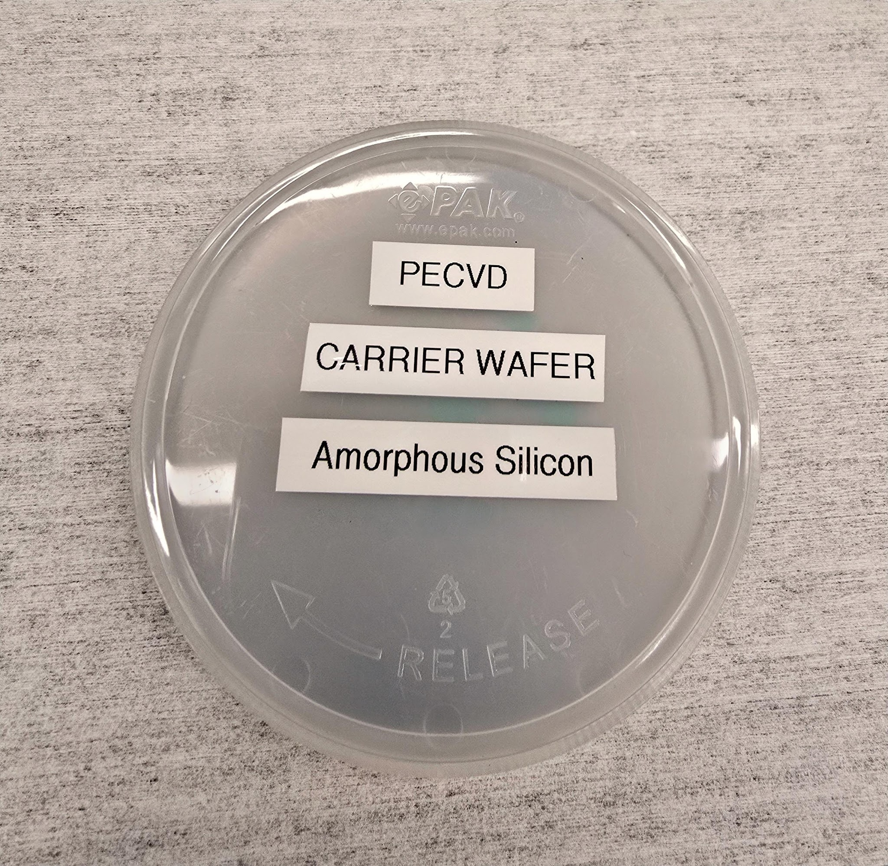{ width="115" }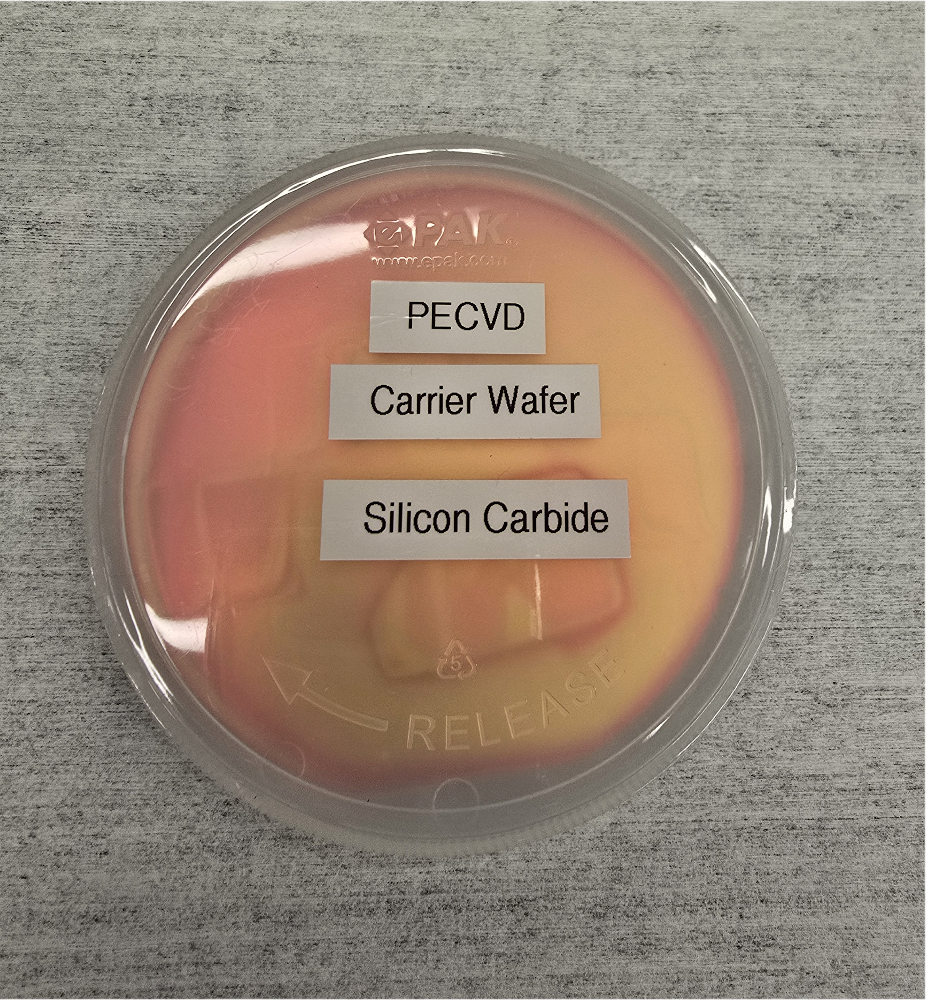{ width="104" }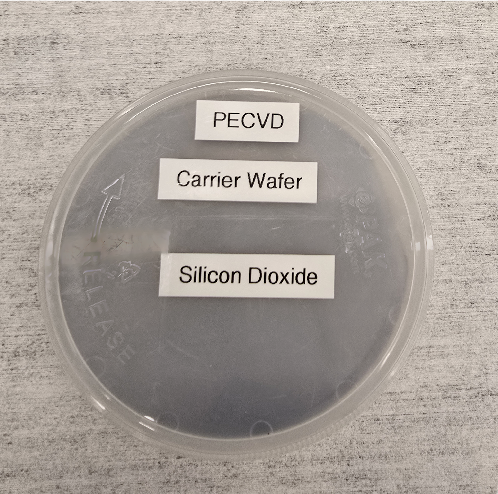{ width="111" }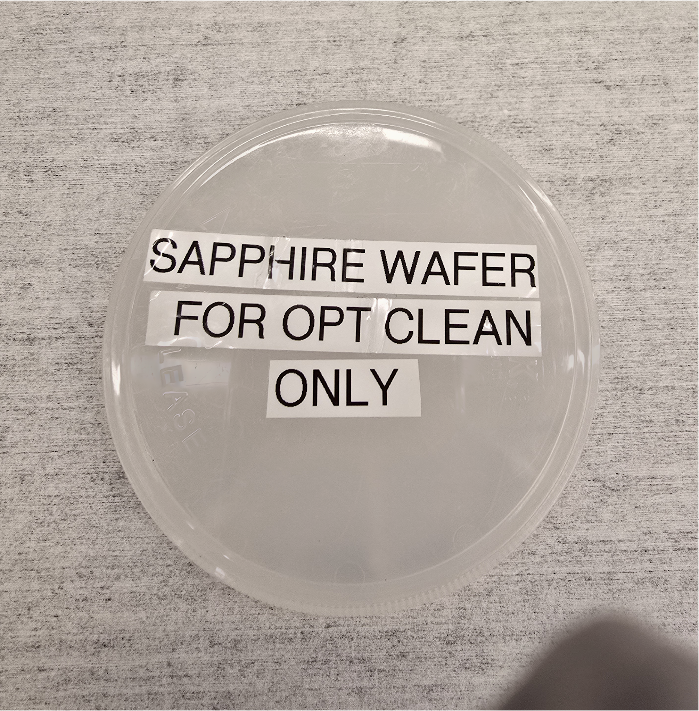{ width="110" }

*Image 1:* 4” Wafers that use the PECVD conditioning or carrier wafer to support small chips.  SiON, A-Si, SiO2 and Sapphire wafers.

*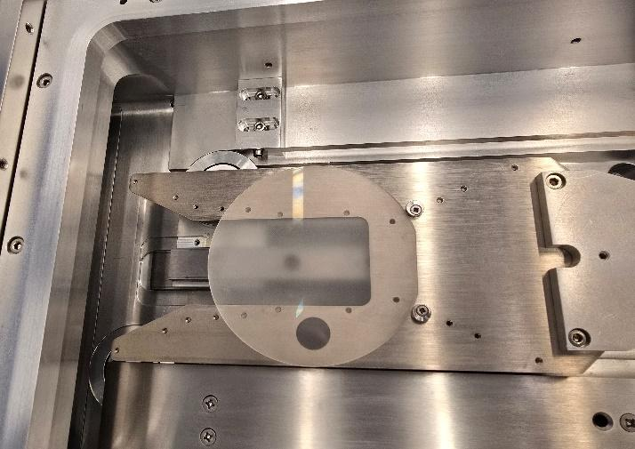{ width="312" }*

*Image 2* Flat Edge of the Sapphire Cleaning Wafer on the load arm

**Do not**

* Leave the Clean Room when the process is running.  
* Never change the matching network position while running the deposition recipe.  
* Lean or shake the tool   
* Overwrite or change other recipes.  
* Never use resists, polymers or tape in the PECVD  
* Leave any stuff after disabling a badger account on the tool  
* Take any of the items from inside the cleaning room without the approval of staff.  
* **Never use Oxidizer and Flammable gases together, it will explode**   
* Deposit too much of the material before running a clean. For SiO2 \> 5µm, SiN \> 3 µm, a-Si \> 2µm, or SiC \> 1.5µm, depositions must be split in half and the chamber must be cleaned at the halfway point.

**Emergency Stop**

* In the case of an emergency where a tool malfunction puts users in imminent danger, press the red EMO button on the tool. This is only to be used as a last resort.

*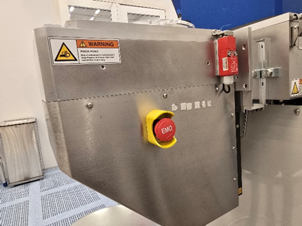{ width="351" }*

***Image 3*** EMO located at the side wall of the load lock chamber

To change the matching position of the transformer, reach out at the bottom right corner of the right-side panel. 

### **Section 3- Process Steps of SOP** {#section-3--process-steps-of-sop}

**Material Deposition Procedure**

Log in to the PTIQ system, using a private user account or common **User account** under **Individual** category. (Computer’s Screen will wake up only after enabling BADGER ACCOUNT)

{ width="341" }

*Image 5**\-***  **PTIQ Login Screen** 

**{ width="493" }**

If users have their own private account, they can login under the same Individual category and use their ID and Password, where they have permission to create recipes, modify process parameters, save, delete and transfer files. 

After logging in to the appropriate account, users might see on the screen as either Image 6 or Image 7\.

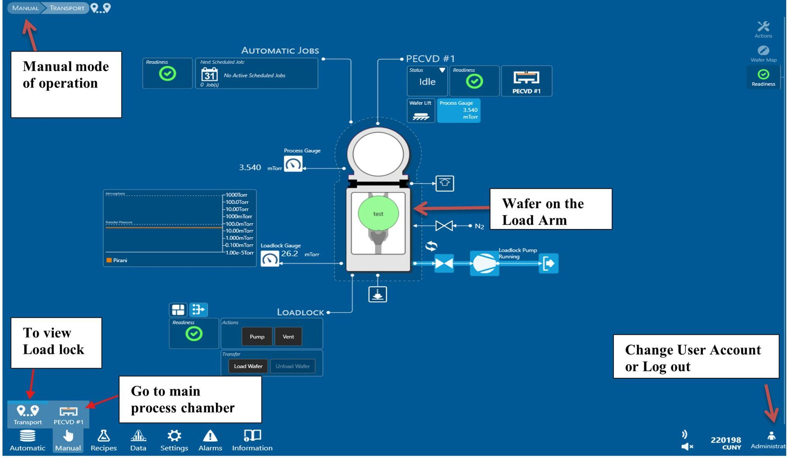*Image 6,* general cartoon view of PTIQ screen

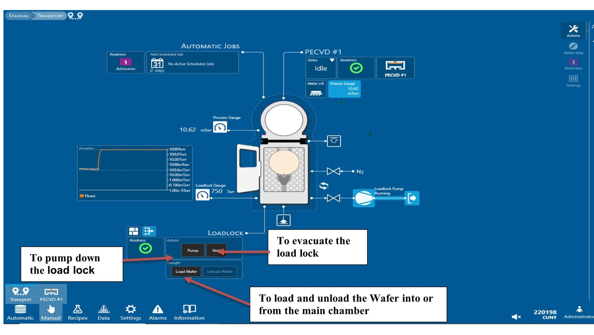

*Image 7, * Opened Load Lock lid

* #### **Three Operation Steps** {#three-operation-steps}

1. ##### **Load Sample** {#load-sample}

   Sapphire wafer is always there in the Load Lock under the vacuum.

1. Go to the Transport \[step **1**\] tab under Manual and select VENT \[step **2**\] to evacuate the load lock as shown in the **Image 8**, follow the number sequences. 

2. Wait for the load lock to reach atmospheric pressure, it takes approximately 2mins and 10 sec.

3. When vented, the Load lock chamber will be populated with grey dots.

4. Open Load lock Lid, place specified carrier wafer for the next operation. Small chips should be placed on the carrier wafer. For bigger than 3 inches wafer, replace Sapphire wafer with substrate wafer.

5. The slant edge of the wafer must be aligned between the two set screws on the Load Arm. (**as of Image 2)**

6. Close the lid of the load lock and pump the chamber \[step **3**\].

7. When pumping is done, load the wafer into the main chamber \[step **4**\]

8. Ivory color of the wafer is assumed as fresh wafer into the chamber.

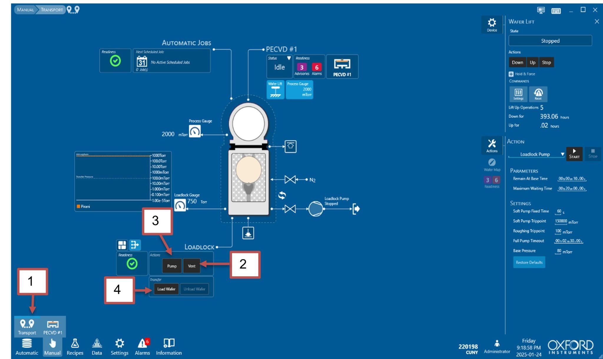

*Image 8*, Loading steps for wafer/chips for Condition/Deposition/Clean processe*s*

2. ##### **Run Recipe** {#run-recipe}

1. Click PECVD\#1 \[step **1**\] tab under Manual tab. Follow the numbered steps on the **Image 9\.**

2. At the Right-hand side, click the RUN RECIPE tab, click the drop down menu \[step **2**\]   to select the recipe to be used. 

3. After selecting the recipe click START \[step **3**\] to load the recipe. 

4. Now click **START RECIPE** \[step **4**\] under the **RUN** Recipe tab to run the desired recipe.

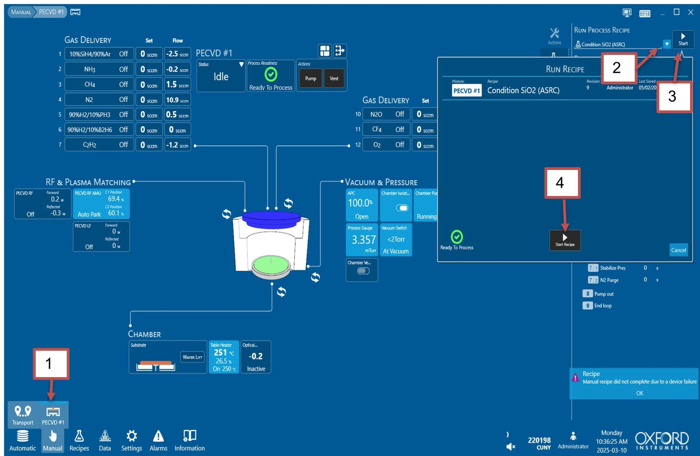

*Image 9,* Steps for Loading and Runing Recipe

3. ##### **Unload Sample** {#unload-sample}

   When the process is completed, the wafer inside the chamber will be in GREEN. Follow steps of **Image 10**.

1. Go to **Manual** tab and Transport \[step **1**\]. Under the Transport tab, select **UNLOAD** Wafer \[step **2**\].

2. Wait for the wafer to return to load lock. Be sure to check the load arm is fully retracted back to the load lock and wafer is on the arm.

3. Now select **VENT** \[step **3**\] tab to Evacuating Load Lock

4. Wait for load lock pressure to reach atmospheric pressure. It can be known as the load lock space will be filled up with gray dots.

5. Open the Lid and place the Clean Wafer (Sapphire) for the next OPT Clean operation.

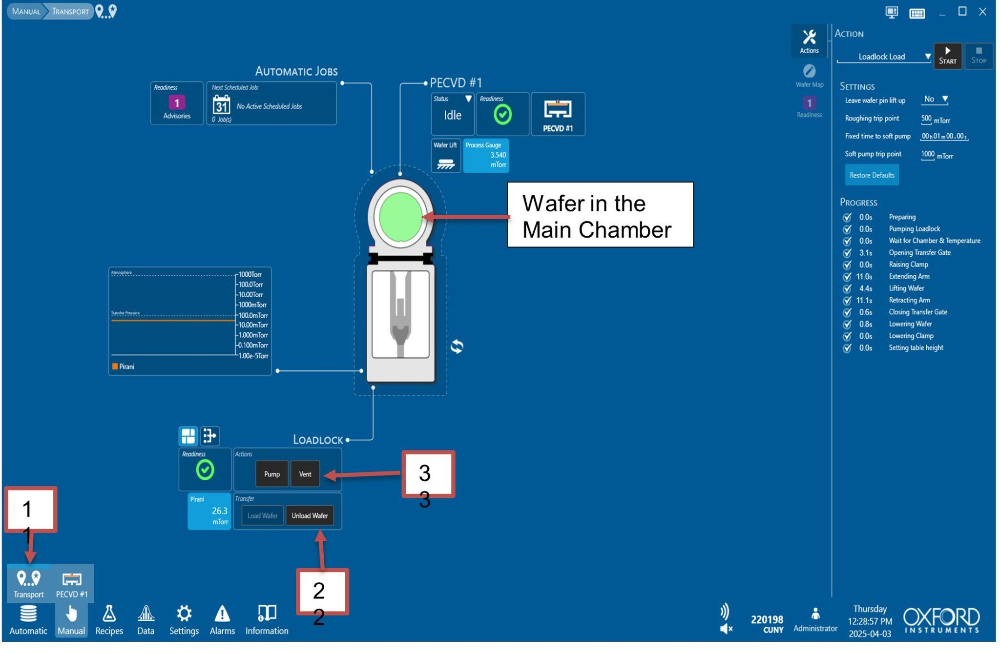

*Image 10,* Unloading steps for wafer/chips after Condition/Deposition processes 

* #### **Three Main Processes** {#three-main-processes}

1. ##### **Condition Chamber** {#condition-chamber}

1. Set the match position to the appropriate setting for the desired film to be deposited.

2. To load wafer for conditioning the chamber, Click Manual Tab Transport Tab, under the load lock, vent. 

3. Follow the steps shown in **image 8** for unloading the clean sapphire wafer to load the carrier wafer. 

4. Load the carrier wafer as per the instruction above. (Flat edge between the two set screws)

5. Load recipe as shown in **Image 9** (loading and running recipe)

6. In the conditioning recipe, table temperature is set according to the material to be deposited. So, select an appropriate condition recipe. \[The user does not need to set the deposition table temperature in the deposition recipe.\]

7. When conditioning is complete, the message will pop up as saying completion of process successfully.

8. Follow the steps shown in **image 10** for unloading carrier wafer to load the substrate for the deposition.

9. Vent the load lock and unload the wafer for the next operation deposition steps.

2. ##### **Deposition** {#deposition}

	To Run the Deposition Recipe.

1. Load the wafer/substrate into the main chamber by following the steps shown in **image 8**. 

2. Now, go to PECVD\#1 tab to load the desired deposition recipe; **image 9**

3. Look into the deposition category to select the recipe users want to deposit.

4. Change the deposition time by following the steps of **Image 11** and **Image 12**. As per users required thickness of the material.

As mentioned below.

**Changing Deposition time in the Recipe**

1. With respect to Time (Hr. Min. Sec) as of **Image 11**

Go to the Recipe Editor \[step **1**\].

1. Select the recipe which you want to use \[step **2**\]. 

2. Look for the Process step where main deposition parameters are mentioned.

3. Input your desired time under the deposition column \[step **3**\].

4. Hit the ENTER key to register your input time.

5. Click the SAVE tab at the top-middle of the screen to save your entered time \[step **4**\]. \[must\]

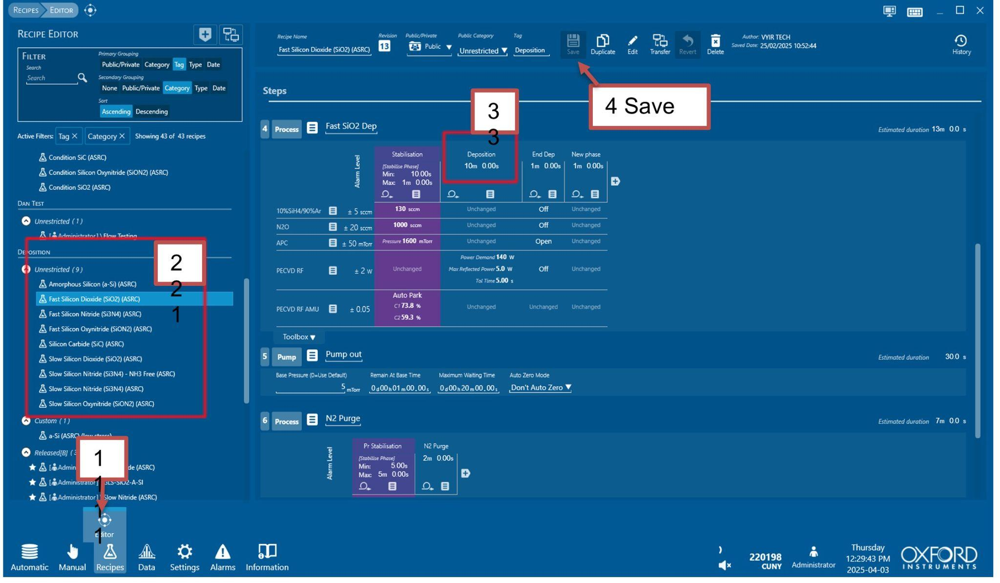

*Image 11*, Changing deposition time on the Deposition recipe

2. With respect to the growth rate per CYCLE (here Nitrite Recipe); Follow the steps of **Image 12\.**

1. Go to the Recipe Editor \[step **1**\].

2. Select the recipe which you want to use \[step **2**\]. 

3. Confirm the recipe that you selected \[step **3**\].

4. Look for the Process step where Columns RF and LF are looped. Deposition is done with pulsating manner of RF and LF discharge. One loop or cycle is 20 sec. i.e. 3 cycles a minute.

5. Input your desired numbers of cycles under the deposition column \[step **4**\].

6. Hit the ENTER key to register your input time. \[must\]

7. Click the SAVE tab at the top-middle of the screen to save your entered time \[step **5**\]. \[must\]

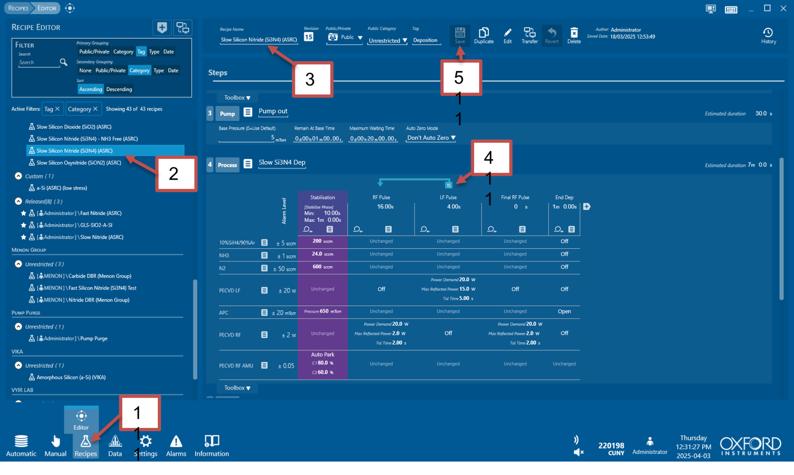

*Image 12*, Changing deposition time on the Nitrite Recipe or recipe that has the deposition process with a number of cycles.

3. ##### **Clean Chamber** {#clean-chamber}

**Approximate time: 50 mins**

Set the match position to the appropriate setting for cleaning \[430\]

Load the Sapphire wafer into the loading Arm correctly

1. Go to Recipe editor \[step **1**\] and select the cleaning recipe. Follow the steps of **Image 13\.**

   1. Timed Clean

For a Clean timed recipe, the **Cleaning Time calculation** **must include the Condition recipe deposition time and main deposition time as per the chart stuck on the side wall of the Plasma Asher Tool** to clean the chamber. Add an extra 10-minute cleaning time when deposition is higher than 1 micron.

1. Select OPT CLEAN TIMED (recommended) \[step **2**\] and \[step **3**\]. 

   2. Go to Process (step 4), edit deposition run **time** of the **High-pressure clean** \[step **4**\], click Enter to register edited time and SAVE it \[step **5**\]

      **Note:** **Do not change Low Pressure Time.**

   2. End Point Detection Clean 

      1. Select OPT CLEAN EPD. 

2. After editing cleaning time, follow the steps of loading **wafer, loading and running the recipe and unloading the wafer** steps as shown in **images 8,9 and 10\.**  
3. Be inside the Cleanroom until the clean recipe is completed.  
4. Unload Clean wafer into the Load lock and keep the chamber under vacuum.  
5. Clean the tools area, if needed, and disable the tool from the badger.

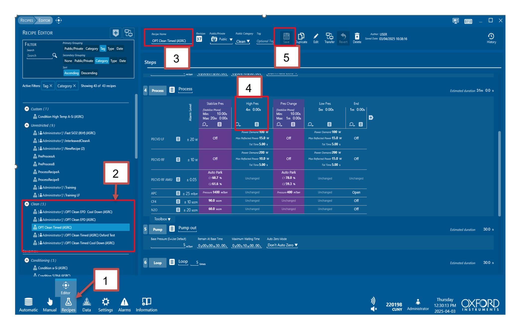

*Image 13*, Changing Cleaning Time for OPT Clean Timed Recipe

### **Section 4 – Gases, Hazards Classification and symbols** {#section-4-–-gases,-hazards-classification-and-symbols}

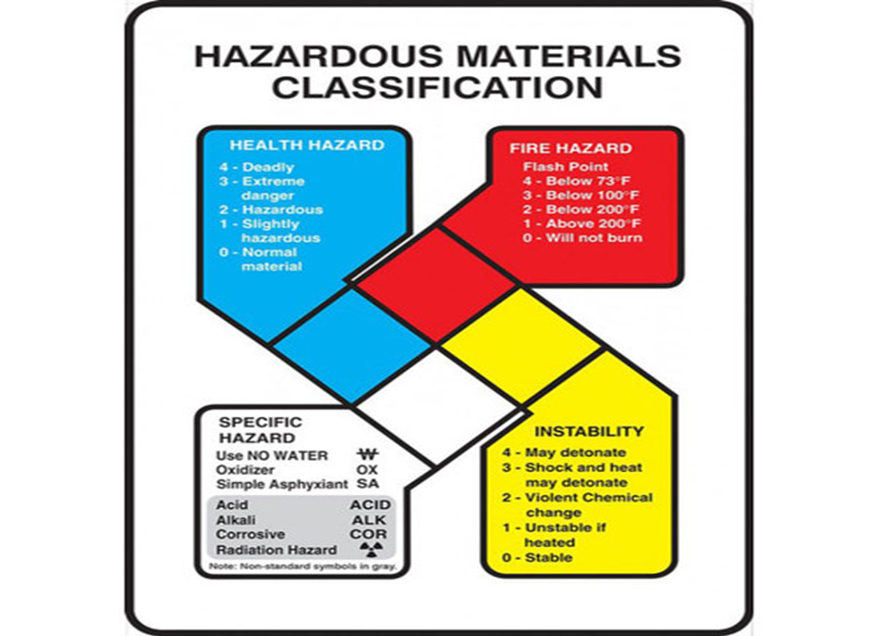{ width="445" }

**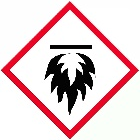{ width="61" }**  \= Flammable

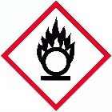{ width="61" } \= Oxidizing

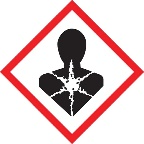{ width="63" } \= Health Hazard

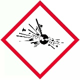{ width="69" }\= Explosive

**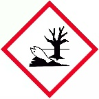{ width="63" }** \= Environmental Hazard

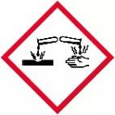{ width="62" } \= Corrosive

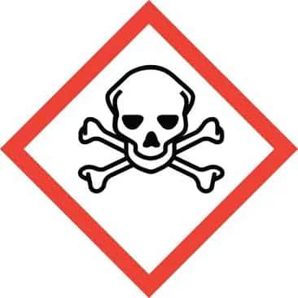{ width="66" } \= Toxic

{ width="61" }  \= Harmful

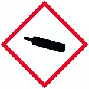{ width="66" } \= Compressed Gas

 

* #### **Gases, Hazard sign and Description** {#gases,-hazard-sign-and-description}

| S. No | Gases | Gases & Hazard Sign | Description |
| ----- | ----- | ----- | ----- |
| 1 | SiH4 (Silane) |    | Pyrophoric – Ignites and explodes spontaneously in air, often without a spark Flammable compressed gas Toxic at high concentrations: mainly lungs Can cause severe burn |
| 2 | NH3 (Ammonia) |   | Corrosive to skin, eyes and mucous membranes Acute toxic and cause severe respiratory irritation if inhaled Reacts with acids and oxidizer Environmental hazard |
|   | PH3 (Phosphene) |   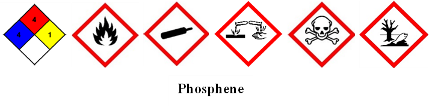{ width="343" }  | Highly toxic even at low concentrations Highly Flammable Pyrophobic- Ignites and explodes spontaneously in air Causes damage to lungs, liver, kidneys and Central Nervous System. |
| 4 | B2H6 (Diborane) |   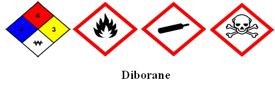{ width="247" } | Extremely toxic to organs Highly flammable Pyrophoric and ignite in moist air. Highly reactive Causes damage to lungs, liver, kidneys and Central Nervous System |
| 5 | CH4 (Methane) |  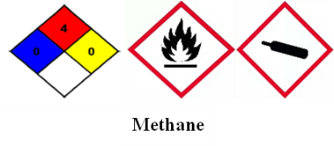{ width="176" } | Flammable gas Reduce oxygen level (Asphyxiant) at high concentrations, specifically in a confined space. |
| 6 | C2H2 (Acetylene) |   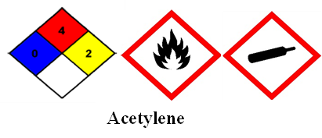{ width="185" } | Highly flammable, explosive under pressure or when mixed with moist air. Reactive gas forms explosive compounds with Cu, Ag and Hg. Asphyxiant in confined areas. |
| 7 | H2 (Hydrogen) |   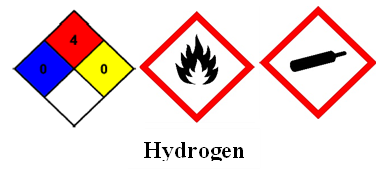{ width="163" } | Extremely flammable gas Odorless and invisible flame Reduce oxygen levels at high concentrations.  |
| 8 | N2O (Nitrous Oxide) |  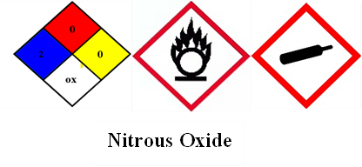{ width="158" } | Colorless, sweet-smelling Supports combustion (Oxidizer) Can cause fire or explosion if mixed with flammables at high temperature and pressure Inhalation hazard (narcotic effects) Asphyxiant concentrations |
| 9 | O2 (Oxygen) |   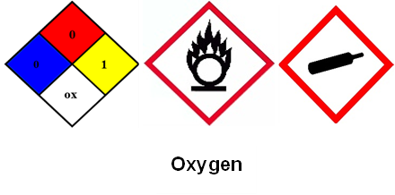{ width="193" } | Odorless, colorless gas with strong oxidizer Intensifies fire, with combustible materials (oils, greases or organic materials) may ignite spontaneously and  Can cause explosion at high pressure Prolong exposure to high concentration leads to damage tissues and organs.  |

* **What to watch out for during operation**

* If the carrier wafer used for the chamber cleaning is over etched, it must be replaced otherwise it will inevitably break inside the chamber.

* to change the match position to 430 when running the clean, otherwise the reflected power will be too high, and the recipe will abort.

* **When to call staff?**

* If the pump fails.

* If a wafer breaks or gets stuck in the chamber.

* If Red Alert appears

* When the Tool behaves weird.

**Revision History:**  
Version 1.0 \- After PTIQ Upgrade  \- May 2025 

