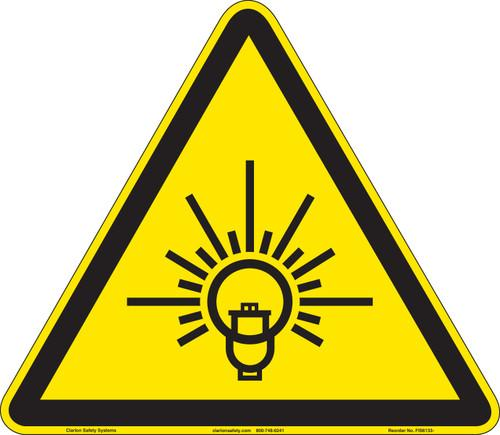
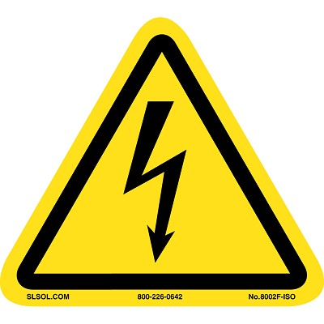

<!-- AUTO-GENERATED by scripts/sync_gdocs.py from the Google Doc below. Edit the Google Doc, not this file. -->

# AJA Thermal Evaporator

[:material-file-document-outline: Open the Google Doc](https://docs.google.com/document/d/1XmcgTR4KJSk2_5zVrSb0KT16OabZz5VcCGGa1UyJi4s/preview){ .md-button }
[:material-file-pdf-box: View PDF](../../assets/pdfs/tools/Thermal_Evap_SOP.pdf){ .md-button }
[:material-download: Download PDF](../../assets/pdfs/tools/Thermal_Evap_SOP.pdf){ .md-button download="Thermal_Evap_SOP.pdf" }

---

# Safety Information and Overview {#safety-information-and-overview}

| Advanced Science Research Center | Graduate Center CUNY |
| :---- | :---- |
| Date | 6/04/2025 |
| SOP Title | AJA Thermal Evaporator SOP |
| Principal Investigator | Samantha Roberts |
| Department | NanoFabrication Facility |
| Room and Building | ASRC G.263 |

## **Section 1 – Process or Experiment Description** {#section-1-–-process-or-experiment-description}

This SOP is only for the general use of depositing thin films. Only approved users are allowed to use the equipment, after passing a qualification with the tool manager. Any maintenance will be done by trained staff members. Some maintenance creates additional hazards which will be described in the Instrument Manual.

\*Note: Any sample preparation is to be done by the user, and this document does not cover any information related to sample preparation. Any materials listed outside of the approved list, must be discussed with the tool manager.  NO high vapor pressure materials

## **Section 2 – Hazardous Substances** {#section-2-–-hazardous-substances}

**Substance Name:** Chromium

**Common Name:** Chrome

**Abbreviation:** Cr

**Substance Name:** Silver

**Abbreviation:** Ag

## **Section 3 – Potential Hazards** {#section-3-–-potential-hazards}

| Hazard | Hazard Sign | Hazard Description |
| :---- | ----- | :---- |
| Bright light | { width="83" } | **Serious eye damage** may occur if viewed directly at light during use |
| Electric Shock | { width="80" } | The tool operates in **extremely high voltages (3-10kV).** |
| Thermal  | { width="88" } | Sample(s) and sample plate can get **hot to touch** |
| Chrome | { width="98" }{ width="74" } | Exposure to particulate or vapor form may present **significant health hazards and is toxic to aquatic organisms.**   Under the high temperatures involved in e-beam evaporation, **metallic Cr can oxidize** into Cr(VI), especially in the presence of residual oxygen. **This is highly toxic to aquatic organisms and is a known human carcinogen.** |
| Silver | { width="99" }{ width="77" } | Silver is toxic to aquatic life in nanoparticulate or ionic forms. **low acute toxicity**, but chronic exposure (especially to nanoparticles or silver dust) may lead to: **Argyria**: A bluish-gray discoloration of the skin.
 **Respiratory irritation** from dust or vapor in poorly ventilated areas. |

## **Section 4 – Routes of Exposure** {#section-4-–-routes-of-exposure}

Eye damage can occur if looking through the viewport window with the shutter open, and not wearing the appropriate protective eyewear. 

Electric shock can occur when working with the high voltage feedthroughs or in the back of the electronics rack, without properly grounding the work area beforehand.

Thermal hazard is present if using the e-beam evaporator for a long period of time, which can heat up the plate and the sample(s).

Inhalation hazard is present if did not wait until the tool has vented fully to the atmosphere.

## **Section 5 – Personal Protective Equipment** {#section-5-–-personal-protective-equipment}

All personnel must wear the welding goggles whenever looking directly at the bright e-beam.

All trained staff must use the grounding rod to touch the working areas, before attempting any maintenance.

## **Section 6 – Waste Disposal** {#section-6-–-waste-disposal}

Kapton or copper tape that has silver and/or chrome on the top layer, must be disposed into the container found on the workbench. Staff will transport the container for waste disposal when the container is full. 

| Hazardous compound, element, or chemical name | State (L,G,S) | Hazardous | Non-hazardous | Which hazards? | How is waste managed? |
| ----- | ----- | ----- | ----- | :---- | ----- |
| Silver | S | x |  | Solid waste is toxic to environment, aquatic, and human health | Must be collected and disposed of as Hazardous waste  |
| Chrome | S | x |  |  Solid waste is toxic to environment and human health | Must be collected and disposed of as Hazardous waste  |

# **Tool operation** {#tool-operation}

Coming soon\!  
---

# **Common Errors and Troubleshooting**  {#common-errors-and-troubleshooting}

---

Prepared by: Salam Elhalabi  
Date: June 4, 2025  
Reviewed/Revised:   
Salam Elhalabi

