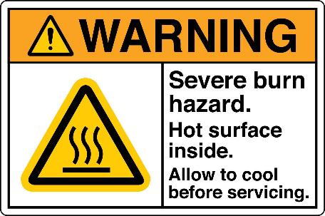
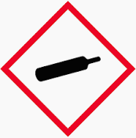
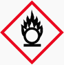
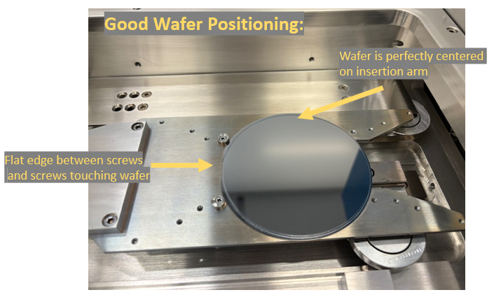
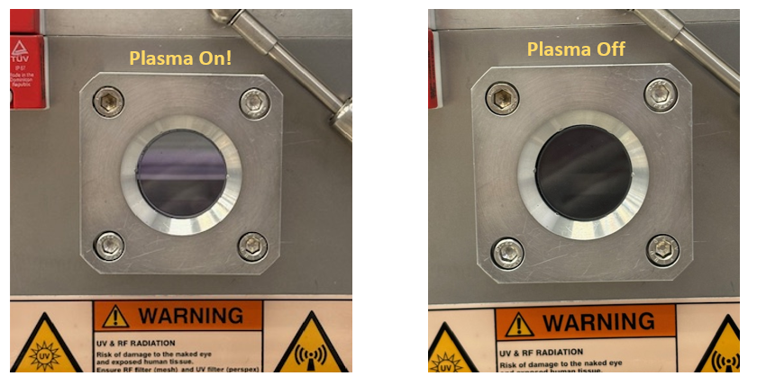

<!-- AUTO-GENERATED by scripts/sync_gdocs.py from the Google Doc below. Edit the Google Doc, not this file. -->

# ICP Fluorine Etcher SOP

[:material-file-document-outline: Google Doc](https://docs.google.com/document/d/134y0mBFL0VjC1F5kO6U1BMUVSfikEUZUemUuRE5o-aQ/preview){ .md-button }
[:material-file-pdf-box: View PDF](../../assets/pdfs/tools/ICP-Fl_SOP.pdf){ .md-button }
[:material-download: Download](../../assets/pdfs/tools/ICP-Fl_SOP.pdf){ .md-button download="ICP-Fl_SOP.pdf" }

---

## **Section 1: Hardware Description and Principle of Operation**  

The Inductively Coupled Plasma Reactive Ion Etcher (ICP-RIE, or often just ICP) uses a radio-frequency-powered electromagnetic field to generate a plasma in a vacuum chamber. The strong field achieved is enabled by the second, additional coil in the upper part of the chamber, unlike in a simple Reactive Ion Etcher (RIE). Gasses pumped in while the RF Power is active are ionized and bombard the sample- removing material through both chemical and physical mechanisms.

Our lab has two ICP-RIEs- an ICP Fluorine (on the le***F***t) and an ICP Chlorine (on the right). The tools are differentiated by the etch gasses available and what materials are allowed or restricted in each tool. 

## **Section 2: General Hazards**

| Pictogram | Description |
| :---- | :---- |
| { width="88" } | Radio-frequency Energy/ Radiation |
| { width="90" } | Ultraviolet Radiation |
| { width="87" } | Hot Surface  |
| { width="83" } | Mechanical Pinch-Point  |

 

Note- If you are sensitive to magnetic fields (eg- use a Pacemaker) please consult with tool manager. (There are magnets in the turbo pump)

Do not place flammable chemicals (eg- solvents) on the tool or in the vicinity of hot tool parts. 

Note On Hazardous Gasses:

Gasses available in the ICP-Fluorine tool are: C4F8, SF6, O2, CHF3, CF4, Ar, N2, and He. 

Be aware that hazardous flammable, oxidizing, corrosive, and acutely toxic (potentially fatal) gasses are used in the ICP tools, namely the ICP-Cl. The gasses are safely contained, and the lab is equipped with a Toxic Gas Monitoring System (TGMS)- but always be alert and aware of any unusual tool behavior. Contact staff immediately with concerns. Evacuate the building immediately if the TGMS Blue Light Alarm sounds and encourage others to do so too. If the TGMS Yellow Light Alarm sounds, evacuate the cleanroom. If you ever smell anything unusual during venting, immediately close porthole and contact staff. 

Any process recipe using a double-valve interlocked Hazardous Gas needs to incorporate a sufficient inert (Argon) purge step afterwards. This should be at least three minutes. The double-valve interlocked hazardous gasses on the ICP-Cl are BCl3, Cl2, H2, HBr, and CH4. **There are currently no double-valve interlocked gasses in the ICP-F.**

Only open the Loadlock when it has fully completed its “vent” process without any errors. If the Loadlock “vent” command produces an error, quickly command it to “pump” down again and contact staff. Do not continue to open the loadlock, even if it is at atmosphere. 

**Flammable gasses and Oxygen (O2) must never mix in the chamber\!** The Flammable gasses in the ICP-Cl are Hydrogen (H2) and Methane (CH4). **There are currently no flammable gasses in the ICP-F.** Flammable gasses and other oxidizing gasses like Chlorine (Cl2) may only be mixed when explicitly allowed by the tool manager.

If you need to prematurely stop a process step with hazardous gasses, it is preferable to **click “Skip Phase” rather than stop** to go to the next **non-plasma** phase. This ensures any additional purge steps of the recipe are completed before transfer to the load lock. *(If you do accidentally click stop, there is also a load lock purge process before venting, but it is best to not just rely on one process.)*

| Gas | GHS Labels | Hazards |
| :---- | :---- | :---- |
| **Octafluorocyclobutane (C4F8)** | { width="61" } | \-Gasses Under Pressure (liquified) (may displace oxygen) \-Warning  |
| **Sulfur Hexafluoride (SF6)**  | { width="61" } | \-Gasses Under Pressure (may displace oxygen) \-Warning  |
| **Oxygen (O2)** | { width="61" }{ width="60" } | \-Gasses Under Pressure  \-Danger \-**Oxidizing\!**  |
| **Trifluoromethane (CHF3)** | { width="61" }{ width="60" } | \-Gasses Under Pressure (may displace oxygen) \-Warning \-Specific Target Organ Toxicity \- Single Exposure  |
| **Tetrafluoromethane (CF4)** | { width="61" } | \-Gasses Under Pressure (may displace oxygen) \-Warning  |
| **Argon (Ar)** | { width="61" } | \-Gasses Under Pressure (may displace oxygen) \-Warning \-Simple Asphyxiant  |
| **Nitrogen (N2)** | { width="61" } | \-Gasses Under Pressure (may displace oxygen) \-Simple Asphyxiant |
| **Helium (He)** | { width="61" } | \-Gasses Under Pressure (may displace oxygen) \-Warning  |

For Full MSDS Information, Visit:

**C4F8**: [https://www.airgas.com/msds/001056.pdf](https://www.airgas.com/msds/001056.pdf) 

**SF6:** [https://www.airgas.com/msds/001048.pdf](https://www.airgas.com/msds/001048.pdf) 

**O2:**  [https://www.airgas.com/msds/001043.pdf](https://www.airgas.com/msds/001043.pdf) 

**CHF3:** [https://www.efcgases.com/wp-content/uploads/2024/09/EFC-Trifluoromethane-SDS-EF-004.pdf?x83664](https://www.efcgases.com/wp-content/uploads/2024/09/EFC-Trifluoromethane-SDS-EF-004.pdf?x83664) 

**CF4:** [https://www.airgas.com/msds/001051.pdf](https://www.airgas.com/msds/001051.pdf)

**Ar:** [https://www.airgas.com/msds/001004.pdf](https://www.airgas.com/msds/001004.pdf) 

**N2:** [https://www.airgas.com/msds/001040.pdf](https://www.airgas.com/msds/001040.pdf) 

**He:** [https://www.airgas.com/msds/001025.pdf](https://www.airgas.com/msds/001025.pdf) 

## **Section 3: Routes of Exposure**

Inhalation (always make sure load lock has successfully completed automatic venting cycle)

Eye exposure (mitigated by filter, do not tamper with viewport or stare into plasma for lengthy periods)

## **Section 4: Approval and Training**

Before using the tool, all users must have already been approved to access the cleanroom facility. While using the tool, users must adhere to all rules outlined during cleanroom orientation and in the facility manuals. Only users that have been qualified may use the tool.

In order to become qualified to use this tool, a user must: 

1. Submit the formstack request(s) for their etch process(es) and receive written approval  
2. Read this SOP  
3. Attend an in-person training session  
4. Demonstrate competence during an individual qualification session.   
5. Join the \#icp\_rie Slack channel

Only the tool manager may train and approve new users.

Current Tool Manager: Emma Anquillare (eanquillare@gc.cuny.edu)

 

**It is the responsibility of the tool user** to always know the most up-to-date tool information. Recent information can be found in this SOP, may be shared via email, or in the \#icp\_rie channel in the CUNY ASRC Nanofab slack. All users must join the slack channel.  ([https://app.slack.com/client/T2SMN1H8Q/C364LUTGA](https://app.slack.com/client/T2SMN1H8Q/C364LUTGA))

 

## **Section 5: Required PPE**

Cleanroom suits (including booties, hairnets, and hoods), nitrile cleanroom gloves, and eye protection are always required inside the cleanroom and when using the tool or the nearby nitrogen blow gun. 

## **Section 6: Material Approval Process and Restrictions**

***All*** materials (both exposed and not exposed) entering the tool must be disclosed and approved before insertion into ***only their approved etcher***. Any changes to the materials or gas chemistry of the etch process must be explicitly approved in writing by the etch tool manager. Requests can be made using this form: [https://asrc.formstack.com/forms/asrc\_nanofabrication\_facility\_etch\_process\_request\_form](https://asrc.formstack.com/forms/asrc_nanofabrication_facility_etch_process_request_form) 

The form can also be accessed here:

{ width="185" }

Fomblin oil is available for chip adherence to carrier wafer if needed.

Wafers and carrier wafers processed in the RIE should not then be processed in the ICP-RIE tools, even if the materials they are made of would usually be allowed. Similarly, wafers and carrier wafers processed in the ICP-Cl should not then go into the ICP-F. Speak to tool manager for further details. 

## **Section 7: Process Steps**

> > > 1. **Set Up** 

1. Enable Badger.  
2. Ensure in “User” mode. Never operate in any other mode.  
3. Ensure the previous user ran a cleaning process using the “Data \> Activity Explorer”  Tab and by clicking the “Module” and “Recipe” sort options. (*See screenshot*). Click “Refresh” for the most recent data.  
4.  Ensure that the designated cleaning wafer is in the loadlock *(empty labelled container nearby. See Photo.)*  
5. If for any reason there is not a cleaning wafer in the loadlock or a clean was not run- insert cleaning wafer and run clean. \[See Clean Step IV\]  
6. In the “Manual \> Transfer” tab, ensure the Main Chamber status is “Idle” and “Ready for Process” and the Main Chamber is pumped down to base pressure or lower (\<5x10\-5 torr)

    **Note**\- The cleaning wafer should **only** be used for cleaning recipes and nothing else. **It is not a free carrier wafer.** 

    **Note:** In the manual ICP180\#1 Chamber view, the main chamber pressure when a process is *not* running is given by the “High Vacum Gauge” and “Process Gauge” should be ignored. When a process *is* running, the chamber pressure is given by the “Process Gauge” and the “High Vacuum Gauge” will be off. 

***Checking Log View History:***

***Transport Page:***

> > > 2. **Conditioning Step/ Season Chamber**

*(Conditioning is optional but greatly helps consistency of results)*

1. Insert your carrier wafer or conditioning wafer by venting the load lock *(Go to the “Transport” Tab and click “Vent” under Load Lock quick actions. Wait until the entire Process completes and view pressure changes in the real-time chart. Venting is also indicated by the formation of grey and white dots in the loadlock background. When it is ready to be opened you will also hear a slight hissing noise as nitrogen escapes the load lock. Then open the load lock porthole and insert the wafer shiny-side up, flat side touching the screws, and close the load lock porthole.)*

**Note**\- Wafer size is 4” only\! Be sure to center the wafer on the load arm, placing the flat edge between the two screws and ensuring the wafer contacts both screws. Tap it against screws and hold gently on sides to avoid shifts when under vacuum. An off-center wafer may be shattered in the main chamber. 

**Note-** wafers (including carrier wafers) that have been processed in the ICP-Cl should not then be processed in the ICP-F, regardless of composition.

**Note-** Never attempt to change any of the venting or purging parameters\! Never command the software to open or close the gate valve, especially if the load lock is vented.

**Note**\- Never attempt to vent or pump the main chamber

**Note**\- If you have done any chemical deposition on the wafer (eg- spun photoresist) the *edge bead must be removed* to avoid wafer shattering. (Remove the edge bead via swabbing with acetone, then IPA around the wafer edges.)

2. Re-evacuate the load lock *(click “Pump” under Load Lock quick actions in the transport tab and wait until process is complete. Observe drop in pressure chart and return of background to all-white color).*  
3. Go to the “Recipes” Tab on the bottom and select your desired recipe. Ensure the parameters are the same as the ones you desire, the tolerances are correct, and adjust the RF step time to the time of your desired conditioning.   
4. Be sure to click the “Save” Button or else the changes will not register. 

**Users should not create their own new recipes. Users should not change anything but the Step Time of the RF/ etching steps of a recipe unless explicitly permitted to do so. Under no circumstances should users change the gasses used, Alarm levels, Maximum Reflected Powers, Tolerance Times, or Capacitor Positions.** If you need further recipe customization, please contact the tool manager. 

**Note-** Any saved recipe changes will be permanent between sessions, so if you are allowed to change something beyond time please return it to the original setting when you are done

**Note-** The maximum reflected power is typically 5% of the forward power, and not higher than 10% of the forward power. Alarm level is typically \~5% of forward power. Tolerance time should *never* be zero and not higher than 10 seconds. If you observe an unusual value please contact tool manager. Standard tolerance values for recipes are kept in the tool binder. 

**Note**\- Processes in recipes are always sandwiched between “pump to base pressure” steps. The recipe phases must always end with APC open, RF off, gasses off, and temperature at 20C.  

**Note**\- Do not rely on a recipe to be identical to one you ran during another session just because the name is the same. Record all recipe setpoints when you run it and ensure they match desired values. 

***Recipe Page:***

5. Return to the “Transport” tab and ensure the pressure in the load lock has dropped below the base pressure and is thus sufficiently low for wafer transfer.   
6. Go to the “Automatic” tab and select your desired recipe from the drop down menu in the “Actions” Tab on the upper right portion of the screen. (you do not need to check the “conditioning” box)  
7. Use the Batch ID field to enter your name followed by a dash and brief description of what you are placing inside (eg- “Jane- Si Wafer”)  
8. Hit “Run” to begin process. The display will show the wafer moving in the main chamber.  
9. Observe the process in the “Manual \> ICP180 \#1” Tab. **Ensure that actual process parameters match with setpoints and that “Reflected Power” values are always very low.** **You must stay in the cleanroom for the entire process. Stop the process using the Pause, Skip Phase, or Stop buttons in the Recipe tab if you notice any unusual behavior.**   
10. Accept pop-up when process is finished. The tool will automatically return the wafer to the load lock if there were no alarms or interruptions.   
11. Once you see the wafer fully returned, vent the load lock in the “Transfer” tab and remove the wafer when the vent process is completed. 

**Note-** If the process triggered an alarm, prematurely stopped, or was manually started with the wafer already inside the chamber (using the upper-right “Start” button and drop down recipe menu in manual mode) the wafer will not automatically return to the load lock when the process is complete. You must manually move it using the “Unload Wafer” button in the “Transport” Tab. 

**Note-** Even when plasma is “off”, small RF values (\<3.5W) may remain in the indicator field. This is normal. 

**Note-** When running a recipe automatically, the upper-right “Recipe” tab drop down menu in “Manual” mode will *NOT* automatically update to reflect the name of the recipe being run, and will just display the last manually loaded recipe, even though the progress bar will accurately display recipe progress. Loading another recipe will display the progress of the last time that recipe was run. 

**Note- If you need to prematurely stop a process step with hazardous gasses**, it is preferable to **click “Skip Phase” rather than stop**. This ensures any additional purge steps of the recipe are completed before transfer to the load lock. *(If you do accidentally click stop, there is a separate load lock purge step before venting, but it is best to not just rely on a single purge.)*

**Note**\- Helium cooling on the backside of wafer relies on a flow of Helium to maintain a set pressure on the underside of the wafer, pushing it up against the clamp. The “Maximum Helium Flow” setpoint is the maximum helium flow rate that the software will tolerate before aborting the process. The “Actual Helium Flow” rate should always be significantly lower than (less than half of) the maximum. A flow rate of **5 SCCM or less** generally indicates a good seal. (If the maximum flow is required, contact staff. This may indicate issues with the wafer lift or clamp.)

***Automatic Tab View:***

***ICP180 \#1 Tab View During Process:***

**Note**\- Plasma glow will likely be visible from viewport when plasma is active:

 

> > > 

> > > 3. **Etch Sample**  
1. Insert your process wafer, or your process chip mounted to a carrier wafer following the instructions above. (No stand-alone chips or smaller wafers allowed.) Remember to **remove edge beads** and **include your name and a brief description of the etched material in the Batch ID** (eg- “Jane- SiO2 on Si”)

**Note** \- If attaching a chip to a carrier wafer, use only the smallest possible amount of Fomblin oil to adhere it to the center of the wafer and ensure even cooling. Apply evenly via the non-swab end of a swab so that the Fomblin oil is not visible after the chip is applied and ensure the chip doesn’t move when gently nudged by tweezers. (Chips poorly applied can be disturbed by the vacuum). Visible Fomblin oil will affect your process. **Fomblin oil (or any liquid) should never drip to the underside of the wafer**. Running a first etch on a dummy chip may be beneficial.

2. Close load lock porthole and pump down the load lock using instructions above.  
3. Follow the steps in the previous section to execute your etch recipe. The etch recipe will likely vary from your conditioning etch only by the time of the etch step. The length of your etch process will often be longer than the conditioning step.   
4. Remember to add your etch to the tool’s etch log\!

**Note-** The double arrow  **** buttons may be used to change the style of elements of the display. You can revert back to the original “**hybrid**” display via the “**View**” menu on the upper right hand corner. Some users may find the other, tabular display more convenient.

> > > 4. **Clean**

*(This cleans the instrument chamber, not the wafer)*

1. Remove etched sample and/or carrier wafer via the load lock venting process described above. Insert the designated tool cleaning wafer and re-evacuate the load lock.  
2. “Load” the tool’s designated cleaning recipe and only change desired time of RF cleaning step. **Clean for either the sum of total etching time \+ conditioning time, or 10-15 minutes, whichever is larger**. **You** **Must also run a clean for 10 minutes at each 1 micron interval if etching beyond 1 micron.** The ICP-F Clean recipe is “OPT Clean” and the ICP Cl Clean Recipe is “OPT Clean ASRC”. Special cleans may also be mandated depending on the etch process. (See Chart below) Make sure the table temperature is set to 20C.

| Mandatory Custom Clean Recipes |  |
| :---- | :---- |
| GaAs Etch with BCl3  | After the etch: run a purge step (built into recipe), remove the sample wafer, then insert a fresh (not shared/used) Silicon wafer and run the GaAs etch recipe again for 20 minutes followed by the purge step. Then insert the cleaning wafer and run “ASRC BCl3 Clean” for 20 minutes (if BCl3 used) followed by “OPT Clean ASRC” for 20 minutes. |
| Any BCl3 Process | “ASRC BCl3 Clean” (15 minutes) followed by “OPT Clean ASRC” (Calculated) |
| *…more coming soon\!* |  |

3. Run process. **Stay logged into Badger and in the cleanroom for the entire clean.**  
4. Accept pop-up when finished.  
5. Ensure the cleaning wafer is returned fully to the load lock and the load lock is left under vacuum when done.   
6. Disable Badger

   

**Note**\- if for any reason the tool is unable to run a clean, make sure the table temperature set point is still set to 20C before leaving the tool 

## **Section 8: Emergency Stop**

**EMO Button**

Only push this button if you feel you are in immediate physical danger- such as visual arc flashing, sparks, or flames.

If you see arc flashing or sparks within the chamber through the viewport: First, stop the process in the software (“Stop” button) or jump to the next *non-plasma* step (“Skip Phase” button) to quell the arcing. If this does not stop the arcing, this may warrant use of the EMO button.

A ticking noise during a plasma process accompanied by haywire RF numbers may also warrant use of the EMO button if attempting to stop it using the software doesn’t work first. 

## **Section 9: What to Watch out for During Operation**

Make sure desired gas flow and power values are consistently close to their setpoints, and that reflected power is always low. Helium flow should not be maximized. 

When not in use, the table temperature should always be left at 20°C. Ensure that the metal portions of the red and blue cooling lines behind the tool are always free of condensation or frost build up:

## **Section 10: Disallowed Activities**

* This instrument incorporates hazards such as high-voltage electronics, radio-frequency radiation, UV- radiation, compressed gasses, heated parts, pinch- points, and vacuum chambers. **Never attempt to tinker with the tool or software beyond what is explicitly described in this SOP**.    
* When etching through a wafer, a carrier wafer is always needed to protect the tool table. The table should never be exposed to plasma without a wafer.   
* Oxygen and flammable gasses should ***never*** mix. (eg- H2 and CH4 should never be mixed with O2.) If you ever observe it immediately stop the process and alert staff. Other oxidizing gasses (Cl2) may only be mixed with flammables when explicitly allowed by the tool manager.   
* BCL3 and O2 should never mix  
* The instrument should not be left at very low temperatures (0°C) for lengthy periods beyond what is needed for a process. (Failure to run a clean or change the table temperature after a process will leave the table at the recipe's temperature indefinitely and cause moisture build-up from condensation.) Ensure no visible condensation or frost has built up on the cooling lines behind the tool.   
* Fomblin oil should never be heated above 250°C (may decompose to HF). This should not be a problem over the table temperatures we etch in (maximum 80°C), but keep this in mind for any post-process work.  
* While you should keep an eye on your process periodically using the porthole, it's not advisable to stare deeply into it for lengthy periods with plasma running

**When operating this tool, Users should never:**

* Adjust Alarm levels, Maximum Reflected Powers, Tolerance Times, or Capacitor Positions  
* Click “Continue” with a process that has alarmed  
* Attempt to change any of the venting or purging parameters.  
* Place fingers/hand/body parts in the gate valve area  
* Command software to open or close the gate valve, especially if the load lock is vented  
* Attempt to manually open or close the gate valve, especially if the load lock is vented  
* Attempt to vent or pump the main chamber  
* Attempt to troubleshoot a problem themselves \- photograph the error message or unusual behavior, contact staff, and await our instruction. If a process pauses due to an alarm and staff are not immediately available, be sure to “stop” the process.  
* Attempt to open the loadlock before the venting and purging process is fully complete. Do not open the Loadlock if this process gives a red alert. Contact staff and pumpdown the loadlock in the interim.  
* Place a new material in without gaining explicit approval from the etch tool manager via formstack. Anytime you want to change your process chemistry or put in a new material (regardless of whether or not it is etched), please submit a new form.   
* Leave the load lock vented or open when not in use  
* Forget to run a clean at the end of your process.  
* Leave the cleanroom while running a plasma process  
* Operate in any mode other than USER  
* Incorporate new gasses into a recipe that are not already utilized in that recipe or attempt to create a new recipe. Only make changes to a recipe that have been explicitly approved.  
* Forget to remove the edge bead of a wafer with photoresist

## **Section 11: Revision History**

Revision 1.0- July 31, 2024

Revision 2.0- August 19, 2024 (Added QR code, no mixing of any oxidizing or flammable gas)

Revision 3.0- September 17, 2024 (updated for PLC Software Upgrade and current ICP-F gasses)

Revision 4.0- May 22, 2025 (Structure updated with hazard information to match unified lab format, Cl2/flammable processes allowed with explicit approval, tolerance times never zero, other minor clarifications and changes)

## **Section 12: Signature Page**

My signature below indicates that I have read this SOP and will abide by all rules and instructions. 

| Name of Qualified User | Signature  | Date |
| :---- | :---- | :---- |
|  |  |  |
|  |  |  |
|  |  |  |
|  |  |  |
|  |  |  |
|  |  |  |
|  |  |  |
|  |  |  |
|  |  |  |
|  |  |  |
|  |  |  |
|  |  |  |
|  |  |  |
|  |  |  |
|  |  |  |
|  |  |  |
|  |  |  |
|  |  |  |
|  |  |  |
|  |  |  |
|  |  |  |
|  |  |  |
|  |  |  |
|  |  |  |
|  |  |  |
|  |  |  |
|  |  |  |
|  |  |  |
|  |  |  |
|  |  |  |
|  |  |  |
|  |  |  |
|  |  |  |
|  |  |  |
|  |  |  |
|  |  |  |
|  |  |  |

