<!-- AUTO-GENERATED by scripts/sync_gdocs.py from the Google Doc below. Edit the Google Doc, not this file. -->

# Elionix EBL 100keV SOP

[:material-file-document-outline: Open the Google Doc](https://docs.google.com/document/d/1cOrrlJ8EToXcZ4G9Xtm8EBx-b4wHd6OidtbHtsJkXLc/preview){ .md-button }
[:material-file-pdf-box: View PDF](../../assets/pdfs/tools/Elionix_100keV_SOP.pdf){ .md-button }
[:material-download: Download PDF](../../assets/pdfs/tools/Elionix_100keV_SOP.pdf){ .md-button download="Elionix_100keV_SOP.pdf" }

---

---

**Standard Operation Procedure:**

**Elionix ELS-G100 and ELS-HS50**

---

## **Safety Information and Overview** {#safety-information-and-overview}

1. ### **Tool Information** {#tool-information}

The Elionix 100keV and Elionix 50keV are both E-Beam Lithography tools that use a raster scanned electron beam to write patterns on pieces (as small as 1cm2 or wafers up to 6” in diameter.  The tools is able to accommodate substrates of various compositions, from 150 𝜇m thick up to 2.5mm thick.

2. ### **General Hazards** {#general-hazards}

The Elionix E-Beam lithography tools use extremely high voltages.  Though the tool is carefully grounded and contained, If you observe any issues please contact staff.  

| Pictogram | Description |
| :---- | :---- |
| { width="100" } |  High Voltage |

 

3. ### **Personal Protective Equipment** {#personal-protective-equipment}

The Elionix tools are in the lithography area which is designated class 100 and a face mask is required.  Additionally, the standard gown, hood, booties, gloves and eye protection are required.  

---

## **Tool Operation** {#tool-operation}

1. ### **Converting your GDSII or DXF CAD Files** {#converting-your-gdsii-or-dxf-cad-files}

* Here at ASRC we use WECAS to convert CAD files.  All files must be converted on the computer in the computer room – offline.  **DO NOT convert any CAD files on the Elionix tool computer as this will crash the system.**  Instructions on how to use WECAS will be provided in a separate manual.      
* Once you have converted the files, Save the entire folder on the Elionix computer in a folder with your user name.  This folder will have the scbc, the sccc, and the scon files needed to write your job.  This folder will get transferred to the tool after you log into Badger.  
* If you are interested in doing Proximity Effect Correction (PEC) or interleaving for field boundaries, or the fracturing of polygons in a custom manner, etc. please contact the CNI at Columbia and get an account to use Beamer for training and usage.  

---

2. ### **Overview of the Elionix System Components** {#overview-of-the-elionix-system-components}

   

After logging into Badger, you should ascertain the state of the machine.  The system is shown in the Figure below.  The only part of the system that you should interact with are the load lock where you will load your sample, and the Computer and keyboard.  **No other knobs or buttons should be touched. ** Below you will see images denoting the various parts of the machine

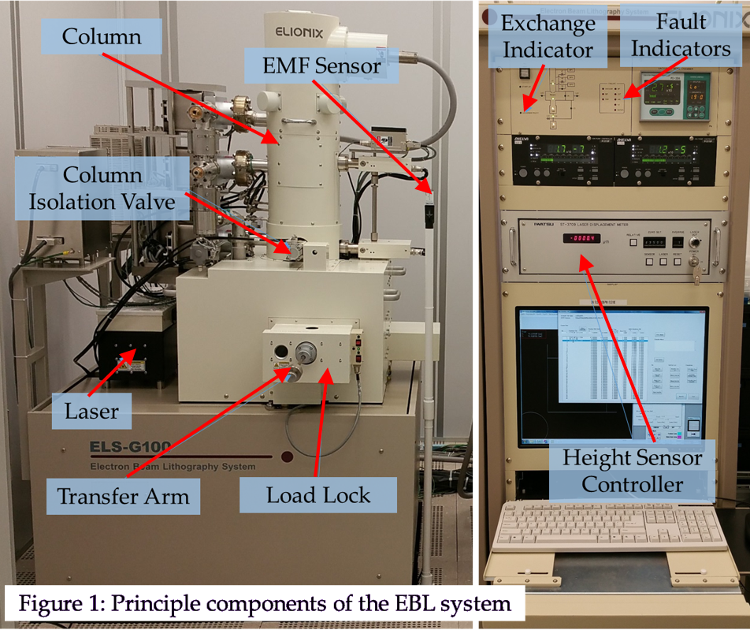{ width="542" }

**Layout of the Elionix Tool Components**

When you get to the machine, the software that controls the Elionix hardware and beam should be running.  If it is not select the “ELS-G100” from the bottom windows tool bar.  An overview of the software is shown in the image below.  Note there are three mail tabs on the right side of the window:

* The “Stage Movement” tab  
* The “Beam Adjustment” tab  
* The “Exposure” tab 

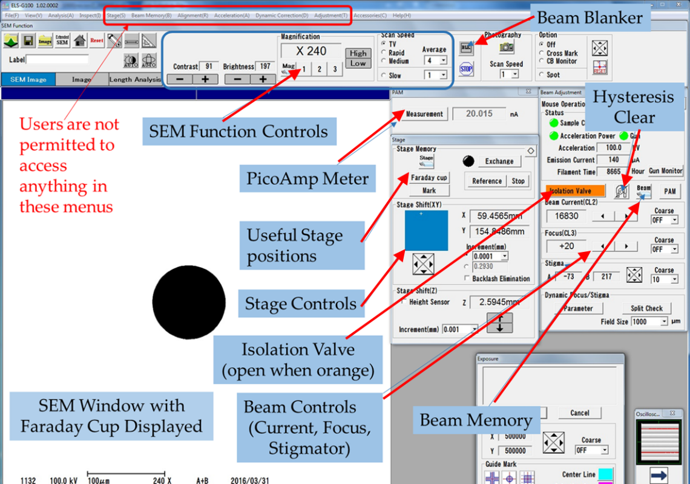{ width="498" }

**Layout of the SEM Window**

---

3. ### **Loading your sample** {#loading-your-sample}

   

* On the Stage Panel click the “Exchange” button.  This will move the stage into alignment with the load lock so that you can load your sample.  When the stage is in position the numbers in the x, y coordinates stop changing.  The circle to the left of the icon will turn green as shown in the panel on the left.     
* The “Exchange Ready” above the Z-Height sensor (above the computer monitor on the hardware) should also be flashing green.   You are now ready to load your sample.  
    
  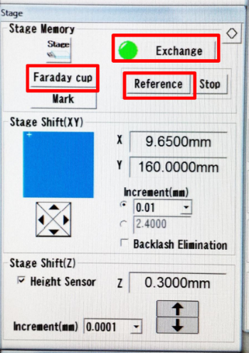{ width="194" }

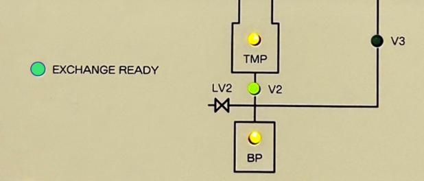{ width="270" }

**Identifying the Exchange Indicators on the tool and the software**

* Mount your sample on the appropriate chuck.  We use the 4” waver chuck or the “multi-piece holder” chuck.  Be sure to secure the grounding clip.  
* Verify the switch for the gate valve is in the closed position.  
* “Vent” the load-lock by flipping the toggle switch upward.  This usually only takes a minute.  When the system is vented the load lock door will easily slide open.    
*  Pull the load-lock door open and mount your holder onto the arm.  The chuck should be held against the load lock door while threading the exchange rod into the chuck.  Be certain that the load-lock arm is tightened after the sample chuck is loaded to prevent movement.  

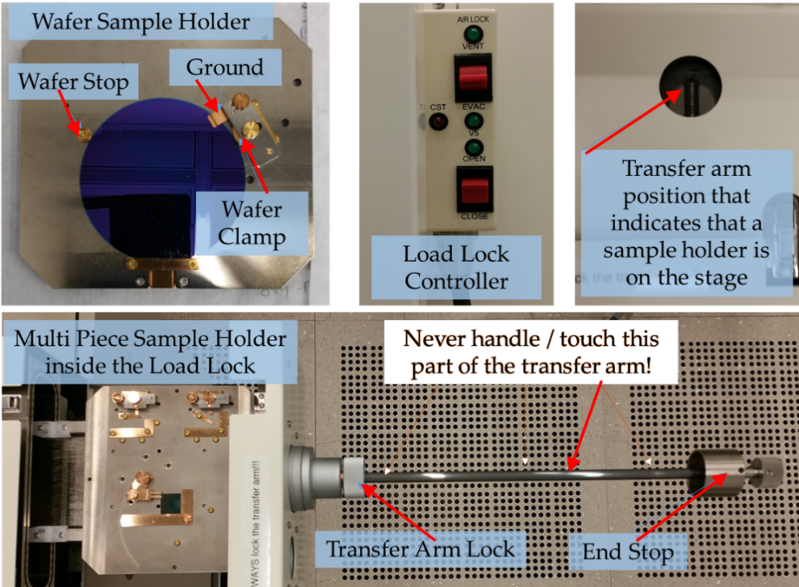{ width="404" }  
**Mounting and loading the sample into the chamber**

* Press “Evacuate” on the load-lock and wait a minute.  It will flash green while evacuating but will be steady green when totally evacuated.  
* Once the evacuate indicator light is steady green you have about 15 seconds to press the lower toggle switch to “open” which opens the load lock gate to the main chamber.  If the light turns off before you open the valve, toggle the switch down to “evacuate” again.    
* Loosen collar on the loading arm.  Insert the rod slowly while you slide it all the way onto the stage.  You will feel some resistance when it reaches the stage but continue until the rod cannot be pushed in any further.    
*  Unscrew the load arm from the chuck (about 6 turns) and pull back until you can see the screw threads in the window of the load lock.  Lock the rod in this position.  This position alerts other users that you have a process running and that there is a sample in the chamber.  
*   Press the bottom toggle switch “close” and the gate will close.  You are now ready to set up the Electron beam for your exposure.

---

4. ### **Preparing the Elionix Beam for Exposure** {#preparing-the-elionix-beam-for-exposure}

#### **Setting the Beam Current** {#setting-the-beam-current}

Now we will pay attention to the “Beam adjustment” screen.  Click on the “Beam” Icon.  This will bring up the “Beam Memory” tab.  Group \[1\] contains recipes for the 120-micron aperture, and group \[2\] contains recipes for the 240 micron aperture.  (Larger beam currents may need the larger aperture).  Each recipe contains preset values for focus, stagnation, brightness and contrast.    

1. Go to the tab that has the recipe that corresponds to the current used to prepare your condition file.   Select the “Recall” radio button, then select the recipe you want.  A screen will pop up that asks you to confirm this choice.  Click ok.  You will see a magnet shaped icon while the magnets are degaussed.  When magnet icon goes away you can close the “Beam memory” screen.

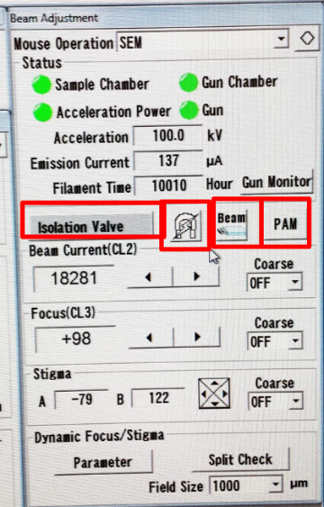{ width="157" }         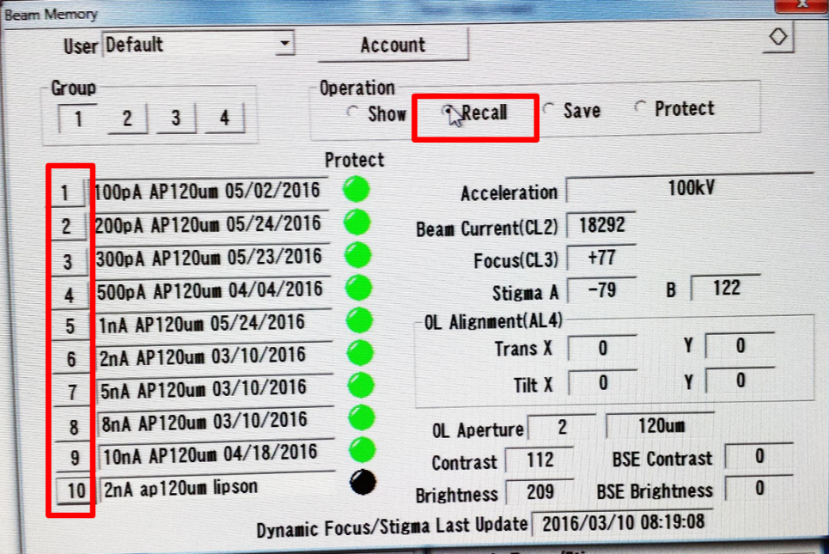{ width="361" }

**Beam Adjustment and Beam Memory windows**

2. Go back to the “Beam Adjustment” panel and click on the “Isolation valve”.  The button will turn orange.  This opens the valve between the electron column and the stage your sample is on.  
3.  Back on the “Stage” panel you will see a button that says, “Faraday Cup”.  Click on this and the stage will move to the Faraday cup position on the stage.    
4. Once the stage stops moving, In the Beam Adjustment panel select the “Measure” Button.  (If you do not see a current value, un-blank the beam by clicking on the black “BLK” button (in top toolbar), which turns white when the beam is “unblanked”.)   If the current is slightly different from the value you entered you can use the right and left arrows next to “beam current” until it reads the correct value for your exposure.  (Note, the right arrow counterintuitively decreases the current, and the left arrow increases it.  Move these values slowly, as the current takes some seconds to stabilize after each change.    
5. After adjusting the current, click on the horseshoe shaped magnet icon to degauss the beam again.  
6.  Blank the beam again using the “BLK” button and deselect the “measure” button.

#### **Adjust the beam focus and stigmation** {#adjust-the-beam-focus-and-stigmation}

 

1. In the “Stage” panel now click on “Reference”.  This will move the stage to the position of an evaporated gold reference sample that is used to correct focus and stigmation.  Once the stage stops moving un-blank the beam again using “BLK” button from the top toolbar.  You will see a low-resolution image (250X) of the gold chip.  Zoom in using the magnification buttons (Top tool bar “High” and “Low”) above the SEM image to a value of 25,000X to 30,000X magnification.  At that magnification you will see a SEM image that looks like the following:

   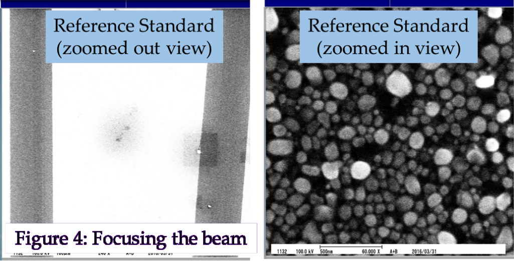{ width="424" }

   

2. To correct focus and stigmation right click on the SEM image with the mouse.  You will see a menu that has “focus”.  Select this and then click in the center of the screen.  A measuring line will appear in the screen.  Moving the mouse left and right will change focus.  Once focused click in the SEM window again to disable the focus command.  
3. To correct stigmation follow the steps above but choose the “stigmation” option when you right click which will bring up a 2-D ruller on the screen.    
4. To exit the focus/stigmation mode, right click in the screen and select “move stage”  
5. You are now finished setting up the beam.  You are ready to run your job.  
   

---

5. ### **Preparing a Schedule File on WECAS** {#preparing-a-schedule-file-on-wecas}

* Copy the Beamer output Folder to your directory From “User in CAD PC” to “Users on-line PC”  
* Open a WECAS screen.  The top toolbar will look as follows:

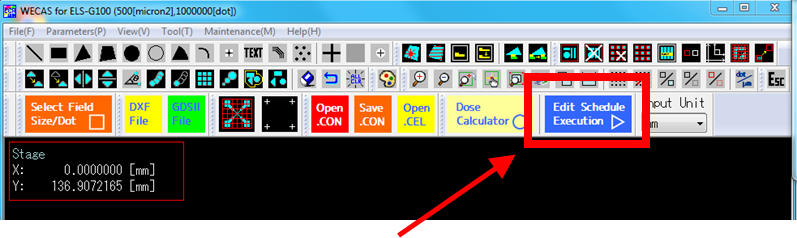{ width="451" }

* Click on the blue “Edit Schedule Execution” button.  The following screen will come up:   
* Clicking on “Initialize Sch List” will clear the previous users schedule file.    
* “Calculate Dose Time” will bring up the window shown below – **The Feed and Scan Pitch should match what you used in the conversion of your CAD file.**   Enter your area Dose and Beam current and click “Calculation” – This gives the shot clock time in µs/dot which you will need next.

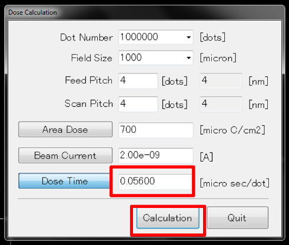{ width="237" }

* Click “Select CON file” (as seen below)  All CON files and the supporting files must be in the same directory.  If you only have one CON file your job will look as it does below.  It is convenient to leave the position shift for now at X \= 0, Y \= 0\.  We will position the pattern on your wafer/piece in a later step.

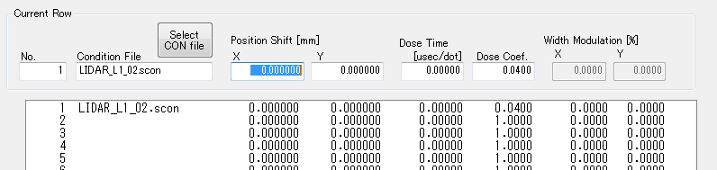{ width="558" }

* Note that “Total Dose Time” \= “Dose  Time” \+ (“Dose Coefficient” \* Factor in .scon).  For some WECAS jobs you may want to set **“Dose Time” \= Calculated Base Dose** and the **Dose Coefficient \= 0\.**  
* Also note that you can make one schedule file that uses multiple CON files and can shoot die at different doses for exposure dose array testing.  For example, the following is what such a schedule file might look like.  This was made using the “Matrix Con File“ button.  Note that there are 2 CON files here, each with 8 different doses at different positions on the wafer.

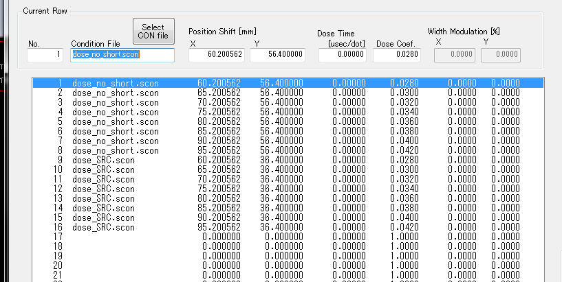{ width="576" }

* Press the Set Options Tab. If alignment is not necessary Set “Registration” to OFF, “Periodic Correction” to OFF and “Width Modulation” to OFF.  The only things that should be active are in the left-hand column under “X/Y Laser” as shown below.  (If alignment is needed, please see Appendix A)   
    
  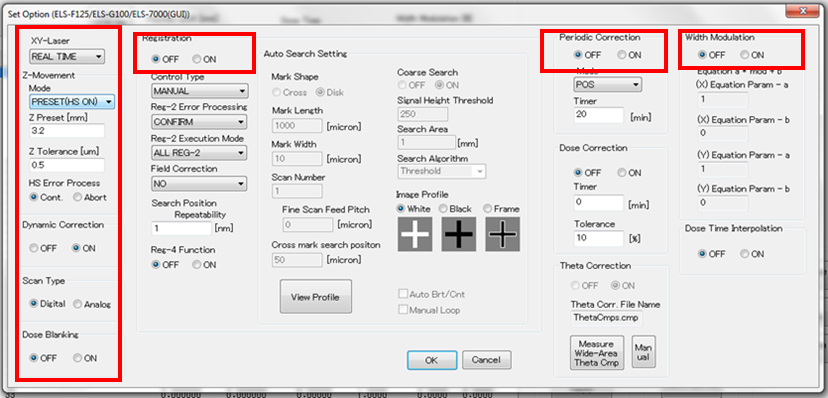{ width="560" }  
    
* The most important parameter in this window is the “Z Preset (mm)” setting for the XY-laser.  This parameter tells the laser displacement meter the height of the substrate.  As of January of 2023 the Z-Preset value for a 500 micron thick Si substrate is \~3.0 mm.  This value will work if your wafer thickness including layers and resist and is is within 200 microns of this value.  If you are working with thinner or thicker substrates you will have to adjust the Z-Preset in the following way:  If it is thicker than 500um you will need to decrease the number.  (For instance: a 750 micron substrate would have a Z-preset of about 2.75mm.    
*   Click “Next” in the Schedule Execution tab.  You will be prompted to save the Schedule file (.SC8 extension) to the same directory your CON files are in.  Change the name else it will save in the directory as “Default”.  The lower left hand corner of your pattern will be at X \= 0 Y \= 0 by default.  You will now see a blue-green tab **“Exp. Graphics”** menu as shown in the image here.

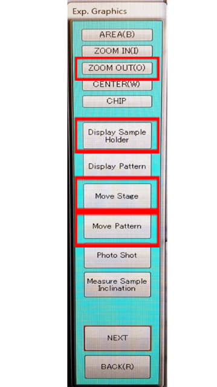{ width="180" }

*  Click “Display Sample Holder” and select the holder you will be using.  We use only the “Multipiece Holder” or the “ 4” Wafer Holder” then Click “Zoom Out” to see the extents of where the sample is held in the Elionix.  If using the multipiece holder enter in the size of your chip so that it shows on the layout screen in proper scale.    
*  Most likely your pattern is not positioned on the wafer/chip.  Click “Move Pattern” and then click at the center position that you want to move the pattern.  This will bring up a dialog box that will offer the option of centering your pattern on the wafer or changing the values to round numbers when positioning on the multi-piece holder.  
*   Click “Next” and since you changed the position of the pattern you will be prompted to resave your schedule file again.  You will then be brought to the Exposure pane in WECAS.  
*  Clicking on the “Calc” button will give you the length of your exposure time to verify all is the same as when you initially converted the job off-line.    
*  Click “Quit” and then “Back” and you will be brought to your modified schedule file which should show you the offsets that show you how your pattern was moved with respect to (0,0).  This completes making your schedule file.  Make certain the folder containing the .scon files, the supporting files and .SC8 files are saved in “User on-line PC”.  

---

6. ### **Exposing the job in WECAS** {#exposing-the-job-in-wecas}

**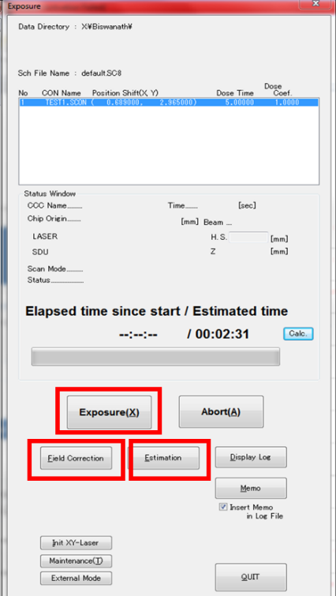{ width="186" }**

1. Click “Next” and check once again the location of the write by choosing “Show Pattern” then “Next” again to get to the exposure tab – as shown to the right  
2. As a sanity check calculate the time for the job.  It should be the same as when you calculated it when writing the job within a few minutes.    
3. Click on the button “Field Correction”.  In the window that pops up click on the “Start” button.  Field correction takes 1-2 tries, about 5 to 10 minutes.  When the start button becomes active you can close the window.  
4. Click on the “Expose” Button too start your job.  It should start within a minute or two.  The field that have been written will show up as white on the exposure screen.    
5. Open the oscilloscope window to watch the fields be written.  If you don’t see it look in the tray at the bottom of the screen.    
   

---

7. ### **Unloading your sample** {#unloading-your-sample}

1. When your job is complete all fields will be white and a pop up widow will tell you it is finished  
2. Click “Isolation Valve” in the beam menu to close it.  The button will turn grey  
3. Click on “Exchange” in the Stage menu to move it into position.  Wait for indicator button to turn green  
4. “Exchange ready” (above the computer monitor) should also be blinking green  
5. Evacuate the load lock🡪open gate valve🡪unlock load arm🡪thread onto sample holder on stage 🡪Remove load arm with sample🡪 Lock the load arm 🡪 Close gate valve 🡪 Vent Load-Lock 🡪 unthread chuck and remove sample 🡪 Place multi-Piece stage in Load Lock thread on load arm   
   1. 🡪 Lock load arm 🡪 Close load lock gate valve🡪 Evacuate the load lock  
6. It is very important to evacuate load lock leaving the load lock under vacuum before logging off the tool.   
7. Log Off the tool in Badger

---

### **Appendix A:  Manual Alignment** {#appendix-a:-manual-alignment}

Now we need to tell WECAS where the alignment marks are, relative to the (0,0) position of your original CAD output by BEAMER.  We Generally use 4 global marks, Denoted A,B,C and D, which are always oriented as shown below:  
        ** 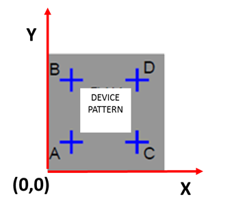{ width="217" }**  
It is useful to create a bounding box in your GDS file that is the size of your chip, or at least encompasses all of your features (including alignment marks) as shown in gray in the image above.  This gives a Lower-left-hand (0,0) (x,y) position, to reference, and you need to program into WECAS the location of the 4 alignment marks with respect to this coordinate system in units of millimeters.

Alignment marks should be crosses 5 µm wide and OA width and height of 1 mm, with a feature at the center that allows for easy alignment.  

	**A.  Modify the Schedule File**

1. You need to tell WECAS that you will be doing alignment when you set up the initial schedule file.  We need to go back to the “Set Option” Button (From Section II Page 3 of this manual) and set values in the “Registration” column (indicated below).  For manual Alignment “Periodic Correction” and “width modulation” remain off \-- These are used only in “Auto” and “Full Auto” alignment modes.  
     
   **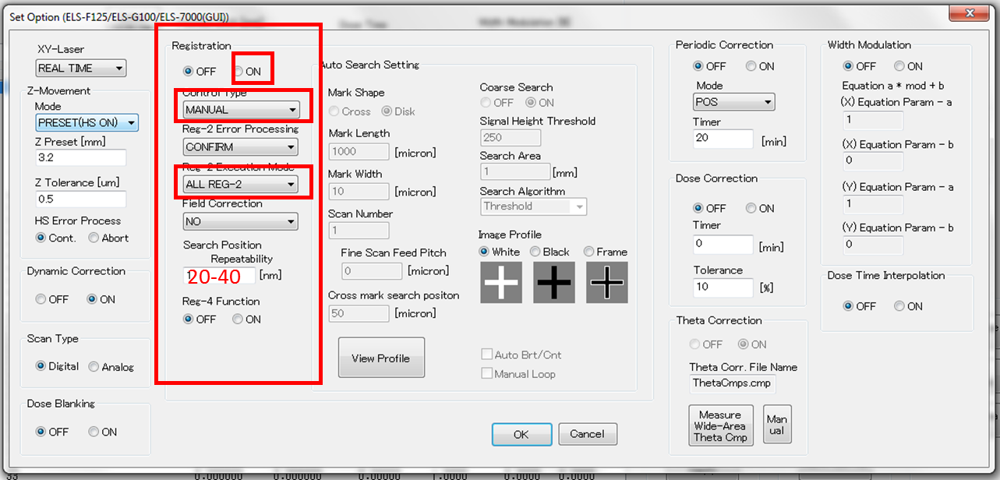{ width="568" }**  
     
2. Click the “ON” radio button in the Registration Panel  
3. Set “Control Type” to “Manual”  
4. Set “Execution Mode” to “ALL REG-2”  REG-2 refers to global marks while REG-4 indicates local marks  
5. Set the “Search Position Repeatability” to 20-50 nm   
6. Open the ASCII .scon file in notepad and add the following line (RS) between the lines PC and PX separated only by commas

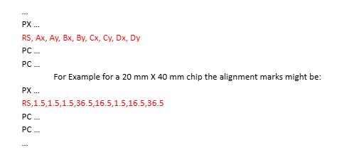  
**Example of modification in the SCON file – Red Text is inserted into the file**

7. Now when you display your schedule file (“Edit Schedule Execution”🡪”Next”) in WECAS you will see white crosses that represent the locations of your alignment marks.    
8. 

       **B.  Load Chip or Wafer and set up Elionix Beam as before in above Sections**

       **C.  Align the Elionix to the “A-Mark” of your sample chip/wafer**

1. From WECAS go to Users On-Line PC then File 🡪 Open Schedule File 🡪 \[SC8 Filename\]  
2. You can get back to the schedule instructions by clicking “back” and then reopen through the “Edit schedule execution”.  You will see your .con files and their locations.    
3. Click “Next” and then “Display Pattern” and then ”Display Sample Holder”  
4. Zoom out to see your pattern  
5. Click on “Move Stage” and then click on the pattern at the center of the Lower-left alignment mark 🡪ie: Mark A.  In the Elionix ELS-G100 software you can watch the stage location change as it moves to the mark.  
6. “Un-blank” the electron beam by clicking on the “BLK” button in the top toolbar.  
7. Find your “A” alignment mark in the SEM window and zoom in and center it using the arrows to move the stage and the crosshairs (Crosshairs activated from the ELS-G100 software)   
8. Click on “Move Pattern” and from the popup menu choose “Read Stage Position”.  Save the new schedule file with these updated write positions.

     **  D.  Start the Exposure following Section IV on “Exposing Job in WECAS”** 

…  
PX …  
RS, Ax, Ay, Bx, By, Cx, Cy, Dx, Dy  
PC …  
PC …  
               For Example for a 20 mm X 40 mm chip the alignment marks might be:  
PX …  
RS,1.5,1.5,1.5,36.5,16.5,1.5,16.5,36.5  
PC …  
PC …  
…

       **E.  Manual SEM Alignment to Marks**

1. After clicking “Expose” in WECAS there will be pop-up windows that ask you to select the center of the mark “A”.  Using a zoomed-in SEM window find the center of the mark in the crosshairs.    
2. Note:  The magnification that you use for Mark A will be the default for B, C, and D. The window needs to be zoomed in enough for accuracy but zoomed out enough to find the mark.  
3. The stage will then move to mark B.  Again, center mark in SEM with the crosshairs and select.  
4. Do this for remaining marks C and D  
5. You will then be asked to select the centers of marks A, B, C, and D again.  The differences will be taken and a screen will pop-up telling you if the marks passed threshold or not.  The algorithm is shown in the figure below.   
6. Even if the marks did not pass your set threshold value you can choose to expose the job.  Else go through the alignment sequence again (The exposure sequence is shown in the figure below)  
7. Expose the Job  
8. When finished unload written sample as usual

## ---

## **Common Issues and Troubleshooting** {#common-issues-and-troubleshooting}

### **Height Sensor Error:** {#height-sensor-error:}

Make certain that the “set option” value is correct (\~3.0 mm for a 5oo um substrate) and that the height sensor is on.

### **Turbo Pump Failure** {#turbo-pump-failure}

If the load lock door is not properly closed when the evacuate switch is toggled, the vacuum pump will fail, often with a loud noise.  This is something that should be prevented against by holding the door firmly shut when pumping down.  

In the event of a pump failure, please make certain that you alert staff directly. 

