<!-- AUTO-GENERATED by scripts/sync_gdocs.py from the Google Doc below. Edit the Google Doc, not this file. -->

# EVG Photomask Aligner

[:material-file-document-outline: Open the Google Doc](https://docs.google.com/document/d/1cds236-fRol1RoqzUvsCR4YPsqeyf5Yum19WReIJFl8/preview){ .md-button }
[:material-file-pdf-box: View PDF](../../assets/pdfs/tools/Mask_Aligner_SOP.pdf){ .md-button }
[:material-download: Download PDF](../../assets/pdfs/tools/Mask_Aligner_SOP.pdf){ .md-button download="Mask_Aligner_SOP.pdf" }

---

# Safety Information and Overview {#safety-information-and-overview}

| Advanced Science Research Center | Graduate Center CUNY |
| :---- | :---- |
| Date | 6/13/2025 |
| SOP Title | Mask Aligner SOP |
| Principal Investigator | Samantha Roberts |
| Department | NanoFabrication Facility |
| Room and Building | ASRC G.263 |
| Primary Phone Number | 2124133399 |

## **Section 1 – Process or Experiment Description** {#section-1-–-process-or-experiment-description}

This SOP is only for the general use of transferring microscale patterns from a photomask, onto a photoresist-coated wafer or substrate using ultraviolet (UV) light. Only approved users are allowed to use the equipment, after passing a qualification with the tool manager. Any maintenance will be done by trained staff members. Some maintenance creates additional hazards which will be described in the Instrument Manual.

\*Note: Any sample preparation is to be done by the user, and this document does not cover any information related to sample preparation. Any materials listed outside of the approved list, must be discussed with the tool manager.  

## **Section 2 – Hazardous Substances** {#section-2-–-hazardous-substances}

**Substance Name:** Mercury

**Abbreviation:** Hg

## **Section 3 – Potential Hazards** {#section-3-–-potential-hazards}

| Hazard | Hazard Sign | Hazard Description |
| :---- | ----- | :---- |
| Bright light | { width="83" } | **Serious eye damage** may occur if viewed directly at light during use |
| UV Radiation | 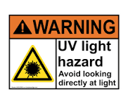{ width="143" } | UV radiation can cause **eye damage.** |
| Thermal  | 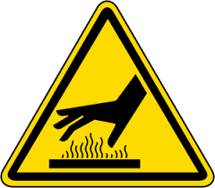{ width="88" } | Hg lamp can get **hot to touch.** |
| Electrical  | { width="80" } | Operate on **high-voltage** systems for light sources and alignment mechanisms. |
| Chemical | 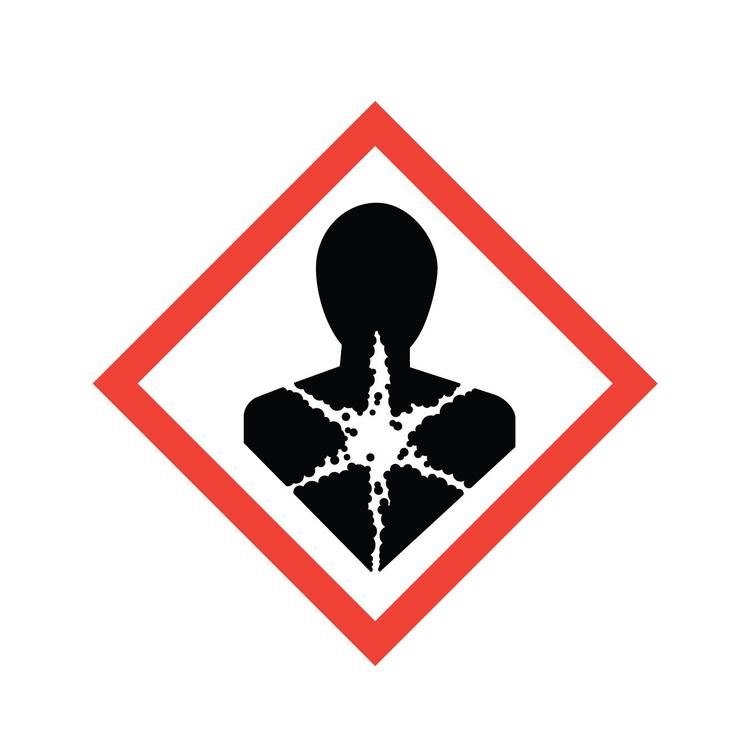{ width="99" } | Photoresists and developers used before and after exposure. Many are **toxic**, **flammable**, or **skin/eye irritants**. |
| Pinching or Crushing | 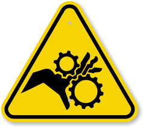{ width="95" } | **Moving parts** such as wafer stage and mask holder. |
| Mercury | { width="99" }{ width="74" }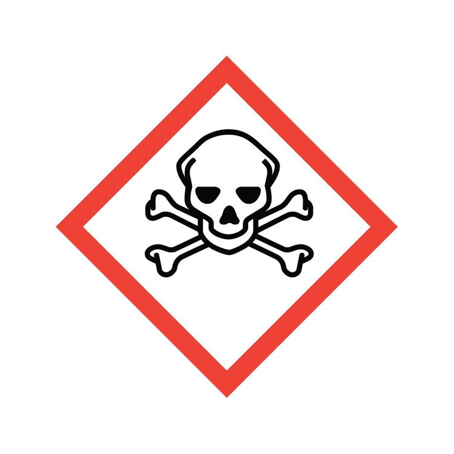{ width="94" } | Mercury vapor and liquid **are highly toxic.**  If the lamp breaks or leaks, it can release elemental mercury, which is: **A neurotoxin** when inhaled.
 **Harmful to kidneys and other organs.
 Dangerous to the environment** if not properly disposed of.  |

## **Section 4 – Routes of Exposure** {#section-4-–-routes-of-exposure}

Eye damage can occur if looking at an exposed area, and not wearing the appropriate protective eyewear. 

Thermal hazard is present if did not wait until the lamp has sufficiently cooled down.

Electrical hazard is present whenever servicing the equipment.

Chemical exposure is present before and after equipment use.

Do not place your hands near any moving parts while the tool is in use.

## **Section 5 – Personal Protective Equipment** {#section-5-–-personal-protective-equipment}

All trained staff members are instructed to use welding goggles whenever doing routine lamp maintenance or inspection. 

All personnel are instructed to not look at exposed areas while in use. 

## **Section 6 – Waste Disposal** {#section-6-–-waste-disposal}

| Hazardous compound, element, or chemical name | State (L,G,S) | Hazardous | Non-hazardous | Which hazards? | How is waste managed? |
| ----- | ----- | ----- | ----- | :---- | ----- |
| Hg Lamp | S | x |  | Solid waste is toxic to environment, aquatic, and human health | Must be collected and disposed of as Hazardous waste  |

# **Tool Operation** {#tool-operation}

Standard Operating Procedure: **Mask Aligner** 

**Hardware Description and Principle of Operation** 

***EVG620 Mask Aligner*** 

The EVG Mask Aligner is equipped with high-resolution top and/or bottom side microscopes for  single or double-side photolithography. An ultra-soft wedge compensation together with a  computer controlled contact force between the mask and wafer ensures that both yield and mask  lifetime are dramatically increased. The system safely handles thick, bowed or small diameter  wafers. The EVG620 superior alignment stage design achieves highly accurate alignment and  exposure results while maintaining high throughput. The system is configured with the NanoAlign  Technology Package, increasing EVG620 aligner microscope resolution by a factor of  approximately 2\. 

Substrate Parameters 

\- Size: pieces up to 150 mm wafers 

\- Thickness: 0.1-10 mm 

Mask Parameters 

\- Size: 5” and 7” 

\- Thickness: \< 7 mm 

Resolution 

\- Proximity: 2 – 4 µm 

\- Soft Contact: 1.5 – 3 µm

\- Hard Contact: 1 – 2 µm 

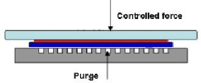  
\- Vacuum Contact: ≤ 0.8 µm 

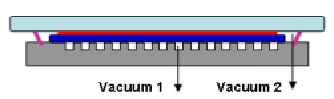  
\- Vacuum \+ Hard Contact 

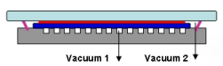{ width="225" }\+  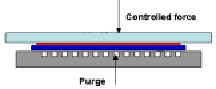

Material Requirements 

Equipment: substrate, tweezers, photomask, wafer chuck and mask holder Personal Protective Equipment: nitrile gloves and face mask 

**Procedure** 

Estimated Time: 30-45 minutes 

*System Pre-Checks* 

1\. Check to ensure the Hg-Arc lamp is ON by slightly moving the lamp viewport window  shutter for the minimum amount of time to see if the light is ON. If the lamp is OFF, contact  NanoFab staff. 

2\. Check to ensure the lamp power supply LCD displays are within the following spec limits.  If the displays are out of range, contact NanoFab staff. 

a. Lamp Temperature: 155°C-180°C 

b. Lamp Power: 350 ± 3 W 

c. N2 Pressure: 6 ± 0.5 barr 

*Create Recipe* 

*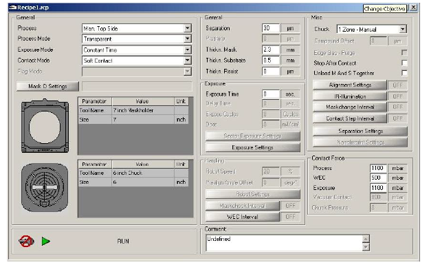*  
1\. Press **New Recipe** under the RECIPES tab. 

2\. General 🡪 Process: Main recipe parameter for process selection. 

a. Select Bond Processes, Top Side Processes or Bottom Side Processes 3\. General 🡪 Process Mode: As there are two products which must be aligned to each other,  the process mode allows to select the alignment mode which should be used. a. Select Transparent, Crosshair or Overlay 

i. Transparent: Substrate could be aligned to a transparent mask. 

ii. Crosshair/Overlay: During alignment, the mask pattern could not be seen  as the substrate is not transparent. 

4\. General 🡪 Exposure Mode: For processes which need exposure to a substrate, different  exposure modes can be used. 

a. Select Constant Dose, Constant Dose – Interval, Constant Time, or Constant Time  – Interval 

5\. General 🡪 Contact Mode 

a. Select Hard Contact, Proximity, Soft Contact, Vacuum Contact, or V+H Contact 6\. General 🡪 Mask Holder 

a. Select

7\. General 🡪 Chuck 

a. Select 

8\. General 🡪 Separation: Distance used during the alignment process step. a. Input \> 30 µm 

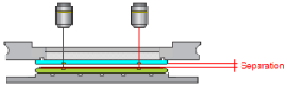  
9\. General 🡪 Proximity: Distance used during the exposure sequence 

a. Input desired distance.  

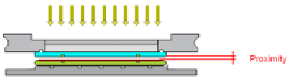  
10\. General 🡪 Thickn. Mask: Mask thickness. 

a. Input mask thickness. (2.3 mm for most quartz masks) 

11\. General 🡪 Thickn. Substrate: Substrate thickness. 

a. Input thickness of substrate. 

12\. General 🡪 Thickn. Resist: Resist thickness.  

a. Input estimated thickness of photoresist. 

13\. Exposure 🡪 Exposure Time: Time which is used for exposure on the substrate. 14\. Exposure 🡪 Delay Time: Delay used for interval exposure between exposure cycles.  15\. Exposure 🡪 Exposure Cycles: Allows changing the number of exposure cycles if interval  exposure has been selected. 

16\. Exposure 🡪 Dose: UV-Dose used for exposure on the substrate. 

17\. Press **Save Recipe As** 🡪 Enter desired file name 🡪 **Save** to save recipe.  *Run Process – Top Side Alignment* 

1\. Open recipe by pressing **Open Recipe**. Select desired recipe. 

2\. Press **RUN **in the lower left portion of the recipe screen. 

3\. Tool will instruct: “Begin Process – Press \<Continue\> Or \<Exit\>”.  

a. Press **Continue**. 

4\. Tool will instruct: “Configure Optic And Press \<Continue\>”. 

a. Verify that the objective lens are installed.  

b. Press **Continue**. 

5\. Tool will instruct: “Insert Maskholder And Press \<Continue\>”.

a. Verify that the mask holder is installed by verifying the inscription on the frame:  “MASKHOLDER 5””. This mask holder should always be installed in the tool.  b. Press **Continue**. 

6\. Tool will instruct: “Fix Maskholder And Press \<Continue\>”. 

a. Ensure that the mask holder is fixed by screwing the three thumbs finger tight. b. Press **Continue**. 

7\. Tool will instruct: “Insert Chuck, Connect Vacuum And Press \<Continue\>”. a. Place appropriate chuck on stage.  

b. Connect vacuum hose to the chuck. 

c. Press **Continue**. 

8\. Tool will instruct: “Insert Loadframe And Press \<Continue\>”. 

a. Place load frame on the tray.  

b. Press **Continue**. 

9\. Tool will instruct: “Insert Mask And Press \<Continue\>”. 

a. Place mask chrome side down and align the edge with the white tray bumpers. b. Press **Continue**. 

10\. Tool will instruct: “Move Tray In”. 

a. Gently move tray in.  

11\. Tool will instruct: “Move Stage In Center Position And Press \<Continue\>”. a. Reset all micrometers to zero. Center position for each micrometer is labeled.  Insure the zero mark is at the top of the number scale.  

b. Press **Continue**. 

12\. Tool will instruct: “Adjust Microscope and Press \<Continue\>”. 

a. Changes to the recipe can be made by switching to the RECIPE tab on the right  side. 

b. Adjust the optics by using the joystick knob for X and Y motion. Rotate knob for Z  axis adjustments. Click on **\[L\]** and **\[R\]** optic icons to move objectives  independently. Adjust left and right camera brightness and contrast as needed. c. Adjust the theta micrometer to correct for mask to optics roation.  

d. Once the mask is aligned, press **Continue**.  

e. If no alignment necessary, press **Continue**. 

13\. Tool will instruct: “Move Tray Out”. 

a. Gently pull the tray out.  

14\. Tool will instruct: “Remove Loadframe And Press \<Continue\>”. 

a. Remove the load frame. 

b. Press **Continue**. 

15\. Tool will instruct: “Insert Substrate For WEC And Press \<Continue\>”. a. Load substrate with resist side face up.  

b. Press **Continue**. 

16\. Tool will instruct: “Move Tray In”. 

a. Gently push the tray in. 

17\. Tool will instruct: “Adjust Substrate And Press \<Continue\>”.

a. Changes to the recipe can be made by switching to the RECIPE tab on the right  side. 

b. Adjust the focus by rotating the joystick.  

c. Use the joystick and micrometers to align the sample to the mask.  

d. Press **Sep/Cont** to verify alignment when mask comes into contact with the  substrate. 

e. Press **Continue**.  

18\. If Stop After Contact is checked **YES**, tool will instruct: “Check Contact Mode And Press  \<Continue\>”. 

a. If substrate is still aligned to the photomask, press **Continue**.  

b. If alignment has shifted and press **Undo**.  

i. Adjust alignment. Press **Sep/Cont** to ensure alignment after contact.  

1\. If alignment fails, minimize the separation parameter.  

ii. Press **Continue**.  

iii. Repeat *Step 12*. 

19\. After exposure, tool will instruct: “Move Tray Out”. 

a. Gently move tray out. 

20\. Tool will instruct: “Remove Substrate And Press \<Continue\>”. 

a. Remove substrate.  

b. Press **Continue**. 

21\. Tool will instruct: “End Of Process – Press \<Continue\> Or \<Exit\>”. 

a. Pressing **Exit** will start the sequence for unloading the mask. 

b. Pressing **Continue** will allow you to load another sample. 

i. Repeat sequences until all samples are complete. 

22\. After pressing **Exit**, tool will instruct: “Insert Loadframe and Press \<Continue\>”. a. Place the load frame on the tray. 

b. Press **Continue**. 

23\. Tool will instruct: “move Tray In”. 

a. Gently push tray in. 

24\. Tool will instruct: “Move Stage In Center Position And Press \<Continue\>”. a. Reset all three micrometers to zero. Insure the zero mark is at the top of the  number scale.  

b. Press **Continue**. 

25\. Tool will instruct: “Move Tray Out”. 

a. Gently pull tray out.  

26\. Tool will report: “End Of Process – Press \<Continue\> Or \<Exit\>”. 

a. Press **Exit**. 

27\. Remove the mask from the load frame.  

28\. Close the recipe. Decide whether to save the changes or not and select a response  accordingly.  

*Run Process – Bottomside Alignment*

1\. Select the following options for an existing or new recipe: 

a. Process: **Man Bottomside** 

b. Process Mode: **Crosshair** 

2\. Select **Run **on the recipe window. 

3\. Repeat *Step 3 – Step 11* of *Run Process – Top Side Alignment*. 

4\. Tool will instruct: “Remove Loadframe and Press \<Continue\>”. 

a. Remove load frame. 

b. Press **Continue**. 

5\. Tool will instruct: “Move tray in”.  

a. Gently move tray in.  

6\. Tool will instruct: “Adjust Microscope to Mask and Press \<Continue\>”. a. This step is for FOCUS ONLY. Rotate the joy stick to focus the lens.  b. Press **Continue**.  

7\. Tool will instruct: “Adjust Crosshair and Press \<Continue\>”. 

a. Using the trackball, click on the crosshair and drag it to the center of the mask  alignment mark for crosshair overlay on each side. Adjustments can be made to  the length and width of the crosshairs from the control menu.  

b. Press **Continue**. 

8\. Tool will instruct: “Move tray out”. 

a. Gently move tray out.  

9\. Tool will instruct: “Insert Substrate and Press \<Continue\>”. 

a. Load substrate with resist side face up.  

b. Press **Continue**. 

10\. Tool will instruct: “Move tray in”.  

a. Gently move tray in.  

11\. Tool will instruct: “Align Substrate and Press \<Continue\>”. 

a. Align substrate to crosshairs by using the micrometers.  

b. Press **Continue**.  

12\. If Stop After Contact is checked **YES**, tool will instruct: “Check Contact Mode And Press  \<Continue\>”. 

a. If substrate is still aligned to the photomask, press **Continue**.  

b. If alignment has shifted and press **Undo**.  

i. Adjust alignment. Press **Sep/Cont** to ensure alignment after contact.  1\. If alignment fails, minimize the separation parameter.  

ii. Press **Continue**.  

iii. Repeat *Step 12*. 

13\. After exposure, tool will instruct: “Move tray out”.  

a. Gently move tray out. 

14\. Tool will instruct: “Remove Substrate and Press \<Continue\>”. 

a. Remove substrate.  

15\. Repeat *Step 21 – Step 28* of *Run Process – Top Side Alignment*.

**Emergency Stop** 

*Critical* 

\- If the tool is smoking or a gas leak has occurred, press the EMO button if possible and  leave the cleanroom.  

*Non-Critical* 

\- If exposing, press joystick to break the exposure sequence.  

\- Press **Undo** to start the sequence of unloading substrate and photomask.  

**Allowed Activities** 

\- You can use tape on the chucks but be careful not to get it on the chuck o-ring. 

**Disallowed Activities** 

\- Don’t look directly at the UV light. 

\- Do not change the objective lens.  

\- Don’t touch the lamp controls.  

**What to watch out for during operation** 

\- When adjusting the micrometers, gently rotate. Aggressive rotation shifts the stage off  center.  

**Common Troubleshooting Tips** 

\- If vacuum is low and not picking up photomask: 

o Clean topside of photomask with IPA.  

o Ensure that the stage is centered by adjusting the micrometers. 

o Unscrew and remove the mask holder.  

▪ Check for missing o-rings. 

▪ Wipe the bottom side of the mask holder with IPA.  

\- If alignment shifts after performing Sep/Con, decrease the separation. 

**When to call staff?**  

\- Lamp is off. 

\- Computer is turned off. 

\- Tool is shut down.  

\- Lamp temperature/pressure is out of range.  

\- N2 pressure is out of range. 

\- Vacuum error is still occurring after attempting common troubleshooting tips. 

**Badger Criteria** 

*Report Problem:* 

1\. Vacuum error. 

*Shutdown:* 

1\. Lamp is off. 

# **Common Errors and Troubleshooting\-** 

---

 {#common-errors-and-troubleshooting-}

Prepared by: Salam Elhalabi  
Date: June 13, 2025  
Reviewed/Revised:   
Salam Elhalabi  

