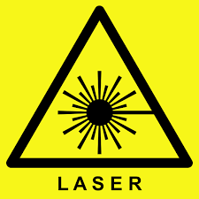
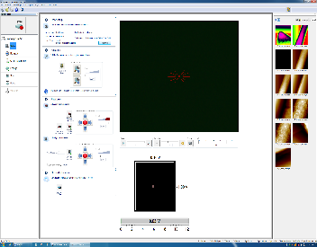
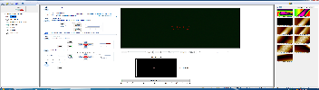
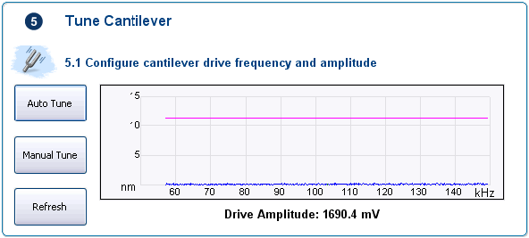
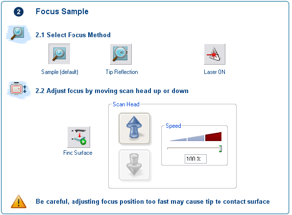
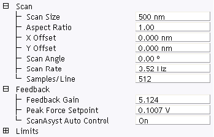
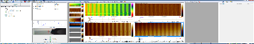

<!-- AUTO-GENERATED by scripts/sync_gdocs.py from the Google Doc below. Edit the Google Doc, not this file. -->

# Atomic Force Microscope

[:material-file-document-outline: Open the Google Doc](https://docs.google.com/document/d/1vWchHUJWEjEPmC7fhBNWyf3IMGcx8EHeKd0mEAQ3X0c/preview){ .md-button }
[:material-file-pdf-box: View PDF](../../assets/pdfs/tools/AFM_SOP.pdf){ .md-button }
[:material-download: Download PDF](../../assets/pdfs/tools/AFM_SOP.pdf){ .md-button download="AFM_SOP.pdf" }

---

Standard Operating Procedure: **AFM**

Table of Contents: 

# Section 1 – Process or Experiment Description

This Standard Operating Procedure (SOP) outlines the proper use of the Bruker Dimension FastScan AFM. The Bruker AFM provides high speed topographic imaging without loss of resolution or force control. The system is capable of measurements on both large and small size samples in air or fluids. The FastScan module generates on the fly atomic force microscopy images.

FastScan Scanner: ScanAsyst, Nanomechanical Mapping, TappingMode (air & fluid), PhaseImaging, Contact Mode, Lateral Force Microscopy, Lift Mode, MFM, EFM, Force Spectroscopy, Force Volume

Icon Scanner: ScanAsyst, TappingMode (air), Contact Mode, Lateral Force Microscopy, PhaseImaging, Lift Mode, MFM, Force Spectroscopy, Force Volume, EFM, Surface Potential, Piezoresponse Microscopy.

All standard laboratory safety protocols must be followed throughout this procedure. While not all safety rules are explicitly stated within this SOP, they are covered in the required safety training sessions that must be completed prior to beginning any lab work. For instance, all personnel must wear appropriate lab attire, including an approved lab coat, safety goggles, closed-toe shoes, and clothing that covers all exposed skin, including the legs. A copy of the laboratory’s minimum safety requirements can be found in the SOP binder for reference.

# Section 2 – Hazards General

| Hazard | Hazard Sign | Hazard Description |
| :---: | :---: | ----- |
| Laser Hazard  | { width="47" } | AFMs typically use a **low-power laser** (often Class 1, 2, or sometimes 3R) that is directed at the back of the cantilever and reflected onto a photodetector. During probe/sample alignment users may be exposed to the beam either directly or via reflections. |
| Electrical Shock Hazard High Voltage present | { width="68" } | High voltage is present during AFM setup. Ensure the "High Voltage" light is OFF before installing the Z-piezo to the FastScan head. Failure to follow this procedure may result in **electrical shock** and serious injury. |

# Section 3 – Routes of Exposure

N/A

# Section 4 – Process Steps

## 4.1. Working Instructions

### 4.1.1 System Power up & Probe Setup

1. Open the NanoScope software.   
2. Select an experiment. The various scanning modes and their subcategories can be selected from the experiment menu. Then **Click Load Experiment**.  
3. When the workflow toolbar appears, select **Setup** and then **Load Probe** in the Probe Setup submenu.  
4. Select probe that will be used from the drop-down menu and click **Move to Probe Loading Position**. This will move the stage away from the head so that the probe holder can loaded/unloaded.   
5. Adjust the laser spot on the recommended size (small/large) using the laser adjustment switch located on the right side of the FastScan head. 

6. Remove the Z-Piezo from the Fastscan Head.  
7. Secure the Z-Piezo to the FastScan probe mounting block. Then follow the instructions to mount the probe on Z-Piezo scanner as shown below.

8. On the scanner, make sure the “High Voltage” light is off and the vacuum switch is turned off before continuing. Remove the Z-piezo from its support and attach it to its scanning head. Ensure the High Voltage light is OFF  prior to installing the probe holder. Failure to do so could result in electrical shock.  
9. Ensure the Z-piezo fits snugly onto the head and seals by gently manipulating with two fingers until you feel it ‘Click’ into place.  
10. Switch on the vacuum and plug in the connector to the scanner.  
      
    NOTE: If the Z-piezo is not installed correctly, issues will arise later during imaging.  
       
11. Click **Return and Save Changes** to be brought back to the **Setup** menu.  
12. The cantilever must be brought into focus. This can be done by using the Up/Down focus controls in the Focus Tip submenu. It’s best to zoom in on the tip(2x or 3x magnification setting) before attempting to bring the edges of the tip into sharp focus.

NOTE: Adjustments can be made to optimize the view by zooming in or out on the video control, as well as increasing or decreasing the illumination.

13. Calibrate the laser position so that the laser reticle shown in the UI matches that of the actual laser spot. Once complete, optimize laser position and auto-align the photodetector. The vertical target is generally set to 0.0 V but in uncommon cases may need to be adjusted depending on your sample and the experiment. 

14. Choose the tip location. The actual location of the tip must be selected for the most accurate measurements. If you are uncertain, you can find SEM micrographs of each Bruker tip on the Bruker website.

15. Depending on the scanning mode, you may need to tune the cantilever which can be done using Auto Tune.

{ width="347" }

### 4.1.2. Loading your sample

1. Load the sample on the circular wafer sample chuck. The circular wafer sample chuck can be manually rotated for ease of loading the sample.  
2. Click on **Navigate** in the Workflow Toolbar. Move your sample below the scanning head.  
3. Using the trackball and/or the Focus Sample submenu, bring the scanning head towards the surface of your sample. Focus on your sample surface. If the sample is transparent or reflective, use the Tip Reflection focus method instead of the default.

{ width="409" }

WARNING: Be very careful when focusing on the surface using the Z motor. Set speed to a low speed to reduce the risk of damage to the head, probe, and sample.

4. Use the stage direction controls to move the sample around until the desired imaging area is centered in video window.  
   

### 4.1.3.Sample Measurement

1. Prior to engaging the surface, click on **Check Parameters** in the Workflow Toolbar. Set scan size 500nm and offsets 0 nm for not to damage the tip uring the engage. { width="239" }  
2. Close the AFM acoustic and vibration isolation enclosure. Once ready, click **Engage** to begin the scan. The parameters can be adjusted during the scan but should be done with caution as it can destroy the sample or tip.  
3. Image capture can be done using Capture Now, or Capture Continuous. It is recommended to select Capture Continuous. The file name and directory can be changed at any time.

4. To scan another sample, move to a new sample location, or quit the experiment, select **Withdraw** from the Workflow Toolbar.

### 4.14. Unloading Sample and Shutdown Tool

1. To end your session, click on **Setup**, and then **Load Probe**. Select **Move to Probe Loading Position** in order to move the stage to a safe location for probe removal.  
2. Open the AFM acoustic and vibration isolation enclosure. Remove the sample from stage.  
3. Make sure the High Voltage light is off before proceeding. Turn the Z-Scanner Vacuum switch to OFF. With one hand, securely hold the perimeter of the Z-Piezo. With the other hand press the **Z-Scanner Release** button, located on the scanner. Once the Z-piezo is removed, disconnect the connector from the scanner.  
4. To remove the probe, follow the directions loading the probe in reverse. Leave the Z-piezo back to the FastScan head.  
5. Exit the Nanoscope software.  
6. Clean up the work area

# Section 5-Allowed Activities

Users are only allowed to do what is recommended in the SOP. 

# Section 6-Disallowed Activities

Users should not attempt to calibrate the tool. If they do not believe the tool is properly calibrated they should inform the cleanroom staff.

# Section7-What to watch out for during operation

* Ensure the High Voltage light is not illuminated prior to installing the probe holder. Failure to do so could result in electrical shock.  
* Use caution when focusing on the surface using the Z motor. Always move the probe away from the surface initially and check the speed. Set speed to a low speed to reduce the risk of damage to the head, probe, and sample.  
* Handle the AFM head with extreme care\! Any impact to the head may cause severe damage to the piezos, which are very expensive to repair/replace.

# Section8-Common Troubleshooting Tips

If you get an error for laser alignment error, make sure that laser is aligned on the back of the cantilever, not the probe substrate. If the laser is aligned on the probe substrate, you will still get a good sum value of the photodetector, but the sum won’t drop off rapidly in all directions and the probe will crash into the surface when engaging. 

# Section9-When to call staff? 

If the stage is not working or the Nanoscope software fails to start, or if there is an error with another stage service or startup errors.

# Section10-Badger Criteria 

*Report Problem:Shutdown:*

If the above error occurs, inform the staff and report in the Badger.

