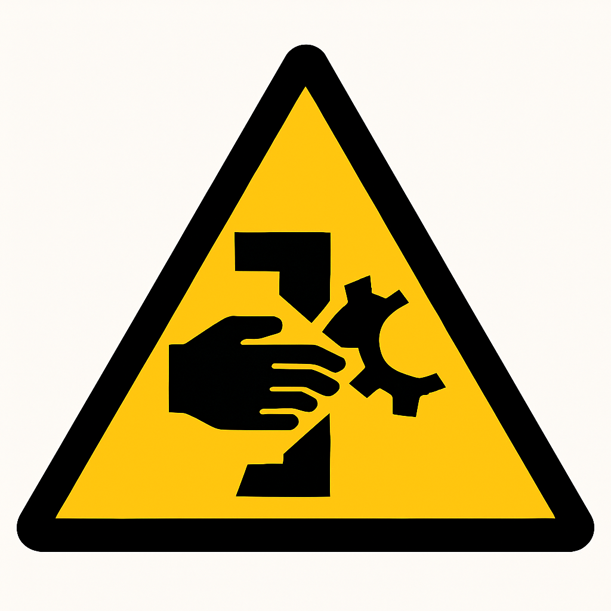
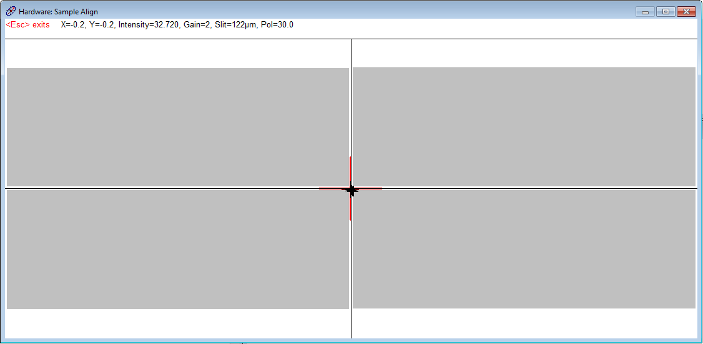
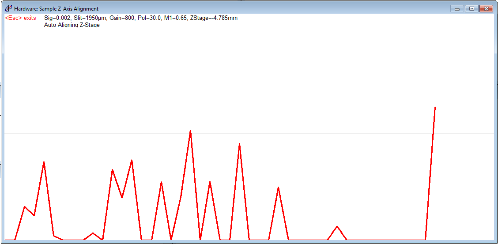

<!-- AUTO-GENERATED by scripts/sync_gdocs.py from the Google Doc below. Edit the Google Doc, not this file. -->

# Woollam V-VASE Ellipsometer

[:material-file-document-outline: Google Doc](https://docs.google.com/document/d/1beyiXEaJvjsNaPcidsnvz1DwOyGI37BpkUN3oCp7gmo/preview){ .md-button }
[:material-file-pdf-box: View PDF](../../assets/pdfs/tools/Ellipsometer_SOP.pdf){ .md-button }
[:material-download: Download](../../assets/pdfs/tools/Ellipsometer_SOP.pdf){ .md-button download="Ellipsometer_SOP.pdf" }

---

**Standard Operating Procedure: J.A. Woollam V-VASE Ellipsometer** 

# **Section 1 – Process or Experiment Description** {#section-1-–-process-or-experiment-description}

This Standard Operating Procedure (SOP) outlines the proper use of the J.A. Woollam V-VASE Ellipsometer. Ellipsometry is a sensitive measurement technique that uses polarized light to characterize thin films, surfaces, and material microstructure by determining the relative phase change in the beam of reflected light.  Ellipsometry can be used to determine optical constants (n, k or ε1, ε2), thin film thickness, doping concentration, surface and interfacial roughness, alloy ratio, crystallinity, optical anisotropy, and depth of profile of material properties.

All standard laboratory safety protocols must be followed throughout this procedure. While not all safety rules are explicitly stated within this SOP, they are covered in the required safety training sessions that must be completed prior to beginning any lab work. For instance, all personnel must wear appropriate lab attire, including an approved lab coat, safety goggles, closed-toe shoes, and clothing that covers all exposed skin, including the legs. A copy of the laboratory’s minimum safety requirements can be found in the SOP binder for reference.

# **Section 2 – Hazards General** {#section-2-–-hazards-general}

| Hazard | Hazard Sign | Hazard Description |
| :---: | :---: | ----- |
| Mechanical Hazard Pinch Point | { width="81" } | The act of scanning your sample can cause the stage to move outward and rotate. Keep hands and fingers clear of sample stage while making measurements. |

# **Section 3 – Routes of Exposure** {#section-3-–-routes-of-exposure}

            N/A

# **Section 4 – Process Steps**

## **4.1. Working instructions**  {#4.1.-working-instructions}

### **4.1.1 System Power Up** {#4.1.1-system-power-up}

1. Turn on the power for the system if it is not ON.  
2. Turn on the monochromator.  
3. Turn on the power for the lamp and then press and release the ignite button. The lamp should ignite after a few seconds. You should allow the lamp to warm up for at least 15 minutes before using the system to perform measurements.   
   1. Note: The system uses an IR-Vis fiber optic cable between the monochromator and the polarizer, which has a spectral range of 300-1700 nm. There also is an IR-Vis-UV fiber optic cable with a spectral range of 240-1700 nm, but with an absorption band at 1350-1430 nm, which is better suited for UV measurements. If you want to use that cable ask the cleanroom staff to change it for you. Do not attempt to adjust or change the fiber optic cable without staff assistance.  
4. Start the WVASE32 software on the computer and navigate to the hardware window.   
5. Initialize the system: **Hardware window \-\>initialize.**   
   Enter a username when prompted to do so.   
6. Insert the alignment detector in the polarized light source if it is not already in place. Be careful whenever handling the alignment detector, especially when inserting it. Be sure the pins are aligned and connected correctly so they are not bent or broken in the process.

###      **4.1.2.  Loading your sample and alignment** {#4.1.2.-loading-your-sample-and-alignment}

1. Place calibration wafer on the sample holder. The sample size switch on the side of the sample holder should be set to large for large wafers or small for small samples and then set the vacuum switch from vent to vacuum to hold the wafer in place.   
2. Click on **Acquire Data-\>Align Sample** from the menu bar. You’ll be prompted to insert the alignment detector and then to adjust the positioning of the wafer; click **OKAY** when prompted to do so.   
3. Adjust the alignment of the sample by turning the two knobs on the back of the sample holder. You need to center the red cross in the display while equalizing the intensity among the four quadrants. The X and Y values both need to be between \-1 and 1, as close to 0 as possible. Press **Esc** when you are finished.   
   { width="547" }  
     
4. Click **OKAY** when prompted to do so and then the system will then automatically align the z-stage.   
     
   { width="547" }  
   

### **4.1.3.  System Calibration** {#4.1.3.-system-calibration}

   

   

1. Once the alignment is complete, click on **Acquire Data-\>Calibrate System** from the menu bar.  
2. Set the range of wavelengths to your desired range and then perform a coarse calibration followed by a fine calibration. Once it is finished the system should say “**Hardware Initialized and Calibrated”.**  
3. Turn the vacuum switch to vent and remove the calibration wafer. 

###            **4.1.4 Collect Measurement Data** {#4.1.4-collect-measurement-data}

1. Place the sample to be measured on the sample holder. The sample size switch will need to be set to large or small depending on the size of your sample before you set the vacuum switch from vent to vacuum to hold the wafer in place. If you can hear any suction from the vacuum, you need to adjust the sample so that it is flat to the sample holder and that it covers the whole are of the vacuum.  
2. If you are trying to measure a precise spot on your sample you can determine where the beam will hit your sample using the system camera. Open the camera software on the computer and then adjust the focus knob on the camera until it is focus on your sample surface. Move your sample on the sample holder until the desired area is within the circle in the camera window.   
     
3. Align the sample in the same manner you aligned the calibration wafer. **A sample alignment needs to be performed every time you change samples in order to insure good measurements.**  
     
     
4. Set up a measurement by clicking on **Acquire Data-\>Spectroscopic Scan** from the menu bar. There are a lot of options for the spectroscopic scan, such as the range of wavelengths and angles of incidence of the light to be scanned, not to mention other settings for measuring other properties of the sample. You should consult a WVASE manual to better understand all of the measurement options available to you.  
     
   1. Note: It is important to know what data you will need. The more data you collect the longer the measurement process will take.   
   2. Note: Aside from the typical Spectroscopic Scan, you may also acquire data using Dynamic Scan or R\&T Data.   
      1. Dynamic Scan allows a user to acquire time dependent ellipsometric data with a wavelength range specified as a continuous range or as up to 9 discrete wavelengths, though at only one angle of incidence.  
      2. R\&T Data allows a user to acquire intensity reflection and transmission data from a single point on a sample.   
      3. You should consult a WVASE manual to better understand all the measurement options available to you.

   

### **4.1.5.  Save data** {#4.1.5.-save-data}

   

You should save your data to your own folder in the NanoFab01 network drive. Enter any comments that you think will help to distinguish the data you collect from any other data. 

###           **4.1.6. Focusing Probes (Optional)** {#4.1.6.-focusing-probes-(optional)}

1. Click on **Focusing Probe Alignment** under Acquire Data.  
2. Confirm that the alignment detector is already installed in the polarized light source.   
3. There are two focusing probes, one for the polarized light source and one for the detector, each labeled accordingly. Align the probes so the three screws on each probe line up with the three holes on the source and the detector. The labels on the probes should face out towards you. Be careful not to touch or scratch the lenses on the narrow ends of the focusing probes.   
     
4. Fasten the screws to secure the probes and then continue with the alignment.  
5. Adjust the knobs on the polarized light source so that the red cross in the display is center and the intensity among the four quadrants are equal. The X and Y values both need to be between \-1 and 1, as close to 0 as possible. Press **Esc** when you are finished.  
6. Adjust the knobs on the detector to maximize the intensity of the detected signal. Press **Esc** when you are finished.   
7. The Hardware window should say “Focusing Probes ARE Present”.

Note: Using the focusing probes restricts the angles of incidence that can be measured to a range of 40°-77°.

###      **4.1.7.Unloading sample and Shutdown Tool** {#4.1.7.unloading-sample-and-shutdown-tool}

1. Remove the sample from the stage by turning the switch from vacuum to vent.  
2. Close the WVASE32 software.  
3. Close the camera software if you used it.   
4. If another user is scheduled to use the ellipsometer that day, you should leave the monochromator and lamp on. If you are the last user for the day, turn off the power to the lamp and then turn off the power to the monochromator.  
   

###     **4.1.8.Data Analysis** {#4.1.8.data-analysis}

1. To perform analysis of the data measured, the data should be transferred to another computer with the WVASE32 software so that the ellipsometer can be used by another user. Transfer your data files to the NanoFab01 network drive. Do not use a flash drive or the internet on the ellipsometer computer.  
2. Consult the WVASE32 software manual and J.A. Woollam website to determine the best methods for modeling and fitting your experimental data.

# **Section 5- Allowed Activities** {#section-5--allowed-activities}

No restriction on materials to be characterized.

# **Section 6-Disallowed Activities** {#section-6-disallowed-activities}

**DO NOT** leave the lamp and monochromator on once the measurements have completed for the session.

# **Section 7- What to watch out for during operation** {#section-7--what-to-watch-out-for-during-operation}

Make sure that Z-stage alignment completes without any error.

# **Section 8 \- Common Troubleshooting Tips** {#section-8---common-troubleshooting-tips}

If the Z-stage alignment fails, turn off the monochromator and turn it on again. It sometimes fails to start in first attempt.

# **Section 9- When to call staff?**  {#section-9--when-to-call-staff?}

Contact staff if the-stage alignment fails.

# **Section 10- Badger Criteria**  {#section-10--badger-criteria}

*Report Problem:*

1. If the stage alignment fails. Report this in Badger and send a message to staff. 

