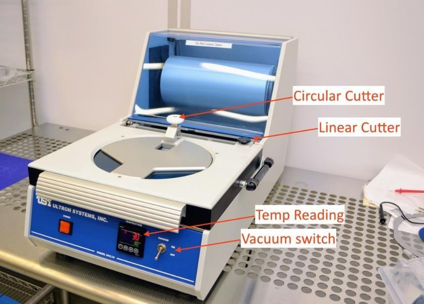
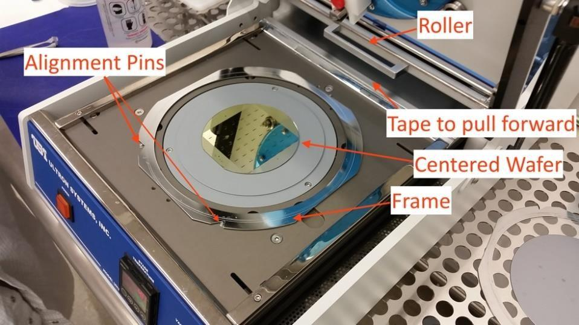
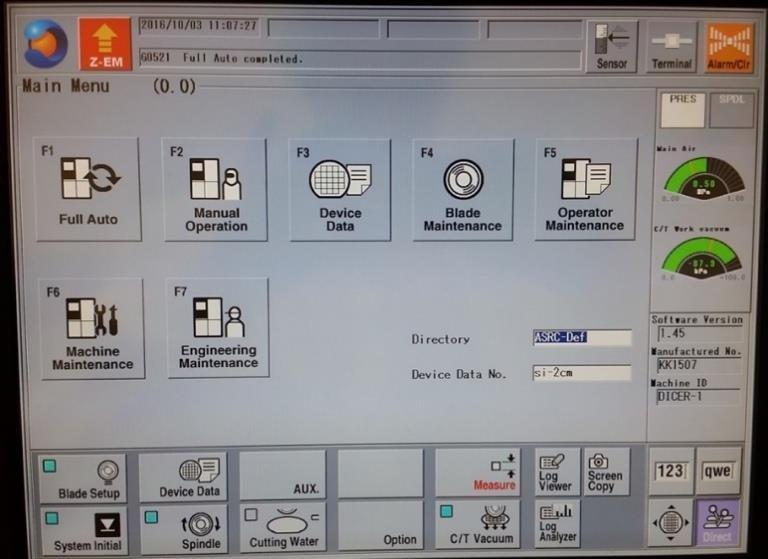
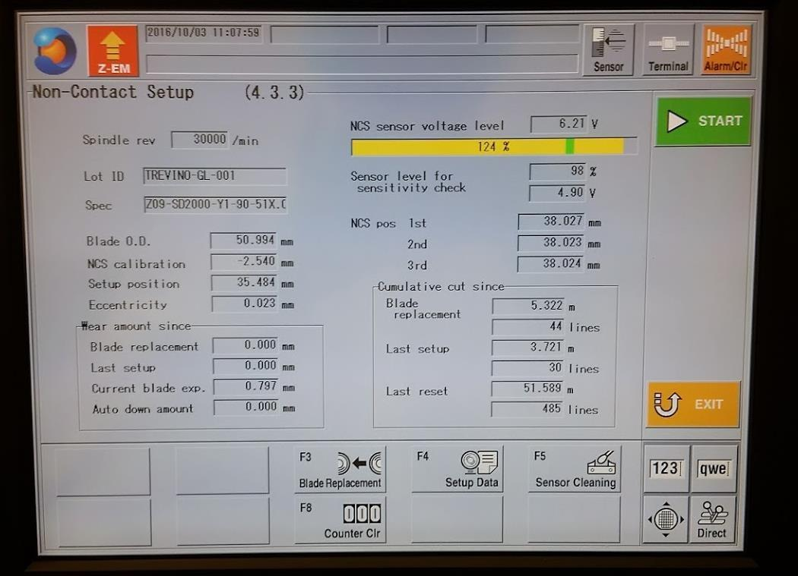
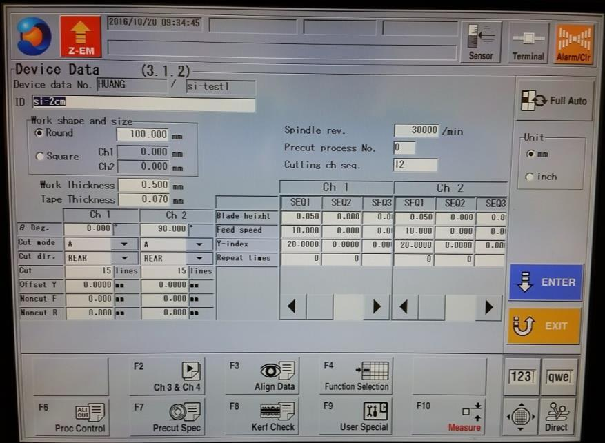
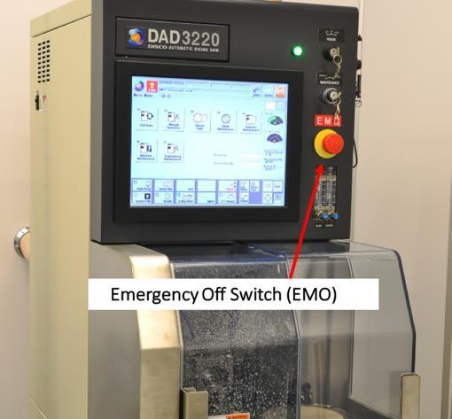
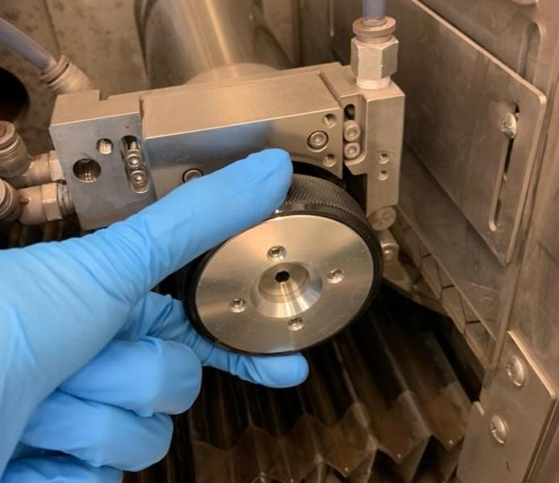
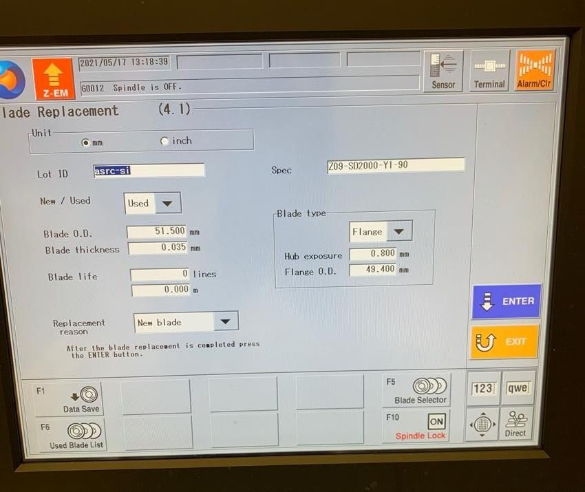

<!-- AUTO-GENERATED by scripts/sync_gdocs.py from the Google Doc below. Edit the Google Doc, not this file. -->

# Disco Dicing Saw

[:material-file-document-outline: Google Doc](https://docs.google.com/document/d/1HBfsM3Lt2x3310cCUOhnfu8L6NcT_e4XFyvLrq5oJIs/preview){ .md-button }
[:material-file-pdf-box: View PDF](../../assets/pdfs/tools/Dicing_Saw_SOP.pdf){ .md-button }
[:material-download: Download](../../assets/pdfs/tools/Dicing_Saw_SOP.pdf){ .md-button download="Dicing_Saw_SOP.pdf" }

---

## **Facility and Contact Information** {#facility-and-contact-information}

**Disco Dicing Saw – DAD3220 SOP** 

| Nanofabrication Facility | ASRC, RFCUNY |
| :---- | :---- |
| **SOP Title** | **Disco Dicing Saw** |
| **Director** | **Samantha Roberts, PhD** |
| **Manager** | **Shawn Kilpatrick** |
| **Room & Building** |  **G263, NanoFab, ASRC** |

## **Section 1- Hardware Description and Principle of Operation** {#section-1--hardware-description-and-principle-of-operation}

### **Disco DAD3220 Dicing Saw** {#disco-dad3220-dicing-saw}

The Disco Dicing Saw is a single spindle dicing saw, capable of handling work-pieces up to a maximum of 6” square or 6” in diameter. The system features an LCD touch panel, auto- alignment, auto-focus, and auto-kerf check functions for enhanced productivity. The 1.5 kW spindle features a shaft lock function for easy blade changes.

An Ultron Systems tape mounter and a UV curing system are to be used in conjunction with the dicing saw.

**Principle of Operation:**

The DAD3220 operates on the principle of mechanical sawing using a rotating diamond blade under controlled conditions. Here's the general working principle:

**Mounting**: The wafer or substrate is mounted on a dicing tape and secured to a dicing frame.

**Alignment:** The system uses optical cameras and alignment marks to define the cutting path (X and/or Y directions).

**Blade Rotation:** A high-speed spindle rotates a diamond-coated dicing blade, typically at 20,000–30,000 RPM.

**Cutting:** The wafer is moved under the rotating blade using precision X-Y stages, while the Z-axis controls the blade depth to cut only through the wafer without damaging the tape.

**Cooling and Debris Removal**: Deionized (DI) water is sprayed during cutting to cool the blade and wafer, reduce particle generation, and flush away debris.

**Automatic Operation**: It can perform programmed dicing sequences using recipe settings for cut depth, blade speed, feed rate, and step size.

### **Ultron UH114 Tape Mounter** {#ultron-uh114-tape-mounter}

The Ultron Tape Mounter mounts wafers to dicing tape and a metal frame to be used with the Disco Dicing Saw. Diced pieces are held in place by the tape until the dicing process is complete. The mounter has an easily adjustable spring-loaded roller assembly, along with film-tensioner bars along the x- and y-axes to ensure bubble-free lamination of the film to the wafer and film frame. Additionally, the UH114 features an adjustable cutting pressure and roller pressure to accommodate various tape base materials and thicknesses. A digital temperature controller ensures consistent work stage temperatures for repeatable mounting.

### **Ultron UH102 UV Release System** {#ultron-uh102-uv-release-system}

The Ultron UV Release System exposes the dicing tape to UV radiation making the adhesive less sticky. This allows you to more easily remove your diced wafer or chip. You can vary the exposure time to get the desired stickiness after exposure.

## **Section 2- Potential Hazards** {#section-2--potential-hazards}

| Hazard | Hazard Sign | Hazard Description |
| :---- | :---- | :---- |
| Electric Shock | { width="80" } | Tools operates with High voltage components |
| Mechanical  Hazard  | { width="129" } | Rotating blades at very high speed can cause serious cuts or amputations.  |
| Slips and Falls | { width="75" } | Water overspray or leaks around the tool can make the floor wet and slippery, increase the risk of falls. |

## **Section 3- Routes of Exposure** {#section-3--routes-of-exposure}

| Route | Description | Risks |
| ----- | :---- | :---- |
|  { width="97" }
Inhalation | Breathing of aerosolized wafer particles (Si, GsAs, metal oxides) Volatile compounds from wafer residual | Allergic, respiratory irritation. GaAs can damage lung in long term exposure |
| { width="101" } Skin Contact | Direct contact with dicing slurry, DI water Blade edges, adhesive tape and cutter | Irritation,  Allergic Cuts or abrasion |
| { width="100" } Eye Contact | Slurry splashes during cutting or cleaning Particles ejection from wafer or blade cracking | Eye irritation, Injury Discomfort |

## **Section 4 \- Personal Protective Equipment** {#section-4---personal-protective-equipment}

Material Requirements

**Personal Protective Equipment**: nitrile gloves, safety glasses, Frock, Hairnet and Shoe Cover

**Equipment**: substrate, Ultron UV tape (Part Number: 1020R-11.0; Thickness \= 95 µm), tweezers, razor/box cutting blade and dicing blade

## **Section 5- Standard Operating Procedure** {#section-5--standard-operating-procedure}

### **Tape Mounter \- Mount Wafer on Film Frame** {#tape-mounter---mount-wafer-on-film-frame}

*{ width="488" }*

1. The Tape Mounter power is kept ON and at 25°C at all times. If you have developed a process at a different temperature, you can adjust the controller on the front of the tool. Remember to turn the temperature back to 25°C when you are done mounting your wafer.

2. Place the wafer face down in the tape applicator, aligning the wafer with the straight-line grooves while centering it using the concentric circular grooves as guides.

{ width="421" }

3. Center a film frame around the wafer, aligning the wafer frame notches with the three silver pins on the mounter surface. Film frames are kept on the wire rack to the left of the tape mounter table.

4. Flip the toggle switch on the front of the tape mounter from OFF to ON. This turns on the vacuum to both the wafer and the frame.  
5. Pull tape over the wafer and film frame, without touching either, and affix to front and rear edges of the frame.  
    1. Note: Make sure tape is not too wavy and look for any cloudy/discolored spots on the tape overtop of the wafer to be mounted. If there are sections of cloudiness, pull additional tape so that is clear of the wafer.  
6. Pull the roller by the handle from the back of the tool to the front slowly.

7. Push roller slowly over the wafer and film frame back and forth 2-3 times to assure good adhesion. You can smooth out bubbles, in most cases, with your fingers.  
8. Return roller assembly to its not-in-use position.

9. Close hinged top.

10. Push down lightly on the Linear Cutter knob and slide it left to right and back left to the home position, while holding slight downward pressure. This cuts the tape from the roll.  
11. Push down lightly on the Circle Cutter knob and go around four times; if the Film Frame is old and heavily scored, you may need to go around more than once, but don't do this more than is necessary.  
12. Open hinged top.

13. Carefully, lift up tape trimmings, pulling radially outwards to prevent lifting up tape from Film Frame, in case there are spots where it hasn’t been cut through. Sometimes it is helpful to hold down the frame at the edge, while peeling the excess tape off.  
14. Turn the vacuum toggle switch to the OFF position.  
    

15. Lift out framed wafer. Use provided finger recesses in chuck to do so.

16. Discard the excess tape in the trashcan.

17. Leave the power to the tool ON.

### **Start Up Tool** {#start-up-tool}

1. Turn the start key switch at the top right (front) of the tool to START, then release to the ON position.  
2. Wait for the tool to finish its boot-up cycle. *2-minutes.*

3. Press **SYSTEM INITIAL** key to initialize the system. *Bottom left of the MAIN MENU**.***

   

***{ width="349" }***

4. Press **BLADE SETUP** at the bottom left of the screen.

5. In the Non-Contact Setup menu that comes up, press **START**.

{ width="378" }

1. The machine will now measure the blade position 3 times.

    2. When complete, the message “G0030 Setup Complete. (\*.\*\*\*mm consumed)” appears at the top. “\*.\*\*\*” indicates the blade wear amount since the last measurement. Normally, this value is 0 \+/- 0.002, prior to cutting.

    3. If the blade wear is out of spec, the system will automatically alarm. If this happens, do not proceed and notify staff that the blade needs to be changed.  
6. Press **EXIT** to return to the MAIN MENU when complete.

7. Mount and center your framed wafer on the chuck table with the wafer facing up.

8. In order for the wafer to be well centered, align the frame notches to the two pins towards the back of the tool. Make sure the frame notches are flush against the pins.

9. Press **C/T VAC** to turn on the vacuum.

###  **Setup Device Date File** {#setup-device-date-file}

DEPTH OF CUT \= WORK THICKNESS \+ TAPE THICKNESS – BLADE HEIGHT

1. From the MAIN MENU, press the **DEVICE DATA** key. Select your device data file using scroll keys in the section of the keypad to the right of the numeric keys.  
    1. Right scroll key moves you from the directory-name list to the file-name list. Up/Down scroll keys move you up and down through the alphanumerically sorted list.  
2. If you haven’t created one yet, select any file and copy it (**F2**) to the “Users” folder and give it an 8-character-limited name.  
    1. For alphabetic characters, press **SHIFT** to toggle between the dual functions of the keys. When the indicator light above the shift key is lit, you’re in character-entry mode.  
3. Locate the file you just named in the directory and select it.

4. Press **ENTER** to open file for editing.

    { width="421" }

    1. If editing, the fields to watch out for are:

        1. SPINDLE REVOLUTION: 30000 RPM is right for most uses. Do not change without consulting staff first.  
        2. CUT MODE: A, with no sub-indexing

            1. Note: Contact lab staff for information about other programming operations.

        3. CUT DIRECTION: rear or front.

        4. WAFER SHAPE: round or square. If a wafer is round, select ROUND and enter the diameter of the wafer (100mm \= 4” wafer). If a chip, select SQUARE and enter dimensions that are slightly larger than your chip.  
        5. WORK THICKNESS: enter known wafer thickness, accurate within \+/- 0.100-mm (0.004-in.).  
        6. TAPE THICKNESS: for our tape, it is 0.095-mm (95-µm).

        7. BLADE HEIGHT: if singulating dices on your wafer, use a height of 0.050- mm.

        8. Y-INDEX CH1/CH2: enter the center-to-center spacing between dices, orthogonal to the CH1/CH2 cut direction.  
        9. FEED SPEED: for silicon, the range is 10-20 mm/s; for glass, the range is 1-2 mm/s.  
    2. Press **ENTER** to save the data. Note: Data is not saved until you press enter and there are no yellow highlighted fields.

### **Wafer Alignment** {#wafer-alignment}

1. From the DEVICE DATA page, press **FULL AUTO** at the top of the screen.  
2. Press **MANUAL ALIGNMENT**.

3. Wafer 9-o’clock position will come under the view of the high-magnification camera.

4. Adjust lighting/brightness.

5. Run Auto Focus.

    1. Press and hold down **F8** key until “Auto focus started” is displayed at the bottom of the screen. Alternatively, go to the FOCUS ADJUSTMENT screen, by briefly pressing **F8**, and choosing from the whole slew of softkey actions displayed along the bottom of the screen. Remember to exit that screen when done.

6. If the wafer surface is still not visible after “Auto focus completed” is displayed, try adjusting the lighting by going to the lighting adjustment screen (**F7**). The F-key actions (displayed along the bottom of the screen) are self-explanatory. Remember to exit this screen, when done, but do not press **EXIT** twice or the program will exit Manual Alignment without completing it.  
7. The next step is to align the θ orientation of the chuck so the saw x-axis is parallel with the singulation streets.

    1. Find one end of a singulation street or alignment mark on the far-left side of the wafer and align its centerline with the crosshairs on the screen using the **SCAN** keys.  
        1. Note: At any time, you can change the magnification from High to Low via the **CHANGE MAGNIF** button. But final adjustments should always be made at high magnification.  
    2. Press **ALIGN θ** and the table moves to the opposite end of your wafer along the x-direction. Machine prompts you to “Select a target for the θ adjustment then press F5 key”.

    3. Find your street (it may be off-screen) with the scan arrows and align the screen crosshairs with its centerline.  
    4. Press **ALIGN θ** and the table returns to its starting position but with the table rotates so as to “level” the two points.  
    5. Re-align the crosshairs with the centerline of the street and repeat the above steps to fine-tune the adjustment. The last prompt on the screen should read “θ adjustment done”. At this point, the screen also read “Match the hair line to the street and press ENTER”.  
    6. If you accidentally press any of the θ keys before completing the next two steps, you will have to re-align θ. When this is the case, the screen prompt will read “Adjustment θ”.  
8. Align the hairline on the screen to the location of the first cut on the wafer. If you left the cut direction as “Rear”, then align the hairline to the bottom most street. This will be the location of the first cut and the tool will index up (towards the rear of the tool) the values you put in for the index, for the number of cuts you previously entered.

    1. Note: The tool requires the last stage move to be in the upward direction (towards the rear). Ensure the last movement was made by pressing the up-arrow key, or you will receive an error message asking you to do so on the next step.

9. Press **ENTER** as the alignment for the current channel is completed.

10. The machine will rotate the table to the next (higher-numbered) channel’s orientation, relative to the current orientation, and prompt you to do the same for this channel.

11. After aligning θ and aligning the hairlines for CH2 and pressing **ENTER**, the system will jump back one level to the FULL AUTOMATION screen.

### **Run Recipe** {#run-recipe}

1. Immediately following MANUAL ALIGNMENT, start cutting by pressing **START**.

2. Pause it by pressing **START** and machine will stop after it finishes the current cut and will position the cut just made under the microscope for your inspection. You may jog only x and y stages without disturbing where the next programmed cut will be made when cutting is resumed with a press of the **START/STOP** key.  
3. If blade breakage is detected and operation is paused, notify staff.

Note: Apart from adjusting the blade height by \+/- 0.100 mm, changing feed speed, or changing the next cutting position, you cannot modify the operation unless you first abort the operation.

### **Unload Sample** {#unload-sample}

1. When cutting is complete, the tool will play the audible alarm. Press **ALRMCLR** at the top right of the screen to stop the alarm.  
2. Open the sliding door where the workpiece is located.

3. Press **C/T VAC** to release the diced wafer/frame.

4. Blow off the excess wafer with the N2 gun located near the tool.

5. Remove the workpiece. Avoid splashing water outside of the tool as the power outlet to the tool is next to the tool.  
6. Blow off remaining water on the chuck/table and then close the door.

### **Shutdown Tool** {#shutdown-tool}

1. Press **EXIT** button until you are at the MAIN MENU.

2. Press **BLADE SETUP** at the bottom left of the screen.

3. In the Non-Contact Setup menu that comes up, press **START**.

4. After blade wear is measured, press **SYSTEM INITIAL** to initialize the system.

5. Switch power key switch to the OFF position. Note: Machine will go through its power- down sequence.

### **UV Release** {#uv-release}

1. Press the orange square **POWER** button on the top right side of the tool IF the tool is not powered on. Wait for it to boot up.  
2. Open the lid, place the frame/wafer with the wafer facing up, aligning the pins to the slots in the frame and then close the lid.

3. The Display Screen should be “READY”. If not, contact staff.

4. Press the blue **TIME** button near the display.

5. The Display Screen will now read “EXPOSURE TIMEXXX”, where “XXX” is an exposure time in seconds.  
6. Using the keypad, enter an exposure time up to 90 seconds long (ex. 090).

    1. Note: An exposure of 120 seconds will remove most of the stickiness of the tape. For those who would like the tape to remain somewhat sticky after exposure, use a time of 45 seconds or less.  
7. When you have completed entering the desired exposure time, press the blue **TIME** button again to set it. The Display Screen will read “READY” again.  
8. To start the exposure, press the round green **START** button at the top right of the tool.

    1. The tool will cycle through a “PREEXPOSE PURGE” and then the exposure, displaying a countdown during the process – “EXPOSURE TIMEXXX”.  
9. When complete, the tool will again display “READY”.

10. You can now open the lid and remove the frame/wafer.

11. If additional exposures are required, the process above can be repeated.

12. Leave the power to the tool ON.

### **Cleanup and Waste Disposal** {#cleanup-and-waste-disposal}

1. Discard unwanted diced substrate in the sharps container.

2. Discard of tape in the trashcan.

3. Return Film Frame on wire rack.

## **Section 6- Safety and Emergency** {#section-6--safety-and-emergency}

**Emergency Stop**

***Non-critical stopping procedu**re*

* Cutting may be interrupted immediately by pressing the red **Z-EM** key: spindle will be raised to 10-mm blade height, chuck table will be returned to x-origin position (i.e. its center position, under the microscope), alarm will sound and cutting will be halted, but cutting water will keep flowing.

    * In this case: Turn off the alarm and press **CUT WATER** key to stop DI water from being wasted.

    * From this point, inspect the wafer, before resuming cutting. When cutting is resumed it will restart at the last, halted, index (y) position.

***Critical emergency stopping procedure***

*{ width="222" }*

* The Emergency Off Switch (EMO switch) is a large red button below the key switches, shown in the picture below. The EMO switch should only ever be pressed in the event of imminent or current danger to the user.  
    * This button should never be pressed to stop an operation for any other reason.

    * If pressed, do not attempt to restart the tool. Contact staff immediately.

**Allowed Activities**

* Users may coat wafers with cured photoresist prior to dicing. This is encouraged, as it helps keep the surface clean of debris from the cutting process, as the resist can be lifted off in solvents after dicing.  
* Except when in the middle of a cutting operation, pressing the **EXIT** key enough number of times will eventually lead back to the MAIN MENU.  
* A cutting operation may be paused at any time by pressing the **START/STOP** key. The machine will complete its current cut, then bring the middle of the cut under the high- magnification camera screen for inspection. During this pause, the only way to modify the current operation is by pressing either the **HAIRLINE ADJ** or **CUT POS ADJUST** softkey; avoid pressing these keys when in the STOP CORRECTION screen for inspection purposes. Cutting operation will resume from where it left off with the press, again, of the **START/STOP** key. To abort the cutting operation, press the **SOFT OPERATION** softkey.

**Disallowed Activities**

* Changing blades without prior staff permission.

* Cutting materials other than standard substrates without consultation of staff.

    * Standard substrates include silicon and glass wafers with thickness between 50- 700 µm-thick.

    * Non-standard substrates will likely require special blades and cutting parameters. Staff and Disco will help you pick the correct blade for your particular application.

**What to watch out for during operation**

* Common causes of blade breakage:

    * The wafer is not centered on the chuck, so the blade plunges vertically into the wafer as it begins its cut, instead of 10 mm before the edge of the wafer, based on the size of the wafer entered in Device Data.

    * The wafer dimension entered in Device Data is smaller than actual. Blade breaks for the same reason as in the preceding case. It does not hurt to specify dimensions 5% greater than actual.

    * The FEED SPEED is set too high for the depth of cut for the particular blade and material.

    * The Blade Breakage Detector is set too low for the blade and by forcing it down over the blade prior to adjustment.

* Water flow rate:  
    * Blade: \< 0.3

    * Blade shower: 0.3 – 1.0

**Common Troubleshooting Tips**

* At any point, if the alarm goes off, read the error message on the screen to know what the alarm is about, before pressing the **ALRMCLR** key to silence it.

**When to call staff?**

* The tool errors with any kind of water flow error. Do not continue processing and contact staff immediately.  
* The blade fails the non-contact measurement for any reason. Do not continue processing and contact staff immediately.

* The tool errors with any blade errors. Do not continue processing and contact staff immediately.  
* The blade cuts into the chuck. Do not continue processing and contact staff immediately.

* Any of the water nozzles are bent, broken or touching the substrate during cutting. Do not continue processing and contact staff immediately.

**Badger Criteria**

**Report Problem:**

1. Tool errors involving damage, worn, or broken blades.

**Shutdown:**

1. Tool error involving water issues.

2. Tool error involving broken or damaged water nozzles.

3. Tool error involving chuck damage.

**Version History:**

1. Created 1.0 – December ,2017  
2. Revision 1.1 – January,2021   
3. Revision 1.2 – June 2025

## **Section 7 – Blade Change Procedure** {#section-7-–-blade-change-procedure}

**Turn On Tool**

1. Turn the start key switch at the top right (front) of the tool to START, then release to the ON position.  
    2. Wait for the tool to finish its boot-up cycle. *2-minutes.*

        3. Press **SYSTEM INITIAL** key to initialize the system. *Bottom left of the MAIN MENU**.***

        4. Press **BLADE SETUP** at the bottom left of the screen.

        5. In the Non-Contact Setup menu that comes up, press **START**.

            1. The machine will now measure the blade position 3 times.

            2. When complete, the message “G0030 Setup Complete. (\*.\*\*\*mm consumed)” appears at the top. “\*.\*\*\*” indicates the blade wear amount since the last measurement. Normally, this value is 0 \+/- 0.002, prior to cutting.  
            3. If the blade wear is out of spec, the system will automatically alarm. A new blade will need to be installed.

*Blade Change*

1. Press **BLADE REPLACEMENT** on the bottom tool bar. If in the main menu, the blade replacement button is F4.  
2. Wait for spindle to turn off. Open left splash cover.

3. Remove the shower arm by unscrewing the clamping screw.

4. Affix nut demounting jig onto the flange lock nut. Turn counterclockwise until the flange lock nut is removed.  
    1. Press down on the center of the demounting jig release the clamps that attaches onto the flange lock nut.

        { width="304" }

5. Remove flange.  
6. Carefully remove existing blade and place in its case. Makes sure it is dry before closing the blade case.  
    1. Handling the blade should be done with the flat part or inner edge, not the outer edge.  
7. Clean flange with IPA and blow dry with the nitrogen gun.

8. Add new blade to the flange making sure it is sitting correctly on the flange.

9. Wipe the blade mount clean with IPA and blow dry with the nitrogen gun. Mount blade mount as parallel as possible to the flange.  
    1. If the blade mount is mounted unevenly, pressure to even it out may snap the glass blade.

10. Wipe the wheel mount clean with IPA and blow dry with the nitrogen gun. Mount the wheel mount by rotating the mount clockwise on the flange until it is finger tight. Insert the torque driver bit into the center hole of the lock bolt. Turn the torque driver clockwise twice (two clicks).  
11. Mount the shower arm and screw the clamp screw finger tight.

12. Save old blade data by pressing **DATA SAVE** on the bottom tool bar.  
13. Enter used blade ID. Press **ENTER**.

    1. Silicon blade: asrc-si

    2. Glass blade: asrc-gl

14. Upload new blade data by pressing **USED BLADE LIST** on the bottom tool bar.

{ width="374" }

15. Select desired blade data. Press **ENTER**.

16. In the blade replacement screen press **EXIT**.

17. Perform blade setup.

18. Change tool blade status sign to reflect the installed blade.

19. If installing a new blade, the blade needs to be dressed.

20. Perform hairline alignment.

