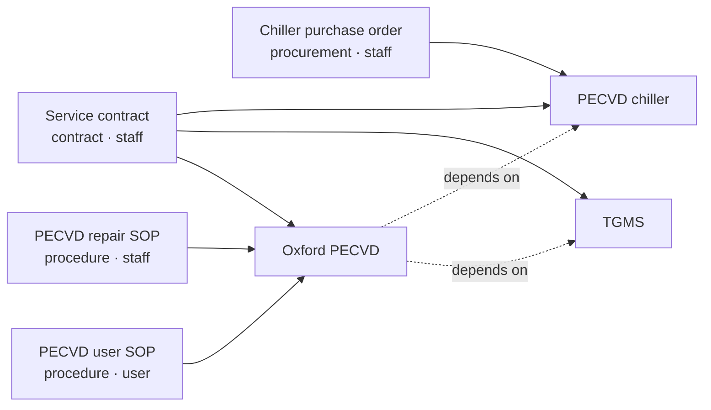

# Model tools as assets and documents as links

**Date:** 2026-10-06
**Status:** Draft — decisions of 2026-10-06 recorded, awaiting Phase A gate

## Description

An asset is a tool or a piece of support equipment. A document is a
file. A document points at the assets it is about. An asset points at
the support equipment it depends on. A file lives in one place. A
contract that covers three machines has three links, not three copies.

Someone writes the asset list. The model may only pick from that list,
from the document types below, and from the audience values. It does
not invent a new tool.

This is a worked example, using ASRC tools. It is not a change to the
sync script or the public site.

Solid arrows are `about`: a document to an asset. Dashed arrows are
`depends_on`: an asset to support equipment it needs.

"Everything about the Oxford PECVD" is the user SOP, the repair SOP,
and the service contract. "All contracts" is the service contract,
which also names the TGMS and the chiller. "The chiller is down, what
is affected" is the Oxford PECVD.

## Decisions

Recorded 2026-10-06. These are settled; Phase B builds on them.

| Decision | Choice | Why |
| --- | --- | --- |
| Asset-to-asset edge | Add `depends_on` now. One hop, not followed transitively. | "PECVD chiller" is a relationship hidden in a name. Without the edge, "the chiller is down, which tools are affected" has no answer. |
| `kind` vs `class` | Drop `kind`. Keep `class` and `subclass`. | `kind` was a two-value summary of `class` (`support_equipment` versus everything else); two columns that must agree is a bug waiting for a row. `class` and `subclass` already exist in NanoKnow, so nothing new is invented. "Is it a tool or support equipment" is answered by `class`. |
| Document type × audience validity | Deferred. | Not needed for the example. Listed under open questions. |
| Hoods | Hoods are assets, `class=wet_processing`. | Users are trained on them. The etch pages under a hood are documents about that hood, the same shape as SOPs under a tool. |
| Asset ids | Qualifier plus subclass, never a bare subclass. Permanent. | `ald` breaks the day a second ALD arrives. Renaming an id is a migration; renaming a `name` is a cell edit. Rule below. |

## Categories

### Asset class and subclass

These are the classes NanoKnow already uses, from
`pipelines/app/schemas/classification.py`. Each asset has one class and
one subclass, and every subclass belongs to exactly one class.
`not_applicable` and `unknown` are for a guess that did not match. They
are not assigned to a real asset row.

Seven classes are process stations a user is trained on. The eighth,
`support_equipment`, is what those stations depend on: the TGMS, a
chiller, a pump. That split is the only "tool versus support" distinction
in the model; there is no separate column for it.

| Class | Subclasses |
| --- | --- |
| `lithography` | `ebl`, `photo_lithography`, `three_d_litho`, `spinner`, `hotplate`, `oven` |
| `deposition` | `pecvd`, `lpcvd`, `ebeam_evap`, `thermal_evap`, `ald`, `sputter` |
| `etching` | `rie`, `icp_rie`, `asher`, `uv_clean`, `vapor_etch` |
| `metrology` | `sem`, `afm`, `electrical_probe`, `profilometer`, `ellipsometer`, `thin_film_spectrometer`, `thin_film_stress`, `optical_microscope` |
| `thermal_processing` | `oxidation_furnace`, `diffusion_furnace`, `anneal_furnace`, `rta` |
| `wet_processing` | `wet_etching`, `development`, `chemical_cleaning`, `srd` |
| `packaging` | `dicing_saw`, `wire_bonding`, `bonding`, `cmp` |
| `support_equipment` | `vacuum_pump`, `chiller`, `compressor`, `air_handling`, `electrical`, `tgms`, `environmental_control` |

### Document type

| Type | What the file is |
| --- | --- |
| `procedure` | Steps for a person to follow. A user SOP, a hood etch page, and a staff repair SOP are all this type. |
| `manual` | The manufacturer's book, for a tool or for a pump, chiller, or the TGMS. |
| `recipe` | Setpoints for a process run. |
| `contract` | A service agreement. Not a NanoKnow type today. |
| `procurement` | A quote, purchase order, or purchasing packet. Not a NanoKnow type today. |
| `policy` | A lab rule. |

### Audience

| Audience | Who it is for |
| --- | --- |
| `user` | People operating the tool. This is what the public site lists. |
| `staff` | People maintaining the lab. Repair notes, manuals, contracts, procurement. |

`admin`, `mixed`, and `unknown` exist on NanoKnow today. This example
uses `user` and `staff` only.

### Edge type

| Edge | From → to | Meaning |
| --- | --- | --- |
| `about` | document → asset | The file is about this asset. |
| `depends_on` | asset → asset | This asset needs that one to run. The target is normally `support_equipment`. |

`depends_on` is one hop. "Everything about X" does not follow it by
default; "X including its support equipment" does, once. Nothing walks
chains.

### Asset id rule

An id is lower-case, hyphenated, and permanent. It is a qualifier plus
the subclass, so two assets of the same subclass can never share one:

| Asset is… | Qualifier | Example |
| --- | --- | --- |
| A process tool | Manufacturer or model | `oxford-pecvd`, `fiji-ald`, `aja-sputter` |
| A hood | The hood's working name | `caustics-hood`, `hf-piranha-hood` |
| Support equipment serving one tool | The tool it serves | `pecvd-chiller` |
| Lab-wide support equipment | `facility` | `facility-tgms` |

A bare subclass (`ald`, `chiller`) is never an id. Changing what a
machine is called edits `name`, not `id`. Replacing a machine is a new
row with a new id; the old row stays so its documents still resolve.

## Example rows

### Assets

Aliases are other names that mean this same row. "PECVD" and
"Oxford PlasmaPro" both resolve to Oxford PECVD.

| id | name | class | subclass | aliases |
| --- | --- | --- | --- | --- |
| oxford-pecvd | Oxford PECVD | deposition | pecvd | PECVD, Oxford PlasmaPro |
| fiji-ald | Fiji ALD | deposition | ald | ALD |
| aja-sputter | AJA Sputter | deposition | sputter | AJA |
| caustics-hood | Caustics/Metal Etch Hood | wet_processing | wet_etching | caustics hood, metal etch hood |
| facility-tgms | TGMS | support_equipment | tgms | toxic gas monitor |
| pecvd-chiller | PECVD chiller | support_equipment | chiller | |

The other hoods (Litho-Development, Solvent, HF and Piranha, RCA) are
the same shape as the Caustics row and are left out to keep the
example short.

### Documents

A policy has no asset. The contract has three, filled in below.

| id | title | type | audience |
| --- | --- | --- | --- |
| d1 | Oxford PECVD SOP | procedure | user |
| d2 | PECVD repair SOP | procedure | staff |
| d3 | Oxford PlasmaPro manual | manual | staff |
| d4 | PECVD oxide recipe | recipe | user |
| d5 | 2026 deposition service contract | contract | staff |
| d6 | Chiller purchase order | procurement | staff |
| d7 | Rules of conduct | policy | user |
| d8 | Aluminum etch | procedure | user |

### `about` links

One row is one "about" link. The contract is three rows.

| document | asset |
| --- | --- |
| d1 Oxford PECVD SOP | oxford-pecvd |
| d2 PECVD repair SOP | oxford-pecvd |
| d3 Oxford PlasmaPro manual | oxford-pecvd |
| d4 PECVD oxide recipe | oxford-pecvd |
| d5 2026 deposition service contract | oxford-pecvd |
| d5 2026 deposition service contract | facility-tgms |
| d5 2026 deposition service contract | pecvd-chiller |
| d6 Chiller purchase order | pecvd-chiller |
| d8 Aluminum etch | caustics-hood |

`d7` has no link row.

### `depends_on` links

| asset | depends on |
| --- | --- |
| oxford-pecvd | facility-tgms |
| oxford-pecvd | pecvd-chiller |

### What a question returns

| Question | Result | How |
| --- | --- | --- |
| Everything about the Oxford PECVD | d1, d2, d3, d4, d5 | `about` only |
| Oxford PECVD including its support equipment | d1–d6 | `about`, plus `about` of each `depends_on` target |
| All support equipment | facility-tgms, pecvd-chiller | `class` filter |
| User documents about the Oxford PECVD | d1, d4 | `about`, audience filter |
| All contracts | d5 | type filter |
| Everything about the TGMS | d5 | `about` |
| The PECVD chiller is down; which tools are affected | oxford-pecvd | reverse `depends_on` |
| Everything about the Caustics hood | d8 | `about` |
| Documents with no asset | d7 | no `about` row |

## What this leaves out

Vendors, chemicals, people, and rooms are not nodes. There are two edge
types and no others. A document does not also get a subject such as
"operation" or "maintenance." User versus staff, and procedure versus
contract, already say that.

The public site stays a list of `user` procedures and recipes. Staff
documents are indexed for staff search. A file still has one folder in
Drive. These tables are the links, not a second copy of the file.

## Steps

### Phase A — Agree the example

- [x] Write this example: asset rows, document rows, link rows, and the
      category lists.
- [x] Record the 2026-10-06 decisions: `depends_on` edge, drop `kind`
      and keep class/subclass, hoods are assets, id rule, defer
      type × audience.
- [ ] Read the tables above against the lab. Check that Oxford PECVD,
      the TGMS, the chiller, and the Caustics hood are the right shape,
      and that the service contract as three links is the case you meant.
- [ ] Pick five real files from Drive that are not in this example and
      fill in their document row and `about` rows. Any file that needs a
      seventh type, a third audience, or a third edge type fails the gate.

### Phase A review gate — STOP for sign-off

- [ ] The six document types cover the files you actually have.
- [ ] `user` and `staff` are enough audience values for now.
- [ ] `about` and one-hop `depends_on` are enough edge types.
- [ ] The id rule produced an id for all five trial files' assets
      without an exception.
- [ ] Decision: keep this shape / adjust the types / abandon

### Phase B — Store it in NanoKnow

Only after the example is accepted. This work is in the NanoKnow repo,
not in the docs sync.

- [ ] Add an asset table (id, name, class, subclass, aliases). Class
      and subclass values come from `classification.py`; a write whose
      subclass is not in its class is rejected.
- [ ] Enforce the id rule on write: lower-case, hyphenated, not equal to
      any bare subclass value.
- [ ] Add `contract` and `procurement` to the document types.
- [ ] Add an `about` table (document, asset).
- [ ] Add a `depends_on` table (asset, asset).
- [ ] Resolve a mentioned name to an existing asset alias. An unmatched
      name stays a suggestion. It does not create an asset.
- [ ] Browse "everything about this asset," "including its support
      equipment," "all documents of this type," "all assets of this
      class," and "what depends on this asset" from those tables.

### Phase B review gate — STOP for sign-off

- [ ] The PECVD SOP and the service contract return together for
      Oxford PECVD, and the contract also returns for the TGMS.
- [ ] "Including its support equipment" adds the chiller purchase order
      and nothing else.
- [ ] Reverse `depends_on` from the chiller returns the Oxford PECVD.
- [ ] A made-up tool name does not create a row.
- [ ] A write with id `ald` is rejected.
- [ ] A write with `class=deposition, subclass=chiller` is rejected.
- [ ] Decision: proceed / adjust / abandon

## Open questions

Not blocking Phase A. Decide before or during Phase B.

- **Document type × audience.** Some combinations may be impossible (a
  `user` manual, a `staff` recipe). Deferred on 2026-10-06. If they are
  impossible, Phase B wants a validity rule rather than a free 6 × 2 grid.
- **Where the asset list lives.** The tools registry sheet already holds
  name and category for every published tool. Either the sheet becomes
  the asset table of record and NanoKnow imports it (aliases become a
  sheet column), or NanoKnow owns the table and the sheet is derived
  from it. Two hand-maintained lists will drift.
- **Link provenance.** A `source` column on `about` (`human` / `model`)
  would make a model-guessed link a suggestion until confirmed, matching
  the rule already applied to unmatched asset names.
- **Document status.** `current` / `superseded` / `draft`. Without it,
  "everything about the Oxford PECVD" returns every past contract.
- **Nanodocs as a view.** The public site is the `audience=user` filter
  of this graph. A tool gets a sidebar caret
  (`plans/2026-10-06-nested-tool-sections.md`) exactly when it has two
  or more `user` documents. Later, the sync could read that rather than
  a hand-kept sheet.

## Known limits / notes

- Class and subclass values are copied from
  `pipelines/app/schemas/classification.py` in the NanoKnow repo.
  `contract` and `procurement` are not in that file today.
- `depends_on` is deliberately one hop. If a chain (tool → chiller →
  chilled-water loop) is ever needed, that is a new decision, not an
  extension of this one.
- The public docs site does not read these tables. Its sidebar stays
  the `.nav.yml` files.
- Re-indexing old documents is a later step. Until then, existing
  guesses stay as they are.
