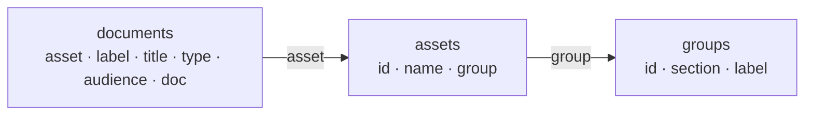

# Make the registry sheet the source of truth: assets, documents, groups

**Date:** 2026-10-09
**Status:** Draft — proposal for review; supersedes `2026-10-09-sheet-owns-page-path.md` if accepted

## Description

Nanodocs is rendered from three Google Sheets, but the sheets only hold
names and links. The site path, the sidebar group, the hood an etch
belongs to, and the folder-vs-file choice all live in Python
(`TOOL_CATEGORY_DIRS`, `TOOL_PAGE_OVERRIDES`, `CHEM_PAGE_MAP`,
`POLICY_PAGE_MAP`). Two plans tried to fix that and each missed:

| Plan | What it gets right | Why it is not quite right |
| --- | --- | --- |
| `2026-10-09-sheet-owns-page-path` | One `Share Link`; sheet owns the path; Python maps deleted. | Still one row per *page*, so a hood row is both the asset and its SOP. Folder-ness is inferred from another row's `Parent`. Every path, including a tool's, is `slugify(Name)`, so renaming a tool moves its URL even though the sheet already has a permanent `Programmatic ID`. `Class` is free text per row. No audience. Three sheets keep three different column sets. |
| `2026-10-06-asset-document-graph` | Asset ≠ document. A document is *about* an asset. Documents have `type` and `audience`. A policy has no asset. | It is NanoKnow's data model (four tables, subclass taxonomy, `kind`, `depends_on`) and says so: "not a change to the sync script or the public site." Its id rule (`fiji-ald`, never a bare subclass) contradicts the `Programmatic ID` column that already exists in the tools workbook (`ald`, `pecvd`). "Nanodocs as a view" is left as an open question. |

The tools workbook already has the shape the Oct 6 plan wants. Its tabs are:

| Tab | What it is | Read by the sync? |
| --- | --- | --- |
| `Tool List` | An **asset table**: `Name - Short`, `Name - Full`, `Manufacturer`, `Model`, `Type (Category)`, `Programmatic ID` | No |
| `Staff Tool List` | An asset attribute: `Name - Short` → staff | No |
| `Document URLs` | A **document table**: `Tool Name`, `Type (Category)`, `Share Link`, `PDF Link` (a formula) | Yes — the only tab read |

The chem workbook mixes both kinds in one tab (`Type` = `Hood` is an
asset, `Type` = `Etch` is a document) and the hood each etch belongs to
exists only in `CHEM_PAGE_MAP`. The policy workbook is documents only.

This plan takes the Oct 6 split — asset, document, link — and makes it
the registry nanodocs reads, at the smallest size that covers the site
today. Everything heavier in Oct 6 (subclass taxonomy, `kind`,
`depends_on`, NanoKnow tables) stays deferred, and this registry becomes
the asset list of record that NanoKnow imports later, which answers Oct
6's open question "where the asset list lives".

### The model

Three tabs in one workbook. A row is a node; a cell that names another
row's id is the edge.



- An **asset** is a thing people are trained on: a tool, a hood, a furnace. It exists whether or not it has a document (Ozone Cleaner has a row and no page). On the site it is a directory.
- A **document** is one Google Doc published as one page. It is *about* at most one asset. A document with no asset is a facility document (policy, signup).
- A **group** is what an asset is (`deposition`, `wet-processing`) and the sidebar heading those assets sit under. Each group belongs to a **section**, the top-level tab it is shown in. Hoods are assets in group `wet-processing`; that group's section is `chemicals`, so they stay on the Chemical Handling tab. The asset says what it is; the group says where it is shown.

Audience is on the document, as the Oct 6 plan has it. The site build
publishes `public` rows; the staff preview (`plans/2026-08-20-staff-preview-server.md`)
can publish `public` + `staff` later with one flag. The columns exist
now; the filter is one line.

### Growth rule

- `id` values are permanent. Rename `name` or `label`, never `id`. Replacing a machine is a new row with a new id. A document's URL follows its `label`; the sync writes the redirect.
- Columns can be added to any tab at any time. The sync reads the columns it knows and ignores the rest. `Manufacturer`, `Model`, and the staff assignment are already extra columns of this kind.
- Vocabularies (`type`, `audience`, `section`) are short lists in the sync. Adding a value is a one-line change plus whatever renders it.
- Nothing is inferred from another row. An asset is a folder because it is an asset, not because something points at it.

The first growth steps, none of which change this schema: a `parent`
column on `assets` (the PECVD chiller), a `status` column on
`documents` (`draft` / `current` / `superseded`), and a `nanoknow_id`
crosswalk column on `assets` if NanoKnow adopts the Oct 6 id rule.

## Schema

Three tabs. Header names are lower-case snake so the contract is visible
in the sheet. The sync fails loudly on a missing required column and
ignores columns it does not know, so attribute columns can be added at
will.

### Every tab and column

| Tab | Column | Required | What it holds | Where it comes from today |
| --- | --- | --- | --- | --- |
| `groups` | `id` | yes | Folder segment under the section: `deposition`, `etching`, `wet-processing`. Lower-case, hyphens. Permanent. | `TOOL_CATEGORY_DIRS` values |
| `groups` | `section` | yes | The tab the group is shown in: `tool_sops`, `chemicals`, or `policy`. | which workbook |
| `groups` | `label` | yes | The bold sidebar heading: `Deposition SOPs`, `Wet Processing`. | `title:` in the group's `.nav.yml` |
| `assets` | `id` | yes | Permanent slug; the URL segment and the key documents point at. Lower-case, hyphens. Never edited once published. | `Programmatic ID` |
| `assets` | `name` | yes | Sidebar label for the asset: `Oxford PECVD`, `Fiji ALD`. Free to edit; the URL does not move. | the label in `.nav.yml` |
| `assets` | `group` | yes | A `groups.id`. Says what the asset is and, through the group, where it is shown. | `Type (Category)` |
| `assets` | `short_name` | no | Staff shorthand: `PECVD`, `ICP-Cl`. Not rendered. | `Name - Short` |
| `assets` | `description` | no | What the machine is: `Plasma Enhanced Chemical Vapor Deposition`. Not rendered yet. | `Name - Full` |
| `assets` | `manufacturer`, `model` | no | Kept as-is. Not rendered yet. | same |
| `documents` | `asset` | no | An `assets.id`. Blank for a facility document (policy, signup). | `Tool Name` / `CHEM_PAGE_MAP` |
| `documents` | `label` | see rule | Sidebar text, and the source of the URL: the file is `slugify(label).md`. Blank on an asset's primary document, which is listed under the asset's `name` and written as `index.md`. Required when `asset` is blank. | the label in `.nav.yml` / `*_PAGE_MAP` |
| `documents` | `title` | yes | The on-page H1: `Atomic Layer Deposition (ALD)`, `ASRC Nanofab -- Rules of Conduct`. | the H1 on disk |
| `documents` | `section` | when `asset` blank | `policy`, or blank for the docs root (`signup`). Ignored when `asset` is set; the asset's group supplies it. | which workbook |
| `documents` | `type` | yes | `sop`, `process`, `policy`, `guide`. | — |
| `documents` | `audience` | yes | `public`, `staff`, `admin`. The public build publishes `public`. | — |
| `documents` | `doc` | yes | The one Google Doc URL. Preview, Markdown, DOCX, and PDF export URLs are derived from its id. Blank = registered but unpublished. | `Share Link` + `PDF Link` |

Row order carries no meaning. Sidebar order is set in the repo's
`.nav.yml` files (see Sidebar).

### Notes per tab

**`groups`.** A group with no published asset produces no folder
(`furnace` today). A section's tab, its hand-written `index.md`, and its
entry in `docs/.nav.yml` exist whether or not any group points at it.

**`assets`.** The existing `Tool List` tab with headers renamed and the
hoods added. One tab for every asset kind. An asset has no section of
its own; it is shown wherever its group's section is. `id` and `name`
are kept separate because asset URLs are the ones people bookmark and
the chat widget cites, and the ids already exist.

**`documents`.** One row is one page. `label` is both the sidebar text
and the URL — renames are rare, and when one happens the sync writes a
redirect (below), so there is no separate slug column to keep in step.
`title` is always filled; nothing is inherited from the asset row.
`type` is recorded but not rendered in this plan. It is here because the
Oct 6 split needs it to mean anything later (a staff `manual` and a
public `sop` about the same tool), and because the cost is one column
with four values. `process` is the hood etch pages — a chemical
procedure performed at an asset, as opposed to operating the asset.

### Path rule

One rule, no special cases:

```text
dir  = docs / section / group / asset        (each segment only if set)
file = index.md            when asset is set and label is blank
       slugify(label).md   otherwise
```

`slugify` lower-cases and turns every run of non-alphanumerics into one
hyphen: `Rules of Conduct` → `rules-of-conduct`, `C14 Application` →
`c14-application`, `Hydrofluoric Acid Etch` → `hydrofluoric-acid-etch`.

When `asset` is set, `group` is the asset's group and `section` is that
group's section. When it is not, `section` is the document row's own and
there is no group.

| Row | Path | URL |
| --- | --- | --- |
| asset `pecvd` (group deposition → tool_sops), label blank | `tool_sops/deposition/pecvd/index.md` | `/tool_sops/deposition/pecvd/` |
| asset `pecvd`, label `Oxide Recipe` | `tool_sops/deposition/pecvd/oxide-recipe.md` | `/tool_sops/deposition/pecvd/oxide-recipe/` |
| asset `caustics-hood` (group wet-processing → chemicals), label blank | `chemicals/wet-processing/caustics-hood/index.md` | `/chemicals/wet-processing/caustics-hood/` |
| asset `caustics-hood`, label `Gold Etch` | `chemicals/wet-processing/caustics-hood/gold-etch.md` | `/chemicals/wet-processing/caustics-hood/gold-etch/` |
| no asset, section `policy`, label `Safety Manual` | `policy/safety-manual.md` | `/policy/safety-manual/` |
| no asset, section blank, label `Nanofab Signup` | `nanofab-signup.md` | `/nanofab-signup/` |

Every asset is a directory, so adding a second document never moves the
first one or its images. Images go to `<asset dir>/img/`. A directory
with only `index.md` and no `.nav.yml` renders as a single sidebar link
(the rule from `2026-10-06-nested-tool-sections.md`), so single-document
tools look exactly as they do now.

The PDF key is derived from the path, not the display name:
`<section>/<group>/<asset>/<index|slug>.pdf` under `docs/assets/pdfs/`
and in R2. The `download=` attribute on the Download pill supplies the
friendly filename (`Oxford_PECVD_SOP.pdf`) from `title`. Renaming a
title no longer renames an R2 key.

### Redirects

The sync already keeps `.sync-state.json` keyed by Google Doc id. It
gains the last path written for each doc. When a row's resolved path
differs from the remembered one — a label edit, an asset moved to
another group — the sync appends the old URL → new URL line to
`docs/_redirects`, which Cloudflare Pages serves natively. A rename
therefore costs nothing and old bookmarks, QR codes, and chat citations
keep working. Phase B seeds the file with every URL that changes in the
migration.

### Sidebar

Order lives in the repo; labels and membership live in the sheet.
`.nav.yml` files stay hand-written, and the sync merges into them
rather than replacing them. For each directory that holds a page it
published, the sync:

- rewrites the label of every entry whose path it generated, to the sheet's `name` (asset directory), `label` (document), or group `label` (group directory);
- appends an entry for any published page or asset directory that has no entry, at the end of the list;
- never reorders, never removes, and never touches entries for paths it did not generate.

The entry shapes are the ones awesome-nav already reads:

| Directory | Entry the sync maintains |
| --- | --- |
| `<section>/` | `label: <group id>` for each group with a published asset; for `policy`, `label: <slug>.md` for each asset-less document |
| `<section>/<group>/` | `name: <asset id>` for each published asset |
| `<asset dir>/` | `label: <slug>.md` for each non-primary document; the file is created, with `index.md` first, the first time an asset gains a second document |

Everything else in those files is yours: the order, `index.md` landing
pages, hand-written pages dropped into a generated directory, and
`docs/.nav.yml` itself (Home, FAQ, Signup, Authoring), which the sync
never opens. A group without a hand-written `index.md` is a heading with
no landing page, which the theme renders fine; `wet-processing` can
start that way.

Sorting or filtering the sheet therefore changes nothing on the site.
A new row shows up at the bottom of its list on the next cron run; move
it where you want it in the repo. An entry whose page moved (a label
edit, an asset in a new group) goes stale, and `zensical build --strict`
fails on it until the line is deleted — the merge appends the new entry
but will not guess that the old one is the same page.

Under Chemical Handling the hierarchy adds one level: the tab, then a
bold "Wet Processing" heading, then each hood as a collapsed caret with
its etch pages inside. Today the hoods are the bold headings and the
etch pages are always visible. The shape is the one `2026-10-06-nested-tool-sections.md`
chose for PECVD, applied to hoods too; whether the extra click is
acceptable is a Phase B gate item.

### Consistency check

A `--check` mode, runnable on its own and as the last step of every sync,
reports and exits non-zero when:

- a published row has no entry in its directory's `.nav.yml` (cannot happen after a merge, but catches a hand-deleted line);
- a `.nav.yml` entry the sync generated carries a label that differs from the sheet;
- a page on disk starts with the `AUTO-GENERATED` marker but no row resolves to it (a row deleted from the sheet, or a label edit that left the old file behind);
- a `_redirects` source still exists as a page.

The first two are the sheet-to-tree direction; the third is the
tree-to-sheet direction, which `--strict` cannot see because an orphaned
page is still a valid page. This can land after Phase C; the merge
alone keeps the public sidebar correct.

### Validation

The sync stops the run with the row and the reason. It never guesses.

- `assets.id` or `groups.id` duplicated; `id` not lower-case `[a-z0-9-]`.
- `assets.group` not in `groups`; `groups.section` or `documents.section` not in the section list.
- `documents.asset` not in `assets`.
- An asset with two documents whose labels slugify the same, or with two blank labels (two primaries).
- A document with no asset and no `label`; any document with no `title`.
- `type` or `audience` not in its vocabulary.
- Two rows resolving to the same path.

Two rows pointing at one Google Doc is allowed (Piranha Clean and RCA
Clean do today). A row is a page; a doc may back two pages.

## Migration of today's rows

What Phase A fills in. Asset `name` and document `label` are today's
sidebar text; `title` is today's H1. The three tabs, fully populated from the
live sheets and the current pages, are in `plans/registry-samples/`
(`groups.csv`, `assets.csv`, `documents.csv`) — import each as a tab to
see the shape.

### `groups`

| id | section | label |
| --- | --- | --- |
| lithography | tool_sops | Lithography SOPs |
| deposition | tool_sops | Deposition SOPs |
| etching | tool_sops | Etcher SOPs |
| metrology | tool_sops | Metrology SOPs |
| packaging | tool_sops | Packaging SOPs |
| furnace | tool_sops | Furnace SOPs |
| wet-processing | chemicals | Wet Processing |

### `assets`

All 41 `Tool List` rows carry over with
`group = lower(Type (Category))`, `id = Programmatic ID`. The 21 with
documents get `name` from today's nav label, e.g. `ald` → `Fiji ALD`
(the nav says "Fuji"; the Model column says Fiji G2), `metal-evap` →
`AJA Metal Evaporator`, `rie` → `Reactive Ion Etcher`, `elionix-100kev`
→ `Elionix E-Beam Lithography`. The 20 without documents get `name` =
`Name - Short` for now.

Five new rows for the hoods, `group = wet-processing`:

| id | name |
| --- | --- |
| litho-hood | Litho-Development Hood |
| solvent-hood | Solvent Lift-Off Hood |
| caustics-hood | Caustics/Metal Etch Hood |
| hf-piranha-hood | HF and Piranha Hood |
| rca-hood | RCA Hood |

`SRD` (spin rinse dryer) is filed under `lithography` in `Tool List`;
the Oct 6 sample put it in wet processing. It has no document, so it is
a cell edit whenever that is decided.

### `documents`

`label` is today's sidebar text; `title` is today's H1, on every row.

| asset | label | title | type | audience |
| --- | --- | --- | --- | --- |
| each of the 21 tools with a link | | today's H1 (`Atomic Layer Deposition (ALD)`, `Oxford 80 RIE` …) | sop | public |
| litho-hood, solvent-hood, caustics-hood, hf-piranha-hood, rca-hood | | today's H1 (`Caustics and Metal Etch Hood` …) | sop | public |
| caustics-hood | Aluminum Etch | Aluminum Etch | process | public |
| caustics-hood | Chrome Etch | Chrome Etch | process | public |
| caustics-hood | Gold Etch | Gold Etch | process | public |
| caustics-hood | Silicon Etch | Isotropic Silicon Etch | process | public |
| caustics-hood | Nickel Etch | Nickel Etch SOP | process | public |
| hf-piranha-hood | Hydrofluoric Acid Etch | Hydrofluoric Acid Etch | process | public |
| hf-piranha-hood | Piranha Clean | Piranha Clean | process | public |
| rca-hood | RCA Cleaning Procedure | RCA Cleaning Procedure | process | public |
| — (section policy) | Rules of Conduct | ASRC Nanofab -- Rules of Conduct | policy | public |
| — (section policy) | Safety Manual | ASRC Nanofab Facility -- Safety Manual | policy | public |
| — (section policy) | C14 Application | Instruction for C-14 Application | policy | public |
| — (section policy) | Suspension Policy | Lab Suspension Policy | policy | public |
| — (section blank) | Nanofab Signup | Becoming a Nanofab User | guide | public |

`doc` is today's `Share Link` for each. URLs change wherever the derived
path differs from today's file: tool ids with hyphens (`aja_sputter` →
`aja-sputter`), `etch/` → `etching/`, every hood (gains the
`wet-processing/` segment), every policy page (`manual` →
`rules-of-conduct`, `c14` → `c14-application`), and `signup` →
`nanofab-signup`. Phase B seeds `docs/_redirects` with all of them.
`docs/.nav.yml` is hand-written and its Signup entry is updated by hand.

### What this does to the earlier plans

- `2026-10-09-sheet-owns-page-path`: superseded. Keeps one `Share Link` with all export URLs derived, and keeps slugified names for documents (with redirects on rename). Drops `Class`/`Parent`, and uses the permanent `Programmatic ID` for assets instead of slugifying their names.
- `2026-10-06-nested-tool-sections`: its Phase B checklist becomes automatic. A second document row on an asset produces the caret. The hand-written `pecvd/pecvd_processes.md` sample goes away in Phase B.
- `2026-10-06-asset-document-graph`: unchanged in intent; its Phase B (NanoKnow tables) imports `assets` from this workbook instead of maintaining a second list. Its id rule applies to NanoKnow's own key, with a crosswalk column here if the two ever differ. `plans/asset-graph-samples/assets.csv` already has that crosswalk shape (`registry_name`).

## Steps

### Phase A — Build the three tabs

In the tools workbook (`1b4RRhKAukj9NrFyiJl_I9vbAUnrgDSy1TeNq2QLKJr4`).
Do not touch `Document URLs` or the chem and policy workbooks; the
current sync keeps working until Phase C.

- [ ] Add a `groups` tab: import `plans/registry-samples/groups.csv`.
- [ ] Replace `Tool List` with `assets`: import `plans/registry-samples/assets.csv` (46 rows — the 41 tools with renamed headers plus the five hoods). Or rename the existing headers and append the hoods by hand.
- [ ] Add a `documents` tab: import `plans/registry-samples/documents.csv` (39 rows — 21 tool SOPs, 13 hood pages, 5 facility documents).
- [ ] Share the workbook so the two new tabs export as CSV ("anyone with link can view" is already set); note each tab's `gid`.

### Phase A review gate — STOP for sign-off

- [ ] Every `Programmatic ID` is the id you want in URLs for good. Changing one later is a redirect, not a cell edit.
- [ ] One workbook for all three sections is acceptable (versus keeping chem and policy in their own workbooks with the same tabs).
- [ ] `type` and `audience` vocabularies are right: `sop`, `process`, `policy`, `guide`; `public`, `staff`, `admin`.
- [ ] `label` doubling as the URL is acceptable: a label edit moves the page and writes a redirect.
- [ ] The migration's URL changes are acceptable.
- [ ] Decision: proceed / adjust / abandon

### Phase B — Sync reads the registry

On a branch. Cut-over, not coexistence: the old generated files are
deleted and regenerated, so there is one tree to review.

- [ ] Replace `SECTIONS` with one `REGISTRY` (workbook id, three gids). Load and validate `groups`, `assets`, `documents` as above before any download.
- [ ] Resolve the path, PDF key, and nav entries per the rules. Parse the doc id from `doc`; derive preview and export URLs. Stop reading `PDF Link`.
- [ ] Delete `TOOL_CATEGORY_DIRS`, `TOOL_PAGE_OVERRIDES`, `CHEM_PAGE_MAP`, `POLICY_PAGE_MAP`, and `resolve_page_path`'s per-section branches.
- [ ] `--audience public` (default) filters documents. `--group`, `--asset`, and `--only <label>` replace `--category` / `--only <name>`.
- [ ] Merge into `.nav.yml`: relabel generated entries from the sheet, append missing ones, never reorder or remove. Create `<asset dir>/.nav.yml` with `index.md` first when an asset gains a second document.
- [ ] Delete every page starting with the `AUTO-GENERATED` marker, `docs/**/img/`, `docs/assets/pdfs/`, and `pecvd/pecvd_processes.md`. Rewrite the existing `.nav.yml` files to the new paths by hand (`etch/` → `etching/`, hyphenated ids, `wet-processing/`), keeping today's order. Run one full sync; it should append nothing.
- [ ] Record each doc's written path in `.sync-state.json`; append to `docs/_redirects` when it changes. Seed the file with every URL the migration moves.
- [ ] Update links in the hand-written index pages (`deposition/index.md`, `chemicals/index.md`'s hood cards, and the others) and the Signup entry in `docs/.nav.yml` to the new paths.
- [ ] `.github/workflows/sync-and-publish.yml`: commit when `.nav.yml`, `_redirects`, or `.sync-state.json` changed, not only pages.
- [ ] Update `README.md`, `AGENTS.md`, and `docs/authoring/index.md`: three tabs, the path rule, the growth rule, the merge rule for `.nav.yml`.
- [ ] `uv run ruff check .` and `uv run ruff format .`
- [ ] `uv run zensical build --strict` passes.

### Phase B review gate — STOP for sign-off

`uv run zensical serve`:

- [ ] Each tab's sidebar is in today's order with the sheet's labels. Group headings are bold and open as before.
- [ ] Add a row to `documents` with no nav entry, re-sync, and confirm it appears at the end of its list; edit its `label`, re-sync, and confirm the nav label follows.
- [ ] Chemical Handling shows one bold "Wet Processing" heading with the five hoods under it. Caustics, HF/Piranha, and RCA are carets with their etch pages inside; Litho and Solvent are single links. Decide whether the extra level is acceptable or the hoods need a different arrangement.
- [ ] Single-document tools show no caret.
- [ ] Every page's H1 is the sheet `title`; every sidebar entry is the sheet `label` or asset `name`. Images and both PDF pills resolve.
- [ ] Old URLs redirect locally via `wrangler pages dev` or on a preview deploy. Edit one `label` in the sheet, re-sync, and confirm a new `_redirects` line appears.
- [ ] Decision: proceed / adjust / abandon

### Phase C — Cut over

- [ ] Upload all PDFs under the new R2 keys; delete the old keys.
- [ ] Merge; confirm the production deploy and redirects.
- [ ] Delete the `Document URLs` tab and retire the chem and policy workbooks (or leave them read-only with a note pointing at the registry).
- [ ] Mark `2026-10-09-sheet-owns-page-path.md` superseded; update `2026-10-06-nested-tool-sections.md` status.
- [ ] Follow-up: implement `--check` and add it to the cron workflow after the sync.

## Known limits / notes

- `type` is stored and validated but not rendered. First use is the staff preview, where `sop` and `manual` about one tool need different labels.
- `audience=staff` and `admin` rows are accepted and skipped by the public build. Nothing publishes them until the staff preview reads `--audience staff`.
- Assets without documents produce no page. A later decision could render a stub from `description`, `manufacturer`, `model` — that is a template change, not a schema change.
- `Staff Tool List` is untouched. It joins on `Name - Short`; if it is ever read it should join on `id`.
- Asset-to-asset edges (`parent`, Oct 6's `depends_on`) are not here. The first row that needs one adds a `parent` column; the path rule already handles a nested asset directory if that is wanted.
- The sync still needs network to `docs.google.com`. No credentials.
- `.github/workflows/sync-and-publish.yml` commits only when a page changed. Phase B must make it commit `.nav.yml` and `_redirects` changes too, or a sheet relabel never reaches the site.
- Moving ordering into the sheet later is one rule change: the merge becomes a full rewrite, driven by an `order` column. Nothing in the schema has to move.
